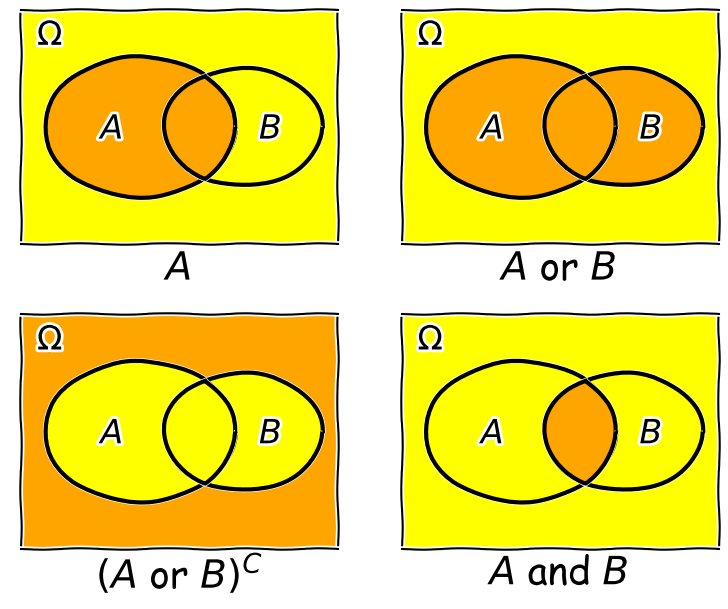
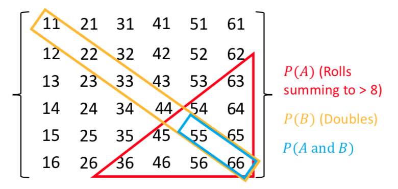

<!-- Just one possible MathJax CDN below. You may use others. -->

In this episode we will be using numpy. You can set this up as follows:
~~~
import numpy as np
~~~
{: .language-python}

## Probability, and frequentist vs. Bayesian approaches

Correct statistical inference requires an understanding of probability and how to work with it. We can do this using the language of mathematics and _probability theory_.

First let us consider what a probability is. There are two approaches to this, famously known as the [__frequentist__]({{ page.root }}/reference/#frequentist) and [__Bayesian__]({{ page.root }}/reference/#bayesian) approaches:

- A __frequentist__ approach considers that the probability $$P$$ of a random event occuring is equivalent to the frequency such an event would occur at, in an infinite number of repeating [__trials__]({{ page.root }}/reference/#trial)  which have that event as one of the outcomes. $$P$$ is expressed as the fractional number of occurrences, relative to the total number. For example, consider the flip of a coin (which is perfect so it cannot land on it's edge, only on one of its two sides). If the coin is fair (unbiased to one side or the other), it will land on the 'heads' side (denoted by $$H$$) exactly half the time in an infinite number of trials, i.e. the probability $$P(H)=0.5$$.
- A __Bayesian__ approach considers the idea of an infinite number of trials to be somewhat abstract: instead the Bayesian considers the probability $$P$$ to represent the _belief_ that we have that the event will occur. In this case we can again state that $$P(H)=0.5$$ if the coin is fair, since this is what we expect. However, the approach also explicitly allows the experimenter's prior belief in a hypothesis (e.g. 'The coin is fair?') to factor in to the assessment of probability. This turns out to be crucial to assessing the probability that a given hypothesis is true.

Some years ago these approaches were seen as being in conflict, but the value of 'Bayesianism' in answering scientific questions, as well as in the rapidly expanding field of Machine Learning, means it is now seen as the best approach to statistical inference. We can still get useful insights and methods from frequentism however, so what we present here will focus on what is practically useful and may reflect a mix of both approaches. Although, at heart, we are all Bayesians now.

We will consder the details of Bayes' theorem later on. But first, we must introduce probability theory, in terms of the concepts of sample space and events, conditional probability, probability calculus, and (in the next episodes) probability distributions.

## Sample space and conditional events

Imagine a [__sample space__]({{ page.root }}/reference/#sample-space), $$\Omega$$ which contains the set of all possible and mutially exclusive _outcomes_ of some random process (also known as _elements_ or _elementary outcomes_ of the set). In statistical terminology, an [__event__]({{ page.root }}/reference/#event) is a set containing one or more outcomes. The event occurs if the outcome of a draw (or sample) of that process is in that set. Events do not have to be mutually exclusive and may also share outcomes, so that events may also be considered as combinations or subsets of other events.

For example, we can denote the sample space of the results (Heads, Tails) of two successive coin flips as $$\Omega = \{HH, HT, TH, TT\}$$. Each of the four outcomes of coin flips can be seen as a separate event, but we can also can also consider new events, such as, for example, the event where the first flip is heads $$\{HH, HT\}$$, or the event where both flips are the same $$\{HH, TT\}$$.

Now consider two events $$A$$ and $$B$$, whose probability is [__conditional__]({{ page.root }}/reference/#conditional-probability) on one another. I.e. the chance of one event occurring is dependent on whether the other event also occurs. The occurrence of conditional events can be represented by Venn diagrams where the entire area of the diagram represents the sample space of all possible events (i.e. probability $$P(\Omega)=1$$) and the probability of a given event or combination of events is represented by its area on the diagram. The diagram below shows four of the possible combinations of events, where the area highlighted in orange shows the event (or combination) being described in the notation below.

We'll now decribe these combinations and do the equivalent calculation for the coin flip case where event $$A=\{HH, HT\}$$ and event $$B=\{HH, TT\}$$ (the probabilities are equal to 0.5 for these two events, so the example diagram is not to scale).

1. Event $$A$$ occurs (regardless of whether $$B$$ also occurs), with probability $$P(A)$$ given by the area of the enclosed shape relative to the total area.
2. Event $$(A \mbox{ or } B)$$ occurs (in set notation this is the _union_ of sets, $$A \cup B$$). Note that the formal '$$\mbox{or}$$' here is the same as in programming logic, i.e. it corresponds to 'either or both' events occurring. The total probability is not $$P(A)+P(B)$$ however, because that would double-count the intersecting region. In fact you can see from the diagram that $$P(A \mbox{ or } B) = P(A)+P(B)-P(A \mbox{ and } B)$$. Note that if $$P(A \mbox{ or } B) = P(A)+P(B)$$ we say that the two events are [__mutually exclusive__]({{ page.root }}/reference/#mutual-exclusivity) (since $$P(A \mbox{ and } B)=0$$).
3. Event $$(A \mbox{ or } B)^{C}$$ occurs and is the _complement_ of $$(A \mbox{ or } B)$$ which is everything excluding $$(A \mbox{ or } B)$$, i.e. $$\mbox{not }(A \mbox{ or } B)$$.
4. Event $$(A \mbox{ and } B)$$ occurs (in set notation this is the _intersection_ of sets, $$A\cap B$$). The probability of $$(A \mbox{ and } B)$$ corresponds to the area of the overlapping region.

Now in our coin flip example, we know the total sample space is $$\Omega = \{HH, HT, TH, TT\}$$ and for a fair coin each of the four outcomes $$X$$, has a probability $$P(X)=0.25$$. Therefore:

1. $$A$$ consists of 2 outcomes, so $$P(A) = 0.5$$
2. $$(A \mbox{ or } B)$$ consists of 3 outcomes (since $$TH$$ is not included), $$P(A \mbox{ or } B) = 0.75$$
3. $$(A \mbox{ or } B)^{C}$$ corresponds to $$\{TH\}$$ only, so $$P(A \mbox{ or } B)^{C}=0.25$$
4. $$(A \mbox{ and } B)$$ corresponds to the overlap of the two sets, i.e. $$HH$$, so $$P(A \mbox{ and } B)=0.25$$.

> ## Trials and samples
> In the language of statistics a [__trial__]({{ page.root }}/reference/#trial) is a single 'experiment' to produce a set of one or more measurements, or in purely statistical terms, a single realisation of a sampling process, e.g. the random draw of _one or more_ outcomes from a sample space. The result of a trial is to produce a [__sample__]({{ page.root }}/reference/#sample). It is important not to confuse the sample size, which is the number of outcomes in a sample (i.e. produced by a single trial) with the number of trials. An important aspect of a trial is that the outcome is [__independent__]({{ page.root }}/reference/#independence) of that of any of the other trials. This need not be the case for the measurements in a sample which may or may not be independent.
>
> Some examples are:
> - A roll of a pair of dice would be a single trial. The sample size is 2 and the sample would be the numbers on the dice. It is also possible to consider that a roll of a pair of dice is two separate trials for a sample of a single dice (since the outcome of each is presumably independent of the other roll).
> - A single sample of fake data (e.g. from random numbers) generated by a computer would be a trial. By simulating many trials, the distribution of data expected from complex models could be generated.
> - A full deal of a deck of cards (to all players) would be a single trial. The sample would be the hands that are dealt to all the players, and the sample size would be the number of players. Note that individual players' hands cannot themselves be seen as trials as they are clearly not independent of one another (since dealing from a shuffled deck of cards is [__sampling without replacement__]({{ page.root }}/reference/#sampling-with-replacement)).
>
{: .callout}

> ## Test yourself: dice roll sample space
> Write out as a grid the sample space of the roll of two six-sided dice (one after the other), e.g. a roll of 1 followed by 3 is denoted by the element 13. You can neglect commas for clarity. For example, the top row and start of the next row will be:
>
> $$11\:21\:31\:41\:51\:61$$
>
> $$12\:22\:...........$$
>
> Now highlight the regions corresponding to: 
>
> - Event $$A$$: the numbers on both dice add up to be $$>$$8.
> - Event $$B$$: both dice roll the same number (e.g. two ones, two twos etc.).
>
> Finally use your grid to calculate the probabilities of $$(A \mbox{ and } B)$$ and  $$(A \mbox{ or } B)$$, assuming that the dice are fair, so that all the outcomes of a roll of two dice are equally probable.
>
>> ## Solution
>> 

>> 
>> 

>> There are 36 possible outcomes, so assuming they are equally probable, a single outcome has a probability of 1/36 ($$\simeq$$0.028). We can see that the region corresponding to $$A \mbox{ and } B$$ contains 2 outcomes, so $$P(A \mbox{ and } B)=2/36$$. Region $$A$$ contains 10 outcomes while region $$B$$ contains 6. $$P(A \mbox{ or } B)$$, which here corresponds to the number of _unique_ outcomes, is given by: $$P(A)+P(B)-P(A \mbox{ and } B)=(10+6-2)/36=7/18$$.
> {: .solution}
{: .challenge}

## Conditional probability

We can also ask the question, what is the probability that an event $$A$$ occurs if we know that the other event $$B$$ occurs?  We write this as the probability of $$A$$ _conditional on_ $$B$$, i.e. $$P(A\vert B)$$.  We often also state this is the _'probability of A given B'_. 

To calculate this, we can see from the Venn diagram that if $$B$$ occurs (i.e. we now have $$P(B)=1$$), the probability of $$A$$ also occurring is equal to the fraction of the area of $$B$$ covered by $$A$$. I.e. in the case where outcomes have equal probability, it is the fraction of outcomes in set $$B$$ which are also contained in set $$A$$.

This gives us the equation for [__conditional probability__]({{ page.root }}/reference/#conditional-probability):

$$P(A\vert B) = \frac{P(A \mbox{ and } B)}{P(B)}$$

So, for our coin flip example, $$P(A\vert B) = 0.25/0.5 = 0.5$$. This makes sense because only one of the two outcomes in $$B$$ ($$HH$$) is contained in $$A$$.

In our simple coin flip example, the sets $$A$$ and $$B$$ contain an equal number of equal-probability outcomes, and the symmetry of the situation means that $$P(B\vert A)=P(A\vert B)$$. However, this is not normally the case. 

For example, consider the set $$A$$ of __people taking this class__, and the set of __all students__ $$B$$. Clearly the probability of someone being a student, given that they are taking this class, is very high, but the probability of someone taking this class, given that they are a student, is not. __In general $$P(B\vert A)\neq P(A\vert B)$$__.

Note that events $$A$$ and $$B$$ are [__independent__]({{ page.root }}/reference/#independence) if $$P(A\vert B) = P(A) \Rightarrow P(A \mbox{ and } B) = P(A)P(B)$$. The latter equation is the one for calculating combined probabilities of events that many people are familiar with, but it only holds if the events are independent! For example, the probability that you ate a cheese sandwich for lunch is (generally) independent of the probability that you flip two heads in a row. Clearly, independent events do not belong on the same Venn diagram since they have no relation to one another! However, if you are flipping the coin in order to narrow down what sandwich filling to use, the coin flip and sandwich choice can be classed as outcomes on the same Venn diagram and their combination can become an event with an associated probability.

> ## Test yourself: conditional probability for a dice roll
> Use the solution to the dice question above to calculate: 
>
> 1. The probability of rolling doubles given that the total rolled is greater than 8.
> 2. The probability of rolling a total greater than 8, given that you rolled doubles.
> 
>> ## Solution
>>
>> 1. $$P(B\vert A) = \frac{P(B \mbox{ and } A)}{P(A)}$$ (note that the names of the events are arbitrary so we can simply swap them around!). Since $$P(B \mbox{ and } A)=P(A \mbox{ and } B)$$ we have $$P(B\vert A) =(2/36)/(10/36)=1/5$$.
>> 2. $$P(A\vert B) = \frac{P(A \mbox{ and } B)}{P(B)}$$ so we have $$P(A\vert B)=(2/36)/(6/36)=1/3$$.
> {: .solution}
{: .challenge}

> ## Rules of probability calculus
> We can now write down the rules of probability calculus and their extensions:
> 
> - The  __convexity rule__ sets some defining limits: 
>   $$ 0 \leq P(A\vert B) \leq 1 \mbox{ and } P(A\vert A)=1$$
> - The __addition rule__: 
>   $$P(A \mbox{ or } B) = P(A)+P(B)-P(A \mbox{ and } B)$$
> - The __multiplication rule__ is derived from the equation for conditional probability: 
>   $$P(A \mbox{ and } B) = P(A\vert B) P(B)$$
> 
> $$A$$ and $$B$$ are [__independent__]({{ page.root }}/reference/#independence) if $$P(A\vert B) = P(A) \Rightarrow P(A \mbox{ and } B) = P(A)P(B)$$.
>
> We can also _'extend the conversation'_ to consider the probability of $$B$$ in terms of probabilities with $$A$$:
>
> $$ \begin{align} P(B) & = P\left((B \mbox{ and } A) \mbox{ or } (B \mbox{ and } A^{C})\right) \\ 
> & = P(B \mbox{ and } A) + P(B \mbox{ and } A^{C}) \\ 
> & = P(B\vert A)P(A)+P(B\vert A^{C})P(A^{C}) \end{align}$$
>
> The 2nd line comes from applying the addition rule and because the events $$(B \mbox{ and } A)$$ and $$(B \mbox{ and } A^{C})$$ are mutually exclusive. The final result then follows from applying the multiplication rule.
>
> Finally we can use the 'extension of the conversation' rule to derive the __law of total probability__. Consider a set of all possible mutually exclusive events $$\Omega = \{A_{1},A_{2},...A_{n}\}$$, we can start with the first two steps of the extension to the conversion, then express the results using sums of probabilities:
> 
> $$P(B) = P(B \mbox{ and } \Omega) = P(B \mbox{ and } A_{1}) + P(B \mbox{ and } A_{2})+...P(B \mbox{ and } A_{n})$$
>
> $$= \sum\limits_{i=1}^{n} P(B \mbox{ and } A_{i})$$
> 
> $$= \sum\limits_{i=1}^{n} P(B\vert A_{i}) P(A_{i}) $$
>
> This summation to eliminate the conditional terms is called [__marginalisation__](#marginalisation). We can say that we obtain the marginal distribution of $$B$$ by marginalising over $$A$$ ($$A$$ is _'marginalised out'_).
{: .callout}

> ## Test yourself: conditional probabilities and GW counterparts
> You are an astronomer who is looking for radio counterparts of binary neutron star mergers that are detected via gravitational wave events. Assume that there are three types of binary merger: binary neutron stars ($$NN$$), binary black holes ($$BB$$) and neutron-star-black-hole binaries ($$NB$$). For a hypothetical gravitational wave detector, the probabilities for a detected event to correspond to $$NN$$, $$BB$$, $$NB$$ are 0.05, 0.75, 0.2 respectively.  Radio emission is detected only from mergers involving a neutron star, with probabilities 0.72 and 0.2 respectively.  
>
>Assume that you follow up a gravitational wave event with a radio observation, without knowing what type of event you are looking at.  Using $$D$$ to denote radio detection, express each probability given above as a conditional probability (e.g. $$P(D\vert NN)$$), or otherwise (e.g. $$P(BB)$$). Then use the rules of probability calculus (or their extensions) to calculate the probability that you will detect a radio counterpart.
>
>> ## Solution
>> We first write down all the probabilities and the terms they correspond to. First the radio detections, which we denote using $$D$$:
>>
>> $$P(D\vert NN) = 0.72$$, $$P(D\vert NB) = 0.2$$, $$P(D\vert BB) = 0$$
>>
>> and: $$P(NN)=0.05$$, $$P(NB) = 0.2$$, $$P(BB)=0.75$$
>>
>> We need to obtain the probability of a detection, regardless of the type of merger, i.e. we need $$P(D)$$. However, since the probabilities of a radio detection are conditional on the merger type, we need to marginalise over the different merger types, i.e.:
>>
>> $$P(D) = P(D\vert NN)P(NN) + P(D\vert NB)P(NB) + P(D\vert BB)P(BB)$$ 
>> $$= (0.72\times 0.05) + (0.2\times 0.2) + 0 = 0.076$$
>>
>> You may be able to do this simple calculation without explicitly using the law of total probability, by using the 'intuitive' probability calculation approach that you may have learned in the past. However, learning to write down the probability terms, and use the probability calculus, will help you to think systematically about these kinds of problems, and solve more difficult ones (e.g. using Bayes theorem, which we will come to later).
> {: .solution}
{: .challenge}

## Setting up a random event generator in Numpy
It's often useful to generate your own random outcomes in a program, e.g. to simulate a random process or calculate a probability for some random event which is difficult or even impossible to calculate analytically. In this episode we will consider how to select a non-numerical outcome from a sample space. In the following episodes we will introduce examples of random number generation from different probability distributions. 
 
Common to all these methods is the need for the program to generate random bits which are then used with a method to generate a given type of outcome. This is done in Numpy by setting up a `generator` object. A generic feature of computer random number generators is that they must be _initialised_ using a random number [__seed__]({{ page.root }}/reference/#seed) which is an integer value that sets up the sequence of random numbers. Note that the numbers generated are not truly random: the sequence is the same if the same seed is used. However they are random with respect to one another.
E.g.:
~~~
rng = np.random.default_rng(331)
~~~
{: .language-python}
will set up a generator with the `seed=331`.  We can use this generator to produce, e.g. random integers to simulate five repeated rolls of a 6-sided dice:
~~~
print(rng.integers(1,7,5))
print(rng.integers(1,7,5))
~~~
{: .language-python}
where the first two arguments are the `low` and `high` (exclusive, i.e. 1 more than the maximum integer in the sample space) values of the range of contiguous integers to be sampled from, while the third argument is the `size` of the resulting array of random integers, i.e. how many outcomes to draw from the sample.
~~~
[1 3 5 3 6]
[2 3 2 2 6]
~~~
{: .output}
Note that repeating the command yields a different sample. This will be the case every time we repeat the `integers` function call, because the generator starts from a new point in the sequence. If we want to repeat the same 'random' sample we have to reset the generator to the same seed:
~~~
print(rng.integers(1,7,5))
rng = np.random.default_rng(331)
print(rng.integers(1,7,5))
~~~
{: .language-python}
~~~
[4 3 2 5 4]
[1 3 5 3 6]
~~~
{: .output}
For many uses of random number generators you may not care about being able to repeat the same sequence of numbers. In these cases you can set initialise the generator with the default seed using `np.random.default_rng()`, which obtains a seed from system information (usually contained in a continuously updated folder on your computer, specially for provide random information to any applications that need it). However, if you want to do a statistical test or simulate a random process that is exactly repeatable, you should consider specifying the seed. __But do not initialise the same seed unless you want to repeat the same sequence!__

## Random sampling of items in a list or array

If you want to simulate random sampling of non-numerical or non-sequential elements in a sample space, a simple way to do this is to set up a list or array containing the elements and then apply the numpy method `choice` to the `generator` to select from the list. As a default, sampling probabilities are assumed to be $$1/n$$ for a list with $$n$$ items, but they may be set using the `p` argument to give an array of p-values for each element in the sample space. The `replace` argument sets whether the sampling should be done with or without [__replacement__]({{ page.root }}/reference/#sampling-with-replacement).

For example, to set up 10 repeated flips of a coin, for an unbiased and a biased coin:
~~~
rng = np.random.default_rng()  # Set up the generator with the default system seed
coin = ['h','t']
# Uses the defaults (uniform probability, replacement=True)
print("Unbiased coin: ",rng.choice(coin, size=10))
# Now specify probabilities to strongly weight towards heads:
prob = [0.9,0.1]
print("Biased coin: ",rng.choice(coin, size=10, p=prob))
~~~
{: .language-python}
~~~
Unbiased coin:  ['h' 'h' 't' 'h' 'h' 't' 'h' 't' 't' 'h']
Biased coin:  ['h' 'h' 't' 'h' 'h' 't' 'h' 'h' 'h' 'h']
~~~
{: .output}
Remember that your own results will differ from these because your random number generator seed will be different!

> ## Programming challenge: simulating hands in 3-card poker
> A normal deck of 52 playing cards, used for playing poker, consists of 4 'suits' (in English, these are clubs, spades, diamonds and hearts) each with 13 cards. The cards are also ranked by the number or letter on them: in normal poker the rank ordering is first the number cards 2-10, followed by - for English cards - J(ack), Q(ueen), K(ing), A(ce). However, for our purposes we can just consider numbers 1 to 13 with 13 being the highest rank.
>
> In a game of three-card poker you are dealt a 'hand' of 3 cards from the deck (you are the first player to be dealt cards). If your three cards can be arranged in sequential numerical order (the suit doesn't matter), e.g. 7, 8, 9 or 11, 12, 13, your hand is called a __straight__. If you are dealt three cards from the same suit, that is called a __flush__. You can also be dealt a __straight flush__ where your hand is both a straight and a flush. Note that these three hands are mutually exclusive (because a straight and a flush in the same hand is always classified as a straight flush)!
>
> Write some Python code that simulates randomly being dealt 3 cards from the deck of 52 and determines whether or not your hand is a straight, flush or straight flush (or none of those). Then simulate a large number of hands (at least $$10^{6}$$!) and from this simulation, calculate the probability that your hand will be a straight, a flush or a straight flush. Use your simulation to see what happens if you are the last player to be dealt cards __after__ 12 other players are dealt their cards from the same deck. Does this change the probability of getting each type of hand?
>
>> ## Hint
>> To sample cards from the deck you can set up a list of tuples which each represent the suit and the rank of a single card in the deck, e.g. `(1,3)` for suit 1, card rank 3 in the suit. The exact matching of numbers to suits or cards does not matter!
> {: .solution}
{: .challenge}

