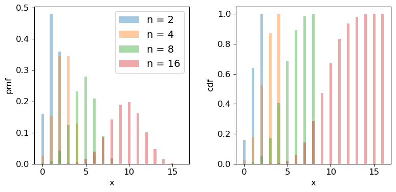
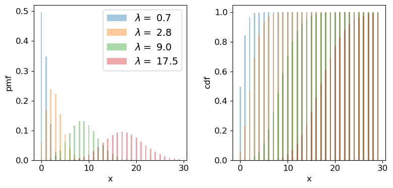
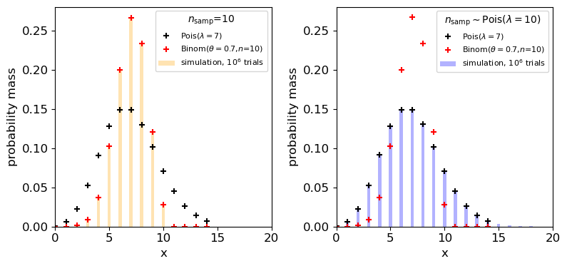

<!-- Just one possible MathJax CDN below. You may use others. -->

In this episode we will be using numpy, as well as matplotlib's plotting library. Scipy contains an extensive range of probability distributions in its 'scipy.stats' module, so we will also need to import it. Remember: scipy modules should be installed separately as required - they cannot be called if only scipy is imported.
~~~
import numpy as np
import matplotlib.pyplot as plt
import scipy.stats as sps
~~~
{: .language-python}

## Discrete random variables

Often, we want to map a [__sample space__]({{ page.root }}/reference/#sample-space) $$\Omega$$ (denoted with curly brackets) of possible outcomes on to a set of corresponding probabilities. The sample space may consist of non-numerical elements or numerical elements, but in all cases the elements of the sample space represent possible outcomes of a random 'draw' from a set of probabilities which can be used to form a discrete probability distribution.

For example, when flipping an ideal coin (which cannot land on its edge!) there are two outcomes, heads ($$H$$) or tails ($$T$$) so we have the sample space $$\Omega = \{H, T\}$$. We can also represent the possible outcomes of 2 successive coin flips as the sample space $$\Omega = \{HH, HT, TH, TT\}$$. A roll of a 6-sided dice would give $$\Omega = \{1, 2, 3, 4, 5, 6\}$$. However, a Poisson process corresponds to the sample space $$\Omega = \mathbb{Z}^{0+}$$, i.e. the set of all positive and integers and zero, even if the probability for most elements of that sample space is infinitesimal (it is still $$> 0$$).

In the case of a Poisson process or the roll of a dice, our sample space already consists of a set of contiguous (i.e. next to one another in sequence) numbers which correspond to discrete [__random variables__]({{ page.root }}/reference/#random-variable). Where the sample space is [__categorical__]({{ page.root }}/reference/#categorical-data), such as heads or tails on a coin, or perhaps a set of discrete but non-integer values (e.g. a pre-defined set of measurements to be randomly drawn from), it is useful to map the elements of the sample space on to a set of integers which then become our discrete random variables. For example, when flipping a coin, we can define the possible values taken by the random variable, known as the _variates_ $$X$$, to be:

$$
X=
\begin{cases}
0 \quad \mbox{if tails}\\
1 \quad \mbox{if heads}\\
\end{cases}
$$

By defining the values taken by a random variable in this way, we can mathematically define a _probability distribution_ for how likely it is for a given event or outcome to be obtained in a single trial (i.e. a draw - a random selection - from the sample space).

## Probability distributions of discrete random variables

Random variables do not just take on any value - they are drawn from some [__probability distribution__]({{ page.root }}/reference/#probability-distribution). In probability theory, a random measurement (or even a set of measurements) is an [__event__]({{ page.root }}/reference/#event) which occurs (is 'drawn') with a fixed probability, assuming that the experiment is fixed and the underlying distribution being measured does not change over time (statistically we say that the random process is [__stationary__]({{ page.root }}/reference/#stationary-process)).

We can write the probability that the variate $$X$$ has a value $$x$$ as $$p(x) = P(X=x)$$, so for the example of flipping a coin, assuming the coin is fair, we have $$p(0) = p(1) = 0.5$$.  Our definition of mapping events on to random variables therefore allows us to map discrete but non-integer outcomes on to numerically ordered integers $$X$$ for which we can construct a probability distribution. Using this approach we can define the [__cumulative distribution function or cdf__]({{ page.root }}/reference/#cdf) for discrete random variables as:

$$F(x) = P(X\leq x) = \sum\limits_{x_{i}\leq x} p(x_{i})$$

where the subscript $$i$$ corresponds to the numerical ordering of a given outcome, i.e. of an element in the sample space. For convenience we can also define the [__survival function__]({{ page.root }}/reference/#survival-function), which is equal to $$P(X\gt x)$$. I.e. the survival function is equal to $$1-F(x)$$.

The function $$p(x)$$ is specified for a given distribution and for the case of discrete random variables, is known as the [__probability mass function__]({{ page.root }}/reference/#pmf) or __pmf__.

## Properties of discrete random variates: mean and variance

Consider a set of repeated samples or draws of a random variable which are [__independent__]({{ page.root }}/reference/#independence), which means that the outcome of one does not affect the probability of the outcome of another.  A [__random variate__]({{ page.root }}/reference/#random-variate) is the quantity that is generated by sampling once from the probability distribution, while a [__random variable__]({{ page.root }}/reference/#random-variable) is the notional object able to assume different numerical values, i.e. the distinction is similar to the distinction in python between `x=15` and the object to which the number is assigned `x` (the variable).

The [__expectation__]({{ page.root }}/reference/#expectation) $$E(X)$$ is equal to the arithmetic mean of the random variates as the number of sampled variates increases $$\rightarrow \infty$$. For a discrete probability distribution it is given by the mean of the distribution function, i.e. the pmf, which is equal to the sum of the product of all possible values of the variable with the associated probabilities:

$$E[X] = \mu =  \sum\limits_{i=1}^{n} x_{i}p(x_{i})$$

This quantity $$\mu$$ is often just called the [__mean__]({{ page.root }}/reference/#mean) of the distribution, or the [__population mean__]({{ page.root }}/reference/#population) to distinguish it from the [__sample mean__]({{ page.root }}/reference/#sample) of data, which we will come to later on.

More generally, we can obtain the expectation of some function of $$X$$, $$f(X)$$:

$$E[f(X)] = \sum\limits_{i=1}^{n} f(x_{i})p(x_{i})$$

It follows that the expectation is a _linear operator_. So we can also consider the expectation of a scaled sum of variables $$X_{1}$$ and $$X_{2}$$ (which may themselves have different distributions):

$$E[a_{1}X_{1}+a_{2}X_{2}] = a_{1}E[X_{1}]+a_{2}E[X_{2}]$$

and more generally for a scaled sum of variables $$Y=\sum\limits_{i=1}^{n} a_{i}X_{i}$$:

$$E[Y] = \sum\limits_{i=1}^{n} a_{i}E[X_{i}]$$

It is also useful to consider the [__variance__]({{ page.root }}/reference/#variance), which is a measure of the squared 'spread' of the values of the variates around the mean, i.e. it is related to the weighted width of the probability distribution. It is a squared quantity because deviations from the mean may be positive (above the mean) or negative (below the mean). The (population) variance of discrete random variates $$X$$ with (population) mean $$\mu$$, is the expectation of the function that gives the squared difference from the mean:

$$V[X] = \sigma^{2} = \sum\limits_{i=1}^{n} (x_{i}-\mu)^{2} p(x_{i})$$

It is possible to rearrange things:

$$V[X] = E[(X-\mu)^{2})]  = E[X^{2}-2X\mu+\mu^{2}]$$

$$\rightarrow V[X] = E[X^{2}] - E[2X\mu] + E[\mu^{2}] = E[X^{2}] - 2\mu^{2} + \mu^{2}$$

$$\rightarrow V[X] = E[X^{2}] - \mu^{2} = E[X^{2}] - E[X]^{2}$$

In other words, the variance is the _expectation of squares - square of expectations_. Therefore, for a function of $$X$$:

$$V[f(X)] = E[f(X)^{2}] - E[f(X)]^{2}$$

For a sum of [__independent__]({{ page.root }}/reference/#independence), scaled random variables, the expected variance is equal to the sum of the individual variances multiplied by their squared scaling factors: 

$$V[Y] = \sum\limits_{i=1}^{n}  a_{i}^{2} \sigma_{i}^{2}$$

We will consider the case where the variables are correlated (and not independent) in a later Episode.

> ## Test yourself: mean and variance of dice rolls
> Starting with the probability distribution of the score (i.e. from 1 to 6) obtained from a roll of a single, fair, 6-sided dice, use equations given above to calculate the expected mean and variance of the total obtained from summing the scores from a roll of three 6-sided dice. You should not need to explicitly work out the probability distribution of the total from the roll of three dice!
>
>> ## Solution
>> We require $$E[Y]$$ and $$V[Y]$$, where $$Y=X+X+X$$, with $$X$$ the variate produced by a roll of one dice. The dice are fair so $$p(x)=P(X=x)=1/6$$ for all $$X$$ from 1 to 6. Therefore the expectation for one dice is $$E[X]=\frac{1}{6}\sum\limits_{i=1}^{6} i = 21/6 = 7/2$$. 
>>
>> The variance is $$V[X]=E[X^{2}]-\left(E[X]\right)^{2} = \frac{1}{6}\sum\limits_{i=1}^{6} i^{2} - (7/2)^{2} = 91/6 - 49/4 = 35/12 \simeq 2.92$$ . 
>> 
>> The mean and variance for a roll of three six sided dice, since they are equally weighted is equal to the sum, i.e. $$E[Y]=21/2$$ and $$V[Y]=35/4$$.
> {: .solution}
{: .challenge}

## Probability distributions: Bernoulli and Binomial

A [__Bernoulli trial__]({{ page.root }}/reference/#distributions---bernoulli) is a draw from a sample with only two possibilities (e.g. the colour of sweets drawn, with replacement, from a bag of red and green sweets). The outcomes are mapped on to integer variates $$X=1$$ or $$0$$, assuming probability of one of the outcomes $$\theta$$, so the probability $$p(x)=P(X=x)$$ is:

$$
p(x)=
\begin{cases}
\theta & \mbox{for }x=1\\
1-\theta & \mbox{for }x=0\\
\end{cases}
$$

and the corresponding Bernoulli distribution function (the pmf) can be written as:

$$p(x\vert \theta) = \theta^{x}(1-\theta)^{1-x} \quad \mbox{for }x=0,1$$

where the notation $$p(x\vert \theta)$$ means _'probability of obtaining x, conditional on model parameter $$\theta$$'_. The vertical line $$\vert$$ meaning _'conditional on'_ (i.e. 'given these existing conditions') is the usual notation from probability theory, which we use often in this course. A variate drawn from this distribution is denoted as $$X\sim \mathrm{Bern}(\theta)$$ (the 'tilde' symbol $$\sim$$ here means 'distributed as'). It has $$E[X]=\theta$$ and $$V[X]=\theta(1-\theta)$$ (which can be calculated using the equations for discrete random variables above).

We can go on to consider what happens if we have repeated Bernoulli trials. For example, if we draw sweets with replacement (i.e. we put the drawn sweet back before drawing again, so as not to change $$\theta$$), and denote a 'success' (with $$X=1$$) as drawing a red sweet, we expect the probability of drawing $$red, red, green$$ (in that order) to be $$\theta^{2}(1-\theta)$$. 

However, what if we don't care about the order and would just like to know the probability of getting a certain number of successes from $$n$$ draws or [__trials__]({{ page.root }}/reference/#trial) (since we count each draw as a sampling of a single variate)? The resulting distribution for the number of successes ($$x$$) as a function of $$n$$ and $$\theta$$ is called the [__binomial distribution__]({{ page.root }}/reference/#distributions---binomial):

$$p(x\vert n,\theta) = \begin{pmatrix} n \\ x \end{pmatrix} \theta^{x}(1-\theta)^{n-x} = \frac{n!}{(n-x)!x!} \theta^{x}(1-\theta)^{n-x} \quad \mbox{for }x=0,1,2,...,n.$$

Note that the matrix term in brackets is the binomial coefficient to account for the permutations of the ordering of the $$x$$ successes.  For variates distributed as $$X\sim \mathrm{Binom}(n,\theta)$$, we have $$E[X]=n\theta$$ and $$V[X]=n\theta(1-\theta)$$.

Scipy has the binomial distribution, `binom` in its `stats` module.  Different properties of the distribution can be accessed via appending the appropriate method to the function call, e.g. `sps.binom.pmf`, or `sps.binom.cdf`.  Below we plot the pmf and cdf of the distribution for different numbers of trials $$n$$.  It is formally correct to plot discrete distributions using separated bars, to indicate single discrete values, rather than bins over multiple or continuous values, but sometimes stepped line plots (or even histograms) can be clearer, provided you explain what they show.

~~~
## Define theta
theta = 0.6
## Plot as a bar plot
fig, (ax1, ax2) = plt.subplots(1,2, figsize=(9,4))
fig.subplots_adjust(wspace=0.3)
for n in [2,4,8,16]:
    x = np.arange(0,n+1)
    ## Plot the pmf
    ax1.bar(x, sps.binom.pmf(x,n,p=theta), width=0.3, alpha=0.4, label='n = '+str(n))
    ## and the cumulative distribution function:
    ax2.bar(x, sps.binom.cdf(x,n,p=theta), width=0.3, alpha=0.4, label='n = '+str(n))
for ax in (ax1,ax2):
    ax.tick_params(labelsize=12)
    ax.set_xlabel("x", fontsize=12)
    ax.tick_params(axis='x', labelsize=12)
    ax.tick_params(axis='y', labelsize=12)
ax1.set_ylabel("pmf", fontsize=12)
ax2.set_ylabel("cdf", fontsize=12)
ax1.legend(fontsize=14)
plt.show()
~~~
{: .language-python}

> ## Programming example: how many observations do I need? 
> Imagine that you are developing a research project to study the radio-emitting counterparts of binary neutron star mergers that are detected by a gravitational wave detector. Due to relativistic beaming effects however, radio counterparts are not always detectable (they may be beamed away from us). You know from previous observations and theory that the probability of detecting a radio counterpart from a binary neutron star merger detected by gravitational waves is 0.72. For simplicity you can assume that you know from the gravitational wave signal whether the merger is a binary neutron star system or not, with no [_false positives_]({{ page.root }}/reference/#false-positive).
>
> You need to request a set of observations in advance from a sensitive radio telescope to try to detect the counterparts for each binary merger detected in gravitational waves. You need 10 successful detections of radio emission in different mergers, in order to test a hypothesis about the origin of the radio emission. Observing time is expensive however, so you need to minimise the number of observations of different binary neutron star mergers requested, while maintaining a good chance of success. __What is the minimum number of observations of different mergers that you need to request, in order to have a better than 95% chance of being able to test your hypothesis?__
>
> _(Note: all the numbers here are hypothetical, and are intended just to make an interesting problem!)_
>
>> ## Hint
>> We would like to know the chance of getting __at least__ 10 detections, but the cdf is defined as $$F(x) = P(X\leq x)$$. So it would be more useful (and more accurate than calculating 1-cdf for cases with cdf$$\rightarrow 1$$) to use the [__survival function__]({{ page.root }}/reference/#survival-function) method (`sps.binom.sf`).
> {: .solution}
>> ## Solution
>>  We want to know the number of trials $$n$$ for which we have a 95% probability of getting __at least__ 10 detections. Remember that the cdf is defined as $$F(x) = P(X\leq x)$$, so we need to use the survival function (1-cdf) __but for $$x=9$$__, so that we calculate what we need, which is $$P(X\geq 10)$$.  We also need to step over increasing values of $$n$$ to find the smallest value for which our survival function exceeds 0.95. We will look at the range $$n=$$10-25 (there is no point in going below 10!). 
>> ~~~
>> theta = 0.72
>> for n in range(10,26):
>>     print("For",n,"observations, chance of 10 or more detections =",sps.binom.sf(9,n,p=theta))
>> ~~~
>> {: .language-python}
>> ~~~
>> For 10 observations, chance of 10 or more detections = 0.03743906242624486
>> For 11 observations, chance of 10 or more detections = 0.14226843721973037
>> For 12 observations, chance of 10 or more detections = 0.3037056744016985
>> For 13 observations, chance of 10 or more detections = 0.48451538004550243
>> For 14 observations, chance of 10 or more detections = 0.649052212181364
>> For 15 observations, chance of 10 or more detections = 0.7780490885758796
>> For 16 observations, chance of 10 or more detections = 0.8683469020520406
>> For 17 observations, chance of 10 or more detections = 0.9261375026767835
>> For 18 observations, chance of 10 or more detections = 0.9605229100485057
>> For 19 observations, chance of 10 or more detections = 0.9797787381766699
>> For 20 observations, chance of 10 or more detections = 0.9900228387408534
>> For 21 observations, chance of 10 or more detections = 0.9952380172098922
>> For 22 observations, chance of 10 or more detections = 0.9977934546597212
>> For 23 observations, chance of 10 or more detections = 0.9990043388667172
>> For 24 observations, chance of 10 or more detections = 0.9995613456019353
>> For 25 observations, chance of 10 or more detections = 0.999810884619313
>> ~~~
>> {: .output}
>> So we conclude that we need 18 observations of different binary neutron star mergers, to get a better than 95% chance of obtaining 10 radio detections.
> {: .solution}
{: .challenge}

## Probability distributions: Poisson

Imagine that we are running a particle detection experiment, e.g. to detect radioactive decays. The particles are detected at random intervals such that the [__expected mean__]({{ page.root }}/reference/#expectation) rate per time interval (i.e. defined over an infinite number of intervals) is $$\lambda$$. To work out the distribution of the number of particles $$x$$ detected in the time interval, we can imagine splitting the interval into $$n$$ equal sub-intervals. Then, if the expected rate $$\lambda$$ is constant and the detections are independent of one another, the probability of a detection in any given time interval is the same: $$\lambda/n$$. We can think of the sub-intervals as a set of $$n$$ repeated Bernoulli trials, so that the number of particles detected in the overall time-interval follows a binomial distribution with $$\theta = \lambda/n$$:

$$p(x \vert \, n,\lambda/n) = \frac{n!}{(n-x)!x!} \frac{\lambda^{x}}{n^{x}} \left(1-\frac{\lambda}{n}\right)^{n-x}.$$

In reality the distribution of possible arrival times in an interval is continuous and so we should make the sub-intervals infinitesimally small, otherwise the number of possible detections would be artificially limited to the finite and arbitrary number of sub-intervals. If we take the limit $$n\rightarrow \infty$$ we obtain the follow useful results:

$$\frac{n!}{(n-x)!} = \prod\limits_{i=0}^{x-1} (n-i) \rightarrow n^{x}$$ and $$\lim\limits_{n\rightarrow \infty} (1-\lambda/n)^{n-x} = e^{-\lambda}$$

where the second limit arises from the result that $$e^{x} = \lim\limits_{n\rightarrow \infty} (1+x/n)^{n}$$.  Substituting these terms into the expression from the binomial distribution we obtain:

$$p(x \vert \lambda) = \frac{\lambda^{x}e^{-\lambda}}{x!}$$ 

This is the [__Poisson distribution__]({{ page.root }}/reference/#distributions---poisson), one of the most important distributions in observational science, because it describes counting statistics, i.e. the distribution of the numbers of counts in bins. For example, although we formally derived it here as being the distribution of the number of counts in a fixed interval with mean rate $$\lambda$$ (known as a [_rate parameter_]({{ page.root }}/reference/#parameter)), the interval can refer to any kind of binning of counts where individual counts are independent and $$\lambda$$ gives the expected number of counts in the bin.

For a random variate distributed as a Poisson distribution, $$X\sim \mathrm{Pois}(\lambda)$$, $$E[X] = \lambda$$ and $$V[X] = \lambda$$. The expected variance leads to the expression that the standard deviation of the counts in a bin is equal to $$\sqrt{\lambda}$$, i.e. the square root of the expected value. We will see later on that for a Poisson distributed [_likelihood_]({{ page.root }}/reference/#likelihood), the observed number of counts is an estimator for the expected value. From this, we obtain the famous $$\sqrt{counts}$$ error due to counting statistics.

We can plot the Poisson pmf and cdf in a similar way to how we plotted the binomial distribution functions. An important point to bear in mind is that the rate parameter $$\lambda$$ does not itself have to be an integer: the underlying rate is likely to be real-valued, but the Poisson distribution produces integer variates drawn from the distribution that is unique to $$\lambda$$.

~~~
## Plot as a bar plot
fig, (ax1, ax2) = plt.subplots(1,2, figsize=(9,4))
fig.subplots_adjust(wspace=0.3)
## Step through lambda, note that to avoid Python confusion with lambda functions, we make sure we choose
## a different variable name!
for lam in [0.7,2.8,9.0,17.5]:
    x = np.arange(0,30)
    ## Plot the pmf, note that perhaps confusingly, the rate parameter is defined as mu
    ax1.bar(x, sps.poisson.pmf(x,mu=lam), width=0.3, alpha=0.4, label='$\lambda =$ '+str(lam))
    ## and the cumulative distribution function:
    ax2.bar(x, sps.poisson.cdf(x,mu=lam), width=0.3, alpha=0.4, label='$\lambda =$ '+str(lam))
for ax in (ax1,ax2):
    ax.tick_params(labelsize=12)
    ax.set_xlabel("x", fontsize=12)
    ax.tick_params(axis='x', labelsize=12)
    ax.tick_params(axis='y', labelsize=12)
ax1.set_ylabel("pmf", fontsize=12)
ax2.set_ylabel("cdf", fontsize=12)
ax1.legend(fontsize=14)
plt.show()
~~~
{: .language-python}

> ## Programming example: how long until the data are complete?
> Following your successful proposal for observing time, you've been awarded 18 radio observations of neutron star binary mergers (detected via gravitational wave emission) in order to search for radio emitting counterparts. The expected detection rate for gravitational wave events from binary neutron star mergers is 9.5 per year. Assume that you require all 18 observations to complete your proposed research. According to the time award rules for so-called 'Target of opportunity (ToO)' observations like this, you will need to resubmit your proposal if it isn't completed within 3 years. What is the probability that you will need to resubmit your proposal?
>
>> ## Solution
>> Since binary mergers are independent random events and their mean detection rate (at least for a fixed detector sensitivity and on the time-scale of the experiment!) should be constant in time, the number of merger events in a fixed time interval should follow a Poisson distribution.
>>
>> Given that we require the full 18 observations, the proposal will need to be resubmitted if there are fewer than 18 gravitational wave events (from binary neutron stars) in 3 years. For this we can use the cdf, remember again that for the cdf $$F(x) = P(X\leq x)$$, so we need the cdf for 17 events. The interval we are considering is 3 years not 1 year, so we should multiply the annual detection rate by 3 to get the correct $$\lambda$$:
>> ~~~
>> lam = 9.5*3
>> print("Probability that < 18 observations have been carried out in 3 years =",sps.poisson.cdf(17,lam))
>> ~~~
>> {: .language-python}
>> ~~~
>> Probability that < 18 observations have been carried out in 3 years = 0.014388006538141204
>> ~~~
>> {: .output}
>> So there is only a 1.4% chance that we will need to resubmit our proposal.
> {: .solution}
{: .challenge}

> ## Test yourself: is this a surprising detection?
> Meanwhile, one of your colleagues is part of a team using a sensitive neutrino detector to search for bursts of neutrinos associated with neutron star mergers detected from gravitational wave events. The detector has a constant background rate of 0.03 count/s. In a 1 s interval following a gravitational wave event, the detector detects a two neutrinos.  __Without using Python__ (i.e. by hand, with a calculator), calculate the probability that you would detect __less than two__ neutrinos in that 1 s interval. Assuming that the neutrinos are background detections, should you be suprised about your detection of two neutrinos?
>
>> ## Solution 
>> The probability that you would detect less than two neutrinos is equal to the summed probability that you would detect 0 or 1 neutrino (note that we can sum their probabilities because they are mutually exclusive outcomes). Assuming these are background detections, the rate parameter is given by the background rate $$\lambda=0.03$$. Applying the Poisson distribution formula (assuming the random Poisson variable $$x$$ is the number of background detections $$N_{\nu}$$) we obtain:
>>
>> $$P(N_{\nu}<2)=P(N_{\nu}=0)+P(N_{\nu}=1)=\frac{0.03^{0}e^{-0.03}}{0!}+\frac{0.03^{1}e^{-0.03}}{1!}=(1+0.03)e^{-0.03}=0.99956$$ to 5 significant figures.
>>
>> We should be surprised if the detections are just due to the background, because the chance we would see 2 (or more) background neutrinos in the 1-second interval after the GW event is less than one in two thousand! Having answered the question 'the slow way', you can also check your result for the probability using the `scipy.stats` Poisson cdf for $$x=1$$.
>>
>> Note that it is crucial here that the neutrinos arrive within 1 s of the GW event. This is because GW events are rare and the background rate is low enough that it would be unusual to see two background neutrinos appear within 1 s of the rare event which triggers our search. If we had seen two neutrinos only within 100 s of the GW event, we would be much less surprised (the rate expected is 3 count/100 s). We will consider these points in more detail in a later episode, after we have discussed Bayes' theorem.
> {: .solution}
{: .challenge}

## Generating random variates drawn from discrete probability distributions

So far we have discussed random variables in an abstract sense, in terms of the population, i.e. the continuous probability distribution. But real data is in the form of [__samples__]({{ page.root }}/reference/#sample): individual measurements or collections of measurements, so we can get a lot more insight if we can generate 'fake' samples from a given distribution. 

The `scipy.stats` distribution functions have a method `rvs` for generating random variates that are drawn from the distribution (with the given [parameter]({{ page.root }}/reference/#parameter) values). You can either freeze the distribution or specify the parameters when you call it. The number of variates generated is set by the `size` [argument]({{ page.root }}/reference/#argument) and the results are returned to a numpy array. The default seed is the system seed, but if you initialise your own `generator` (e.g. using `rng = np.random.default_rng()`) you can pass this to the `rvs` method using the `random_state` parameter.

~~~
# Generate 10 variates from Binom(10,0.4)
bn_vars = print(sps.binom.rvs(n=4,p=0.4,size=10))
print("Binomial variates generated:",bn_vars)

# Generate 10 variates from Pois(2.7)
pois_vars = sps.poisson.rvs(mu=2.7,size=10)
print("Poisson variates generated:",pois_vars)
~~~
{: .language-python}
~~~
Binomial variates generated: [1 2 0 2 3 2 2 1 2 3]
Poisson variates generated: [6 4 2 2 5 2 2 0 3 5]
~~~
{: .output}

Remember that these numbers depend on the starting seed which is almost certainly unique to your computer (unless you pre-select it by passing a bit generator initialised by a specific seed as the argument for the `random_state` parameter). They will also change each time you run the code cell.

> ## How random number generation works
> Random number generators use algorithms which are strictly _pseudo-random_ since 
> (at least until quantum-computers become mainstream) no algorithm can produce genuinely random numbers. However, the non-randomness of the algorithms that exist is impossible to detect, even in very large samples.
>
> For any distribution, the starting point is to generate [__uniform__]({{ page.root }}/reference/#distributions---uniform) random variates in the interval $$[0,1]$$ (often the interval is half-open $$[0,1)$$, i.e. exactly 1 is excluded). $$U(0,1)$$ is the same distribution as the distribution of [percentiles]({{ page.root }}/reference/#percentile) - a fixed range quantile has the same probability of occurring wherever it is in the distribution, i.e. the range 0.9-0.91 has the same probability of occuring as 0.14-0.15. This means that by drawing a $$U(0,1)$$ random variate to generate a quantile and putting that in the ppf of the distribution of choice, the generator can produce random variates from that distribution. All this work is done 'under the hood' within the `scipy.stats` distribution function.
>
> It's important to bear in mind that random variates work by starting from a ['seed']({{ page.root }}/reference/#seed) (usually an integer) and then each call to the function will generate a new (pseudo-)independent variate __but__ the sequence of variates is replicated if you start with the same seed. However, seeds are generated by starting from a system seed set using random and continuously updated data in a special file in your computer, so they will differ each time you run the code.
{: .callout}

> ## Programming challenge: distributions of discrete measurements
>  It often happens that we want to take measurements for a sample of objects in order to classify them. E.g. we might observe photons from a particle detector and use them to identify the particle that caused the photon trigger. Or we measure spectra for a sample of astronomical sources, and use them to classify and count the number of each type of object in the sample. In these situations it is useful to know how the number of objects with a given classification - which is a random variate - is distributed. 
>
> For this challenge, consider the following simple situation. We use X-ray data to classify a sample of $$n_{\rm samp}$$ X-ray sources in an old star cluster as either black holes or neutron stars. Assume that the probability of an X-ray source being classified as a black hole is $$\theta=0.7$$ and the classification for any source is independent of any other. Then, for a given sample size the number of X-ray sources classified as black holes is a random variable $$X$$, with $$X\sim \mathrm{Binom}(n_{\rm samp},\theta)$$. 
>
> Now imagine two situations for constructing your sample of X-ray sources:
>
> - a. You consider only a fixed, pre-selected sample size $$n_{\rm samp}=10$$. E.g. perhaps you consider only the 10 brightest X-ray sources, or the 10 that are closest to the cluster centre (for simplicity, you can assume that the sample selection criterion does affect the probability that a source is classified as a black hole).
> - b. You consider a random sample size of X-ray sources such that $$n_{\rm samp}$$ is Poisson distributed with $$n_{\rm samp}\sim \mathrm{Pois}(\lambda=10)$$. I.e. the expectation of the sample size is the same as for the fixed sample size, but the sample itself can randomly vary in size, following a Poisson distribution.
> 
> Now use Scipy to simulate a set of $$10^{6}$$ samples of measurements of $$X$$ for each of these two situations. I.e. first keeping the sample size fixed (then randomly generated) for a million trials, generate binomially distributed variates. Plot the probability mass function of your simulated measurements of $$X$$ (this is just a histogram of the number of trials producing each value of $$X$$, divided by the number of trials to give a probability for each value of $$X$$) and compare your simulated distributions with the pmfs for binomial and Poisson distributions to see what matches best for each of the two cases of sample size (fixed or Poisson-distributed) considered.
>
> To help you, you should make a plot which looks like this:
>
> 

> 
> 

>
> The plot shows that the distribution of the measured number of black holes depends on whether the sample size was fixed or not!
> 
> Finally, explain why the distribution of $$X$$ for the random Poisson-distributed sample size follows the Poisson distribution for $$\lambda=7$$.
> 
>> ## Hints
>> - Instead of using a for loop to generate a million random variates, you can use the `size` argument with the `.rvs` method to generate a single array of a million variates.
>> - For counting the frequency of each value of a random variate, you can use e.g. `np.histogram` or `plt.hist` (the latter will plot the histogram directly) but when the values are integers it is simplest to count the numbers of each value using `np.bincount`. Look it up to see how it is used.
>> - Use `plt.scatter` to plot pmf values using markers.
> {: .solution}
{: .challenge}

