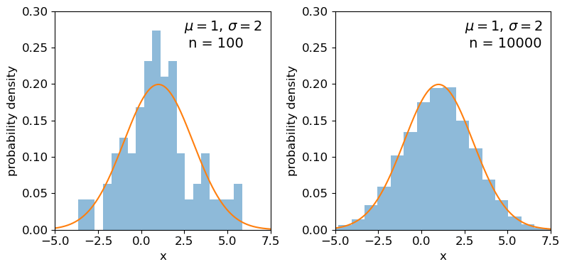

<!-- Just one possible MathJax CDN below. You may use others. -->

In this episode we will be using numpy, as well as matplotlib's plotting library. Scipy contains an extensive range of distributions in its 'scipy.stats' module, so we will also need to import it. Remember: scipy modules should be installed separately as required - they cannot be called if only scipy is imported.
~~~
import numpy as np
import matplotlib.pyplot as plt
import scipy.stats as sps
~~~
{: .language-python}

## The cdf and pdf of a continuous probability distribution

Consider a [__continuous__]({{ page.root }}/reference/#continuous) random variable $$x$$, which follows a fixed, continuous probability distribution. A random variate $$X$$ (e.g. a single experimental measurement) is drawn from the distribution. We can define the probability $$P$$ that $$X\leq x$$ as being the [__cumulative distribution function__]({{ page.root }}/reference/#cdf) (or __cdf__), $$F(x)$$:

$$F(x) = P(X\leq x)$$

We can choose the limiting values of our distribution, but since $$X$$ must take on some value (i.e. the definition of an 'event' is that _something_ must happen) the distribution _must_ satisfy: 

$$\lim\limits_{x\rightarrow -\infty} F(x) = 0$$ and $$\lim\limits_{x\rightarrow +\infty} F(x) = 1$$

From these definitions we find that the probability that $$X$$ lies in the closed interval $$[a,b]$$ (note: a _closed_ interval, denoted by square brackets, means that we include the endpoints $$a$$ and $$b$$) is:

$$P(a \leq X \leq b) = F(b) - F(a)$$

We can then take the limit of a very small interval $$[x,x+\delta x]$$ to define the [__probability density function__]({{ page.root }}/reference/#pdf) (or __pdf__), $$p(x)$$:

$$\frac{P(x\leq X \leq x+\delta x)}{\delta x} = \frac{F(x+\delta x)-F(x)}{\delta x}$$

$$p(x) = \lim\limits_{\delta x \rightarrow 0} \frac{P(x\leq X \leq x+\delta x)}{\delta x} = \frac{\mathrm{d}F(x)}{\mathrm{d}x}$$

This means that the cdf is the integral of the pdf, e.g.:

$$P(X \leq x) = F(x) = \int^{x}_{-\infty} p(x^{\prime})\mathrm{d}x^{\prime}$$

where $$x^{\prime}$$ is a dummy variable.  The probability that $$X$$ lies in the interval $$[a,b]$$ is:

$$P(a \leq X \leq b) = F(b) - F(a) = \int_{a}^{b} p(x)\mathrm{d}x$$

and $$\int_{-\infty}^{\infty} p(x)\mathrm{d}x = 1$$.

Note that the pdf is in some sense the continuous equivalent of the [__pmf__]({{ page.root }}/reference/#pmf) of discrete distributions, but for continuous distributions the function must be expressed as a probability _density_ for a given value of the continuous random variable, instead of the probability used by the pmf. A discrete distribution always shows a finite (or exactly zero) probability for a given value of the discrete random variable, hence the different definitions of the pdf and pmf.

> ## Why use the pdf?
> By definition, the cdf can be used to directly calculate probabilities (which is very useful in statistical assessments of data), while the pdf only gives us the probability density for a specific value of $$X$$. So why use the pdf? One of the main reasons is that it is generally much easier to calculate the pdf for a particular probability distribution, than it is to calculate the cdf, which requires integration (which may be analytically impossible in some cases!). 
>
> Also, the pdf gives the relative probabilities (or [__likelihoods__]({{ page.root }}/reference/#likelihood)) for particular values of $$X$$ and the model parameters, allowing us to compare the relative likelihood of [__hypotheses__]({{ page.root }}/reference/#hypothesis) where the model [parameters]({{ page.root }}/reference/#parameter) are different. This principle is a cornerstone of statistical inference which we will come to later on.
{: .callout}

## Properties of continuous random variates: mean and variance

As with variates drawn from discrete distributions, the [__expectation__]({{ page.root }}/reference/#expectation) $$E(X)$$ (also known as the  [__mean__]({{ page.root }}/reference/#mean $$\mu$$) for continuous random variates is equal to their arithmetic mean as the number of sampled [__variates__]({{ page.root }}/reference/#random-variate) increases $$\rightarrow \infty$$. For a [continuous]({{ page.root }}/reference/#continuous) probability distribution it is given by the mean of the distribution function, i.e. the pdf:

$$E[X] = \mu = \int_{-\infty}^{+\infty} xp(x)\mathrm{d}x$$

And we can obtain the expectation of some function of $$X$$, $$f(X)$$:

$$E[f(X)] = \int_{-\infty}^{+\infty} f(x)p(x)\mathrm{d}x$$

while the variance is:

$$V[X] = \sigma^{2} = E[(X-\mu)^{2})] = \int_{-\infty}^{+\infty} (x-\mu)^{2} p(x)\mathrm{d}x$$

and the results for scaled linear combinations of continuous random variates are the same as for discrete random variates, i.e. for a scaled sum of random variates $$Y=\sum\limits_{i=1}^{n} a_{i}X_{i}$$:

$$E[Y] = \sum\limits_{i=1}^{n} a_{i}E[X_{i}]$$

$$V[Y] = \sum\limits_{i=1}^{n}  a_{i}^{2} \sigma_{i}^{2}$$

and we should also recall the results which follow for averages of variables $$\bar{X} = \frac{1}{n} \sum\limits_{i=1}^{n} X_{i}$$:

$$E[\bar{X}] = \frac{1}{n} \sum\limits_{i=1}^{n} \mu_{i}$$ 

$$V[\bar{X}] = \frac{1}{n^{2}} \sum\limits_{i=1}^{n} \sigma_{i}^{2}$$

and in the case where the variates are all drawn from the same distribution with mean $$\mu$$ and variance $$\sigma^{2}$$:
 
 $$E[\bar{X}] = \mu$$ and $$V[\bar{X}] = \frac{\sigma^{2}}{n}$$.

## Probability distributions: Uniform

Now we'll introduce two common probability distributions, and see how to use them in your Python data analysis. We start with the [__uniform distribution__]({{ page.root }}/reference/#distributions---uniform), which has equal probability values defined over some finite interval $$[a,b]$$ (and zero elsewhere). The pdf is given by:

$$p(x\vert a,b) = 1/(b-a) \quad \mathrm{for} \quad a \leq x \leq b$$

where the notation $$p(x\vert a,b)$$ means _'probability density at x, conditional on model parameters $$a$$ and $$b$$'_. For $$X$$ drawn from a uniform distribution over the interval $$[a,b]$$, we write $$X\sim \mathrm{U}(a,b)$$. We can use the approach given above to calculate the mean
$$E[X] = (b+a)/2$$ and variance $$V[X] = (b-a)^{2}/12$$.

> ## Distribution parameters: location, scale and shape
> When working with probability distributions in Python, it is often useful to _'freeze'_ a distribution by fixing its parameters and defining the frozen distribution as a new function, which saves repeating the parameters each time. The common format for [arguments]({{ page.root }}/reference/#argument) of scipy statistical distributions which represent distribution parameters, corresponds to statistical terminology for the parameters:
> 
> - A [__location parameter__]({{ page.root }}/reference/#parameter) (the `loc` argument in the scipy function) determines the location of the distribution on the $$x$$-axis. Changing the location parameter just shifts the distribution along the $$x$$-axis.
> - A [__scale parameter__]({{ page.root }}/reference/#parameter) (the `scale` argument in the scipy function) determines the width or (more formally) the statistical dispersion of the distribution. Changing the scale parameter just stretches or shrinks the distribution along the $$x$$-axis but does not otherwise alter its shape.
> - There _may_ be one or more [__shape parameters__]({{ page.root }}/reference/#parameter) (scipy function arguments may have different names specific to the distribution). These are parameters which do something other than shifting, or stretching/shrinking the distribution, i.e. they change the shape in some way.
>
> Distributions may have all or just one of these parameters, depending on their form. For example, normal distributions are completely described by their location (the mean) and scale (the standard deviation), while exponential distributions (and the related discrete _Poisson_ distribution) may be defined by a single parameter which sets their location as well as width. Some distributions use a [__rate parameter__]({{ page.root }}/reference/#parameter) which is the reciprocal of the scale parameter (exponential/Poisson distributions are an example of this). 
>
{: .callout}

Now let's freeze a uniform distribution with parameters $$a=1$$ and $$b=4$$:

~~~
## define parameters for our uniform distribution
a = 1
b = 4
print("Uniform distribution with limits",a,"and",b,":")
## freeze the distribution for a given a and b
ud = sps.uniform(loc=a, scale=b-a) # The 2nd parameter is added to a to obtain the upper limit = b
~~~
{: .language-python}

The uniform distribution has a scale parameter $$\lvert b-a \rvert$$. This statistical distribution's location parameter is formally the centre of the distribution, $$(a+b)/2$$, but for convenience the scipy `uniform` function uses $$a$$ to place a bound on one side of the distribution. We can obtain and plot the pdf and cdf by applying those named [methods]({{ page.root }}/reference/#method) to the scipy function.  Note that we must also use a suitable function (e.g. `numpy.arange`) to create a sufficiently dense range of $$x$$-values to make the plots over. 

~~~
## You can plot the probability density function
fig, (ax1, ax2) = plt.subplots(1,2, figsize=(9,4))
# change the separation between the sub-plots:
fig.subplots_adjust(wspace=0.3)
x = np.arange(0., 5.0, 0.01)
ax1.plot(x, ud.pdf(x), lw=2)
## or you can plot the cumulative distribution function:
ax2.plot(x, ud.cdf(x), lw=2)
for ax in (ax1,ax2):
    ax.tick_params(labelsize=12)
    ax.set_xlabel("x", fontsize=12)
    ax.tick_params(axis='x', labelsize=12)
    ax.tick_params(axis='y', labelsize=12)
ax1.set_ylabel("probability density", fontsize=12)
ax2.set_ylabel("probability", fontsize=12)
plt.show()
~~~
{: .language-python}

## Probability distributions: Normal

The [__normal distribution__]({{ page.root }}/reference/#distributions---normal) is one of the most important in statistical data analysis (for reasons which will become clear) and is also known to physicists and engineers as the _Gaussian distribution_. The distribution is defined by location parameter $$\mu$$ (often just called the __mean__, but not to be confused with the mean of a statistical sample) and scale parameter $$\sigma$$ (also called the __standard deviation__, but again not to be confused with the sample standard deviation). The pdf is given by:

$$p(x\vert \mu,\sigma)=\frac{1}{\sigma \sqrt{2\pi}} e^{-(x-\mu)^{2}/(2\sigma^{2})}$$

For normally-distributed variates ($$X\sim \mathrm{N}(\mu,\sigma)$$) we obtain the simple results that $$E[X]=\mu$$ and $$V[X]=\sigma^{2}$$.

It is also common to refer to the __standard normal distribution__ which is the normal distribution with $$\mu=0$$ and $$\sigma=1$$:

$$p(z\vert 0,1) = \frac{1}{\sqrt{2\pi}} e^{-z^{2}/2}$$

The standard normal is important for many statistical results, including the approach of defining statistical significance in terms of the number of _'sigmas'_ which refers to the probability contained within a range $$\pm z$$ on the standard normal distribution (we will discuss this in more detail when we discuss statistical significance testing).

> ## Programming example: plotting the normal distribution
> Now that you have seen the example of a uniform distribution, use the appropriate `scipy.stats` function to plot the pdf and cdf of the normal distribution, for a mean and standard deviation of your choice (you can freeze the distribution first if you wish, but it is not essential).
>
>> ## Solution
>> ~~~
>> ## Define mu and sigma:
>> mu = 2.0
>> sigma = 0.7
>> ## Plot the probability density function
>> fig, (ax1, ax2) = plt.subplots(1,2, figsize=(9,4))
>> fig.subplots_adjust(wspace=0.3)
>> ## we will plot +/- 3 sigma on either side of the mean
>> x = np.arange(-1.0, 5.0, 0.01)
>> ax1.plot(x, sps.norm.pdf(x,loc=mu,scale=sigma), lw=2)
>> ## and the cumulative distribution function:
>> ax2.plot(x, sps.norm.cdf(x,loc=mu,scale=sigma), lw=2)
>> for ax in (ax1,ax2):
>>     ax.tick_params(labelsize=12)
>>     ax.set_xlabel("x", fontsize=12)
>>     ax.tick_params(axis='x', labelsize=12)
>>     ax.tick_params(axis='y', labelsize=12)
>> ax1.set_ylabel("probability density", fontsize=12)
>> ax2.set_ylabel("probability", fontsize=12)
>> plt.show()
>> ~~~
>> {: .language-python}
>>
>> 

>> 
>> 

> {: .solution}
{: .challenge}

It's useful to note that the pdf is much more distinctive for different functions than the cdf, which (because of how it is defined) always takes on a similar, slanted 'S'-shape, hence there is some similarity in the form of cdf between the normal and uniform distributions, although their pdfs look radically different.

## Probability distributions: Lognormal

Another important continuous distribution is the [__lognormal__]({{ page.root }}/reference/#distributions---lognormal) distribution. If random variates $$X$$ are lognormally distributed, then the variates $$Y=\ln(X)$$ are normally distributed.

$$p(x\vert \theta,m,s) = \frac{1}{(x-\theta)s\sqrt{2\pi}}\exp \left(\frac{-\left(\ln [(x-\theta)/m] \right)^{2}}{2s^{2}}\right) \quad x > \theta \mbox{ ; } m, s > 0$$

Here $$\theta$$ is the location parameter, $$m$$ the scale parameter and $$s$$ is the shape parameter.  The case for $$\theta=0$$ is known as the __2-parameter lognormal__ distribution while the __standard lognormal__ occurs when $$\theta=0$$ and $$m=1$$.  For the 2-parameter lognormal (with location parameter $$\theta=0$$), $$X\sim \mathrm{Lognormal}(m,s)$$ and we find $$E[X]=m\exp(s^{2}/2)$$ and $$V[X]=m^{2}[\exp(s^{2})-1]\exp(s^{2})$$.

> ## Moments: mean, variance, skew, kurtosis
> The mean and variance of a distribution of random variates are examples of statistical [__moments__]. The [__first raw moment__] is the mean $$\mu=E[X]$$. By subtracting the mean when calculating expectations and taking higher integer powers, we obtain the [__central moments__]:
>
> $$\mu_{n} = E[(X-\mu)^{n}]$$
>
> Which for a continuous probability distribution may be calculated as:
> 
> $$\mu_{n} = \int_{-\infty}^{+\infty} (x-\mu)^{n} p(x)\mathrm{d}x$$
>
> The central moments may sometimes be _standardised_ by dividing by $$\sigma^{n}$$, to obtain a dimensionless quantity. The first central moment is zero by definition. The second central moment is the [__variance__]({{ page.root }}/reference/#variance) ($$\sigma^{2}$$). Although the mean and variance are by far the most common, you will sometimes encounter the third and fourth central moments, known respectively as the [__skewness__]({{ page.root }}/reference/#skew) and [__kurtosis__]({{ page.root }}/reference/#kurtosis). 
>
> Skewness measures how skewed (asymmetric) the distribution is around the mean. Positively skewed (or 'right-skewed') distributions are more extended to larger values of $$x$$, while negatively skewed ('left-skewed') distributions are more extended to smaller (or more negative) values of $$x$$. For a symmetric distribution such as the normal or uniform distributions, the skewness is zero. Kurtosis measures how `heavy-tailed' the distribution is, i.e. how strong the tail is relative to the peak of the distribution. The _excess kurtosis_, equal to kurtosis minus 3 is often used, so that the standard normal distribution has excess kurtosis equal to zero by definition.
{: .discussion}

> ## Programming example: skewness and kurtosis
> We can return the moments of a Scipy distribution using the `stats` method with the argument `moments='sk'` to return only the skew and excess kurtosis. In a single plot panel, plot the pdfs of the following distributions and give the skew and kurtosis of the distributions as labels in the legend. 
>
> - A normal distribution with $$\mu=1$$ and $$\sigma=0.5$$.
> - A 2-parameter lognormal distribution with $$s=0.5$$ and $$m=1$$.
> - A 2-parameter lognormal distribution with $$s=1$$ and $$m=1$$.
>
>> ## Solution
>> ~~~
>> # First set up the frozen distributions:
>> ndist = sps.norm(loc=1,scale=0.5)
>> lndist1 = sps.lognorm(loc=0,scale=1,s=0.5)
>> lndist2 = sps.lognorm(loc=0,scale=1,s=1)
>> 
>> x = np.arange(-1.0, 5.0, 0.01) # x-values to plot the pdfs over
>> plt.figure()
>> for dist in [ndist,lndist1,lndist2]:
>>     skvals = dist.stats(moments='sk') # The stats method outputs an array with the corresponding moments
>>     label_txt = r"skew="+str(np.round(skvals[0],1))+", ex. kurtosis="+str(np.round(skvals[1],1))
>>     plt.plot(x,dist.pdf(x),label=label_txt)
>> plt.xlabel("x", fontsize=12)
>> plt.ylabel("probability density", fontsize=12)
>> plt.tick_params(axis='x', labelsize=12)
>> plt.tick_params(axis='y', labelsize=12)
>> plt.legend(fontsize=11)
>> plt.show()
>> ~~~
>> {: .language-python}
>> 

>> 
>> 

>>
> {: .solution}
{: .challenge}

## Quantiles and median values

It is often useful to be able to calculate the [__quantiles__]({{ page.root }}/reference/#quantile) (such as [__percentiles__]({{ page.root }}/reference/#percentile) or [__quartiles__]({{ page.root }}/reference/#quantile)) of a distribution, that is, what value of $$x$$ corresponds to a fixed interval of integrated probability? We can obtain these from the __inverse function__ of the cdf ($$F(x)$$). E.g. for the quantile $$\alpha$$:

$$F(x_{\alpha}) = \int^{x_{\alpha}}_{-\infty} p(x)\mathrm{d}x = \alpha \Longleftrightarrow x_{\alpha} = F^{-1}(\alpha)$$

The value of $$x$$ corresponding to $\alpha=0.5$, i.e. the fiftieth percentile value, which contains half the total probability below it, is known as the [__median__]({{ page.root }}/reference/#median). Note that positively skewed distributions always show mean values that exceed the median, while negatively skewed distributions show mean values which are less than the median (for symmetric distributions the mean and median are the same).

Note that $$F^{-1}$$ denotes the inverse function of $$F$$, not $$1/F$$! This is called the [__percent point function__]({{ page.root }}/reference/#ppf)  (or __ppf__). To obtain a given quantile for a distribution we can use the `scipy.stats` method `ppf` applied to the distribution function. For example:

~~~
## Print the 30th percentile of a normal distribution with mu = 3.5 and sigma=0.3
print("30th percentile:",sps.norm.ppf(0.3,loc=3.5,scale=0.3))
## Print the median (50th percentile) of the distribution
print("Median (via ppf):",sps.norm.ppf(0.5,loc=3.5,scale=0.3))
## There is also a median method to quickly return the median for a distribution:
print("Median (via median method):",sps.norm.median(loc=3.5,scale=0.3))
~~~
{: .language-python}
~~~
30th percentile: 3.342679846187588
Median (via ppf): 3.5
Median (via median method): 3.5
~~~
{: .output}

> ## Intervals
> It is sometimes useful to be able to quote an interval, containing some fraction of the probability (and usually centred on the median) as a 'typical' range expected for the random variable $$X$$. We will discuss intervals on probability distributions further when we discuss [confidence intervals]({{ page.root }}/reference/#confidence-interval) on parameters. For now, we note that the `.interval` method can be used to obtain a given interval centred on the median. 
> For example, the [__Interquartile Range__]({{ page.root }}/reference/#interquartile-range) (__IQR__) is often quoted as it marks the interval containing half the probability, between the upper and lower [__quartiles__]({{ page.root }}/reference/#quantile) (i.e. from 0.25 to 0.75):
> ~~~
> ## Print the IQR for a normal distribution with mu = 3.5 and sigma=0.3
> print("IQR:",sps.norm.interval(0.5,loc=3.5,scale=0.3))
> ~~~
> {: .language-python}
> ~~~
> IQR: (3.2976530749411754, 3.7023469250588246)
> ~~~
> {: .output}
> So for the normal distribution, with $$\mu=3.5$$ and $$\sigma=0.3$$, half of the probability is contained in the range $$3.5\pm0.202$$ (to 3 decimal places). 
{: .callout}

## The distributions of random numbers

In the previous episode we saw how to use Python to generate random numbers and calculate statistics or do simple statistical experiments with them (e.g. looking at the [covariance]({{ page.root }}/reference/#covariance) as a function of sample size). We can also generate a larger number of random variates and compare the resulting sample distribution with the [pdf]({{ page.root }}/reference/#pdf) of the distribution which generated them. We show this for the [uniform]({{ page.root }}/reference/#distributions---uniform) and [normal]({{ page.root }}/reference/#distributions---normal) distributions below:

~~~
mu = 1
sigma = 2
## freeze the distribution for the given mean and standard deviation
nd = sps.norm(mu, sigma)

## Generate a large and a small sample
sizes=[100,10000]
x = np.arange(-5.0, 8.0, 0.01)
fig, (ax1, ax2) = plt.subplots(1,2, figsize=(9,4))
fig.subplots_adjust(wspace=0.3)
for i, ax in enumerate([ax1,ax2]):
    nd_rand = nd.rvs(size=sizes[i])
    # Make the histogram semi-transparent
    ax.hist(nd_rand, bins=20, density=True, alpha=0.5)
    ax.plot(x,nd.pdf(x))
    ax.tick_params(labelsize=12)
    ax.set_xlabel("x", fontsize=12)
    ax.tick_params(axis='x', labelsize=12)
    ax.tick_params(axis='y', labelsize=12)
    ax.set_ylabel("probability density", fontsize=12)
    ax.set_xlim(-5,7.5)
    ax.set_ylim(0,0.3)
    ax.text(2.5,0.25,
            "$\mu=$"+str(mu)+", $\sigma=$"+str(sigma)+"\n n = "+str(sizes[i]),fontsize=14)
plt.show()

## Repeat for the uniform distribution
a = 1
b = 4
## freeze the distribution for given a and b
ud = sps.uniform(loc=a, scale=b-a) 
sizes=[100,10000]
x = np.arange(0.0, 5.0, 0.01)
fig, (ax1, ax2) = plt.subplots(1,2, figsize=(9,4))
fig.subplots_adjust(wspace=0.3)
for i, ax in enumerate([ax1,ax2]):
    ud_rand = ud.rvs(size=sizes[i])
    ax.hist(ud_rand, bins=20, density=True, alpha=0.5)
    ax.plot(x,ud.pdf(x))
    ax.tick_params(labelsize=12)
    ax.set_xlabel("x", fontsize=12)
    ax.tick_params(axis='x', labelsize=12)
    ax.tick_params(axis='y', labelsize=12)
    ax.set_ylabel("probability density", fontsize=12)
    ax.set_xlim(0,5)
    ax.set_ylim(0,0.8)
    ax.text(3.0,0.65,
            "$a=$"+str(a)+", $b=$"+str(b)+"\n n = "+str(sizes[i]),fontsize=14)    
plt.show()
~~~
{: .language-python}

Clearly the sample distributions for 100 random variates are much more scattered compared to the 10000 random variates case (and the 'true' distribution).

## The distributions of sums of uniform random numbers

Now we will go a step further and run a similar experiment but plot the histograms of __sums__ of random numbers instead of the random numbers themselves. We will start with sums of uniform random numbers which are all drawn from the same, uniform distribution. To plot the histogram we need to generate a large number (`ntrials`) of samples of size given by `nsamp`,  and step through a range of `nsamp` to make a histogram of the distribution of summed sample variates. Since we know the mean and variance of the distribution our variates are drawn from, we can calculate the expected variance and mean of our sum using the approach for sums of random variables described in the previous episode.

~~~
# Set ntrials to be large to keep the histogram from being noisy
ntrials = 100000
# Set the list of sample sizes for the sets of variates generated and summed
nsamp = [2,4,8,16,32,64,128,256,512]
# Set the parameters for the uniform distribution and freeze it
a = 0.5
b = 1.5
ud = sps.uniform(loc=a,scale=b-a)
# Calculate variance and mean of our uniform distribution
ud_var = ud.var()
ud_mean = ud.mean()
# Now set up and plot our figure, looping through each nsamp to produce a grid of subplots
n = 0  # Keeps track of where we are in our list of nsamp
fig, ax = plt.subplots(3,3, figsize=(9,4))
fig.subplots_adjust(wspace=0.3,hspace=0.3) # Include some spacing between subplots
# Subplots ax have indices i,j to specify location on the grid
for i in range(3):
    for j in range(3):
        # Generate an array of ntrials samples with size nsamp[n]
        ud_rand = ud.rvs(size=(ntrials,nsamp[n]))
        # Calculate expected mean and variance for our sum of variates
        exp_var = nsamp[n]*ud_var
        exp_mean = nsamp[n]*ud_mean
        # Define a plot range to cover adequately the range of values around the mean
        plot_range = (exp_mean-4*np.sqrt(exp_var),exp_mean+4*np.sqrt(exp_var))
        # Define xvalues to calculate normal pdf over
        xvals = np.linspace(plot_range[0],plot_range[1],200)
        # Calculate histogram of our sums
        ax[i,j].hist(np.sum(ud_rand,axis=1), bins=50, range=plot_range,
                                              density=True, alpha=0.5)
        # Also plot the normal distribution pdf for the calculated sum mean and variance
        ax[i,j].plot(xvals,sps.norm.pdf(xvals,loc=exp_mean,scale=np.sqrt(exp_var)))
        # The 'transform' argument allows us to locate the text in relative plot coordinates
        ax[i,j].text(0.1,0.8,"$n=$"+str(nsamp[n]),transform=ax[i,j].transAxes)
        n = n + 1
        # Only include axis labels at the left and lower edges of the grid:
        if j == 0:
            ax[i,j].set_ylabel('prob. density')
        if i == 2:
            ax[i,j].set_xlabel("sum of $n$ $U($"+str(a)+","+str(b)+"$)$ variates")
plt.show()
~~~
{: .language-python}

A sum of two uniform variates follows a triangular probability distribution, but as we add more variates we see that the distribution starts to approach the shape of the normal distribution for the same (calculated) mean and variance!  Let's show this explicitly by calculating the ratio of the 'observed' histograms for our sums to the values from the corresponding normal distribution. 

To do this correctly we should calculate the average probability density of the normal pdf in bins which are the same as in the histogram. We can calculate this by integrating the pdf over each bin, using the difference in [cdfs]({{ page.root }}/reference/#cdf) at the upper and lower bin edge (which corresponds to the integrated probability in the normal pdf over the bin). Then if we normalise by the bin width, we get the probability density expected from a normal distribution with the same mean and variance as the expected values for our sums of variates.

~~~
# For better precision we will make ntrials 10 times larger than before, but you
# can reduce this if it takes longer than a minute or two to run.
ntrials = 1000000
nsamp = [2,4,8,16,32,64,128,256,512]
a = 0.5
b = 1.5
ud = sps.uniform(loc=a,scale=b-a)
ud_var = ud.var()
ud_mean = ud.mean()
n = 0
fig, ax = plt.subplots(3,3, figsize=(9,4))
fig.subplots_adjust(wspace=0.3,hspace=0.3)
for i in range(3):
    for j in range(3):
        ud_rand = ud.rvs(size=(ntrials,nsamp[n]))
        exp_var = nsamp[n]*ud_var
        exp_mean = nsamp[n]*ud_mean
        nd = sps.norm(loc=exp_mean,scale=np.sqrt(exp_var))
        plot_range = (exp_mean-4*np.sqrt(exp_var),exp_mean+4*np.sqrt(exp_var))
        # Since we no longer want to plot the histogram itself, we will use the numpy function instead
        dens, edges = np.histogram(np.sum(ud_rand,axis=1), bins=50, range=plot_range,
                                              density=True)
        # To get the pdf in the same bins as the histogram, we calculate the differences in cdfs at the bin
        # edges and normalise them by the bin widths.
        norm_pdf = (nd.cdf(edges[1:])-nd.cdf(edges[:-1]))/np.diff(edges)
        # We can now plot the ratio as a pre-calculated histogram using the trick we learned in Episode 1
        ax[i,j].hist((edges[1:]+edges[:-1])/2,bins=edges,weights=dens/norm_pdf,density=False,
                     histtype='step')
        ax[i,j].text(0.05,0.8,"$n=$"+str(nsamp[n]),transform=ax[i,j].transAxes)
        n = n + 1
        ax[i,j].set_ylim(0.5,1.5)
        if j == 0:
            ax[i,j].set_ylabel('ratio')
        if i == 2:
            ax[i,j].set_xlabel("sum of $n$ $U($"+str(a)+","+str(b)+"$)$ variates")
plt.show()
~~~
{: .language-python}

The plots show the ratio between the distributions of our sums of $$n$$ uniform variates, and the normal distribution with the same mean and variance expected from the distribution of summed variates. There is still some scatter at the edges of the distributions, where there are only relatively few counts in the histograms of sums, but the ratio plots still demonstrate a couple of important points:

- As the number of summed uniform variates increases, the distribution of the sums gets closer to a normal distribution (with mean and variance the same as the values expected for the summed variable).
- The distribution of summed variates is closer to normal in the centre, and deviates more strongly in the 'wings' of the distribution.

It's also useful to note that __a normally distributed variate added to another normally distributed variate, produces another normally distributed variate__ (with mean and variance equal to the sums of mean and variance for the added variables). The normal distribution is a limiting distribution, which sums of random variates will always approach, leading us to one of the most important theorems in statistics...

> ## The Central Limit Theorem
> The [__Central Limit Theorem__]({{ page.root }}/reference/#central-limit-theorem) __(CLT)__ states that under certain general conditions (e.g. distributions with finite mean and variance), a sum of $$n$$ random variates drawn from distributions with mean $$\mu_{i}$$ and variance $$\sigma_{i}^{2}$$ will tend towards being normally distributed for large $$n$$, with the distribution having mean $$\mu = \sum\limits_{i=1}^{n} \mu_{i}$$ and variance $$\sigma^{2} = \sum\limits_{i=1}^{n} \sigma_{i}^{2}$$ (and if we instead take the mean rather than the sum of variates, we find $$\mu = \frac{1}{n} \sum\limits_{i=1}^{n} \mu_{i}$$ and $$\sigma^{2} = \frac{1}{n^{2}} \sum\limits_{i=1}^{n} \sigma_{i}^{2}$$).
>
> It is important to note that the limit is approached asymptotically with increasing $$n$$, and the rate at which it is approached depends on the shape of the distribution(s) of variates being summed, with more asymmetric distributions requiring larger $$n$$ to approach the normal distribution to a given accuracy. The CLT also applies to mixtures of variates drawn from different types of distribution or variates drawn from the same type of distribution but with different parameters. Note also that summed normally distributed variables are always distributed normally, whatever the combination of normal distribution parameters.
>
> Finally, we should bear in mind that, as with other distributions, in the large sample limit the binomial and Poisson distributions both approach the normal distribution, with mean and standard deviation given by the expected values for the discrete distributions (i.e. $$\mu=n\theta$$ and $$\sigma=\sqrt{n\theta(1-\theta)}$$ for the binomial distribution and $$\mu = \lambda$$ and $$\sigma = \sqrt{\lambda}$$ for the Poisson distribution). It's easy to do a simple comparison yourself, by overplotting the Poisson or binomial pdfs on those for the normal distribution.
> 
{: .callout}

> ## Programming challenge: the central limit theorem applied to skewed distributions
> We used Monte Carlo simulations above to show that the sum of $$n$$ random uniform variates converges on a normal distribution for large $$n$$. Now we will investigate what happens when the variates being summed are drawn from a skewed distribution, such as the lognormal distribution. Repeat the exercise above to show the ratio compared to a normal distribution for multiple values of $$n$$, but for a sum of lognormally distributed variates instead of the uniformly distributed variates used above. You should try this for the following lognormal distribution parameters:
> 
> - $$s=0.5$$ and $$m=1$$.
> - $$s=1$$ and $$m=1$$.
> 
> Also, use the functions `scipy.stats.skew` and `scipy.stats.kurtosis` to calculate the sample skew and kurtosis of your simulated variates for each value of $$n$$ and include the calculated values in the legends of your plots. Besides giving the simulated data array, you can use the default arguments for each function. These functions calculate the sample equivalents (i.e. for actual data) of the standardised skew and excess kurtosis.
>
> Based on your plots and your measurements of the sample skew and kurtosis for each $$n$$ considered, comment on what effect the skewness of the initial lognormal distribution has on how quickly a normal distribution is reached by summing variates.
{: .challenge}
