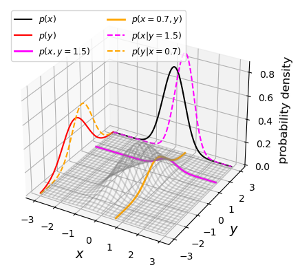
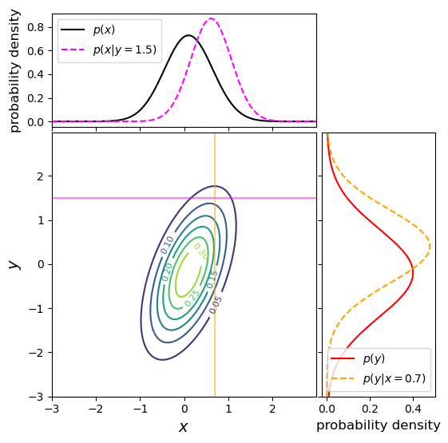
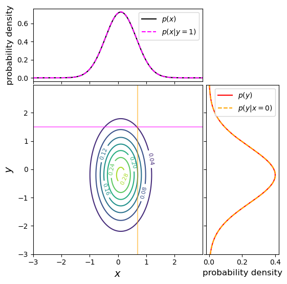
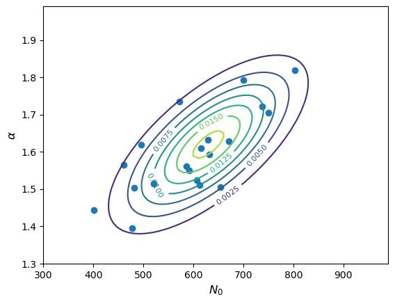
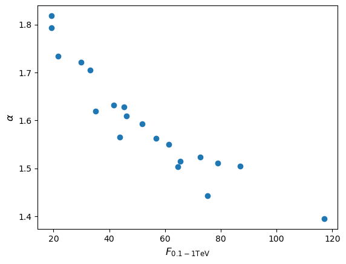
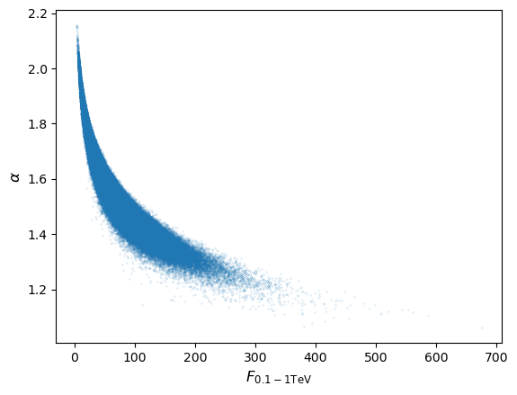
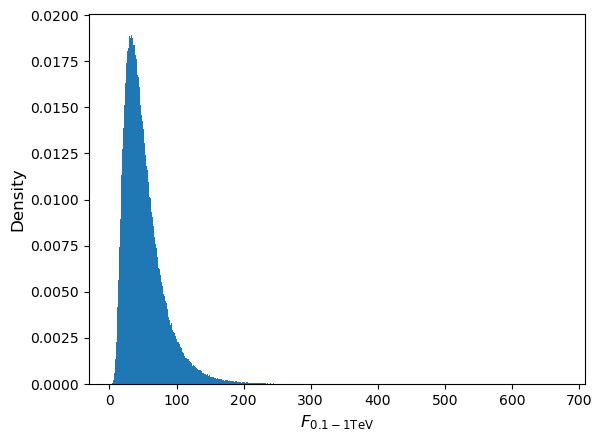

<!-- Just one possible MathJax CDN below. You may use others. -->

In this episode we will be using numpy, as well as matplotlib's plotting library. Scipy contains an extensive range of distributions in its 'scipy.stats' module, so we will also need to import it. Remember: scipy modules should be installed separately as required - they cannot be called if only scipy is imported.
~~~
import numpy as np
import matplotlib.pyplot as plt
import scipy.stats as sps
~~~
{: .language-python}

## Joint probability distributions

So far we have considered [__probability distributions__]({{ page.root }}/reference/#probability-distribution) that describe the probability of sampling a single variable. These are known as [__univariate__]({{ page.root }}/reference/#univariate) probability distributions. Now we will consider [__joint probability distributions__]({{ page.root }}/reference/#joint-probability-distribution) which describe the probability of sampling a given combination of multiple variables, where we must make use of our understanding of [__conditional probability__]({{ page.root }}/reference/#conditional-probability).  Such distributions can be [__multivariate__]({{ page.root }}/reference/#multivariate), considering multiple variables, but for simplicity we will focus on the [__bivariate__]({{ page.root }}/reference/#bivariate) case, with only two variables $$x$$ and $$y.$$ 

Now consider that each variable is sampled by measurement, to return variates $$X$$ and $$Y$$. Any combination of variates can be considered as an [__event__]({{ page.root }}/reference/#event), with probability given by $$P(X \mbox{ and } Y)$$. For discrete variables, we can simply write the joint [__probability mass function__]({{ page.root }}/reference/#pmf) as:

$$p(x,y) = P(X=x \mbox{ and } Y=y)$$

and so the equivalent for the [__cdf__]({{ page.root }}/reference/#cdf) is:

$$F(x,y) = P(X\leq x \mbox{ and } Y\leq y) = \sum\limits_{x_{i}\leq x, y_{j}\leq y} p(x_{i},y_{j})$$

For continuous variables we need to consider the joint probability over an infinitesimal range in $$x$$ and $$y$$. The joint [__probability density function__]({{ page.root }}/reference/#pdf) for jointly sampling variates with values $$X$$ and $$Y$$ is defined as:

$$p(x,y) = \lim\limits_{\delta x, \delta y\rightarrow 0} \frac{P(x \leq X \leq x+\delta x \mbox{ and } y \leq Y \leq y+\delta y)}{\delta x \delta y}$$

I.e. this is the probability that a given measurement of two variables finds them both in the ranges $$x \leq X \leq x+\delta x$$, $$y \leq Y \leq y+\delta y$$. For the cdf we have:

$$F(x,y) = P(X\leq x \mbox{ and } Y\leq y) = \int^{x}_{-\infty} \int^{y}_{-\infty} p(x',y')\mathrm{d}x' \mathrm{d}y'$$

where $$x'$$ and $$y'$$ are dummy variables.

In general the probability of variates $$X$$ and $$Y$$ having values in some region $$R$$ is:

$$P(X \mbox{ and } Y \mbox{ in }R) = \int \int_{R} p(x,y)\mathrm{d}x\mathrm{d}y$$

## Conditional probability and marginalisation

Let's now recall the _multiplication rule_ of probability calculus for the variates $$X$$ and $$Y$$ occuring together:

$$p(x,y) = P(X=x \mbox{ and } Y=y) = p(x\vert y)p(y)$$

I.e. we can understand the joint probability $$p(x,y)$$ in terms of the probability for a particular $x$ to occur given that a particular $$y$$ also occurs. The probability for a given pair of $$x$$ and $$y$$ is the same whether we consider $$x$$ or $$y$$ as the conditional variable. We can then write the multiplication rule as:

$$p(x,y)=p(y,x) = p(x\vert y)p(y) = p(y\vert x)p(x)$$

From this we have the law of total probability:

$$p(x) = \int_{-\infty}^{+\infty} p(x,y)dy = \int_{-\infty}^{+\infty} p(x\vert y)p(y)\mathrm{d}y$$

i.e. we [__marginalise__]({{ page.root }}/reference/#marginalisation) over $$y$$ to find the __marginal pdf__ of $$x$$, giving the distribution of $$x$$ only.

We can also use the equation for conditional probability to obtain the probability for $$x$$ conditional on the variable $$y$$ taking on a fixed value (e.g. a drawn variate $$Y$$) equal to $$y_{0}$$:

$$p(x\vert y_{0}) = \frac{p(x,y=y_{0})}{p(y_{0})} = \frac{p(x,y=y_{0})}{\int_{-\infty}^{+\infty} p(x,y=y_{0})\mathrm{d}x}$$

Note that we obtain the probability density $$p(y_{0})$$ by integrating the joint probability over $$x$$.

Bivariate probability distributions can be visualised using 3-D plots (where the height of the surface shown by the 'wireframe' shows the joint probability density) or contour plots (where contours show lines of equal joint probability density). The figures below show the same probability distribution plotted in this way, where the distribution shown is a bivariate [__normal distribution__]({{ page.root }}/reference/#distributions---normal). Besides showing the joint probability distributions, the figures also show, as black and red solid curves on the side panels, the univariate marginal distributions which correspond to the probability distribution for each ($$x$$ and $$y$$) variable, marginalised over the other variable. 

 

The two coloured (orange and magenta) lines or curves plotted on the joint probability distributions shown above each show a 'slice' through the joint distribution which corresponds to the conditional joint probability density at a fixed value of $$y$$ or $$x$$ (i.e. they correspond to the cases $$p(x\vert y_{0})$$ and $$p(y\vert x_{0})$$). The dashed lines with the same colours on the side panels show the univariate probability distributions corresponding to these conditional probability densities. They have the same shape as the joint probability density but are correctly normalised, so that the integrated probability is 1. Since the $$x$$ and $$y$$ variables are covariant (correlated) with one another (see below), the position of the conditional distribution changes according to the fixed value $$x_{0}$$ or $$y_{0}$$, so the centre of the curves do not match the centres of the marginal distributions. The curves of conditional probability are also narrower than those of the marginal distributions, since the covariance between $$x$$ and $$y$$ also broadens both marginal distributions, but not the conditional probability distributions, which correspond to a fixed value on one axis so the covariance does not come into play.

## Properties of bivariate distributions: mean, variance, covariance

We can use our result for the marginal pdf to derive the [__mean__]({{ page.root }}/reference/#mean) and [__variance__]({{ page.root }}/reference/#variance) of variates of one variable that are drawn from a bivariate joint probability distribution. Here we quote the results for $$x$$, but the results are interchangeable with the other variable, $$y$$.

Firstly, the expectation (mean) is given by:

$$\mu_{x} = E[X] = \int^{+\infty}_{-\infty} xp(x)\mathrm{d}x = \int^{+\infty}_{-\infty} x \int^{+\infty}_{-\infty} p(x,y)\mathrm{d}y\;\mathrm{d}x$$

I.e. we first marginalise (integrate) the joint distribution over the variable $$y$$ to obtain $$p(x)$$, and then the mean is calculated in the usual way. Note that since the distribution is bivariate we use the subscript $$x$$ to denote which variable we are quoting the mean for.

The same procedure is used for the variance:

$$\sigma^{2}_{x} = V[X] = E[(X-\mu_{x})^{2}] = \int^{+\infty}_{-\infty} (x-\mu_{x})^{2} \int^{+\infty}_{-\infty} p(x,y)\mathrm{d}y\;\mathrm{d}x$$

So far, we have only considered how to convert a bivariate joint probability distribution into the univariate distribution for one of its variables, i.e. by marginalising over the other variable. But joint distributions also have a special property which is linked to the conditional relationship between its variables. This is known as the [__covariance__]({{ page.root }}/reference/#covariance)

The covariance of variates $$X$$ and $$Y$$ is given by:

$$\mathrm{Cov}(X,Y)=\sigma_{xy} = E[(X-\mu_{x})(Y-\mu_{y})] = E[XY]-\mu_{x}\mu_{y}$$

We can obtain the term $$E[XY]$$ by using the joint distribution:

$$E[XY] = \int^{+\infty}_{-\infty} \int^{+\infty}_{-\infty} x y p(x,y)\mathrm{d}y\;\mathrm{d}x = \int^{+\infty}_{-\infty} \int^{+\infty}_{-\infty} x y p(x\vert y)p(y) \mathrm{d}y\;\mathrm{d}x $$

In the case where $$X$$ and $$Y$$ are [__independent__]({{ page.root }}/reference/#independence) variables, $$p(x\vert y)=p(x)$$ and we obtain:

$$E[XY] = \int^{+\infty}_{-\infty} xp(x)\mathrm{d}x \int^{+\infty}_{-\infty} y p(y)\mathrm{d}y = \mu_{x}\mu_{y}$$

I.e. for independent variables the covariance $$\sigma_{xy}=0$$. The covariance is a measure of how dependent two variables are on one another, in terms of their linear correlation. An important mathematical result known as the _Cauchy-Schwarz inequality_ implies that $$\lvert \mathrm{Cov}(X,Y)\rvert \leq \sqrt{V[X]V[Y]}$$. This means that we can define a [__correlation coefficient__]({{ page.root }}/reference/#correlation-coefficient) which measures the degree of linear dependence between the two variables:

$$\rho(X,Y)=\frac{\sigma_{xy}}{\sigma_{x}\sigma_{y}}$$

where $$-1\leq \rho(X,Y) \leq 1$$. Note that variables with positive (non-zero) $$\rho$$ are known as _correlated_ variables, while variables with negative $$\rho$$ are _anticorrelated_.  For independent variables the correlation coefficient is clearly zero, but it is important to note that the covariance (and hence the correlation coefficient) can also be zero for non-independent variables. E.g. consider the relation between random variate $$X$$ and the variate $$Y$$ calculated directly from $$X$$, $$Y=X^{2}$$, for $$X\sim U[-1,1]$$:

$$\sigma_{xy}=E[XY]-\mu_{X}\mu_{Y} = E[X.X^{2}]-E[X]E[X^{2}] = 0 - 0.E[X^{2}] = 0$$

The covariance (and correlation) is zero even though the variables $$X$$ and $$Y$$ are completely dependent on one another. This result arises because the covariance measures the _linear relationship_ between two variables, but __if the relationship between two variables is non-linear, it can result in a low (or zero) covariance and correlation coefficient__.

An example of a joint probability density for two independent variables is shown below, along with the marginal distributions and conditional probability distributions. This distribution uses the same means and variances as the covariant case shown above, but covariance between $$x$$ and $$y$$ is set to zero. We can immediately see that the marginal and conditional probability distributions (which have the same fixed values of $$x_{0}$$ and $$y_{0}$$ as in the covariant example above) are identical for each variable. This is as expected for independent variables, where $$p(x)=p(x\vert y)$$ and vice versa.

Finally we note that these approaches can be generalised to multivariate joint probability distributions, by marginalising over multiple variables. Since the covariance can be obtained between any pair of variables, it is common to define a [__covariance matrix__]({{ page.root }}/reference/#covariance-matrix), e.g.:

$$ \mathbf{\Sigma} = 
\begin{pmatrix}
\sigma_{xx} & \sigma_{xy} & \sigma_{xz} \\
\sigma_{yx} & \sigma_{yy} & \sigma_{yz} \\
\sigma_{zx} & \sigma_{zy} & \sigma_{zz}
\end{pmatrix}$$

The diagonal elements correspond to the variances of each variable (since the covariance of a variable with itself is simply the variance), while off-diagonal elements correspond to the covariance between pairs of variables. Note that in terms of numerical values, the matrix is symmetric about the diagonal, since by definition $$\sigma_{xy}=\sigma_{yx}$$.

> ## Plotting joint probability distributions
> 
> It is useful to be able to plot bivariate pdfs and their marginal and conditional pdfs  yourself, so that you can develop more intuition for how conditional probability works, e.g. by changing the covariance matrix of the distribution. We made the plots above using the following code, first to generate the pdfs:
>
> ~~~
> import scipy.integrate as spint
> # Freeze the parameters of the bivariate normal distribution: means and covariance matrix for x and y
> bvn = sps.multivariate_normal([0.1, -0.2], [[0.3, 0.3], [0.3, 1.0]])
> # Next we must set up a grid of x and y values to calculate the bivariate normal for, on each axis the
> # grid ranges from -3 to 3, with step size 0.01
> x, y = np.mgrid[-3:3:0.01, -3:3:0.01]
> xypos = np.dstack((x, y))
> # Calculate the bivariate joint pdf and for each variable marginalise (integrate) the joint pdf over the 
> # other variable to obtain marginal pdfs for x and y
> xypdf = bvn.pdf(xypos)
> xpdf = spint.simpson(bvnorm,y,axis=1)
> ypdf = spint.simpson(bvnorm,x,axis=0)
> # Now define x and y ranges to calculate a 'slice' of the joint pdf, corresponding to the conditional pdfs
> # for given x_0 and y_0
> xrange = np.arange(-3,3,0.01)
> yrange = np.arange(-3,3,0.01)
> # We must create corresponding ranges of fixed x and y
> xfix = np.full(len(yrange),0.7)
> yfix = np.full(len(xrange),1.5)
> # And define our arrays for the pdf to be calculated
> xfix_pos = np.dstack((xfix, yrange))
> yfix_pos = np.dstack((xrange, yfix))
> # Now we calculate the conditional pdfs for each case, remembering to normalise by the integral of the 
> # conditional pdf so the integrated probability = 1
> bvny_xfix = bvn.pdf(xfix_pos)/spint.simpson(bvn.pdf(xfix_pos),yrange)
> bvnx_yfix = bvn.pdf(yfix_pos)/spint.simpson(bvn.pdf(yfix_pos),xrange)
> ~~~
> {: .language-python}
> Next we made the 3D plot as follows. You should run the iPython magic command `%matplotlib notebook` somewhere in your notebook (e.g. in the first cell, with the import commands) in order to make the plot interactive, which allows you to rotate it with the mouse cursor and really benefit from the 3-D plotting style.
>  ~~~
> fig = plt.figure()
> ax = fig.add_subplot(projection='3d')
> # Plot the marginal pdfs on the sides of the 3D box (corresponding to y=3 and x=-3)
> ax.plot3D(x[:,0],np.full(len(xpdf),3.0),xpdf,color='black',label=r'$p(x)$')
> ax.plot3D(np.full(len(ypdf),-3.0),y[0,:],ypdf,color='red',label=r'$p(y)$')
> # Plot the slices through the joint pdf corresponding to the conditional pdfs:
> ax.plot3D(xrange,yfix,bvn.pdf(yfix_pos),color='magenta',linewidth=2,label=r'$p(x,y=1.5)$')
> ax.plot3D(xfix,yrange,bvn.pdf(xfix_pos),color='orange',linewidth=2,label=r'$p(x=0.7,y)$')
> # Plot the normalised conditional pdf on the same box-sides as the marginal pdfs
> ax.plot3D(xrange,np.full(len(xrange),3.0),bvnx_yfix,color='magenta',linestyle='dashed',label=r'$p(x\vert y=1.5)$')
> ax.plot3D(np.full(len(yrange),-3.0),yrange,bvny_xfix,color='orange',linestyle='dashed',label=r'$p(y\vert x=0.7)$')
> # Plot the joint pdf as a wireframe:
> ax.plot_wireframe(x, y, xypdf, rstride=20, cstride=20, alpha=0.3, color='gray')
> # Plot labels and the legend
> ax.set_xlabel(r'$x$',fontsize=14)
> ax.set_ylabel(r'$y$',fontsize=14)
> ax.set_zlabel(r'probability density',fontsize=12)
> ax.legend(fontsize=9,ncol=2)
> plt.show()
> ~~~
> {:.language-python}
> Look at the online documentation for the `scipy.stats.multivariate_normal` function to find out what the parameters do. Change the covariance and variance values to see what happens to the joint pdf and the marginal and conditional pdfs. Remember that the variances correspond to diagonal elements of the covariance matrix, i..e to the elements [0,0] and [1,1] of the array with the covariance matrix values. The amount of diagonal 'tilt' of the joint pdf will depend on the magnitude of the covariant elements compared to the variances. You should also bear in mind that since the integration is numerical, based on the calculated joint pdf values, the marginal and conditional pdfs will lose accuracy if your joint pdf contains significant probability outside of the calculated region. You could fix this by e.g. making the calculated region larger, while setting the `x` and `y` limits to show the same zoom in of the plot.
>
> We chose `plot_wireframe()` to show the joint pdf, so that the other pdfs (and the slices through the joint pdf to show the conditional pdfs), are easily visible. But you could use other versions of the 3D surface plot such as `plot_surface()` also including a colour map and colour bar if you wish. If you use a coloured surface plot you can set the transparency (`alpha`) to be less than one, in order to see through the joint pdf surface more easily.
> 
> Finally, if you want to make a traditional contour plot, you could use the following code:
> ~~~
> # We set the figsize so that we get a square plot with x and y axes units having equal dimension 
> # (so the contours are not artificially stretched)
> fig = plt.figure(figsize=(6,6))
> # Add a gridspec with two rows and two columns and a ratio of 3 to 7 between
> # the size of the marginal axes and the main axes in both directions.
> # We also adjust the subplot parameters to obtain a square plot.
> gs = fig.add_gridspec(2, 2,  width_ratios=(7, 3), height_ratios=(3, 7), left=0.1, right=0.9, 
>                           bottom=0.1, top=0.9, wspace=0.03, hspace=0.03)
> # Set up the subplots and their shared axes
> ax = fig.add_subplot(gs[1, 0])
> ax_xpdfs = fig.add_subplot(gs[0, 0], sharex=ax)
> ax_ypdfs = fig.add_subplot(gs[1, 1], sharey=ax)
> # Turn off the tickmark values where necessary
> ax_xpdfs.tick_params(axis="x", labelbottom=False)
> ax_ypdfs.tick_params(axis="y", labelleft=False)
> con = ax.contour(x, y, xypdf)  # The contour plot
> # Marginal and conditional pdfs plotted in the side/top panel
> ax_xpdfs.plot(x[:,0],xpdf,color='black',label=r'$p(x)$')
> ax_ypdfs.plot(ypdf,y[0,:],color='red',label=r'$p(y)$')
> ax_xpdfs.plot(xrange,bvnx_yfix,color='magenta',linestyle='dashed',label=r'$p(x\vert y=1.5)$')
> ax_ypdfs.plot(bvny_xfix,yrange,color='orange',linestyle='dashed',label=r'$p(y\vert x=0.7)$')
> # Lines on the contour show the slices used for the conditional pdfs
> ax.axhline(1.5,color='magenta',alpha=0.5)
> ax.axvline(0.7,color='orange',alpha=0.5)
> # Plot labels and legend
> ax.set_xlabel(r'$x$',fontsize=14)
> ax.set_ylabel(r'$y$',fontsize=14)
> ax_xpdfs.set_ylabel(r'probability density',fontsize=12)
> ax_ypdfs.set_xlabel(r'probability density',fontsize=12)
> ax.clabel(con, inline=1, fontsize=8) # This adds labels to show the value of each contour level
> ax_xpdfs.legend()
> ax_ypdfs.legend()
> #plt.savefig('2d_joint_prob.png',bbox_inches='tight')
> plt.show()
> ~~~
> {: .language-python}
> 
{: .discussion}

## Probability distributions: multivariate normal

`scipy.stats` contains a number of multivariate probability distributions, with the most commonly used being `multivariate_normal` considered above, which models the multivariate normal pdf:

$$p(\mathbf{x}\vert \boldsymbol{\mu}, \mathbf{\Sigma}) =  \frac{\exp\left(-\frac{1}{2}(\mathbf{x}-\boldsymbol{\mu})^{\mathrm{T}} \mathbf{\Sigma}^{-1}(\mathbf{x}-\boldsymbol{\mu})\right)}{\sqrt{(2\pi)^{k}\lvert\mathbf{\Sigma}\rvert}}$$

where bold symbols denote vectors and matrices: $$\mathbf{x}$$ is a real $$k$$-dimensional column vector of variables $$[x_{1}\,x_{2}\, ...\,x_{k}]^{\mathrm{T}}$$, $$\boldsymbol{\mu} = \left[E[X_{1}]\,E[X_{2}]\,...\,E[X_{k}]\right]^{\mathrm{T}}$$ and $$\mathbf{\Sigma}$$ is the $$k\times k$$ covariance matrix of elements: 

$$\Sigma_{i,j}=E[(X_{i}-\mu_{i})(X_{j}-\mu_{j})]=\mathrm{Cov}[X_{i},X_{j}]$$

Note that $$\mathrm{T}$$ denotes the transpose of the vector (to convert a row-vector to a column-vector and vice versa) while $$\lvert\mathbf{\Sigma}\rvert$$ and $$\mathbf{\Sigma}^{-1}$$ are the determinant and inverse of the covariance matrix respectively. A single sampling of the distribution produces variates $$\mathbf{X}=[X_{1}\,X_{2}\, ...\,X_{k}]^{\mathrm{T}}$$ and we describe their distribution with $$\mathbf{X} \sim N_{k}(\boldsymbol{\mu},\mathbf{\Sigma})$$.

Scipy's `multivariate_normal` comes with the usual `pdf` and `cdf` methods although its general functionality is more limited than for the univariate distributions. Examples of the `pdf` plotted for a bivariate normal are given above for the 3D and contour plotting examples. The `rvs` method can also be used to generate random data drawn from a multivariate distribution, which can be especially useful when simulating data with correlated (but normally distributed) errors, provided that the covariance matrix of the data is known.

> ## Programming example: multivariate normal random variates
> You are simulating measurements of a sample of gamma-ray spectra which are described by a power-law model, at energy $$E$$ (in GeV) the photon flux density (in photons/GeV) is given by $$N(E)=N_{0}E^{-\alpha}$$ where $$N_{0}$$ is the flux density at 1 GeV.  Based on the statistical errors in the expected data, you calculate that your measured values of $$N_{0}$$ and $$\alpha$$ should be covariant with means $$\mu_{N_{0}}=630$$, $$\mu_{\alpha}=1.62$$, standard deviations $$\sigma_{N_{0}}=100$$, $$\sigma_{\alpha}=0.12$$ and covariance $$\sigma_{N_{0}\alpha}=8.3$$. Assuming that the paired measurements of $$N_{0}$$ and $$\alpha$$ are drawn from a bivariate normal distribution, simulate a set of 20 measured pairs of these quantities and plot them as a scatter diagram, along with the confidence contours of the underlying distribution.
>
>> ## Solution
>> ~~~
>> # Set up the parameters:
>> means = [630, 1.62]
>> sigmas = [100, 0.12]
>> covar = 8.3
>> # Freeze the distribution:
>> bvn = sps.multivariate_normal(means, [[sigmas[0]**2, covar], [covar, sigmas[1]**2]])
>> # Next we must set up a grid of x and y values to calculate the bivariate normal for. We choose a range that
>> # covers roughly 3-sigma around the means
>> N0_grid, alpha_grid = np.mgrid[300:1000:10, 1.3:2.0:0.01]
>> xypos = np.dstack((N0_grid, alpha_grid))
>> # Make a random set of 20 measurements. For reproducibility we set a seed first:
>> rng = np.random.default_rng(38700)
>> xyvals = bvn.rvs(size=20, random_state=rng)
>> # The output is an array of shape (20,2), for clarity we will assign each column to the corresponding variable:
>> N0_vals = xyvals[:,0]
>> alpha_vals = xyvals[:,1]
>> # Now make the plot
>> plt.figure()
>> con = plt.contour(N0_grid, alpha_grid, bvn.pdf(xypos))
>> plt.scatter(N0_vals, alpha_vals)
>> plt.xlabel(r'$N_{0}$',fontsize=12)
>> plt.ylabel(r'$\alpha$',fontsize=12)
>> plt.clabel(con, inline=1, fontsize=8)
>> plt.show()
>> ~~~
>> {: .language-python}
>>
>> 

>> 
>> 

> {: .solution}
{: .challenge}

## Simulating correlated data from mathematical and physical models

Many measurements will result in simultaneous data for multiple variables which will often be correlated, and many physical situations will also naturally produce correlations between random variables. E.g. the temperature of a star depends on its surface area and luminosity, which both depend on the mass, metallicity and stellar age (and corresponding stage in the stellar life-cycle). Such variables are often easier to relate using mathematical models with one or more variables being drawn independently from appropriate statistical distributions, and the correlations between them being produced by their mathematical relationship. In general, the resulting distributions will not be multivariate normal, unless they are related to multivariate normal variates by simple linear transformations.

> ## Programming example: calculating fluxes from power-law spectra
> Now imagine you want to use your measurements of gamma ray spectra from the previous programming example, to predict the integrated photon flux $$F_{\rm 0.1-1 TeV}$$ in the energy range $$10^{2}$$-$$10^{3}$$ GeV. Starting from your simulated measurements of $$N_{0}$$ and $$\alpha$$, make a scatter plot of the photon flux in this range vs. the index $$\alpha$$. Does the joint probability distribution of $$\alpha$$ and $$F_{\rm 0.1-1 TeV}$$ remain a multivariate normal? Check your answer by repeating the simulation for $$10^{6}$$ measurements of $$N_{0}$$ and $$\alpha$$ and also plotting a histogram of the calculated fluxes.
>
>> ## Hint
>> The integrated photon flux is equal to $$\int^{1000}_{100} N_{0} E^{-\alpha}\mathrm{d}E$$
> {: .solution}
>> ## Solution
>> The integrated photon flux is $$\int^{1000}_{100} N_{0} E^{-\alpha}\mathrm{d}E = \frac{N_{0}}{1-\alpha}\left(1000^{(1-\alpha)}-100^{(1-\alpha)}\right)$$. We can apply this to our simulated data:
>> ~~~
>> flux_vals = (N0_vals/(1-alpha_vals))*(1000**(1-alpha_vals)-100**(1-alpha_vals))
>> plt.figure()
>> plt.scatter(flux_vals, alpha_vals)
>> plt.xlabel(r'$F_{\rm 0.1-1 TeV}$',fontsize=12)
>> plt.ylabel(r'$\alpha$',fontsize=12)
>> plt.show()
>> ~~~
>> {: .language-python}
>>
>> 

>> 
>> 

>>
>> Since a power-law (i.e. non-linear) transformation is applied to the measurements we would not expect the flux distribution to remain normal, although the joint distribution 
>> of $$\alpha$$ (i.e. marginalised over flux) should of course remain normal. Repeating the simulation for a million pairs of $$N_{0}$$ and $$\alpha$$ we obtain (setting marker size `s=0.01` for the scatter plot and using `bins=1000` and `density=True` for the histogram):
>> 
>> 

>> 
>> 

>> 
>> 

>> 
>> 

>> 
>> As expected, the flux distribution is clearly not normally distributed, it is positively skewed to high fluxes, resulting in the curvature of the joint distribution.
> {: .solution}
{: .challenge}

## Sums of multivariate random variables and the multivariate Central Limit Theorem

Consider two $$m$$-dimensional multivariate random variates, $$\mathbf{X}=[X_{1}, X_{2},..., X_{m}]$$ and $$\mathbf{Y}=[Y_{1}, Y_{2},..., Y_{m}]$$, which are drawn from different distributions with mean vectors $$\boldsymbol{\mu}_{x}$$, $$\boldsymbol{\mu}_{y}$$ and covariance matrices $$\boldsymbol{\Sigma}_{x}$$, $$\boldsymbol{\Sigma}_{y}$$. The sum of these variates, $$\mathbf{Z}=\mathbf{X}+\mathbf{Y}$$ follows a multivariate distribution with mean $$\boldsymbol{\mu}_{z}=\boldsymbol{\mu}_{x}+\boldsymbol{\mu}_{y}$$ and covariance $$\boldsymbol{\Sigma}_{z}=\boldsymbol{\Sigma}_{x}+\boldsymbol{\Sigma}_{y}$$. I.e. analogous to the univariate case, the result of summing variates drawn from multivariate distributions is to produce a variate with mean vector equal to the sum of the mean vectors and covariance matrix equal to the sum of the covariance matrices.

The analogy with univariate distributions also extends to the [__Central Limit Theorem__]({{ page.root }}/reference/#central-limit-theorem), so that the sum of $$n$$ random variates drawn from multivariate distributions is drawn from a distribution which for large $$n$$ becomes asymptotically multivariate normal, with mean vector equal to the sum of mean vectors and covariance matrix equal to the sum of covariance matrices.

> ## Programming challenge: demonstrating the multivariate Central Limit Theorem with a 3D plot
> 
> For this challenge we will use correlated random variates `x` and `y` which are generated by the following Python code:
> ~~~
> x = sps.lognorm.rvs(loc=1,s=0.5,size=nsamp)
> y = np.sqrt(x)+sps.norm.rvs(scale=0.3,size=nsamp)
> ~~~
> {: .language-python}
>
> First, generate a large sample (e.g. $$10^{6}$$) of random variates from these distributions and plot a scatter plot and histograms of `x` and `y`, to show visually that the distribution is not a multivariate normal (you should also explain in words why not). Also measure the means and covariance of your variates (you can use `np.mean` and `np.cov` to measure means and covariances of arrays of data).
> 
> Next, using many trials (at least $$10^{6}$$), generate random variates from these distributions and take the means of `x` and `y` for samples of $$n$$ pairs (where $$n$$ is at least 100) of the variates for each trial. Then, use a 2D histogram (in probability density units, i.e. similar to a pdf) together with 3D wireframe or surface plots to show that the distribution of the means is close to a multivariate normal pdf, with mean and covariance matrix expected for the sum. It will be useful to compare both the histogram and pdf on the same plot, and make a separate plot to show the difference between the histogram of mean values and the expected multivariate normal pdf.
>
> Finally show what happens when you significantly increase or decrease the sample size $$n$$ (and explain what is happening).
>
>> ## Hints
>> The following numpy function will calculate a 2D histogram (in units of probability density) of the arrays `xmeans` and `ymeans`, with 100 bins on the x and y axes, with bin edges given by `xedges` and `yedges`.
>> ~~~
>> densities, xedges, yedges = np.histogram2d(xmeans,ymeans,bins=100,density=True)
>> ~~~
>> {: .language-python}
>> The examples given above for plotting joint probability distributions will be very useful to make your 3D plots. You can use the edges of the bins to define a meshgrid of the bin centres, which you can use to evalute the multivariate normal pdf and to plot the densities using a 3D plotting method, e.g.:
>> ~~~
>> # To evaluate the points in the right order (similar to mgrid) we need to specify matrix 'ij' indexing rather than cartesian:
>> xgrid, ygrid = np.meshgrid((xedges[1:]+xedges[:-1])/2,(yedges[1:]+yedges[:-1])/2,indexing='ij')
>> ~~~
>> {: .language-python}
> {: .solution}
{: .challenge}

