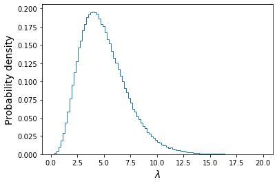

<!-- Just one possible MathJax CDN below. You may use others. -->

In this episode we will be using numpy, as well as matplotlib's plotting library. Scipy contains an extensive range of distributions in its `scipy.stats` module, so we will also need to import it. We will also make use of the `scipy.integrate` integration functions module in this episode. Remember: scipy modules should be installed separately as required - they cannot be called if only scipy is imported.
~~~
import numpy as np
import matplotlib.pyplot as plt
import scipy.stats as sps
import scipy.integrate as spint
~~~
{: .language-python}

When considering two [__events__]({{ page.root }}/reference/#event) $$A$$ and $$B$$, we have previously seen how the equation for conditional probability gives us the multiplication rule:

$$P(A \mbox{ and } B) = P(A\vert B) P(B)$$

It should be clear that we can invert the ordering of $$A$$ and $$B$$ here and the probability of both happening should still be the same, i.e.:

$$P(A\vert B) P(B) = P(B\vert A) P(A)$$

This simple extension of probability calculus leads us to [__Bayes' theorem__]({{ page.root }}/reference/#bayesian), one of the most important results in statistics and probability theory:

$$P(A\vert B) = \frac{P(B\vert A) P(A)}{P(B)}$$

Bayes' theorem, named after clergyman Rev. Thomas Bayes who proposed it in the middle of the 18th century, is in its simplest form, a method to swap the conditional dependence of two events, i.e. to obtain the probability of $$A$$ conditional on $$B$$, when you only know the probability of $$B$$ conditional on $$A$$, and the probabilities of $$A$$ and $$B$$ (i.e. each marginalised over the conditional term). 

To show the inclusion of marginalisation, we can generalise from two events to a set of mutually exclusive exhaustive (i.e. covering every possible outcome) events $$\{A_{1},A_{2},...,A_{n}\}$$:

$$P(A_{i}\vert B) = \frac{P(B\vert A_{i}) P(A_{i})}{P(B)} = \frac{P(B\vert A_{i}) P(A_{i})}{\sum^{n}_{i=1} P(B\vert A_{i}) P(A_{i})}$$

> ## Test yourself: what kind of binary merger is it?
> Returning to our hypothetical problem of detecting radio counterparts from gravitational wave events corresponding to binary mergers of binary neutron stars (NN), binary black holes (BB) and neutron star-black hole binaries (NB), recall that the probabilities of radio detection (event denoted with $$D$$) are:
> 
> $$P(D\vert NN) = 0.72$$, $$P(D\vert NB) = 0.2$$, $$P(D\vert BB) = 0$$
>
> and for any given merger event the probability of being a particular type of binary is: 
>
> $$P(NN)=0.05$$, $$P(NB) = 0.2$$, $$P(BB)=0.75$$
>
> Calculate the following:
> 1. Assuming that you detect a radio counterpart, what is the probability that the event is a binary neutron star ($$NN$$)?
> 2. Assuming that you $$don't$$ detect a radio counterpart, what is the probability that the merger includes a black hole (either $$BB$$ or $$NB$$)?
>
>> ## Hint
>> Remember that if you need a total probability for an event for which you only have the conditional probabilities, you can use the law of total probability and marginalise over the conditional terms.
> {: .solution}
>> ## Solution
>> 1.  We require $$P(NN\vert D)$$. Using Bayes' theorem:
>> $$P(NN\vert D) = \frac{P(D\vert NN)P(NN)}{P(D)}$$
>> We must marginalise over the conditionals to obtain $$P(D)$$, so that:
>> 
>>     $$P(NN\vert D) = \frac{P(D\vert NN)P(NN)}{(P(D\vert NN)P(NN)+P(D\vert NB)P(NB)} = \frac{0.72\times 0.05}{(0.72\times 0.05)+(0.2\times 0.2)}$$
>>    $$= \frac{0.036}{0.076} = 0.474 \mbox{    (to 3 s.f.)}$$
>>
>> 
>> 2. We require $$P(BB \vert D^{C}) + P(NB \vert D^{C})$$, since radio non-detection is the complement of $$D$$ and the $$BB$$ and $$NB$$ events are [__mutually exclusive__]({{ page.root }}/reference/#mutual-exclusivity). Therefore, using Bayes' theorem we should calculate:
>>
>>    $$P(BB \vert D^{C}) = \frac{P(D^{C} \vert BB)P(BB)}{P(D^{C})} = \frac{1\times 0.75}{0.924} = 0.81169$$
>>
>>    $$P(NB \vert D^{C}) = \frac{P(D^{C} \vert NB)P(NB)}{P(D^{C})} = \frac{0.8\times 0.2}{0.924} = 0.17316$$
>>
>> So our final result is: $$P(BB \vert D^{C}) + P(NB \vert D^{C}) = 0.985 \mbox{    (to 3 s.f.)}$$
>>
>> Here we used the fact that $$P(D^{C})=1-P(D)$$, along with the value of $$P(D)$$ that we already calculated in part 1.
>>
>> There are a few interesting points to note about the calculations:
>> - Firstly, in the absence of any information from the radio data, our _prior expectation_ was that a merger would most likely be a black hole binary (with 75% chance). As soon as we obtained a radio detection, this chance went down to zero. 
>> - Then, although the prior expectation that the merger would be of a binary neutron star system was _4 times smaller_ than that for a neutron star-black hole binary, the fact that a binary neutron star was almost 4 times more likely to be detected in radio almost balanced the difference, so that we had a slightly less than 50/50 chance that the system would be a binary neutron star.
>> - Finally, it's worth noting that the non-detection case weighted the probability that the source would be a black hole binary to slightly more than the prior expectation of $$P(BB)=0.75$$, and correspondingly reduced the expectation that the system would be a neutron star-black hole system, because there is a moderate chance that such a system would produce radio emission, which we did not see.
> {: .solution}
{: .challenge}

## Bayes' theorem for continuous probability distributions

From the multiplication rule for continuous probability distributions, we can obtain the continuous equivalent of Bayes' theorem:

$$p(y\vert x) = \frac{p(x\vert y)p(y)}{p(x)} = \frac{p(x\vert y)p(y)}{\int^{\infty}_{-\infty} p(x\vert y)p(y)\mathrm{d}y}$$

> ## Bayes' billiards game
> This problem is taken from the useful article [Frequentism and Bayesianism: A Python-driven Primer][vdplas_primer] by Jake VanderPlas, and is there adapted from a problem [discussed by Sean J. Eddy][eddy_bayes].
>
> Carol rolls a billiard ball down the table, marking where it stops. Then she starts rolling balls down the table. If the ball lands to the left of the mark, Alice gets a point, to the right and Bob gets a point. First to 6 points wins. After some time, Alice has 5 points and Bob has 3. What is the probability that Bob wins the game ($$P(B)$$)?
>
> Defining a success as a roll for Alice (so that she scores a point) and assuming the probability $$p$$ of success does not change with each roll, the relevant distribution is [_binomial_]({{ page.root }}/reference/#distributions---binomial). For Bob to win, he needs the next three rolls to fail (i.e. the points go to him). A simple approach is to estimate $$p$$ using the number of rolls and successes, since the expectation for $$X\sim \mathrm{Binom}(n,p)$$ is $$E[X]=np$$, so taking the number of successes as an unbiased estimator, our estimate for $$p$$, $$\hat{p}=5/8$$. Then the probability of failing for three successive rolls is:
>
> $$(1-\hat{p})^{3} \simeq 0.053$$
>
> However, this approach does not take into account our uncertainty about Alice's true success rate! 
>
> Let's use Bayes' theorem. We want the probability that Bob wins given the data already in hand ($$D$$), i.e. the $$(5,3)$$ scoring. We don't know the value of $$p$$, so we need to consider the marginal probability of $$B$$ with respect to $$p$$:
>
> $$P(B\vert D) \equiv \int P(B,p \vert D) \mathrm{d}p$$
>
> We can use the multiplication rule $$P(A \mbox{ and } B) = P(A\vert B) P(B)$$, since $$P(B,p \vert D) \equiv P(B \mbox{ and } p \vert D)$$:
>
> $$P(B\vert D) = \int P(B\vert p, D) P(p\vert D) \mathrm{d}p$$
>
> Now we can calculate $$P(D\vert p)$$ from the binomial distribution, so to get there we use Bayes' theorem:
>
> $$P(B\vert D) = \int P(B\vert p, D) \frac{P(D\vert p)P(p)}{P(D)} \mathrm{d}p$$
>
> $$= \frac{\int P(B\vert p, D) P(D\vert p)P(p) \mathrm{d}p}{\int P(D\vert p)P(p)\mathrm{d}p}$$
>
> where we first take $$P(D)$$ outside the integral (since it has no explicit $$p$$ dependence) and then express it as the marginal probability over $$p$$.  Now:
> - The term $$P(B\vert p,D)$$ is just the binomial probability of 3 failures for a given $$p$$, i.e. $$P(B\vert p,D) = (1-p)^{3}$$ (conditionality on $$D$$ is implicit, since we know the number of consecutive failures required).
> - $$P(D\vert p)$$ is just the binomial probability from 5 successes and 3 failures, $$P(D\vert p) \propto p^{5}(1-p)^{3}$$. We ignore the term accounting for permutations and combinations since it is constant for a fixed number of trials and successes, and cancels from the numerator and denominator.
> - Finally we need to consider the distribution of the chance of a success, $$P(p)$$. This is presumably based on Carol's initial roll and success rate, which we have no prior expectation of, so the simplest assumption is to assume a uniform distribution (i.e. a __uniform prior__): $$P(p)= constant$$, which also cancels from the numerator and denominator.
>
> Finally, we solve:
>
> $$P(B\vert D) = \frac{\int_{0}^{1} (1-p)^{6}p^{5}}{\int_{0}^{1} (1-p)^{3}p^{5}} \simeq 0.091$$
>
> The probability of success for Bob is still low, but has increased compared to our initial, simple estimate. The reason for this is that our choice of prior suggests the possibility that $$\hat{p}$$ overestimated the success rate for Alice, since the median $$\hat{p}$$ suggested by the prior is 0.5, which weights the success rate for Alice down, increasing the chances for Bob.
{: .discussion}

## The components of Bayes' Theorem

Consider a hypothesis $$H$$ that we want to test with some data $$D$$. The hypothesis may, for example be about the true value of a model parameter or its distribution.

Scientific questions usually revolve around whether we should favour a particular hypothesis, given the data we have in hand. In probabilistic terms we want to know $$P(H\vert D)$$, which is known as the [__posterior probability__]({{ page.root }}/reference/#posterior) or sometimes just 'the posterior'. 

However, you have already seen that the statistical tests we can apply to assess probability work the other way around. We know how to calculate how likely a particular set of data is to occur (e.g. using a test statistic),  given a particular hypothesis (e.g. the value of a population mean) and associated assumptions (e.g. that the data are normally distributed). 

Therefore we usually know $$P(D\vert H)$$, a term which is called the [__likelihood__]({{ page.root }}/reference/#likelihood) since it refers to the likelihood of obtaining the data (or some statistic calculated from it), given our hypothesis. Note that there is a subtle but important difference between the likelihood and the [pdf]({{ page.root }}/reference/#pdf). The pdf gives the probability distribution of the variate(s) (the data or test statistic) for a given hypothesis and its (fixed) parameters. The likelihood gives the probability for fixed variate(s) as a function of the hypothesis parameters.

We also need the [__prior probability__]({{ page.root }}/reference/#prior) or just 'the prior', $$P(H)$$ which represents our prior knowledge or belief about whether the given hypothesis is likely or not, or what we consider plausible parameter values. The prior is one of the most famous aspects of Bayes' theorem and explicit use of prior probabilities is a key difference between [__Bayesian__]({{ page.root }}/reference/#bayesian)  or [__Frequentist__]({{ page.root }}/reference/#frequentism) approaches to statistics.

Finally, we need to normalise our prior-weighted likelihood by the so-called [__evidence__]({{ page.root }}/reference/#evidence), $$P(D)$$, a term corresponding to the probability of obtaining the given data, regardless of the hypothesis or its parameters. This term can be calculated by marginalising over the possible parameter values and (in principle) whatever viable, alternate hypotheses can account for the data. In practice, unless the situation is simple or very well constrained, this term is the hardest to calculate. For this reason, many calculations of the posterior probability make use of Monte Carlo methods (i.e. simulations with random variates), or assume simplifications that allow $$P(D)$$ to be simplified or cancelled in some way (e.g. uniform priors). The evidence is the same for different hypotheses that explain the same data, so it can also be ignored when comparing the relative probabilities of different hypotheses.

## Programming example: is this a fair coin?

Your friend gives you a coin which they took from a Las Vegas casino. They think the coin may be biased, but they don't know for sure and they don't know which way it may be biased (e.g. is a coin-flip getting heads more or less likely than a flip getting tails). You suggest that if you parameterise $$P(heads)=\theta$$, you can find out the probability distribution of $$\theta$$ by repeated flips of the coin. So how do we do this using Bayes' theorem?

Firstly, we must build a hypothesis which we can test using the theorem. In this case it is clear what this must include. The coin flips are independent. Therefore, counting heads as successes, the number ($$x$$) of heads obtained in $$n$$ flips of the coin is given by the binomial probability distribution:

$$p(x\vert n,\theta) = \begin{pmatrix} n \\ x \end{pmatrix} \theta^{x}(1-\theta)^{n-x} = \frac{n!}{(n-x)!x!} \theta^{x}(1-\theta)^{n-x} \quad \mbox{for }x=0,1,2,...,n.$$

We would like to know what the probability distribution of $$\theta$$ is, given the data ($$x$$) and number of flips $$n$$, so we can use Bayes' theorem:

$$p(\theta \vert x, n) = \frac{p(x\vert n,\theta) p(\theta)}{p(x)} = \frac{p(x\vert n,\theta) p(\theta)}{\int^{1}_{0} p(x\vert n,\theta) p(\theta)\mathrm{d}\theta}$$

where we obtained the __evidence__ $$p(x)$$ by marginalising out the conditional dependence on $$\theta$$ from the numerator of the equation (and note that by definition $$0\leq\theta\leq1$$). The __likelihood__ is obtained from our binomial probability distribution, but by fixing $$x$$ to match what is obtained from the $$n$$ coin flips, and varying $$\theta$$. I..e. we measure the likelihood as a function of $$\theta$$, rather than the pmf as a function of $$x$$. 

What should the __prior__, $$p(\theta)$$, be? Well, our friend has no idea about whether the coin is biased or not, or which way. So we can start with the simple assumption that given our limited knowledge, the coin is equally likely to have any given bias, i.e. we assume a uniform prior $$p(\theta)=1$$. Here we can calculate the constant given that $$\int^{1}_{0} constant. \mathrm{d}\theta=1$$, but note that for a uniform prior, the constant value of $$p(\theta)$$ cancels from both the numerator and denominator of our equation. This is a general property of uniform priors in Bayes' theorem, which makes them easier to calculate with than non-uniform priors.

Let's now run a simulation to show how the posterior calculation works after repeated flips of the coin. We will assume that the coin is intrinsically biased towards tails, with the true $$\theta$$ value, $$\theta_{\rm true}=0.25$$. We will start by calculating for the sequence $$HHTT$$ and afterwards generate the results randomly using binomial variates for the given $$\theta$$, doubling the number of flips $$n$$ each time. The code below will carry out this simulation 15 times, starting with no coin-flips (so we will just have the prior distribution as our posterior distribution for $$\theta$$, since we have not started the experiment yet), then carrying out our initial sequence before doubling each time until we reach 4096 coin flips.

~~~
rng = np.random.default_rng(80662) # Set random number generator seed to allow repeatability
true_theta = 0.25 # The true value of theta use to generate binomial variates
theta_vals = np.linspace(0,1,1000) # Set theta values to calculate posterior for
u_prior = 1.0 # Constant uniform prior for theta
x_start = [0,1,2,2,2] # For demo purposes we start with a selected sequence of coin flips (HHTT)
labels_list = [r'0 flips',r'H',r'HH',r'HHT',r'HHTT'] # Labels for the initial sequence of plots

fig, ax = plt.subplots(5,3, figsize=(9,9)) # Create subplot grid with 5 rows and 3 columns 
fig.subplots_adjust(wspace=0.3,hspace=0.4) # Include some spacing between subplots
# Subplots ax[i,j] have indices i,j to specify location on the grid
nplot = 0 # Track how many plots we have made
for i in range(5):
    for j in range(3):
        nplot = nplot + 1 # Update number of plots (we start at 1)
        if nplot < 6: # For the 1st 5 plots we start with n=0 and increment by 1 each time, 
                      # using specified values for x and the label
            n_flips = nplot-1
            x = x_start[nplot-1]
            label_txt=labels_list[nplot-1]
        else:  # After 5 plots we double n each time and generate binomial random variates to
               # obtain x, adding 2 for the 4 we specified ourselves.
            n_flips = n_flips*2
            x = x_start[-1]+sps.binom.rvs(n=n_flips-4,p=true_theta,random_state=rng)
            label_txt=r'$n=$'+str(n_flips)+'$, x=$'+str(x)
        # Now calculate the posterior, first multiply the pmf (our likelihood) by the prior
        ptheta = sps.binom.pmf(k=x,n=n_flips,p=theta_vals)*u_prior
        # Then normalise by integral over ptheta
        int_ptheta = spint.simpson(ptheta,theta_vals)
        ptheta_norm = ptheta/int_ptheta
        ax[i,j].plot(theta_vals,ptheta_norm) # Plot the posterior distribution
        # Add a label at the top - the 'transform' argument allows us to locate the text in 
        # relative plot coordinates
        ax[i,j].text(0.1,1.03,label_txt,transform=ax[i,j].transAxes) # Add a label to the top
        ax[i,j].set_ylim(bottom=0) # Force the minimum of y-range to be zero.
        # Only include axis labels at the left and lower edges of the grid:
        if j == 0:
            ax[i,j].set_ylabel('prob. density')
        if i == 4:
            ax[i,j].set_xlabel(r'$\theta$')
plt.show()
~~~
{: .language-python}

Running this code produces the following figure, showing the results of our simulation. On top of each panel, the sequence of heads and tails is shown initially, followed by the number of coin flips and number of heads flipped ($$n$$ and $$x$$):

The effect of our sequence of coin flips is quite easy to follow. Firstly, after plotting the prior, we see the effect of the first flip being heads is to immediately set $$p(\theta=0)=0$$. This is because we now know that the coin __can__ flip heads, even if we were just very lucky the first time, so the probability of the coin only flipping tails ($$\theta=0$$) is zero. Flipping heads again weights the posterior further towards higher $$\theta$$. But as soon as we flip tails we immediately set $$p(\theta=1)$$ to zero, since we now know that flipping tails is also possible. Getting tails again makes the posterior symmetric - we have no indication that the coin is biased either way, and it seems unlikely that it is highly biased one way or another, since we flipped two of each side. And so we continue, and as we keep flipping the coin our distribution eventually narrows and converges around the true value of $$\theta$$. The fraction of coin flips getting heads matches the value of $$\theta_{\rm true}$$ ever more closely, as we would expect since $$E[X]=n\theta$$ for the binomial distribution with given $$\theta$$.

Now let's see what happens when we change the prior, while keeping everything else the same (including $$\theta_{\rm true}$$!). Besides the uniform prior, we will try two additonal functional forms for the prior, corresponding to two different prior beliefs about the coin:

1. We think the coin is fair or only slightly biased. We represent this with a normal distribution for $$p(\theta)$$, with $$\mu=0.5$$ and $$\sigma=0.05$$. 
2. We think the coin is likely to be strongly biased, but we don't know whether it favours heads or tails. To represent this belief, we choose a prior $$p(\theta)\propto \frac{1}{(\theta+0.01)(1.01-\theta)}$$. This gives us a distribution which is finite, symmetric about $$\theta=0.5$$ and rises strongly towards $$\theta=0$$ and $$\theta=1$$. 

You can try to implement these priors based on the code provided above, e.g. looping through applying the three prior distributions to the likelihood, to plot the three different posterior distributions on the same plots. Note that formally the prior should be normalised so the integrated probability is 1. I.e in our case, $$\int^{1}_{0}p(\theta)\mathrm{d}\theta=1$$. However, we do not need to renormalise our choice of priors explicitly in our calculation, because the same normalisation factor applies to the prior in both the numerator and denominator of the right-hand side of Bayes' formula, so it divides out.

We show the results for our three different priors below, with the posterior probability distributions for the fair coin prior, biased coin prior and uniform prior shown as orange-dotted, green-dashed and solid-blue lines respectively. The first point to note is that although the early posterior distributions are strongly affected by our choice of prior, they all ultimately converge on the same posterior distribution. However, this convergence happens more quickly for the uniform and biased priors than for the fair coin prior, which only converges with the others after thousands of coin flips. This behaviour may seem strange ($$\theta_{\rm true}=0.25$$ is neither strongly biased nor very fair), but it results from the choice of a fairly narrow normal prior for the fair coin belief, which leads to only a very low probability at $$\theta_{\rm true}$$, while the corresponding probability for the biased coin belief is significantly higher there.

To conclude, we see that the choice of prior does not significantly change the posterior distribution of the coins fairness, expressed by $$\theta$$ (i.e. what we conclude $$\theta$$ is most likely to be after our experiment). But a poor choice of prior, i.e. a prior belief that is far from reality, will mean that we need a lot more data (coin flips, in this case) to get to a more accurate assessment of the truth. It is also important to bear in mind that if our prior gave zero probability at the true value of $$\theta$$, we would __never__ converge on it with our posterior distribution, no matter how much data it contained. So it is generally better to have a fairly loose prior, with a broad distribution, than one that is very constrained, __unless__ that choice of prior is well-motivated (e.g. we can use as prior the posterior distribution from a previous experiment, i.e. different data, provided that we trust the experiment!).

> ## Test yourself: what is the true GW event rate?
> In 1 year of monitoring with a hypothetical gravitational wave (GW) detector, you observe 4 GW events from binary neutron stars. Based on this information, you want to calculate the probability distribution of the annual rate of detectable binary neutron star mergers $$\lambda$$.
>
> From the Poisson distribution, you can write down the equation for the probability that you detect 4 GW in 1 year given a value for $$\lambda$$. Use this equation with Bayes’ theorem to write an equation for the posterior probability distribution of $$\lambda$$ given the observed rate, $$x$$ and assuming a prior distribution for $$\lambda$$, $$p(\lambda)$$. Then, assuming that the prior distribution is uniform over the interval $$[0,\infty]$$ (since the rate cannot be negative), derive the posterior probability distribution for the observed $$x=4$$. Calculate the expectation for your distribution (i.e. the distribution mean).
>
>> ## Hint
>> You will find this function useful for generating the indefinite integrals you need:
>> $$\int x^{n} e^{-x}\mathrm{d}x = -e^{-x}\left(\sum\limits_{k=0}^{n} \frac{n!}{k!} x^{k}\right) + \mathrm{constant}$$
>>
> {: .solution}
>
>> ## Solution
>> The posterior probability is $$p(\lambda \vert x)$$ - we know $$p(x \vert \lambda)$$ (the Poisson distribution, in this case) and we assume a prior $$p(\lambda)$$, so we can write down Bayes' theorem to find $$p(\lambda \vert x)$$ as follows:\\
>> $$p(\lambda \vert x) = \frac{p(x \vert \lambda) p(\lambda)}{p(x)} = \frac{p(x \vert \lambda) p(\lambda)}{\int_{0}^{\infty} p(x \vert \lambda) p(\lambda) \mathrm{d}\lambda}$$
>>
>> Where we use the law of total probability we can write $$p(x)$$ in terms of the conditional probability and prior (i.e. we integrate the numerator in the equation). For a uniform prior, $$p(\lambda)$$ is a constant, so it can be taken out of the integral and cancels from the top and bottom of the equation: 
>> $$p(\lambda \vert x) = \frac{p(x \vert \lambda)}{\int_{0}^{\infty} p(x \vert \lambda)\mathrm{d}\lambda}$$
>>
>> From the Poisson distribution $$p(x \vert \lambda) = \lambda^{x} \frac{e^{-\lambda}}{x!}$$, so for $$x=4$$ we have $$p(x \vert \lambda) = \lambda^{4} \frac{e^{-\lambda}}{4!}$$. We usually use the Poisson distribution to calculate the [pmf]({{ page.root }}/reference/#pmf) for variable integer counts $$x$$ (this is also forced on us by the function's use of the factorial of $$x$$) and fixed $$\lambda$$. But here we are fixing $$x$$ and looking at the dependence of $$p(x\vert \lambda)$$ on $$\lambda$$, which is a continuous function. In this form, where we fix the random variable, i.e. the data (the value of $$x$$ in this case) and consider instead the distribution parameter(s) as the variable, the distribution is known as a [__likelihood function__]({{ page.root }}/reference/#likelihood-function). 
>>
>> So we now have:\\
>>   $$p(\lambda \vert x) = \frac{\lambda^{4} \exp(-\lambda)/4!}{\int_{0}^{\infty} \left(\lambda^{4} \exp(-\lambda)/4!\right) \mathrm{d}\lambda} = \lambda^{4} \exp(-\lambda)/4!$$
>> 
>> since (e.g. using the hint above), $$\int_{0}^{\infty} \left(\lambda^{4} \exp(-\lambda)/4!\right) \mathrm{d}\lambda=4!/4!=1$$. This latter result is not surprising, because it corresponds to the integrated probability over all possible values of $$\lambda$$, but bear in mind that we can only integrate over the likelihood because we were able to divide out the prior probability distribution.
>>
>> The mean is given by $$\int_{0}^{\infty} \left(\lambda^{5} \exp(-\lambda)/4!\right) \mathrm{d}\lambda = 5!/4! =5$$.
> {: .solution}
{: .challenge}

> ## Programming example: simulating the true event rate distribution
> Now we have seen how to calculate the posterior probability for $$\lambda$$ analytically, let's see how this can be done computationally via the use of scipy's random number generators. Such an approach is known as a _Monte Carlo integration_ of the posterior probability distribution. Besides obtaining the mean, we can also use this approach to obtain the confidence interval on the distribution, that is the range of values of $$\lambda$$ which contain a given amount of the probability. The method is also generally applicable to different, non-uniform priors, for which the analytic calculation approach may not be straightforward, or even possible.
>
> The starting point here is the equation for posterior probability:
>
> $$p(\lambda \vert x) = \frac{p(x \vert \lambda) p(\lambda)}{p(x)}$$
>
> The right hand side contains two probability distributions. By generating random variates from these distributions, we can simulate the posterior distribution simply by counting the values which satisfy our data, i.e. for which $$x=4$$. Here is the procedure:
> 1. Simulate a large number ($$\geq 10^{6}$$) of possible values of $$\lambda$$, by drawing them from the uniform prior distribution. You don't need to extend the distribution to $$\infty$$, just to large enough $$\lambda$$ that the observed $$x=4$$ becomes extremely unlikely. You should simulate them quickly by generating one large numpy array using the `size` argument of the `rvs` method for the `scipy.stats` distribution.
> 2. Now use your sample of draws from the prior as input to generate the same number of draws from the `scipy.stats` Poisson probability distribution. I.e. use your array of $$\lambda$$ values drawn from the prior as the input to the argument `mu`, and be sure to set `size` to be equal to the size of your array of $$\lambda$$. This will generate a single Poisson variate for each draw of $$\lambda$$.
> 3. Now make a new array, selecting only the elements from the $$\lambda$$ array for which the corresponding Poisson variate is equal to 4 (our observed value).
> 4. The histogram of the new array of $$\lambda$$ values follows the posterior probability distribution for $$\lambda$$. The normalising 'evidence' term $$p(x)$$ is automatically accounted for by plotting the histogram as a density distribution (so the histogram is normalised by the number of $$x=4$$ values). You can also use this array to calculate the mean of the distribution and other statistical quantities, e.g. the standard deviation and the 95% confidence interval (which is centred on the median and contains 0.95 total probability).
>
> Now carry out this procedure to obtain a histogram of the posterior probability distribution for $$\lambda$$, the mean of this distribution and the 95% confidence interval.
>
>> ## Solution
>> ~~~
>> # Set the number of draws to be very large
>> ntrials = 10000000  
>> # Set the upper boundary of the uniform prior (lower boundary is zero)
>> uniform_upper = 20
>> # Now draw our set of lambda values from the prior
>> lam_draws = sps.uniform.rvs(loc=0,scale=uniform_upper,size=ntrials)
>> 
>> # And use as input to generate Poisson variates each drawn from a distribution with
>> # one of the drawn lambda values:
>> poissvars = sps.poisson.rvs(mu=lam_draws, size=ntrials)
>> 
>> ## Plot the distribution of Poisson variates drawn for the prior-distributed lambdas
>> plt.figure()
>> # These are integers, so use bins in steps of 1 or it may look strange
>> plt.hist(poissvars,bins=np.arange(0,2*uniform_upper,1.0),density=True,histtype='step')
>> plt.xlabel('$x$',fontsize=14)
>> plt.ylabel('Probability density',fontsize=14)
>> plt.show()
>> ~~~
>> {: .language-python}
>> 
>> 

>> 
>> 

>>
>> The above plot shows the distribution of the $$x$$ values each corresponding to one draw of a Poisson variate with rate $$\lambda$$ drawn from a uniform distribution $$U(0,20)$$. Of these we will only choose those with $$x=4$$ and plot their $$\lambda$$ distribution below.
>>
>> ~~~
>> plt.figure()
>> ## Here we use the condition poissvars==4 to select only values of lambda which 
>> ## generated the observed value of x. Then we plot the resulting distribution
>> plt.hist(lam_draws[poissvars==4],bins=100, density=True,histtype='step')
>> plt.xlabel('$\lambda$',fontsize=14)
>> plt.ylabel('Probability density',fontsize=14)
>> plt.show()
>> ~~~
>> {: .language-python}
>>
>> 

>> 
>> 

>>
>> We also calculate the mean, standard deviation and the median and 95% confidence interval around it:
>> ~~~
>> print("Mean of lambda = ",np.mean(lam_draws[poissvars==4]))
>> print("Standard deviation of lambda = ",np.std(lam_draws[poissvars==4],ddof=1))
>> lower95, median, upper95 = np.percentile(lam_draws[poissvars==4],q=[2.5,50,97.5])
>> print("The median, and 95% confidence interval is:",median,lower95,"-",upper95)
>> ~~~
>> {: .language-python}
>> ~~~
>> Mean of lambda =  5.00107665467192
>> Standard deviation of lambda =  2.2392759435694183
>> The median, and 95% confidence interval is: 4.667471008241424 1.622514190062071 - 10.252730578626686
>> ~~~
>> {: .output}
>> We can see that the mean is very close to the distribution mean calculated with the analytical approach. The confidence interval tells us that, based on our data and assumed prior, we expect  the true value of lambda to lie in the range $$1.62-10.25$$ with 95% confidence, i.e. there is only a 5% probability that the true value lies outside this range.
>>
> {: .solution}
> For additional challenges: 
> - You could define a Python function for the cdf of the analytical function for the posterior distribution of $$\lambda$$, for $$x=4$$ and then use it to plot on your simulated distribution the analytical posterior distribution, plotted for comparison as a histogram with the same binning as the simulated version. 
> - You can also plot the ratio of the simulated histogram to the analytical version, to check it is close to 1 over a broad range of values.  
> - Finally, see what happens to the posterior distribution of $$\lambda$$ when you change the prior distribution, e.g. to a lognormal distribution with default `loc` and `scale` and `s=1`. (Note that you must choose a prior which does not generate negative values for $$\lambda$$, otherwise the Poisson variates cannot be generated for those values).
{: .challenge}

## Calculating the posterior probability distribution for multiple independent measurements

So far we have seen how to calculate the posterior probability distribution for a model parameter based on a single measurement, e.g. the number of coin flips that show as heads, or the number of GW events observed in a year. However, in many cases our data may consist of multiple independent measurements, for example from an experiment to repeatedly measure a given quantity, either to obtain an average, or to measure the response of an observable quantity to a variable which we can control.

For example, let's assume that we have a vector of $$n$$ measurements $$\mathbf{x}=[x_{1},x_{2},...,x_{n}]$$, which we want to use to figure out the probability distribution of a parameter $$\theta$$ (we now use $$\theta$$ as a general term for a model parameter, not only for the probability parameter of the binomial distribution):

$$p(\theta \vert \mathbf{x}) = \frac{p(\mathbf{x}\vert \theta)p(\theta)}{p(\mathbf{x})} = \frac{p(\mathbf{x}\vert \theta)p(\theta)}{\int^{\infty}_{-\infty} p(\mathbf{x}\vert \theta)p(\theta)\mathrm{d}\theta}$$

In this case the prior term is the same as before, but what about the likelihood, which should now be calculated for a set of independent measurements instead of a single measurement? Since our measurements are statistically independent, the joint probability density of measuring values $$x_{1}$$ and $$x_{2}$$ is $$p(x_{1} \mbox{ and } x_{2})=p(x_{1})p(x_{2})$$. I.e. we can simply multiply the probability densities of the individual measurements and rewrite the likelihood as:

$$p(\mathbf{x}\vert \theta) = p(x_{1}\vert \theta)\times p(x_{2}\vert \theta)\times ... \times p(x_{n}\vert \theta) = \prod\limits_{i=1}^{n} p(x_{i}\vert \theta)$$

Provided that the probability densities of individual measurements can be calculated for any given $$\theta$$, it should be possible to calculate the posterior probability distribution for $$\theta$$, as long as the choice of prior permits it (e.g. a simple uniform prior). In practice it is often not straightforward to do these calculations and thereby map out the entire posterior probability distribution, often because the model or the data (or both)  are too complicated, or the prior is not so simple to work with. For these cases, we will turn in later episodes to maximum-likelihood methods of model fitting using numerical optimisation, or Markov Chain Monte Carlo techniques to map out the posterior pdf.

> ## Programming challenge: estimating $$g$$ by timing a pendulum
> In a famous physics lab experiment, the swing of a pendulum can be used to estimate the gravitational acceleration at the Earth's surface $$g$$. Using the small-angle approximation, the period of the pendulum swing $$T$$, is related to $$g$$ and the length of the pendulum string $$L$$, via:
>
> $$T=2\pi \sqrt{\frac{L}{g}}$$
>
> You obtain the following set of four measurements of $$T$$ for a pendulum with $$L=1$$ m (you may assume that $$L$$ is precisely known):
> 
> $$1.98\pm0.02$$ s, $$2.00\pm0.01$$ s, $$2.05\pm0.03$$ s, $$1.99\pm0.02$$ s.
>
> You may assume that the experimental measurements are drawn from normal distributions around the true value of $$g$$, with distribution means equal to the true value of $$g$$ and standard deviations $$\sigma$$ equal to the error for that measurement. Assuming a uniform prior, use these measurements with Bayes' theorem to calculate the posterior probability distribution for $$g$$.
>
> Then, show what happens if you add a very precise measurement to the existing data: $$2.004\pm0.001$$ s.
>
>> ## Hints
>> You will need to calculate the pdf value for each measurement and value of $$g$$ that you calculate the posterior distribution for, using the normal distribution pdf. For scipy statistical distributions it is possible to use numpy array broadcasting to generate multi-dimensional arrays, e.g. to determine the pdf for each measurement and value of $$g$$ separately and efficiently in a single 2-dimensional array, assuming a set of different location and scale parameters for each measurement. To do so, you should reshape the initial arrays you use for the measurements and errors to be 2-dimensional with shape (4,1), when you want to use them in the scipy pdf function. For integration you can use the `scipy.integrate` Simpson's rule method, used elsewhere in this episode.
>> 
> {: .solution}
>
{: .challenge}

[vdplas_primer]: https://arxiv.org/abs/1411.5018
[eddy_bayes]: https://www.nature.com/articles/nbt0904-1177



