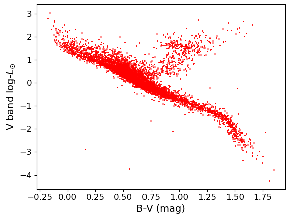
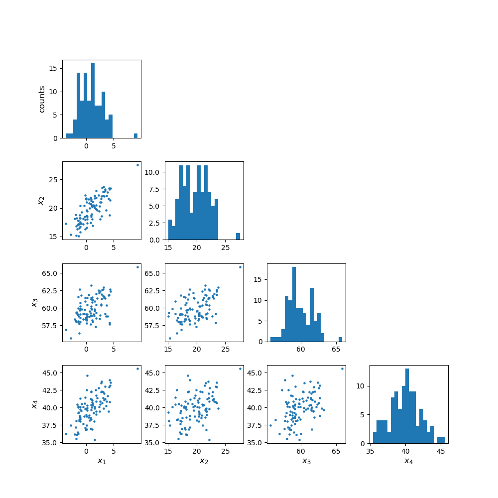
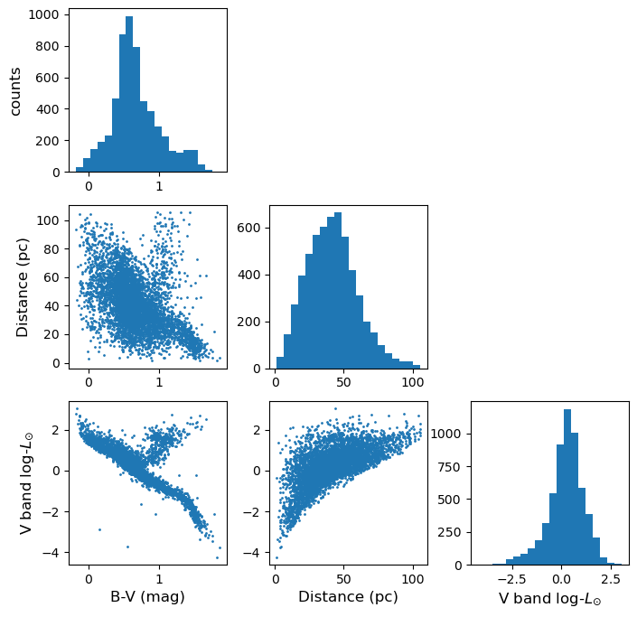
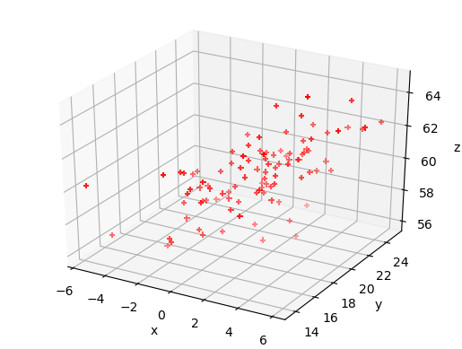
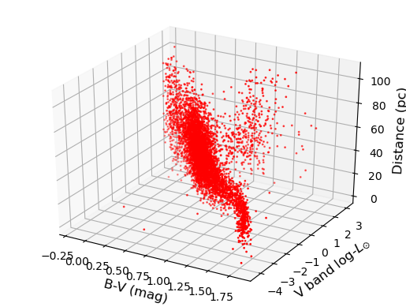

<!-- Just one possible MathJax CDN below. You may use others. -->

In this episode we will be using numpy, as well as matplotlib's plotting library. Scipy contains an extensive range of distributions in its 'scipy.stats' module, so we will also need to import it. Remember: scipy modules should be imported separately as required - they cannot be called if only scipy is imported. We will also need to use the Pandas library, which contains extensive functionality for handling complex multivariate data sets. You should install it if you don't have it.

~~~
import numpy as np
import matplotlib.pyplot as plt
import scipy.stats as sps
import pandas as pd
~~~
{: .language-python}

Now that we have covered the main concepts of probability theory, probability distributions and random variates and Bayes' theorem, we are ready to look in more detail at statistical inference with data. First, we will look at some approaches to data handling and plotting for multivariate data sets. Multivariate data is complex and generally has a high information content, and more specialised python modules as well as plotting functions exist to explore the data as well as plotting it, while preserving as much of the information contained as possible. 

## Reading in, cleaning and transforming data with Pandas

Hipparcos, operating from 1989-1993 was the first scientific satellite devoted to precision astrometry, to accurately measure the positions of stars. By measuring the parallax motion of stars on the sky as the Earth (and the satellite) moves in its orbit around the sun, Hipparcos could obtain accurate measures of distances to stars up to a few hundred parsecs (pc). We will use some data from the Hipparcos mission as our example data set, in order to plot a 'colour-magnitude' diagram of the general population of stars. We will see how to read the data into a Pandas dataframe, clean it of bad and low-precision data, and transform the data into useful values which we can plot.

The file `hipparcos.txt` (see the Lesson data [__here__][hipparcos_data]) is a multivariate data-set containing a lot of information.  To start with you should look at the raw data file using your favourite text editor, Pythons native text input/output commands or the `more` or `cat` commands in the linux shell.  The file is formatted in a complex way, so that we need to skip the first 53 lines in order to get to the data.  We will also need to skip the final couple of lines.  Using the `pandas.read_csv` command to read in the file, we specify `delim_whitespace=True` since the values are separated by spaces not commas in this file, and we use the `skiprows` and `skipfooter` commands to skip the lines that do not correspond to data at the start and end of the file. We specify `engine='python'` to avoid a warning message, and `index_col=False` ensures that Pandas does not automatically assume that the integer ID values that are in the first column correspond to the indices in the array (this way we ensure direct correspondence of our index with our position in the array, so it is easier to diagnose problems with the data if we encounter any).

Note also that here we specify the names of our columns - we could also use names given in a specific header row in the file if one exists.  Here, the header row is not formatted such that the names are easy to use, so we give our own names for the columns.

Finally, we need to account for the fact that some of our values are not defined (in the parallax and its error, `Plx` and `ePlx` columns) and are denoted with `-`.  This is done by setting `-` to count as a `NaN` value to Pandas, using `na_values='-'`.  If we don't include this instruction in the command, those columns will appear as strings (`object`) according to the `dtypes` list.

~~~
hipparcos = pd.read_csv('hipparcos.txt', delim_whitespace=True, skiprows=53, skipfooter=2, engine='python',
names=['ID','Rah','Ram','Ras','DECd','DECm','DECs','Vmag','Plx','ePlx','BV','eBV'],
  index_col=False, na_values='-')
~~~
{: .language-python}

Note that Pandas automatically assigns a datatype (`dtype`) to each column based on the type of values it contains.  It is always good to check that this is working to assign the correct types (here using the `pandas.DataFrame.dtypes` command), or errors may arise.  If needed, we can also assign a `dtype` to each column using that variable in the `pandas.read_csv` command.  

~~~
print(hipparcos.dtypes,hipparcos.shape)
~~~
{: .language-python}
~~~
ID        int64
Rah       int64
Ram       int64
Ras     float64
DECd      int64
DECm      int64
DECs    float64
Vmag    float64
Plx     float64
ePlx    float64
BV      float64
eBV     float64
dtype: object (85509, 12)
~~~
{: .output}

Once we have read the data in, we should also clean it to remove `NaN` values (use the Pandas `.dropna` function). We add a print statement to see how many rows of data are left. We should then also remove parallax values ($$p$$) with large error bars $$\Delta p$$ (use a conditional statement to select only items in the pandas array which satisfy $$\Delta p/p < 0.05$$. Then, let's calculate the distance (distance in parsecs is $$d=1/p$$ where $$p$$ is the parallax in arcsec) and the absolute V-band magnitude ($$V_{\rm abs} = V_{\rm mag} - 5\left[\log_{10}(d) -1\right]$$), which is needed for the colour-magnitude diagram. 

~~~
hnew = hipparcos[:].dropna(how="any") # get rid of NaNs if present
print(len(hnew),"rows remaining")

# get rid of data with parallax error > 5 per cent
hclean = hnew[hnew.ePlx/np.abs(hnew.Plx) < 0.05]

hclean[['Rah','Ram','Ras','DECd','DECm','DECs','Vmag','Plx','ePlx','BV','eBV']] # Just use the values 
# we are going to need - avoids warning message

hclean['dist'] = 1.e3/hclean["Plx"] # Convert parallax to distance in pc
# Convert to absolute magnitude using distance modulus
hclean['Vabs'] = hclean.Vmag - 5.*(np.log10(hclean.dist) - 1.) # Note: larger magnitudes are fainter!
~~~
{: .language-python}

You will probably see a `SettingWithCopyWarning` on running the cell containing this code. It arises from the fact that we are producing output to the same dataframe that we are using as input. We get a warning because in some situations this kind of operation is dangerous - we could modify our dataframe in a way that affects things in unexpected ways later on. However, here we are safe, as we are creating a new column rather than modifying any existing column, so we can proceed, and ignore the warning.

> ## Programming example: colour-luminosity scatter plot
> 
> For a basic scatter plot, we can use `plt.scatter()` on the Hipparcos data. This function has a lot of options to make it look nicer, so you should have a closer look at the official matplotlib documentation for `plt.scatter()`, to find out about these possibilities. 
>
> Now let's look at the colour-magnitude diagram.  We will also swap from magnitude to $$\mathrm{log}_{10}$$ of luminosity in units of the solar luminosity, which is easier to interpret $$\left[\log_{10}(L_{\rm sol}) = -0.4(V_{\rm abs} -4.83)\right]$$. Make a plot using $$B-V$$ (colour) on the $$x$$-axis and luminosity on the $$y$$-axis. 
>
>> ## Solution
>> ~~~
>> loglum_sol = np.multiply(-0.4,(hclean.Vabs - 4.83)) # The calculation uses the fact that solar V-band absolute 
>> # magnitude is 4.83, and the magnitude scale is in base 10^0.4
>> 
>> plt.figure()
>> ## The value for argument s represents the area of the data-point in units of point size (as in "10 point font").
>> plt.scatter(hclean.BV, loglum_sol, c="red", s=1)
>> plt.xlabel("B-V (mag)", fontsize=14)
>> plt.ylabel("V band log-$L_{\odot}$", fontsize=14)
>> plt.tick_params(axis='x', labelsize=12)
>> plt.tick_params(axis='y', labelsize=12)
>> plt.show()
>> ~~~
>> {: .language-python}
>> 
>> 

>> 
>> 

> {: .solution}
{: .challenge}

## Plotting multivariate data with a scatter-plot matrix

Multivariate data can be shown by plotting each variable against each other variable (with histograms plotted along the diagonal). This is quite difficult to do in matplotlib. It is possible by plotting on a grid and making sure to keep the indices right, but doing so can be quite instructive. We will first demonstrate this (before you try it yourself using the Hipparcos data) using some multi-dimensional fake data drawn from normal distributions, using numpy's `random.multivariate_normal` function. Note that besides the size of the random data set to be generated, the variable takes two arrays as input, a 1-d array of mean values and a 2-d matrix of covariances, which defines the correlation of each axis value with the others. To see the effect of the covariance matrix, you can experiment with changing it in the cell below.

Note that the `random.multivariate.normal` function may (depending on the choice of parameter values)throw up a warning `covariance is not positive-semidefinite`.  For our simple simulation to look at how to plot multi-variate data, this is not a problem.  However, such warnings should be taken seriously if you are using the simulated data or covariance to do a statistical test (e.g. Monte Carlo simulation to fit a model where different observables are random but correlated as defined by a covariance matrix).  As usual, more information can be found via an online search.

When plotting scatter-plot matrices, you should be sure to make sure that the indices and grid are set up so that the $$x$$ and $$y$$ axes are shared across columns and rows of the matrix respectively. This way it is easy to compare the relation of one variable with the others, by reading either across a row or down a column. You can also share the axes (using arguments `sharex=True` and `sharey=True` of the `subplots` function) and remove tickmark labels from the plots that are not on the edges of the grid, if you want to put the plots closer together (the `subplots_adjust` function can be used to adjust the spacing between plots.

~~~
rand_data = sps.multivariate_normal.rvs(mean=[1,20,60,40], cov=[[3,2,1,3],[2,2,1,4],[1,1,3,2],[3,4,2,1]], size=100)
ndims = rand_data.shape[1]
labels = ['x1','x2','x3','x4']
fig, axes = plt.subplots(4,4,figsize=(10,10))
fig.subplots_adjust(wspace=0.3,hspace=0.3)
for i in range(ndims): ## y dimension of grid
    for j in range(ndims): ## x dimension of grid
        if i == j:
            axes[i,j].hist(rand_data[:,i], bins=20)
        elif i > j:
            axes[i,j].scatter(rand_data[:,j], rand_data[:,i])
        else:
            axes[i,j].axis('off')
        if j == 0:
            if i == j:
                axes[i,j].set_ylabel('counts',fontsize=12)
            else:
                axes[i,j].set_ylabel(labels[i],fontsize=12)
        if i == 3:
            axes[i,j].set_xlabel(labels[j],fontsize=12)    
plt.show()
~~~
{: .language-python}

> ## Programming example: plotting the Hipparcos data with a scatter-plot matrix
>
> Now plot the Hipparcos data as a scatter-plot matrix.  To use the same approach as for the scatter-plot matrix shown above, you can first stack the columns in the dataframe into a single array using the function `numpy.column_stack`.
>
>> ## Solution
>> ~~~
>> h_array = np.column_stack((hclean.BV,hclean.dist,loglum_sol))
>> 
>> ndims=3
>> labels = ['B-V (mag)','Distance (pc)','V band log-$L_{\odot}$']
>> fig, axes = plt.subplots(ndims,ndims,figsize=(8,8))
>> fig.subplots_adjust(wspace=0.27,hspace=0.2)
>> for i in range(ndims): ## y dimension
>>     for j in range(ndims): ## x dimension
>>         if i == j:
>>             axes[i,j].hist(h_array[:,i], bins=20)
>>         elif i > j:
>>             axes[i,j].scatter(h_array[:,j],h_array[:,i],s=1)
>>         else:
>>             axes[i,j].axis('off')
>>         if j == 0:
>>             if i == j:
>>                 axes[i,j].set_ylabel('counts',fontsize=12)
>>             else:
>>                 axes[i,j].set_ylabel(labels[i],fontsize=12)
>>         if i == 2:
>>             axes[i,j].set_xlabel(labels[j],fontsize=12)
>> plt.show()
>> ~~~
>> {: .language-python}
>> 

>> 
>> 

> {: .solution}
{: .challenge}

## Exploring data with a 3-D plot

We can also use matplotlib's 3-D plotting capability (after importing `from mpl_toolkits.mplot3d import Axes3D`) to plot and explore data in 3 dimensions (provided that you set up interactive plotting using `%matplotlib notebook`, the plot can be rotated using the mouse). We will first plot the multivariate normal data which we generated earlier to demonstrate the scatter-plot matrix.

~~~
from mpl_toolkits.mplot3d import Axes3D
%matplotlib notebook

fig = plt.figure() # This refreshes the plot to ensure you can rotate it
ax = fig.add_subplot(111, projection='3d')
ax.scatter(rand_data[:,0], rand_data[:,1], rand_data[:,2], c="red", marker='+')
ax.set_xlabel('x')
ax.set_ylabel('y')
ax.set_zlabel('z')
plt.show()
~~~
{: .language-python}

> ## Programming example: 3-D plot of the Hipparcos data
> Now make a 3-D plot of the Hipparcos data.
>
>> ## Solution
>> ~~~
>> %matplotlib notebook
>> fig = plt.figure()
>> ax = fig.add_subplot(111, projection='3d')
>> ax.scatter(hclean.BV, loglum_sol, hclean.dist, c="red", s=1)
>> ax.set_xlabel('B-V (mag)', fontsize=12)
>> ax.set_ylabel('V band log-$L_{\odot}$', fontsize=12)
>> ax.set_zlabel('Distance (pc)', fontsize=12)
>> plt.show()
>> ~~~
>> {: .language-python}
>> 
>> 

>> 
>> 

>> 
> {: .solution}
{: .challenge}

>## Programming challenge: reading in and plotting SDSS quasar data
> The data set [__`sdss_quasars.txt`__][sdss_quasar_data] contains measurements by the [__Sloan Digital Sky Survey__][sdss] (SDSS) of various parameters obtained for a sample of 10000 "quasars" - supermassive black holes where gas drifts towards the black hole in an accretion disk, which heats up via gravitational potential energy release, to emit light at optical and UV wavelengths. This question is about extracting and plotting this multivariate data. In doing so, you will prepare for some exploratory data analysis using this data, which you will carry out in the programming challenges for the next three episodes.
>
> You should first familiarise yourself with the data file - the columns are already listed in the first row. The first three give the object ID and position (RA and Dec in degrees), then the redshift of the object, a target flag which you can ignore, followed by the total "bolometric" log10(luminosity), also called ‘log-luminosity’. The luminosity units are erg/s - note that 1 erg/s=10-7 W, though this is not important here. The error bar on log-luminosity is also given. Then follows a variable giving the ratio of radio to UV (250 nm) emission (so-called "radio loudness"), three pairs of columns listing a broadband "continuum" log-luminosity (and error) at three different wavelengths, and seven pairs of columns each listing a specific emission line log-luminosity (and error). Finally, a pair of columns gives an estimate of the black hole mass and its error (in log10 of the mass in solar-mass units).
>
> An important factor when plotting and looking for correlations is that not all objects in the file have values for every parameter. In some cases this is due to poor data quality, but in most cases it is because the redshift of the object prevents a particular wavelength from being sampled by the telescope. In this data-set, when extracting data for your analysis, you should ignore objects where any of the specific quantities being considered are less than or equal to zero (this can be done using a conditional statement to define a new numpy array or Pandas dataframe, as shown above).
>
> Now do the following:
> 1. Load the data into a Pandas dataframe. To clean the data of measurements with large errors, only include log-luminosities with errors <0.1 (in log-luminosity) and log-black hole masses with errors <0.2. 
> 2. Now plot a labelled scatter-plot matrix showing the following quantities: LOGL3000, LOGL_MGII, R_6CM_2500A and LOGBH (note that due to the wide spread in values, you should plot log10 of the radio-loudness rather than the original data). 
> 3. Finally, plot an interactive 3D scatter plot with axes: LOGL3000, R_6CM_2500A and LOGBH. Note that interactive plots may not work if you run your notebook from within JupyterLab, but they should work in stand-alone notebooks.
>
{: .challenge}

[hipparcos_data]: https://github.com/philuttley/statistical-inference/tree/gh-pages/data/hipparcos.txt
[sdss_quasar_data]: https://github.com/philuttley/statistical-inference/tree/gh-pages/data/sdss_quasars.txt
[sdss]: http://www.sdss.org/

