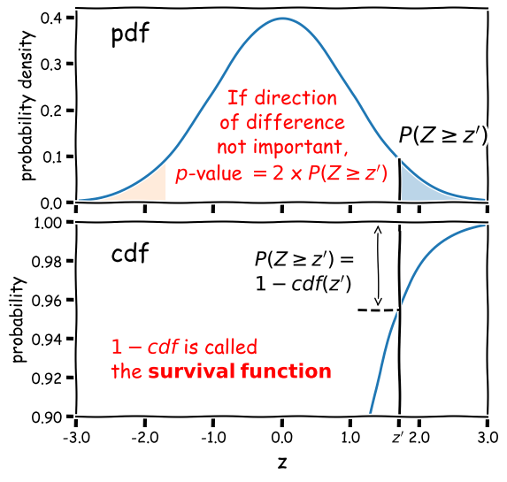
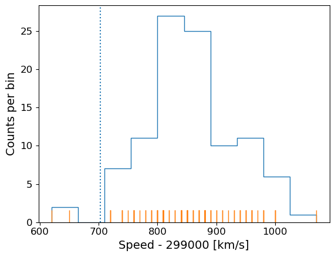
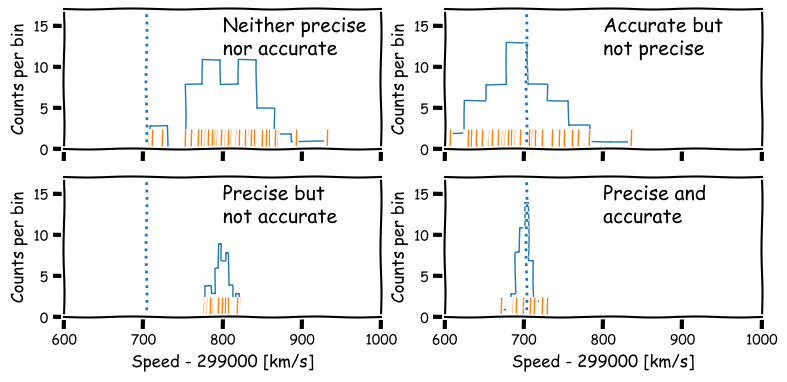
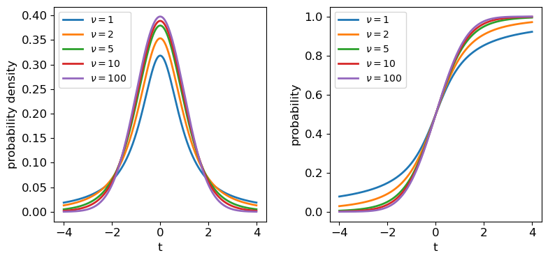
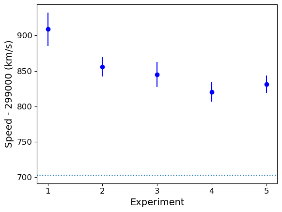

<!-- Just one possible MathJax CDN below. You may use others. -->

In this episode we will be using numpy, as well as matplotlib's plotting library. Scipy contains an extensive range of distributions in its 'scipy.stats' module, so we will also need to import it. Remember: scipy modules should be installed separately as required - they cannot be called if only scipy is imported.
~~~
import numpy as np
import matplotlib.pyplot as plt
import scipy.stats as sps
~~~
{: .language-python}

One of the simplest questions we can ask is whether the data is consistent with being drawn from a given distribution. This might be a known and pre-specified distribution (either theoretical or given by previous measurements), or it might be a comparison with the distribution of another data set. These are simple yes/no questions: we are not trying to determine what the best distribution parameters are to describe the data, or ask whether one model is better than another. We are simply asking whether the data are consistent with some pre-determined hypothesis. 

## Test statistics and significance testing

We have already seen in our discussion of Bayes' theorem that our goal is usually to determine the probability of whether a hypothesis ($$H$$) is true, under certain assumptions and given the data ($$D$$), which we express as $$P(H\vert D)$$. However, the calculation of this posterior probability is challenging and we may have limited data available which we can only use to address simpler questions. For asking simple yes/no questions of the data, frequentist statistics has developed an approach called [__significance testing__]({{ page.root }}/reference/#significance-test), which works as follows.

1. Formulate a simple [__null hypothesis__]({{ page.root }}/reference/#hypothesis) $$H_{0}$$ that can be used to ask the question: _are the data __consistent__ with_ $$H_{0}$$?
2. Calculate a [__test statistic__]({{ page.root }}/reference/#test-statistic) $$z^{\prime}$$ from the data, the probability distribution of which, $$p(z)$$ can be determined in the case when $$H_{0}$$ is true.
3. Use $$p(z)$$ to calculate the probability (or [__$$p$$-value__]({{ page.root }}/reference/#p---value)) that $$z$$ would equal or exceed the observed value $$z^{\prime}$$, if $$H_{0}$$ is true, i.e. calculate the $$p$$-value: $$P(z>z^{\prime})$$.

The $$p$$-value is an estimate of the statistical _significance_ of your hypothesis test. It represents the probability that the test statistic is equal to __or more extreme__ than the one observed, Formally, the procedure is to pre-specify (before doing the test, or ideally before even looking at the data!) a required [__significance level__]({{ page.root }}/reference/#significance-level) $$\alpha$$, below which one would reject the null hypothesis, but one can also conduct _exploratory data analysis_ (e.g. when trying to formulate more detailed hypotheses for testing with additional data) where a $$p$$-value is simply quoted as it is and possibly used to define a set of conclusions.

> ## Significance testing: two-tailed case
> Often the hypothesis we are testing predicts a test statistic with a (usually symmetric) two-tailed distribution, because only the magnitude of the deviation of the test statistic from the expected value matters, not the direction of that deviation. A good example is for deviations from the expected mean due to statistical error: if the null hypothesis is true we don't expect a preferred direction to the deviations and only the size of the deviation matters.
>
> Calculation of the 2-tailed $$p$$-value is demonstrated in the figure below. For a positive observed test statistic $$Z=z^{\prime}$$, the $$p$$-value is twice the integrated probability density for $$z\geq z^{\prime}$$, i.e. $$2\times(1-cdf(z^{\prime}))$$.
> 
> 

>
>

>
> Note that the function 1-cdf is called the [__survival function__]({{ page.root }}/reference/#survival-function) and it is available as a separate method for the statistical distributions in `scipy.stats`, which can be more accurate than calculating 1-cdf explicitly for very small $$p$$-values.
>
> For example, for the graphical example above, where the distribution is a standard normal:
> ~~~
> print("p-value = ",2*sps.norm.sf(1.7))
> ~~~
> {: .language-python}
> ~~~
> p-value =  0.08913092551708608
> ~~~
> {: .output}
> In this example the significance is low (i.e. the $$p$$-value is relatively large) and the null hypothesis is __not__ ruled out at better than 95% confidence.
>
{: .callout}

## Significance levels and reporting

How should we choose our significance level, $$\alpha$$? It depends on how important is the answer to the scientific question you are asking! 

- Is it a really big deal, e.g. the discovery of a new particle, or an unexpected source of emission in a given waveband (such as the first electromagnetic counterpart to a gravitational wave source)? If so, then the usual required significance is $$\alpha= 5\sigma$$, which means the probability of the data being consistent with the null hypothesis (i.e. non-detection of the particle or electromagnetic counterpart) is equal to or less than that in the integrated pdf more than 5 standard deviations from the mean for a standard normal distribution ($$p\simeq 5.73\times 10^{-7}$$ or about 1 in 1.7 million).
- Is it important but not completely groundbreaking or requiring re-writing of or large addition to our understanding of the scientific field? For example, the ruling out of a particular part of parameter space for a candidate dark matter particle, or the discovery of emission in a known electromagnetic radiation source but in a completely different waveband to that observed before (e.g. an X-ray counterpart to an optical source)? In this case we would usually be happy with $$\alpha= 3\sigma$$ ($$p\simeq 2.7\times 10^{-3}$$, i.e. 0.27% probability).
- Does the analysis show (or rule out) an effect but without much consequence, since the effect (or lack of it) was already expected based on previous analysis, or as a minor consequence of well-established theory? Or is the detection of the effect tentative and only reported to guide design of future experiments or analysis of additional data? If so, then we might accept a significance level as low as $$\alpha=0.05$$. This level is considered the minimum bench-mark for publication in some fields, but in physics and astronomy it is usually only considered as suitable for individual claims in a paper that also presents more significant results or novel interpretation.

When reporting results for pre-specified tests we usually state them in this way (or similar, according to your own style or that of the field):

_"\<The hypothesis\> is rejected at the \<insert $$\alpha$$ here\> significance level."_

'Rule out' is also often used as a synonym for 'reject'. Or if we also include the calculated $$p$$-value for completeness:

_"We obtained a $$p-$$value of \<insert $$p$$ here\>", so the hypothesis is rejected at the \<insert $$\alpha$$ here\> significance level."_

Sometimes we invert the numbers (taking 1 minus the $$p$$-value or probability) and report the [__confidence level__]({{ page.root }}/reference/#confidence-level) as a percentage e.g. for $$\alpha=0.05$$ we can also state:

_"We rule out .... at the 95% confidence level."_

And if (as is often the case) our required significance is not satisfied, we should also state that:

_"We cannot rule out .... at better than the \<insert $$\alpha$$ here\> significance level."_

## Introducing our data: Michelson's speed of light measurements

To demonstrate a simple signifiance test of the distribution of the mean of our data, we will use Michelson's speed-of-light measurements `michelson.txt` which you can find [__here__][michelson_data] in the data folder. It's important to understand the nature of the data before you read it in, so be sure to check this by looking at the data file itself (e.g. via a text editor or other file viewer) before loading it.  For the speed-of-light data we see 4 columns. The 1st column is just an identifier ('row number') for the measurement.  The 2nd column is the 'run' - the measurement within a particular experiment (an experiment consists of 20 measurements).  The 4th column identifies the experiment number.  The crucial measurement itself is the 3rd column - to save on digits this just lists the speed (in km/s) minus 299000, rounded to the nearest 10 km/s.

If the data is in a fairly clean array, this is easily achieved with `numpy.genfromtxt` (google it!). By setting the argument `names=True` we can read in the column names, which are assigned as field names to the resulting numpy structured data array. 

We will use the field names of your input 2-D array to assign the data columns Run, Speed and Expt to separate 1-D arrays and print the three arrays to check them:

~~~
michelson = np.genfromtxt("michelson.txt",names=True)
print(michelson.shape) ## Prints shape of the array as a tuple
run = michelson['Run']
speed = michelson['Speed']
experiment = michelson['Expt']
print(run,speed,experiment)
~~~
{: .language-python}

~~~
(100,)
[ 1.  2.  3.  4.  5.  6.  7.  8.  9. 10. 11. 12. 13. 14. 15. 16. 17. 18.
 19. 20.  1.  2.  3.  4.  5.  6.  7.  8.  9. 10. 11. 12. 13. 14. 15. 16.
 17. 18. 19. 20.  1.  2.  3.  4.  5.  6.  7.  8.  9. 10. 11. 12. 13. 14.
 15. 16. 17. 18. 19. 20.  1.  2.  3.  4.  5.  6.  7.  8.  9. 10. 11. 12.
 13. 14. 15. 16. 17. 18. 19. 20.  1.  2.  3.  4.  5.  6.  7.  8.  9. 10.
 11. 12. 13. 14. 15. 16. 17. 18. 19. 20.] [ 850.  740.  900. 1070.  930.  850.  950.  980.  980.  880. 1000.  980.
  930.  650.  760.  810. 1000. 1000.  960.  960.  960.  940.  960.  940.
  880.  800.  850.  880.  900.  840.  830.  790.  810.  880.  880.  830.
  800.  790.  760.  800.  880.  880.  880.  860.  720.  720.  620.  860.
  970.  950.  880.  910.  850.  870.  840.  840.  850.  840.  840.  840.
  890.  810.  810.  820.  800.  770.  760.  740.  750.  760.  910.  920.
  890.  860.  880.  720.  840.  850.  850.  780.  890.  840.  780.  810.
  760.  810.  790.  810.  820.  850.  870.  870.  810.  740.  810.  940.
  950.  800.  810.  870.] [1. 1. 1. 1. 1. 1. 1. 1. 1. 1. 1. 1. 1. 1. 1. 1. 1. 1. 1. 1. 2. 2. 2. 2.
 2. 2. 2. 2. 2. 2. 2. 2. 2. 2. 2. 2. 2. 2. 2. 2. 3. 3. 3. 3. 3. 3. 3. 3.
 3. 3. 3. 3. 3. 3. 3. 3. 3. 3. 3. 3. 4. 4. 4. 4. 4. 4. 4. 4. 4. 4. 4. 4.
 4. 4. 4. 4. 4. 4. 4. 4. 5. 5. 5. 5. 5. 5. 5. 5. 5. 5. 5. 5. 5. 5. 5. 5.
 5. 5. 5. 5.]
~~~
{: .output}

The speed-of-light data given here are primarily [__univariate__]({{ page.root }}/reference/#univariate) and [__continuous__]({{ page.root }}/reference/#continuous) (although values are rounded to the nearest km/s). Additional information is provided in the form of the run and experiment number which may be used to screen and compare the data.

Now the most important step: ***always plot your data!!!***

It is possible to show univariate data as a series of points or lines along a single axis using a [__rug plot__]({{ page.root }}/reference/#rug-plot), but it is more common to plot a [__histogram__]({{ page.root }}/reference/#histogram), where the data values are assigned to and counted in fixed width _bins_. We will combine both approaches. The histogram covers quite a wide range of values, with a central peak and broad 'wings', This spread could indicate [__statistical error__]({{ page.root }}/reference/#statistical-error), i.e. experimental measurement error due to the intrinsic precision of the experiment, e.g. from random fluctuations in the equipment, the experimenter's eyesight etc.  

The actual speed of light in air is 299703 km/s. We can plot this on our histogram, and also add a 'rug' of vertical lines along the base of the plot to highlight the individual measurements and see if we can see any pattern in the scatter.

~~~
plt.figure()
# Make and plot histogram (note that patches are matplotlib drawing objects)
counts, edges, patches = plt.hist(speed, bins=10, density=False, histtype='step')

# We can plot the 'rug' using the x values and setting y to zero, with vertical lines for the 
# markers and connecting lines switched off using linestyle='None'
plt.plot(speed, np.zeros(len(speed)), marker='|', ms=30, linestyle='None')

# Add a vertical dotted line at 703 km/s
plt.axvline(703,linestyle='dotted')

plt.xlabel("Speed - 299000 [km/s]", fontsize=14)
plt.ylabel("Counts per bin", fontsize=14)
plt.tick_params(axis='x', labelsize=12)
plt.tick_params(axis='y', labelsize=12)
plt.show()
~~~
{: .language-python}

The rug plot shows no clear pattern other than the equal 10 km/s spacing between many data points that is imposed by the rounding of speed values. However, the data are quite far from the correct value. This could indicate a [__systematic error__]({{ page.root }}/reference/#systematic-error), e.g. due to an mistake in the experimental setup or a flaw in the apparatus.

To go further, and use data to answer scientific questions, we need to understand a bit more about data, i.e. measurements and how they relate to the probability distributions and random variates we have studied so far.

## Measurements are random variates

Data, in the form of measurements, are random variates drawn from some underlying probabiliy distribution. This is one of the most important insights in statistics, which allows us to answer scientific questions about the data, i.e. [__hypotheses__]({{ page.root }}/reference/#hypothesis). The distribution that measurements are drawn from will depend on the physical (perhaps random) process that generates the quantity we are measuring as well as the measurement apparatus itself. 

As a simple example, imagine that we want to measure the heights of a sample of people in order to estimate the distribution of heights of the wider population, i.e. we are literally sampling from a real population, not a notional one. Our measurement apparatus will introduce some error into the height measurements, which will increase the width of the distribution and hence the spread in our data slightly. But by far the largest effect on the sample of heights will be from the intrinsic width of the underlying population distribution, which will produce the most scatter in the measurements, since we know that intrinsic height variations are considerably larger than the error in our height measurements! Thus, sampling from a real underlying population automatically means that our measurements are random variates. The same can be seen in many physical situations, especially in astronomy, e.g. measuring the luminosity distribution of samples of objects, such as stars or galaxies.

Alternatively, our measurements might be intrinsically random due to the physical process producing random fluctuations in time, or with repeated measurements, e.g. the decays of radioisotopes, the arrival times of individual photons in a detector, or the random occurence of rare events such as the merger of binary neutron stars.

Finally, our measuring instruments may themselves introduce random variations into the measurements. E.g. the random variation in the amount of charge deposited in a detector by a particle, random changes in the internal state of our instrument, or even the accuracy to which we can read a measurement scale. In many cases these measurement errors may dominate over any other errors that are intrinsic to the quantity we are measuring. For example, based on our knowledge of physics we can be pretty confident that the speed of light is not intrinsically varying in Michelson's experiment, so the dispersion in the data must be due to measurement errors. 

> ## Precision and accuracy
> In daily speech we usually take the words _precision_ and _accuracy_ to mean the same thing, but 
> in statistics they have distinct meanings and you should be careful when you use them in a scientific context:
>
> - [__Precision__]({{ page.root }}/reference/#precision) refers to the degree of random deviation, e.g. how broad a measured data distribution is. 
> - [__Accuracy__]({{ page.root }}/reference/#accuracy) refers to how much non-random deviation there is from the true value, i.e. how close the measured data are __on average__ to the 'true' value of the quantity being measured.
>
> In terms of errors, high precision corresponds to low [__statistical error__]({{ page.root }}/reference/#statistical-error) (and vice versa) while high accuracy refers to low [__systematic error__]({{ page.root }}/reference/#systematic-error).
>
> 

> 
> 

>
{: .callout}

## Estimators and bias: sample mean and sample variance

To answer scientific questions, we usually want to use our measurements to estimate some property of the underlying physical quantity we are measuring. To do so, we need to estimate the parameters of the distribution that the measurements are drawn from. Where measurement errors dominate, we might hope that the population mean represents the `true' value of the quantity we wanted to measure. The spread in data (given by the variance) may only be of interest if we want to quantify the precision of our measurements. If the spread in data is intrinsic to the measured quantity itself (e.g. we are sampling from a real underlying population), we might also be interested in the variance of our distribution and the distribution shape itself, if there is enough data to constrain it. We will discuss the latter kind of analysis in a later episode, when we consider fitting models to data distributions.

An [__estimator__]({{ page.root }}/reference/#estimator)  is a method for calculating from data an estimate of a given quantity. For example the sample mean or sample variance are estimators of the population (distribution) mean ($$\mu$$) or variance ($$\sigma^{2}$$). The results of [__biased estimators__]({{ page.root }}/reference/#bias) may be systematically biased away from the true value they are trying to estimate, in which case corrections for the bias are required. The bias is equivalent to [__systematic error__]({{ page.root }}/reference/#systematic-error) in a measurement, but is intrinsic to the estimator rather than the data itself. __An estimator is biased if its expectation value (i.e. its arithmetic mean in the limit of an infinite number of experiments) is systematically different to the quantity it is trying to estimate__.

For example, the [__sample mean__]({{ page.root }}/reference/#mean) is an unbiased estimator of the [__population mean__]({{ page.root }}/reference/#mean). Consider the sample mean, $$\bar{x}$$ for a sample of $$n$$ measurements $$x_{i}$$:

$$\bar{x}=\frac{1}{n}\sum\limits_{i=1}^{n} x_{i}$$

Assuming that our measurements are random variates drawn from the same distribution, with population mean $$\mu = E[x_{i}]$$,  the expectation value of the sample mean is: 

$$E\left[\frac{1}{n}\sum\limits_{i=1}^{n} x_{i}\right] = \frac{1}{n}\sum\limits_{i=1}^{n} E[x_{i}] = \frac{1}{n}n\mu = \mu,$$

which means that the sample mean is an unbiased estimator of the population mean, i.e. its expectation value is equal to the population mean.

The variance needs to be corrected, however. The population variance for random variates $$X$$ is the arithmetic mean of the variance in the limit of infinite observations, i.e.:

$$\sigma^{2} = E[(X-\mu)^{2}] = \frac{1}{n}\sum\limits_{i=1}^{n} (X_{i}-\mu)^{2} \mbox{ for } n\rightarrow \infty.$$

We might then assume that we can define the sample variance in terms of our measurements and their sample mean as: $$\frac{1}{n}\sum\limits_{i=1}^{n} (x_{i}-\bar{x})^{2}$$.
However, we would be wrong! Unlike the sample mean, the normalisation of the sum by $$\frac{1}{n}$$ produces a biased estimator for the population variance. This results from the fact that the sample mean is itself a random variate, variations of which act to reduce the sample variance slightly, unlike the constant population mean used to estimate the population variance. The unbiased estimator is the [__sample variance__]({{ page.root }}/reference/#variance) $$s_{x}^{2}$$ of our measurements is then defined as:

$$s_{x}^{2} = \frac{1}{n-1}\sum\limits_{i=1}^{n} (x_{i}-\bar{x})^{2}$$

where the correction by subtracting 1 from $$n$$ is known as [__Bessel's correction__]({{ page.root }}/reference/#Bessel's-correction). The specific integer correction to the number of sampled variates (1 in this case) is known as the 'delta degrees of freedom`. It can differ for other estimators.

The sample [__standard deviation__]({{ page.root }}/reference/#standard-deviation) $$s_{x}$$ and sample [__standard error__]({{ page.root }}/reference/#standard-deviation) $$s_{\bar{x}}$$ (the error on the sample mean) are defined as:

$$s_{x} = \sqrt{\frac{1}{n-1}\sum\limits_{i=1}^{n} (x_{i}-\bar{x})^{2}}$$

$$s_{\bar{x}} = s_{x}/\sqrt{n}$$

however you should note that $$s_{x}$$ and $$s_{\bar{x}}$$ are biased estimators of (respectively) the population standard deviation $$\sigma$$ and standard error $$\sigma_{\bar{x}}$$. This follows because $$E\left[\sqrt{s_{x}^{2}}\right]\neq \sqrt{E[s_{x}^{2}]}$$ (this is easy to see from comparing the square root of a sum with a sum of square roots). The bias is complex to calculate (when the sample is drawn from a normal distribution it involves Gamma functions) but is only a few per cent for $$n=10$$ and for large $$n$$ it decreases linearly with $$n$$, so that it can be safely ignored for large sample sizes.

Numpy provides functions to calculate from a data array the mean, variance and also the standard deviation (just the square root of variance, but commonly used so it has its own function). `scipy.stats` also includes a function for the standard error on the sample mean. Note that for calculations of the variance, as well as other estimators, which include degrees of freedom, the default may not be correct for the sample variance, so you may need to specify it. You should check the function descriptions if you are unsure.

~~~
michelson_mn = np.mean(speed) + 299000 # Mean speed with offset added back in
michelson_var = np.var(speed,ddof=1) # The delta degrees of freedom for Bessels correction needs to be specified
michelson_std = np.std(speed,ddof=1)
michelson_ste = sps.sem(speed,ddof=1) # The default ddof=1 for the scipy function, but it is good
                                      # practice to specify ddof to be consistent  
print("mean =",michelson_mn," variance=",michelson_var," std. deviation=",michelson_std," std. error =",michelson_ste)
~~~
{: .language-python}
~~~
mean = 299852.4  variance= 6242.666666666667  std. deviation= 79.01054781905178  std.error = 7.901054781905178 
~~~
{: .output}

The true speed of light is 299703 km/s, so there is a difference of $$\simeq$$149 km/s. Does this difference reflect a systematic error in Michelson's measurements, or did it arise by chance?

> ## Bessel's correction to sample variance
>
> We can write the expectation of the summed squared deviations used to calculate sample variance, in terms of differences from the population mean $$\mu$$, as follows:
>
> $$E\left[ \sum\limits_{i=1}^{n} \left[(x_{i}-\mu)-(\bar{x}-\mu)\right]^{2} \right] = \left(\sum\limits_{i=1}^{n} E\left[(x_{i}-\mu)^{2} \right]\right) - nE\left[(\bar{x}-\mu)^{2} \right] = \left(\sum\limits_{i=1}^{n} V[x_{i}] \right) - n V[\bar{x}]$$
>
> But we know that (assuming the data are drawn from the same distribution) $$V[x_{i}] = \sigma^{2}$$ and $$V[\bar{x}] = \sigma^{2}/n$$ (from the standard error) so it follows that the expectation of the average of squared deviations from the sample mean is smaller than the population variance by an amount $$\sigma^{2}/n$$, i.e. it is biased:
>
> $$E\left[\frac{1}{n} \sum\limits_{i=1}^{n} (x_{i}-\bar{x})^{2} \right] = \frac{n-1}{n} \sigma^{2}$$
>
> and therefore for the sample variance to be an unbiased estimator of the underlying population variance, we need to correct our calculation by a factor $$n/(n-1)$$, leading to Bessel's correction to the sample variance:
>
> $$\sigma^{2} = E\left[\frac{1}{n-1} \sum\limits_{i=1}^{n} (x_{i}-\bar{x})^{2} \right]$$
>
> A simple way to think about the correction is that since the sample mean is used to calculate the sample variance, the contribution to population variance that leads to the standard error on the mean is removed (on average) from the sample variance, and needs to be added back in.
{: .callout}

## Comparing sample and population means with significance tests

Since we can use the sample mean as an estimator for the population mean of the distribution our measurements are drawn from, we can consider a simple hypothesis: are our data consistent with being drawn from a distribution with population mean equal to the known speed of light in air? Frequentist methods offer two common approaches which depend on our knowledge of the population distribution, known as the $$Z$$-test (for populations with known variance) and the one-sample $$t$$-test (for populations with unknown variance).

### Standard deviation of sample means and the $$Z$$-test

Imagine that thanks to precise calibration of our instrument, we know that the standard deviation ($$\sigma$$, the square-root of variance) of the population of measurements (equivalent to the so-called 'error bar' on our measurements), is exactly 75 km/s. Our sample mean is $$\simeq 149$$~km/s larger than the true value of the speed of light. This is only twice the expected standard deviation on our measurements, which doesn't sound too bad. However the sample mean is calculated by taking the average of 100 measurements. The expected standard deviation of our sample mean is $$\sigma_{\bar{x}}=\frac{\sigma}{\sqrt{n}}$$, i.e. the standard deviation on our sample mean, usually known as the [__standard error__]({{ page.root }}/reference/#standard-error) on the mean, should be only 7.5 km/s!

We can quantify whether the deviation is statistically significant or not by using a [__significance test__]({{ page.root }}/reference/#significance-test) called the [__$$Z$$-test__]({{ page.root }}/reference/#z-test).  We first define a [__test statistic__]({{ page.root }}/reference/#test-statistic), the [__$$Z$$-statistic__]({{ page.root }}/reference/#z-statistic), which is equal to the difference between sample and population mean normalised by the standard error:

$$Z = \frac{\bar{x}-\mu}{\sigma/\sqrt{n}}.$$

__Under the assumption that the sample mean ($$\bar{x}$$) is drawn from a normal distribution__ with population mean $$\mu$$ with standard deviation $$\sigma/\sqrt{n}$$, $$Z$$ is distributed as a standard normal (mean 0 and variance 1). By calculating the $$p$$-value of our statistic $$Z=z^{\prime}$$ (see _Significance testing: two-tailed case_ above) we can test the hypothesis that the data are drawn from a population with the given $$\mu$$ and $$\sigma$$.

The $$Z$$-test rests on the key assumption that the sample means are normally distributed. If that is not the case, the calculated significance of the test (or $$p$$-value) will not be correct. However, provided that the sample is large enough (and the distribution of the individual measurements is not extremely skewed), the [__Central Limit Theorem__]({{ page.root }}/reference/#central-limit-theorem) tells us that a sample mean is likely to be close to normally distributed and our assumption will hold.

> ## Programming example: calculate the $$Z$$-statistic and its significance
> Now let's write a Python function that takes as input the data and the normal distribution parameters we are comparing it with, calculates the $$Z$$ statistic from the distribution parameters and sample mean, and outputs the $$p$$-value. Then, use our function to carry out a $$Z$$-test on the Michelson data.
>
>> ## Solution
>> ~~~
>> def ztest(data,mu,sigma):
>>     '''Calculates the significance of a z-test comparing a sample mean of input data with a specified 
>>     normal distribution
>>     Inputs: The data (1-D array) and mean and standard deviation of normally distributed comparison population
>>     Outputs: prints the observed mean and population parameters, the Z statistic value and p-value'''
>>     mean = np.mean(data)
>>     # Calculate the Z statistic zmean
>>     zmean = (mean-mu)/(sigma/np.sqrt(len(data)))
>>     # Calculate the p-value of zmean from the survival function - default distribution is standard normal
>>     pval = 2*sps.norm.sf(np.abs(zmean)) # force Z to be positive so the usage of survival 
>>                                         # function is correct
>>     print("Observed mean =",mean," versus population mean",mu,", sigma",sigma)
>>     print("Z =",zmean,"with Significance =",pval)
>>     return
>> ~~~
>> {: .language-python}
>> Now we apply it to our data:
>> ~~~
>> ztest(speed,703,75)
>> ~~~
>> {: .language-python}
>> ~~~
>> Observed mean = 852.4  versus population mean 703 , sigma 75
>> Z = 19.919999999999998 with Significance = 2.7299086350765053e-88
>> ~~~
>> {: .output}
>> The deviation of the sample mean from the true speed of light in air is clearly highly significant! We should not take the exact value of the significance too seriously however, other than to be sure that it is an extremely small number. This is because the calculated $$Z$$ is $$\sim$$20-standard deviations from the centre of the distribution. Even with 100 measurements, the central limit theorem will not ensure that the distribution of the sample mean is close to normal so far from the centre. This will only be the case if the measurements are themselves (exactly) normally distributed.
> {: .solution}
{: .challenge}

### Comparing a sample mean with the mean of a population with unknown variance: the one-sample $$t$$-test

For many data sets we will not know the variance of the underlying measurement distribution exactly, and must calculate it from the data itself, via the sample variance. In this situation, we must replace $$\sigma$$ in the $$z$$-statistic calculation $$Z = (\bar{x}-\mu)/(\sigma/\sqrt{n})$$ with the sample standard deviation $$s_{x}$$, to obtain a new test statistic, the [$$t$$-statistic]({{ page.root }}/reference/#t-statistic) :

$$T = \frac{\bar{x}-\mu}{s_{x}/\sqrt{n}}$$

Unlike the normally distributed $$z$$-statistic, under certain assumptions the $$t$$-statistic can be shown to follow a different distribution, the [$$t$$-distribution]({{ page.root }}/reference/#distributions---t). The assumptions are:

- __The sample mean is normally distributed.__ This means that either the data are normally distributed, or that the sample mean is normally distributed following the central limit theorem. 
- __The sample variance follows a scaled [chi-squared distribution]({{ page.root }}/reference/#distributions---chi\-squared).__ We will discuss the chi-squared distribution in more detail in a later episode, but we note here that it is the distribution that results from summing squared, normally-distributed variates. For sample variances to follow this distribution, it is usually (but not always) required that the data are normally distributed. The variance of non-normally distributed data often deviates significantly from a chi-squared distribution. However, for large sample sizes, the sample variance usually has a narrow distribution of values so that the resulting $$t$$-statistic distribution is not distorted too much.

The significance test is called the __one-sample $$t$$-test__, or often __Student's one-sample $$t$$-test__, after the pseudonym of the test's inventor, William Sealy Gossett (Gossett worked as a statistician for the Guiness brewery, who required their employees to publish their research anonymously). If the assumptions above apply then assuming the data are drawn from a population with mean $$\mu$$, $$T$$ will be drawn from a $$t$$-distribution with parameter $$\nu=n-1$$. Note that since $$t$$ is a symmetric distribution, the deviations measured by $$T$$ can be 'extreme' for positive or negative values and the significance test is two-sided.

Making the assumptions listed above, we can carry out a one-sample $$t$$-test on our complete data set. To do so we could calculate $$T$$ for the sample ourselves and use the $$t$$ distribution for $$\nu=99$$ to determine the two-sided significance (since we don't expect any bias on either side of the true valur from statistical error). But `scipy.stats` also has a handy function `scipy.stats.ttest_1samp` which we can use to quickly get a $$p$$-value. We will use both for demonstration purposes:

~~~
# Define c_air (remember speed has 299000 km/s subtracted from it!)
c_air = 703
# First calculate T explicitly, scipy.stats has a standard error function,
# for calculating the sample standard error:
T = (np.mean(speed)-c_air)/sps.sem(speed,ddof=1)
# The degrees of freedom to be used for the t-distribution is n-1
dof = len(speed)-1
# Applying a 2-tailed significance test, the p-value is twice the survival function for the given T:
pval = 2*sps.t.sf(T,df=dof)
print("T is:",T,"giving p =",pval,"for",dof,"degrees of freedom")

# And now the easy way - the ttest_1samp function outputs T and the p-value but not the dof:
T, pval = sps.ttest_1samp(speed,popmean=c_air)
print("T is:",T,"giving p =",pval,"for",len(speed)-1,"degrees of freedom")
~~~
{: .language-python}
~~~
T is: 18.908867755499248 giving p = 1.2428269455699714e-34 for 99 degrees of freedom
T is: 18.90886775549925 giving p = 1.2428269455699538e-34 for 99 degrees of freedom
~~~
{: .output}

Both approaches give identical $$p$$-values after some rounding at the highest precisions. The test remains highly significant, i.e. the sample is drawn from a population with a mean which is significantly different from the known speed of light in air. However, unless the data set is large we should again be cautious about taking the significance of very large absolute values of $$T$$ at face value, since unless the sample is drawn from a normal distribution, its mean and variance are unlikely to satisfy the normal and chi-squared distribution requirements in the tails of their distributions. Instead it is more 'honest' to simply state that the null hypothesis is ruled out, e.g. at $$>5\sigma$$ significance.

## Probability distributions: the $$t$$-distribution

The $$t$$-distribution is derived based on standard normally distributed variates and depends only on a single parameter, the _degrees of freedom_ $$\nu$$. Its pdf and cdf are complicated, involving Gamma and hypergeometric functions, so rather than give the full distribution functions, we will only state the results that for variates $$X$$ distributed as a $$t$$-distribution (i.e. $$X\sim t(\nu)$$):

$$E[X] = 0$$ for $$\nu > 1$$ (otherwise $$E[X]$$ is undefined)

$$V[X] = \frac{\nu}{\nu-2}$$ for $$\nu > 2$$, $$\infty$$ for $$1\lt \nu \leq 2$$, otherwise undefined.

The distribution in scipy is given by the function `scipy.stats.t`, which we can use to plot the pdfs and cdfs for different $$\nu$$:

~~~
nu_list = [1, 2, 5, 10, 100]
fig, (ax1, ax2) = plt.subplots(1,2, figsize=(9,4))
# change the separation between the sub-plots:
fig.subplots_adjust(wspace=0.3)
x = np.arange(-4, 4, 0.01)
for nu in nu_list:
    td = sps.t(df=nu)
    ax1.plot(x, td.pdf(x), lw=2, label=r'$\nu=$'+str(nu))
    ax2.plot(x, td.cdf(x), lw=2, label=r'$\nu=$'+str(nu))
for ax in (ax1,ax2):
    ax.tick_params(labelsize=12)
    ax.set_xlabel("t", fontsize=12)
    ax.tick_params(axis='x', labelsize=12)
    ax.tick_params(axis='y', labelsize=12)
    ax.legend(fontsize=10, loc=2)
ax1.set_ylabel("probability density", fontsize=12)
ax2.set_ylabel("probability", fontsize=12)
plt.show()
~~~
{: .language-python}

The tails of the $$t$$-distribution are the most prominent for small $$\nu$$, but rapidly decrease in strength for larger $$\nu$$ as the distribution approaches a standard normal in the limit $$\nu \rightarrow \infty$$. This means that for the purposes of significance testing, for large $$n$$ the distribution of $$T$$ approaches that of the $$Z$$-statistic.

## Looking deeper at Michelson's data

The result of our one-sample $$t$$-test leaves us with the remaining possibility that the difference is real and systematic, i.e. _the sample is not drawn from a distribution with mean equal to the known value of $$c_{\rm air}$$_. Intuitively we know it is much more likely that there is a systematic error in the experimental measurements than a change in the speed of light itself! 

However, we know that Michelson's data was obtained in 5 separate experiments - if there is a systematic error, it could change between experiments. So let's now pose a further question: _are any of Michelson's 5 individual experiments consistent with the known value of $$c_{\rm air}$$?_

We can first carry out a simple visual check by plotting the mean and standard error for each of Michelson's 5 experiments:

~~~
plt.figure()
for i in range(1,6):
    dspeed = speed[experiment == i]
    # The errorbar function allows data points with errors (in y and/or x) to be plotted:
    plt.errorbar(i,np.mean(dspeed),yerr=sps.sem(dspeed),marker='o',color='blue')
# Plot a horizontal line for the known speed:
plt.axhline(703,linestyle='dotted')
plt.xlabel('Experiment',fontsize=14)
plt.ylabel('Speed - 299000 (km/s)',fontsize=14)
# Specify tickmark locations to restrict to experiment ID
plt.xticks(range(1,6))
# The tick marks are small compared to the plot size, we can change that with this command:
plt.tick_params(axis="both", labelsize=12)
plt.show()
~~~
{: .language-python}

The mean speed for all the experiments are clearly systematically offset w.r.t. the known value of $$c_{\rm air}$$ (shown by the dotted line). Given the standard errors for each mean, the offsets appear highly significant in all cases (we could do more one-sample $$t$$-tests but it would be a waste of time, the results are clear enough!). So we can conclude that Michelson's experiments are all affected by a systematic error that leads the measured speeds to be too high, by between $$\sim 120$$ and 200 km/s. 

## The two-sample $$t$$-test

We could also ask, __is there evidence that the systematic error changes between experiments?__

Now things get a little more complicated, because our physical model incorporates the systematic error __which is unknown__. So to compare the results from two experiments we must deal with unknown mean _and_ variance!  Fortunately there are variants of the $$t$$-test which can deal with this situation, called [__independent two-sample t-tests__]({{ page.root }}/reference/#t-test).

The independent two-sample t-test uses similar assumptions as the one-sample test to compare the means of two independent samples __and determine whether they are drawn from populations with the same mean__:
- Both sample means are assumed to be normally distributed.
- Both sample variances are assumed to be drawn from scaled chi-squared distributions.
The standard two-sample test further assumes that the two populations being compared have the same population variance, but this assumption is relaxed in __Welch's t-test__ which allows for comparison of samples drawn from populations with different variance (this situation is expected when comparing measurements of the same physical quantity from experiments with different precisions).

> ## Programming example: comparing Michelson's experiment means
> The calculated $$T$$-statistic and degrees of freedom used for the $$t$$-distribution significance test are complicated for these two-sample tests, but we can use `scipy.stats.ttest_ind` to do the calculation for us. 
>
> Experiment 1 shows the largest deviation from the known $$c_{\rm air}$$, so we will test whether the data from this experiment is consistent with being drawn from a population with the same mean (i.e. same systematic error) as the other four experiments. Do the following:
> 1. Look up and read the online documentation for `scipy.stats.ttest_ind`.
> 2. Calculate the $$p$$-value for comparing the mean of experiment 1 with those of experiments 2-5 by using both variance assumptions: i.e. first that variances are equal, and then that variances do not have to be equal (Welch's $$t$$-test).
> 3. What do you conclude from these significance tests? 
>
>> ## Solution
>> ~~~
>> dspeed1 = speed[experiment == 1]
>> print("Assuming equal population variances:")
>> for i in range(2,6):
>>     dspeed0 = speed[experiment == i]
>>     tstat, pval = sps.ttest_ind(dspeed1,dspeed0,equal_var=True)
>>     print("Exp. 1 vs. Exp.",i)
>>     print("T = ",tstat,"and p-value =",pval)
>> print("\nAllowing different population variances:")
>> for i in range(2,6):
>>     dspeed0 = speed[experiment == i]
>>     tstat, pval = sps.ttest_ind(dspeed1,dspeed0,equal_var=False)
>>     print("Exp. 1 vs. Exp.",i)
>>     print("T = ",tstat,"and p-value =",pval)
>> ~~~
>> {: .language-python}
>> ~~~
>> Assuming equal population variances:
>> Exp. 1 vs. Exp. 2
>> T =  1.9515833716400273 and p-value = 0.05838720267301064
>> Exp. 1 vs. Exp. 3
>> T =  2.1781204580045963 and p-value = 0.035671254712023606
>> Exp. 1 vs. Exp. 4
>> T =  3.2739095648811736 and p-value = 0.0022652870881169095
>> Exp. 1 vs. Exp. 5
>> T =  2.9345525158236394 and p-value = 0.005638691935846029
>> 
>> Allowing different population variances:
>> Exp. 1 vs. Exp. 2
>> T =  1.9515833716400273 and p-value = 0.06020049646207564
>> Exp. 1 vs. Exp. 3
>> T =  2.1781204580045963 and p-value = 0.03615741764675092
>> Exp. 1 vs. Exp. 4
>> T =  3.2739095648811736 and p-value = 0.0026588535542915533
>> Exp. 1 vs. Exp. 5
>> T =  2.9345525158236394 and p-value = 0.006537756688652282
>> ~~~
>> {: .output}
>>
>> Relaxing the equal-variance assumption marginally increases the p-values. We can conclude in both cases that the systematic error for Experiment 1 is significantly different to the systematic errors in Experiments 3, 4 and 5 at significances of between 2-3 $$\sigma$$. 
>> 
>> We need to be cautious however, since we have selected Experiment 1 as being different from the others by using the same data that we are using to compare them, i.e. the result that Experiment 1 is different from the others could be biased by our pre-selection, so that our __a posteriori__ sample selection is not strictly independent of the other experiments!  
>>
>> Furthermore, we have compared this particular extremum in sample mean with multiple other experiments - we might expect some significant differences by chance. So the evidence __hints__ at the possibility that the systematic error changes between experiments, but we should return to these issues later on to be sure.
>>
> {: .solution}
{: .challenge}

> ## Programming challenge: 
> In this challenge we will carry out significance tests to compare the means of certain quantities in our SDSS quasar sample, which you can load in using the code you wrote for the challenge in the previous episode.
>
> First, split your sample into two sub-samples based on radio-loudness (R_6CM_2500A), with the split in the samples corresponding to whether the quasars' radio-loudness is above or below the median value. Using these two sub-samples, determine whether the mean black hole mass for each sub-sample is drawn from the same population or not. Explain clearly your reasoning.
> 
> Finally, for those data in each radio-loudness sub-sample which also have values of LOGL1350$$>$$0 and its error $$<$$0.1, calculate a "colour" (in this case, a quantity which indicates the relative strength of far-UV to near-UV emission) which is equal to (LOGL1350-LOGL3000) and determine whether the sample means of this quantity are drawn from different populations for each sub-sample. Explain clearly your reasoning.
> 
{: .challenge}

[michelson_data]: https://github.com/philuttley/statistical-inference/tree/gh-pages/data/michelson.txt
