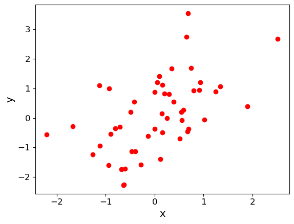
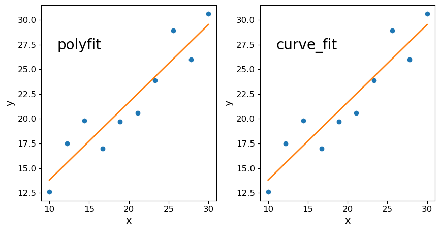
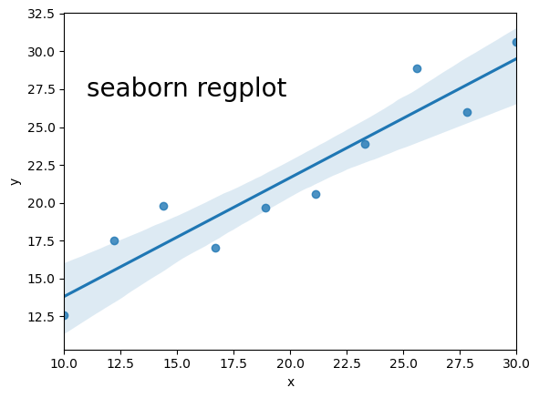

<!-- Just one possible MathJax CDN below. You may use others. -->

In this episode we will be using numpy, as well as matplotlib's plotting library. Scipy contains an extensive range of distributions in its 'scipy.stats' library, so we will also need to import it. Remember: scipy modules should be installed separately as required - they cannot be called if only scipy is imported. We will also need to import the `scipy.optimize` library for some optimisation functions which we will use in this episode.
~~~
import numpy as np
import matplotlib.pyplot as plt
import scipy.stats as sps
import scipy.optimize as spopt
~~~
{: .language-python}

## Statistical properties of multivariate data
So far, we have considered statistical tests of [__univariate__]({{ page.root }}/reference/#univariate) data by realising that the data themselves can be thought of as random variates. Many data sets consist of measurements of mutliple quantities, i.e. they are [__multivariate__]({{ page.root }}/reference/#multivariate) data. For example, optical measurements of a sample of galaxies may produce measurements of their distance, size, luminosity and metallicity for each galaxy. 

To understand the statistical properties of these data, such as their means, variance and covariance, and devise statistical tests of simple hypotheses, we can refer to what we have learned about random variates darwn multivariate probability distributions.  For simplicity we will focus on a [__bivariate__]({{ page.root }}/reference/#bivariate) description in terms of variates $$X$$ and $$Y$$ which represent the measurements of two paired quantities (e.g. different quantities for a given object), although we will note how these generalise when including more variates.

### Sample means, variances and errors on the mean

The sample means of each variate have the same meaning that they do in the univariate case considered in the previous episode. This is because the means can be separated via marginalisation over the other variable in their joint probability distributions, e.g.:

$$\mu_{x} = E[X] = \int^{+\infty}_{-\infty} xp(x)\mathrm{d}x = \int^{+\infty}_{-\infty} x \int^{+\infty}_{-\infty} p(x,y)\mathrm{d}y\;\mathrm{d}x$$

Since we know that the [__sample mean__]({{ page.root }}/reference/#mean) for a sample of $$n$$ measurements $$x_{i}$$, $$\bar{x}=\frac{1}{n}\sum\limits_{i=1}^{n} x_{i}$$ is an unbiased estimator of the [__population mean__]({{ page.root }}/reference/#mean), we can calculate the sample mean for any of the quantities we measure and use it for standard univariate tests such as the $$Z$$-test or $$t$$-test, to compare with a known population mean for that quantity, or means from other samples of that quantity.

The same arguments apply to the sample variance $$s^{2}_{x} = \frac{1}{n-1}\sum\limits_{i=1}^{n} (x_{i}-\mu)^{2}$$ and sample standard deviations and standard errors on the mean (recalling that the latter two quantities have a small bias which can usually be safely ignored for large sample sizes).

### Sample covariance and correlation coefficient

When we are studying multivariate data we can determine sample [statistics]({{ page.root }}/reference/#statistic) for each variable separately as described above, but these do not tell us how the variables are related. For this purpose, we can calculate the [__sample covariance__]({{ page.root }}/reference/#covariance) for two measured variables $$x$$ and $$y$$.:

$$s_{xy}=\frac{1}{n-1}\sum\limits_{i=1}^{n} (x_{i}-\bar{x})(y_{i}-\bar{y})$$

where $$n$$ is the number of pairs of measured data points $$x_{i}$$, $$y_{i}$$. The sample covariance is closely related to the sample variance (note the same Bessel's correction), and when covariance is discussed you will sometimes see sample variance denoted as $$s_{xx}$$. In fact, the covariance tells us the variance of the part of the variations which is linearly correlated between the two variables, just like the [__covariance__]({{ page.root }}/reference/#covariance) for multivariate probability distributions of variates $$X$$ and $$Y$$, also known as the _population covariance_:

$$\mathrm{Cov}(X,Y)=\sigma_{xy} = E[(X-\mu_{x})(Y-\mu_{y})] = E[XY]-\mu_{x}\mu_{y}$$

The sample covariance $$s_{xy}$$ is an [__unbiased estimator__]({{ page.root }}/reference/#bias) of the population covariance $$\sigma_{xy}$$, of the distribution which the measurements are sampled from. Therefore, if the two variables (i.e. the measured quantities) are [__independent__]({{ page.root }}/reference/#independence), the expectation of the sample covariance is zero and the variables are also said to be [__uncorrelated__]({{ page.root }}/reference/#correlated-variables).  Positive and negative covariances, if they are statistically significant, correspond to [__correlated__]({{ page.root }}/reference/#correlated-variables) and [__anticorrelated__]({{ page.root }}/reference/#correlated-variables) data respectively. However, the strength of a correlation is hard to determine from covariance alone, since the amplitude of the covariance depends on the sample variance of the two variables, as well as the degree of linear correlation between them.

Therefore, just as with the population [__correlation coefficient__]({{ page.root }}/reference/#correlation-coefficient) we can normalise by the sample standard deviations of each variable to obtain the sample [__correlation coefficient__]({{ page.root }}/reference/#correlation-coefficient), $$r$$, also known as _Pearson's_ $$r$$, after its developer:

$$r = \frac{s_{xy}}{s_{x}s_{y}} = \frac{1}{n-1} \sum\limits_{i=1}^{n} \frac{(x_{i}-\bar{x})(y_{i}-\bar{y})}{s_{x}s_{y}}$$

The correlation coefficient gives us a way to compare the correlations for variables which have very different magnitudes. It is also an example of a [__test statistic__]({{ page.root }}/reference/#test-statistic), which can be used to test the hypothesis that the variables are uncorrelated, under certain assumptions.

> ## Anscombe's quartet
> This collection of four graphs, known as _Anscombe's quartet_, was first shown by statistician Francis J. Anscombe in a 1973 paper to demonstrate the importance of plotting and visual inspection of data, in addition to the computation of sample statistics. The quartet shows four hypothetical bivariate data sets, with each looking very different but all having the same sample means and variances (for both variables), Pearson correlation coefficients and linear regression parameters (see below). It's clear that if we only calculated the sample statistics without actually plotting the data, we would miss vital information about some of the relationships. The conclusion from this exercise is: __always plot your data!__
>
> 

> 
> 

>  Credit: [Wikimedia Commons][anscombe_plot] based on the figures shown in _Anscombe, Francis J. (1973) Graphs in statistical analysis. American Statistician, 27, 17–21_.
{: .callout}

## Correlation tests: Pearson's r and Spearman's rho

Besides Pearson's $$r$$, another commonly used correlation coefficient and test statistic for correlation tests is Spearman's $$\rho$$ (not to be confused with the population correlation coefficient which is also often denoted $$\rho$$), which is determined using the following algorithm: 

1. Rank the data values $$x_{i}$$, $$y_{i}$$ separately in numerical order. Equal values in the sequence are assigned a rank equal to their average position, e.g. the 4th and 5th highest positions of the $$x_{i}$$ have equal values and are given a rank 4.5 each. Note that the values are not reordered in $$i$$ by this step, only ranks are assigned based on their numerical ordering.
2. For each pair of $$x_{i}$$ and $$y_{i}$$ a difference $$d_{i}=\mathrm{rank}(x_{i})-\mathrm{rank}(y_{i})$$ is calculated.
3. Spearman's $$\rho$$ is calculated from the resulting rank differences:

    $$\rho = 1-\frac{6\sum^{n}_{i=1} d_{i}^{2}}{n(n^{2}-1)}$$

To assess the statistical significance of a correlation, $$r$$ can be transformed to a new statistic $$t$$:

$$t = r\sqrt{\frac{n-2}{1-r^{2}}}$$

or $$\rho$$ can be transformed in a similar way:

$$t = \rho\sqrt{\frac{n-2}{1-\rho^{2}}}$$

Under the assumption that the data are __i.i.d.__, meaning _independent_ (i.e. no correlation) and _identically distributed_ (i.e. for a given variable, all the data are drawn from the same distribution, although note that both variables do not have to follow this distribution), then provided the data set is large (approximately $$n> 500$$), $$t$$ is distributed following a [$$t$$-distribution]({{ page.root }}/reference/#distributions---t) with $$n-2$$ degrees of freedom. This result follows from the central limit theorem, since the correlation coefficients are calculated from sums of random variates. As one might expect, the same distribution also applies for small ($$n<500$$) samples, if the data are themselves normally distributed, as well as being _i.i.d._.

The concept of being identically distributed means that each data point in one variable is drawn from the same population. This requires that, for example, if there is a bias in the sampling it is the same for all data points, i.e. the data are not made up of multiple samples with different biases.

Measurement of either correlation coefficient enables a comparison with the $$t$$-distribution and a $$p$$-value for the correlation coefficient to be calculated. When used in this way, the correlation coefficient can be used as a significance test for whether the data are consistent with following the assumptions (and therefore being uncorrelated) or not. Note that the significance depends on both the measured coefficient and the sample size, so for small samples even large $$r$$ or $$\rho$$ may not be significant, while for very large samples, even $$r$$ or $$\rho$$ which are close to zero could still indicate a significant correlation.

A very low $$p$$-value will imply either that there is a real correlation, or that the other assumptions underlying the test are not valid. The validity of these other assumptions, such as _i.i.d._, and normally distributed data for small sample sizes, can generally be assessed visually from the data distribution. However, sometimes data sets can be so large that even small deviations from these assumptions can produce spuriously significant correlations. In these cases, when the data set is very large, the correlation is (sometimes highly) significant, but $$r$$ or $$\rho$$ are themselves close to zero, great care must be taken to assess whether the assumptions underlying the test are valid or not.

> ## Pearson or Spearman?
> When deciding which correlation coefficient to use, Pearson's $$r$$ is designed to search for linear correlations in the data themselves, while Spearman's $$\rho$$ is suited to monotonically related data, even if the data are not linearly correlated. Spearman's $$\rho$$ is also better able to deal with large outliers in the tails of the data samples, since the contribution of these values to the correlation is limited by their ranks (i.e. irrespective of any large values the outlying data points may have).
{: .callout}

## Correlation tests with scipy

We can compute Pearson's correlation coefficient $$r$$ and Spearman's correlation coefficient, $$\rho$$, for bivariate data using the functions in `scipy.stats`. For both outputs, the first value is the correlation coefficient, the second the p-value. To start with, we will test this approach using randomly generated data (which we also plot on a scatter-plot).

First, we generate a set of $$x$$-values using normally distributed data. Next, we generate corresponding $$y$$-values by taking the $$x$$-values and adding another set of random normal variates of the same size (number of values). You can apply a scaling factor to the new set of random normal variates to change the scatter in the correlation. We will plot the simulated data as a scatter plot.

~~~
x = sps.norm.rvs(size=50)
y = x + 1.0*sps.norm.rvs(size=50)

plt.figure()
plt.scatter(x, y, c="red")
plt.xlabel("x", fontsize=14)
plt.ylabel("y", fontsize=14)
plt.tick_params(axis='x', labelsize=12)
plt.tick_params(axis='y', labelsize=12)
plt.show()
~~~
{: .language-python}

Finally, use the `scipy.stats` functions `pearsonr` and `spearmanr` to calculate and print the correlation coefficients and corresponding $$p$$-value of the correlation for both tests of the correlation. Since we know the data are normally distributed in both variables, the $$p$$-values should be reliable, even for $$n=50$$. Try changing the relative scaling of the $$x$$ and $$y$$ random variates to make the scatter larger or smaller in your plot and see what happens to the correlation coefficients and $$p$$-values.

~~~
## Calculate Pearson's r and Spearman's rho for the data (x,y) and print them out, also plot the data.
(rcor, rpval) = sps.pearsonr(x,y)
(rhocor, rhopval) = sps.spearmanr(x,y)

print("Pearson's r and p-value:",rcor, rpval)
print("Spearman's rho and p-value:",rhocor, rhopval)
~~~
{: .language-python}

For the example data plotted above, this gives:

~~~
Pearson's r and p-value: 0.5358536492516484 6.062792564158924e-05
Spearman's rho and p-value: 0.5417046818727491 4.851710819096097e-05
~~~
{: .output}

Note that the two methods give different values (including for the $$p$$-value).  _How can this be?_ Surely the data are correlated or they are not, with a certain probability?  It is important to bear in mind that (as in all statistical tests) we are not really asking the question "Are the data correlated?" rather we are asking: assuming that the data are really uncorrelated, independent and identically distributed, what is the probability that we would see such a non-zero absolute value of _this particular test-statistic_ by chance?  $$r$$ and $$\rho$$ are _different_ test-statistics: they are optimised in different ways to spot deviations from random uncorrelated data.

> ## Programming example: comparing the effects of outliers on Pearson's $$r$$ and Spearman's $$\rho$$
>
> Let's look at this difference between the two methods in more detail.  What happens when our
data has certain properties, which might favour or disfavour one of the methods? 
>
> Let us consider the case where there is a cloud of data points with no underlying correlation, plus an extreme outlier (as might be expected from some error in the experiment or data recording).  You may remember something like this as one of the four cases from _'Anscombe's quartet'_.
>
> First generate the random data: use the normal distribution to generate 50 data points which are uncorrelated between x and y and then replace one with an outlier which implies a correlation, similar to that seen in Anscombe's quartet. Plot the data, and measure Pearson's $$r$$ and Spearman's $$\rho$$ coefficients and $$p$$-values, and compare them - how are the results of the two methods different in this case? Why do you think this is?
>
>> ## Solution
>> ~~~
>> x = sps.norm.rvs(size=50)
>> y = sps.norm.rvs(size=50)
>> x[49] = 10.0
>> y[49] = 10.0
>>
>> ## Now plot the data and compare Pearson's r and Spearman's rho and the associated p-values
>> 
>> plt.figure()
>> plt.scatter(x, y, c="red",s=10)
>> plt.xlabel("x", fontsize=20)
>> plt.ylabel("y", fontsize=20)
>> plt.tick_params(axis='x', labelsize=20)
>> plt.tick_params(axis='y', labelsize=20)
>> plt.show()
>>
>> (rcor, rpval) = sps.pearsonr(x,y)
>> (rhocor, rhopval) = sps.spearmanr(x,y)
>> 
>> print("Pearson's r and p-value:",rcor, rpval)
>> print("Spearman's rho and p-value:",rhocor, rhopval)
>> ~~~
>> {: .language-python}
> {: .solution}
{: .challenge}

## Simple fits to bivariate data: linear regression

In case our data are linearly correlated, we can try to parameterise the linear function describing the relationship using a simple fitting approach called __linear regression__. The approach is to minimise the scatter (so called __residuals__) around a linear model. For data $$x_{i}$$, $$y_{i}$$, and a linear model with coefficients $$\alpha$$ and $$\beta$$, the residuals $$e_{i}$$ are given by _data$$-$$model_, i.e:

$$e_{i} = y_{i}-(\alpha + \beta x_{i})$$

Since the residuals themselves can be positive or negative, their sum does not tell us how small the residuals are on average, so the best approach to minimising the residuals is to minimise the _sum of squared errors_ ($$SSE$$):

$$SSE = \sum\limits_{i=1}^{n} e_{i}^{2} = \sum\limits_{i=1}^{n} \left[y_{i} - (\alpha + \beta x_{i})\right]^{2}$$

To minimise the $$SSE$$ we can take partial derivatives w.r.t. $$\alpha$$ and $$\beta$$ to find the minimum for each at the corresponding best-fitting values for the fit parameters $$a$$ (the intercept) and $$b$$ (the gradient). These best-fitting parameter values can be expressed as functions of the means or squared-means of the sample:

$$b = \frac{\overline{xy}-\bar{x}\bar{y}}{\overline{x^{2}}-\bar{x}^{2}},\quad a=\bar{y}-b\bar{x} $$

where the bars indicate sample means of the quantity covered by the bar (e.g. $$\overline{xy}$$ is $$\frac{1}{n}\sum_{i=1}^{n} x_{i}y_{i}$$) and the best-fitting model is:

$$y_{i,\mathrm{mod}} = a + b x_{i}$$

It's important to bear in mind some of the limitations and assumptions of linear regression. Specifically it takes no account of uncertainty on the x-axis values and further assumes that the data points are equally-weighted, i.e. the ‘error bars’ on every data point are assumed to be the same. The approach also assumes that experimental errors are uncorrelated. The model which is fitted is necessarily linear – this is often not the case for real physical situations, but many models may be linearised with a suitable mathematical transformation. The same approach of minimising $$SSE$$ can also be applied to non-linear models, but this must often be done numerically via computation.

## Linear regression in numpy, scipy and seaborn

Here we just make and plot some fake data (with no randomisation). First use the following sequences to produce a set of correlated $$x$$, $$y$$ data:

~~~
x = np.array([10.0, 12.2, 14.4, 16.7, 18.9, 21.1, 23.3, 25.6, 27.8, 30.0])
y = np.array([12.6, 17.5, 19.8, 17.0, 19.7, 20.6, 23.9, 28.9, 26.0, 30.6])
~~~
{: .language-python}

There are various methods which you can use to carry out linear regression on your data:
- use `np.polyfit()`
- use `scipy.optimize.curve_fit()`
- If you have it installed, use seaborn's `regplot()` or `lmplot`. Note that this will automatically also draw 68% confidence contours.

Below we use all three methods to fit and then plot the data with the resulting linear regression model. For the `curve_fit` approach we will need to define a linear function (either with a separate function definition or by using a Python __lambda function__, which you can look up online). For the seaborn version you will need to install seaborn if you don't already have it in your Python distribution, and must put `x` and `y` into a Panda's dataframe in order to use the seaborn function.

~~~
fig, (ax1, ax2) = plt.subplots(1, 2, figsize=(10,5)) # Put first two plots side by side to save space

## first attempt: numpy.polyfit
r = np.polyfit(x, y, 1)
ax1.plot(x,y, "o");
ax1.plot(x, r[0]*x+r[1], lw=2)
ax1.text(11,27,"polyfit",fontsize=20)
ax1.set_xlabel("x", fontsize=14)
ax1.set_ylabel("y", fontsize=14)
ax1.tick_params(axis='x', labelsize=12)
ax1.tick_params(axis='y', labelsize=12)

## second attempt: scipy.optimize.curve_fit
func = lambda x, a, b: x*a+b # Here we use a Python lambda function to define our function in a single line.
r2, pcov = spopt.curve_fit(func, x,y, p0=(1,1))
ax2.plot(x,y, "o");
ax2.plot(x, r2[0]*x+r2[1], lw=2)
ax2.text(11,27,"curve_fit",fontsize=20)
ax2.set_xlabel("x", fontsize=14)
ax2.set_ylabel("y", fontsize=14)
ax2.tick_params(axis='x', labelsize=12)
ax2.tick_params(axis='y', labelsize=12)

import seaborn as sns

## fancy version with pandas and seaborn
df = pd.DataFrame(np.transpose([x,y]), index=np.arange(len(x)), columns=["x", "y"])
fig = plt.figure()
sns.regplot("x", "y", df)
plt.text(11,27,"seaborn regplot",fontsize=20)
plt.show()
~~~
{: .language-python}

## Linear regression using Reynolds' fluid flow data

This uses the data in `reynolds.txt` (available [__here__][reynolds_data], which gives Reynolds' 1883 experimental measurements of the pressure gradient for water in a pipe vs. the fluid velocity.  We can load this into Python very simply using `numpy.genfromtxt` (use the names `["dP", "v"]` for the pressure gradient and velocity columns.  Then change the pressure gradient units to p.p.m. by multiplying the pressure gradient by $$9.80665\times 10^{3}$$.

It's important to note that we cannot use Reynolds' data in a correlation test, because the variables are not both randomly sampled: at least one (the velocity) is controlled for the purpose of the experiment. However, we can still determine the linear relationship using linear regression, which only assumes a random component in the $$y$$-axis measurements. 
Now fit the data with a linear model using curve_fit (assume $$v$$ as the explanatory variable, i.e. the one which is controlled for the experiment, on the x-axis).

Finally, plot the data and linear model, and also the ___data-model residuals___ as a pair of panels one on top of the other (you can use `plt.subplots` and share the x-axis values using the appropriate function argument). You may need to play with the scaling of the two plot windows, generally it is better to show the residuals with a more compressed vertical size than the data and model, since the former should be a fairly flat function if the fit converges). To set up the subplots with the right ratio of sizes, shared x-axes and no vertical space between them, you can use a sequence of commands like this:

`fig, (ax1, ax2) = plt.subplots(2,1, figsize=(8,6),sharex=True,gridspec_kw={'height_ratios':[2,1]})`
`fig.subplots_adjust(hspace=0)`

and then use `ax1`, `ax2` to add labels or modify tick parameters (note that the commands for these may be different for subplots than for a usual single-panel figure). You can highlight the residuals better by adding a horizontal dotted line at $$y=0$$ in the residual plot, using the `axhline` command.

~~~
reynolds = np.genfromtxt ("reynolds.txt", dtype=np.float, names=["dP", "v"], skip_header=1, autostrip=True)

## change units
ppm = 9.80665e3
dp = reynolds["dP"]*ppm
v = reynolds["v"]

popt, pcov = spopt.curve_fit(func,dp, v)
fig, (ax1, ax2) = plt.subplots(2,1, figsize=(8,6),sharex=True,gridspec_kw={'height_ratios':[2,1]})
fig.subplots_adjust(hspace=0)
ax1.plot(dp, v, "o")
ax1.plot(dp, popt[0]*dp+popt[1], lw=2)
ax1.set_ylabel("Velocity (m/s)", fontsize=14)
ax1.tick_params(axis="x",direction="in",labelsize=12) # Use this to include visible tick-marks inside the plot
ax2.plot(dp, v-(popt[0]*dp+popt[1]), "o")
ax2.set_xlabel("Pressure gradient (Pa/m)",fontsize=14)
ax2.set_ylabel("Residuals (m/s)", fontsize=14)
# The next two commands can be used to align the y-axis labels
ax1.get_yaxis().set_label_coords(-0.1,0.5)
ax2.get_yaxis().set_label_coords(-0.1,0.5)
ax2.axhline(0.0,ls=':') # plot a horizontal dotted line to better show the deviations from zero
ax2.tick_params(labelsize=12)
plt.show()
~~~
{: .language-python}

The fit doesn't quite work at high values of the pressure gradient. We can exclude those data
points for now. Create new pressure gradient and velocity arrays which only use the first 8 data points. Then repeat the fitting and plotting procedure used above. You should see that the residuals are now more randomly scattered around the model, with no systematic curvature or trend.

~~~
dp_red = dp[:8]
v_red = v[:8]

popt, pcov = spopt.curve_fit(func, dp_red, v_red)
fig, (ax1, ax2) = plt.subplots(2,1, figsize=(8,6),sharex=True,gridspec_kw={'height_ratios':[2,1]})
fig.subplots_adjust(hspace=0)
ax1.plot(dp_red, v_red, "o")
ax1.plot(dp_red, popt[0]*dp_red+popt[1], lw=2)
ax1.set_ylabel("Velocity (m/s)", fontsize=14)
ax1.tick_params(axis="x",direction="in",labelsize=12) # Use this to include visible tick-marks inside the plot
ax2.plot(dp_red, v_red-(popt[0]*dp_red+popt[1]), "o")
ax2.set_xlabel("Pressure gradient (Pa/m)",fontsize=14)
ax2.set_ylabel("Residuals (m/s)", fontsize=14)
# The next two commands can be used to align the y-axis labels
ax1.get_yaxis().set_label_coords(-0.1,0.5)
ax2.get_yaxis().set_label_coords(-0.1,0.5)
ax2.axhline(0.0,ls=':') # plot a horizontal dotted line to better show the deviations from zero
ax2.tick_params(labelsize=12)
plt.show()
~~~
{: .language-python}

> ## Programming challenge: 
> In the Episode 6 programming challenge, you made scatter plots of the quantities LOGL3000, LOGL_MGII, R_6CM_2500A and LOGBH. Now use appropriate methods to look for correlations between these different quantities and report your conclusions based on your results. 
>
> Next, use linear regression to determine the gradient and offset of the relation between LOGL3000 (on the 𝑥-axis) and LOGL_MGII (on the 𝑦-axis). Then repeat the linear regression analysis of these variables for the two sub-samples based on radio loudness, which you created in the Episode 7 programming challenge and note any differences between the linear regression parameters for the two sub-samples.
>
 {: .challenge}

[anscombe_plot]: https://commons.wikimedia.org/w/index.php?curid=9838454
[reynolds_data]: https://github.com/philuttley/statistical-inference/tree/gh-pages/data/reynolds.txt



