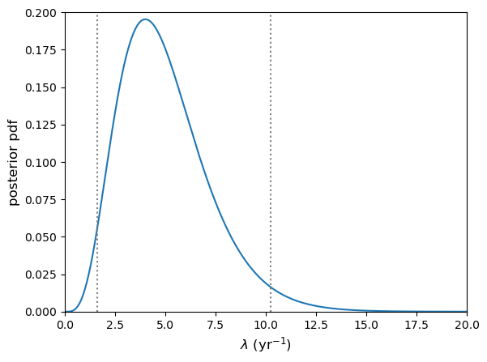
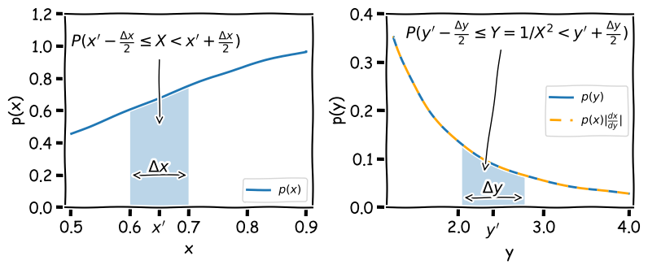

<!-- Just one possible MathJax CDN below. You may use others. -->

We will first need to import Numpy, the Scipy statistics and integration libraries and Matplotlib's plotting library. We will also need Scipy's library of interpolation functions.
~~~
import numpy as np
import scipy.stats as sps
import scipy.integrate as spint
import scipy.interpolate as spinterp
import matplotlib.pyplot as plt
~~~
{: .language-python}

## Confidence intervals

Often we want to use our data to constrain some quantity or physical parameter. For example we might have noisy measurements of the photon counts from an astronomical source which we would like to use to calculate the underlying constant flux of the source (and then the luminosity, if we know the distance). Or perhaps we want to know the gravitational acceleration $$g$$ from measurements of the period of oscillation of a pendulum, $$T$$.  We have already seen how we can use our data together with Bayes' theorem and the appropriate statistical distribution to estimate a probability distribution for our model parameter(s). 

It is often useful to estimate how likely a parameter of interest is to fall within a certain range of values. Often this range is specified to correspond to a given probability that the parameter lies within it and then it is known as a [__confidence interval__]({{ page.root }}/reference/#confidence-interval). For example, consider a posterior probability distribution for a parameter $$\theta$$ given some data $$x$$, $$p(\theta\vert x)$$. The $$95\%$$ confidence interval would be the range $$[\theta_{1},\theta_{2}]$$ such that:

$$\int^{\theta_{2}}_{\theta_{1}} p(\theta\vert x) = 0.95$$

The commonly used 1$$\sigma$$ confidence interval (often known as an error or error bar) corresponds to the range of $$\theta$$ which contains $$\simeq68.3\%$$ of the probability (i.e. $$P\simeq0.683$$), which equates to $$P( \mu-1\sigma \leq X \leq \mu+1\sigma)$$ for a variate $$X\sim N(\mu,\theta)$$. Similarly for 2$$\sigma$$ ($$P\simeq0.955$$) and 3$$\sigma$$ ($$P\simeq0.9973$$) although these are generally designated as confidence intervals, with the term 'error' reserved for 1$$\sigma$$ unless otherwise noted.
 
You may have noticed that the values we obtain for the range covered by a confidence interval have some flexibility, as long as the probability enclosed is equal to the corresponding probability required for the confidence interval. A common convention is that the confidence interval is centred on the [__median__]({{ page.root }}/reference/#median) of the distribution $$\theta_{\rm med}$$, i.e. the 50th [__percentile__]({{ page.root }}/reference/#percentile): $$\int_{-\infty}^{\theta_{\rm med}} p(\theta\vert x) = 0.5$$.  It may sometimes be the case that the confidence interval is centred on the distribution [__mean__]({{ page.root }}/reference/#mean) (i.e. the expectation $$E[\theta]$$) or, as we will see in a couple of episodes, the maximum probability density of the distribution (the so-called maximum likelihood estimate or [__MLE__]({{ page.root }}/reference/#mle). 
 
Unless the distribution is symmetric (in which case the median and mean are identical) and ideally symmetric and centrally peaked (in which case the median, mean and MLE are identical), it may only be possible to centre wide confidence intervals (e.g. $$95\%$$) on the median. This is because there may not be enough probability on one side or the other of the mean or MLE to accommodate half of the confidence interval, if the distribution is asymmetric. Therefore, a good rule of thumb is to center on the median as a default for confidence intervals which encompass a large fraction of the probability (e.g. $$95\%$$ or greater).

## Numerical calculation of a confidence interval from the posterior

Let's return to the problem of estimating the underlying ('true') rate of gravitational wave events from binary neutron stars ($$\lambda$$), based on an observation of 4 of these events in 1 year (so our data $$x=4$$).  In Episode 5 (_"Test yourself: what is the true GW event rate?"_) we calculated the posterior distribution (assuming a uniform prior for $$\lambda$$):

$$p(\lambda\vert x=4)=\lambda^{4}\mathrm{exp}(-\lambda)/4!$$

To get the percentiles for calculating a confidence interval, we need to invert the cdf to obtain the [__percent point function__]({{ page.root }}/reference/#ppf) (ppf) for the distribution. The cdf e.g. for $$\lambda$$ from 0 to $$a$$, $$F(a)$$ is:

$$F(a) = \int_{0}^{a} \lambda^{4}\frac{\mathrm{exp}(-\lambda)}{4!}\mathrm{d}\lambda,$$

which is difficult to compute even with the standard integral provided in the hint to the Episode 5 problem (and we then need to invert the cdf!). 

Instead, we can try a numerical approach. First, we'll calculate our posterior pdf in the usual way, for $$x=4$$ and assuming a uniform prior,  which we can ignore since it divides out. Note that since the integral of the Poisson likelihood from $$0$$ to $$\infty$$ is $$1$$,  strictly speaking we do not need to calculate it here, but we do so here for completeness, as it will be needed for other combinations of likelihood pdf and/or prior.
~~~
x = 4
# This will only be a 1-D calculation so we can calculate over a large array length
# Make sure the lambda array covers the range where p(x|lam)p(lam) is (effectively) non-zero
lam_arr = np.linspace(0,50,10000)
likel_pdf = sps.poisson.pmf(x,lam_arr) # Calculate the likelihood
posterior_pdf = likel_pdf/spint.simpson(likel_pdf,lam_arr)
~~~
{: .language-python}
Now we need to get the cdf of the posterior probability distribution. The cdf is the integral of the posterior pdf from 0 to a given value of $$\lambda$$, $$a$$, so to calculate for many values of $$a$$ we need some kind of cumulative function. Scipy provides this in the `scipy.integrate.cumulative_trapezoid` function. This function will calculate (via the composite trapezoidal rule) the integral in steps corresponding to the steps between values in the input `x` and `y` arrays. For input arrays of length $$n$$, the default is to output an array for the cumulative integral of length $$n-1$$, since the integral evaluations are done for the steps _between_ input array values. Thus the cdf for $$\lambda=0$$ is not included by default. However, we can include it (and make our cdf array the same length as our $$\lambda$$ array) by setting `initial=0` in the `cumulative_trapezoid` arguments.
~~~
posterior_cdf = spint.cumulative_trapezoid(posterior_pdf,lam_arr,initial=0)
~~~
{: .language-python}
Next we need to invert the cdf to obtain the ppf, which will allow us to convert a percentile straight into a value for $$\lambda$$. Since our cdf is calculated for a fixed array of $$\lambda$$ values, a Scipy interpolation object (created by the function `scipy.interpolate.interp1d`) would be useful so that we can immediately return the ppf for any value. Furthermore, the interpolation can be used to directly invert the cdf, since we have a matched grid of $$\lambda$$ and cdf values which are both in ascending numerical order. Therefore we can also interpolate the $$\lambda$$ array for steps of the cdf, and use the resulting interpolation object to obtain $$\lambda$$ for a given cdf value.
~~~
posterior_ppf = spinterp.interp1d(posterior_cdf,lam_arr)
~~~
{: .language-python}
Now that we have what we need, let's use it to calculate the $$95\%$$ confidence interval (centered on the median) on $$\lambda$$ (given 4 detected events), print it and plot the confidence interval boundaries on the posterior pdf using two vertical dotted lines.
~~~
# Calculate 95% confidence interval. The range must be 0.95, centred on 0.5 (the median)
int95 = posterior_ppf([0.025,0.975])
# Print the confidence interval
print(r'95% confidence interval on lambda =',int95)
# And plot the posterior pdf and confidence interval
plt.figure()
plt.plot(lam_arr,posterior_pdf)
# The command below plots the vertical lines to show the interval range
plt.vlines(int95,ymin=0,ymax=0.2,color='gray',linestyle='dotted')
plt.xlabel(r'$\lambda$ (yr$^{-1}$)',fontsize=12)
plt.ylabel(r'posterior pdf',fontsize=12)
plt.xlim(0,20)
plt.ylim(0,0.2)
plt.show()
~~~
{: .language-python}

~~~
95% confidence interval on lambda = [ 1.62347925 10.24159071]
~~~
{: .output}
Note that if we are asked to formally quote the interval, we should use a reasonable number of decimal places in our quoted values and not the full numerical accuracy. A good rule of thumb is for this to correspond to no more than $$\sim 1\%$$ of the range given. E.g. Here we might state the $$95\%$$ confidence interval to be: $$1.6$$--$$10.2$$.

> ## Measurement errors
> You will often see error bars quoted with measurements, e.g. from experimental data. Generally (unless clearly stated otherwise) these will correspond to 1-$$\sigma$$ ($$\simeq68\%$$) confidence intervals. This may be because the error bars correspond to the standard error on a sample mean (e.g. if the measurements are an averaged quantity), or because the measurements correspond to a large number of counts $$n$$, which if Poisson distributed will asymptote to a normal distribution with $$\mu=n$$ and $$\sigma=\sqrt{n}$$. In some cases the distribution of the measurements around the true value may be found to be normal (e.g. via prior calculation). This is seen surprisingly often, due (not surprisingly) to the central limit theorem, since the process of obtaining the measurement may itself be seen as a large combination of random processes.
>
> You should bear in mind however that not all errors can be assumed to be normally distributed and it may not also be clear what the distribution of errors is. However, if you have enough data, you can continue to rely on the central limit theorem to ensure that your sample mean is normally distributed, which will allow you to do a number of statistical tests on your data.
{: .callout}

## Upper and lower limits

Sometimes the value of the parameter we want to measure is not precisely constrained by our data. A simple example of this is when we are working with Poisson type data and have a non-detection, e.g. have taken data over a given interval, but not measured any counts. Assuming our measuring instrument is working okay, this non-detection (or zero counts) is actually useful data! We can use it to place an upper limit (with a certain confidence) on the allowed value of our rate parameter.

For example, lets consider the hypothetical GW detector searching for binary neutron star mergers. Imagine if, instead of detecting 4 such events in 1 year, we recorded no events.  __What is the 3$$\sigma$$ upper limit on the true event rate $$\lambda$$?__

First, let's note our terminology here: when we quote an upper limit to a certain confidence, e.g. $$99\%$$ what we mean is: there is a $$99\%$$ chance that the true rate is __equal to or smaller__ than this upper limit value. When we use a $$\sigma$$-valued confidence limit, e.g. a 3$$\sigma$$ upper limit, we mean that the probability is only 3$$\sigma$$ ($$\sim 0.3\%$$) that the true event rate could be __larger__ than the quoted upper limit value. Either approach is acceptable and formally equivalent, as long as the statement is clear.

Now to answer our question:

~~~
# calculate the exact 3-sigma p-value with a standard normal (multiply by 2
# since distribution is 2-tailed)
p_3sig = 2*sps.norm.sf(3)
print("3-sigma corresponds to p-value=",p_3sig)

# Now set x = 0 for the non-detection
x = 0

# This will only be a 1-D calculation so we can calculate over a large array length
# Make sure the lambda array covers the range where p(x|lam)p(lam) is (effectively) non-zero
lam_arr = np.linspace(0,20,10000)
likel_pdf = sps.poisson.pmf(x,lam_arr) # Calculate the likelihood
posterior_pdf = likel_pdf/spint.simpson(likel_pdf,lam_arr)
posterior_cdf = spint.cumulative_trapezoid(posterior_pdf,lam_arr,initial=0)
posterior_ppf = spinterp.interp1d(posterior_cdf,lam_arr)

# Now we just plug in our required p-value. Note that for an upper limit the confidence
# interval is one-sided and towards larger values, we ignore the median, so we need to
# use the percentile for 1-p.
print("For",x,"events, the 3-sigma upper limit is ",posterior_ppf(1-p_3sig))
~~~
{: .language-python}
~~~
3-sigma corresponds to p-value= 0.0026997960632601866
For 0 events, the 3-sigma upper limit is  5.914578267301981
~~~
{: .output}
We would most likely formally quote our upper limit (e.g. in a presentation or paper) as being $$5.9$$ or possibly $$5.91$$, but no more significant figures than that.

We could also do the same calculation for detected events too, e.g. to set an upper limit on how large the true rate can be, given the observed number of detections (which might be useful to constrain models of the progenitor systems of binary neutron stars).

Lower limits work the same way but in the opposite direction, i.e. we apply the limit on the lower-valued side of the pdf.

## Transformation of variables

Sometimes we may know the probability distribution and hence confidence intervals for some variable $$x$$, but we would like to know the distribution and confidence intervals for another variable $$y$$, which is calculated from $$x$$. For example, consider a measurement, represented by a random variate $$X$$ which is drawn from a distribution $$p(x)$$, from which we can derive a confidence interval (or 'error') on $$X$$. 

We want to transform our measurement to another quantity $$Y=1/X^{2}$$.  How do we calculate the distribution which $$Y$$ is drawn from $$p(y)=p(x^{-2})$$, to obtain an error on $$Y$$? First consider the probability that $$X$$ is drawn in the range $$x^{\prime}-\Delta x/2 \leq X < x^{\prime}+\Delta x/2$$, which is $$P(x^{\prime}-\Delta x/2 \leq X < x^{\prime}+\Delta x/2)$$. If we calculate $$Y$$ from $$X$$ there must be a corresponding range of $$Y$$ which has the same probability, i.e.:

$$P\left(x^{\prime}-\frac{\Delta x}{2} \leq X < x^{\prime}+\frac{\Delta x}{2}\right) = P\left(y^{\prime}-\frac{\Delta y}{2} \leq Y = 1/X^{2} < y^{\prime}+\frac{\Delta y}{2}\right)$$

This situation is illustrated by the shaded regions in the figure below, which both contain equal probability (the calculated area is the same when appropriately scaled by the axes).

Note that the shaded range could in principle contain any probability $$0\leq (P(X)=P(Y)) \leq1$$, and therefore if the range represents a given confidence interval for $$X$$, it also represents the same confidence interval for $$Y$$.  By keeping track of the integrated probability in very small intervals we can transform one into the other. This approach was used to produce the curve for $$p(y)$$ in the figure above, by assuming that $$p(x)$$ is a normal distribution $$N(\mu, \sigma) = (1,0.4)$$, using the following code:

~~~
x_arr = np.linspace(0.5,0.9,10000) # We need a fine grid of x to calculate over
y_arr = x_arr**(-2) # Calculate corresponding values of y

# Now to calculate the integrated probability in the small intervals (bins) between each gridpoint of x, 
# using the cdf for the normal distribution:
x_diffcdf = np.diff(sps.norm.cdf(x_arr,loc=1,scale=0.4))

# We could calculate the x pdf directly from the scipy function, but for consistency we will derive
# it from the probability in each x bin, by dividing by the bin width (difference in adjacent x values)
x_pdf = x_diffcdf/np.diff(x_arr)
y_pdf = x_diffcdf/(-1*np.diff(y_arr)) # Same for y but remember the y values run from large to small!

# For plotting purposes we should assign new x and y values to each of our pdf values, using the centre
# of each bin.
x_mid = (x_arr[1:]+x_arr[:-1])/2
y_mid = (y_arr[1:]+y_arr[:-1])/2
~~~
{: .language-python}

We can go further and take the limit $$\Delta x = \delta x \rightarrow 0$$. In this case we can simply evaluate the probability:

$$P\left(x^{\prime}-\frac{\delta x}{2} \leq X < x^{\prime}+\frac{\delta x}{2}\right) = p(x)\delta x = p(y)\delta y = P\left(y^{\prime}-\frac{\delta y}{2} \leq Y < y^{\prime}+\frac{\delta y}{2}\right)$$

Therefore, in the limit of infinitesimally small intervals, the probability distribution for $$Y$$ can be obtained from:

$$p(y)=p(x) \biggr\lvert \frac{\mathrm{d}x}{\mathrm{d}y} \biggr\rvert$$

I.e. for the transformation $$y=x^{-2}$$ we have $$p(y)=\frac{1}{2}x^{3}p(x)$$. This function, shown as the orange dashed curve in the figure above (which is evaluated for each $$x$$ value and then plotted as function of $$y$$), is an exact match to $$p(y)$$. 

The modulus of the derivative of $$y$$ is used because the probability must be positive-valued while the gradient can be positive or negative. This _transformation of variables_ formula allows us to transform our distribution for functions of $$X$$ and obtain new confidence intervals, which allows __exact__ error propagation for the transformation of our measurements. 

The transformation of variables formula given above will account for transformations which _monotonically_ transform one variable into another, i.e. irrespective of the value of $$X$$, and increases in $$X$$ produces either an increases or decrease in the transformed variate $$Y$$, but not both (i.e. the gradient $$\mathrm{d}x/\mathrm{d}y$$ is always either positive or negative). If this is not the case, there may not be a one-to-one relation between values of $$X$$ and $$Y$$, and you must account for this in the transformed distribution by piecewise adding together the transformed distribution $$p(y)$$ for each monotonic part of the function. This would be necessary in the example above _if_ the probability distribution for $$x$$ extended to negative values of $$x$$.

### Example: the distribution of a squared standard normal variate
$$X$$ is a variate drawn from a standard normal distribution ($$N(0,1)$$) which you use to form a new variate $$Z=X^{2}$$. What is the distribution of $$Z$$?

$$Z$$ varies monotonically with $$\vert X\vert$$ if we consider $$X\lt 0$$ and $$X\geq 0$$ separately. Therefore, we first transform to $$Y=\vert X\vert$$, and multiply the resulting pdf by a factor 2 to account for the contributions from positive and negative values of $$X$$.

$$p(y)=p(x)+p(-x)=2N(0,1)=\frac{2}{\sqrt{2\pi}} e^{-y^{2}/2}$$

Now define $$Z=Y^{2}$$. Then $$\frac{\mathrm{d}y}{\mathrm{d}z}=z^{-1/2}/2$$ and substituting $$z=y^{2}$$ into $$p(y)$$ gives:

$$p(z)=\frac{2}{\sqrt{2\pi}}e^{-z/2}\biggr\lvert \frac{z^{-1/2}}{2}\biggr\rvert = \frac{z^{-1/2}e^{-z/2}}{\sqrt{2\pi}},$$

which is a $$\chi^{2}$$ distribution for $$\nu=1$$ degrees of freedom (see a later episode for a discussion of this distribution). 

> ## Approximate variance relations (propagation of errors)
> 
> Consider a vector of $$n$$ random variates, $$\mathbf{X}=[X_{1},X_{2},...,X_{n}]$$ which are each drawn from different distributions with means $$\boldsymbol{\mu}=[\mu_{1},\mu_{2},...,\mu_{n}]$$ and variances $$\boldsymbol{\sigma}^{2}=[\sigma^{2}_{1},\sigma^{2}_{2},...,\sigma^{2}_{n}]$$. We now form a single variate $$Z$$ from a function of $$\mathbf{X}$$, i.e.: $$Z=f(\mathbf{X})$$. The question is, __what is the variance of the new variable $$Z$$__?
>
> First, let's expand $$f(\mathbf{X})$$ as a Taylor series around $$\boldsymbol{\mu}$$:
>
> $$Z =  f(\mathbf{X}) = f(\boldsymbol{\mu}) + \sum\limits_{i=1}^{n} \frac{\partial f}{\partial X_{i}}\Biggr\vert_{\mathbf{X}=\boldsymbol{\mu}} (X_{i}-\mu_{i})+\cdots$$
>
> where the vertical line indicates that the partial derivative is evaluated at $$\mathbf{X}=\boldsymbol{\mu}$$. If we neglect the higher-order terms, we see that $$E[Z]=E[f(\mathbf{X})] \approx f(\boldsymbol{\mu})$$, since $$E[X_{i}-\mu_{i}]=0$$. Now we calculate the variance, again neglecting the higher-order terms and using the result (see Episode 2) that $$V[Z] = V[f(X)]=E[f(X)^{2}]-E[f(X)]^{2}$$. First we calculate $$f(X)^{2}$$:
>
> $$f(\mathbf{X})^{2} = f(\boldsymbol{\mu})^{2} + 2f(\boldsymbol{\mu}) \sum\limits_{i=1}^{n} \frac{\partial f}{\partial X_{i}}\Biggr\vert_{\mathbf{X}=\boldsymbol{\mu}} (X_{i}-\mu_{i}) + \left[\sum\limits_{i=1}^{n} \frac{\partial f}{\partial X_{i}}\Biggr\vert_{\mathbf{X}=\boldsymbol{\mu}} (X_{i}-\mu_{i})\right] \left[\sum\limits_{j=1}^{n} \frac{\partial f}{\partial X_{j}}\Biggr\vert_{\mathbf{X}=\boldsymbol{\mu}} (X_{j}-\mu_{j})\right]$$
>
> Now we take the expectation value and subtract $$E[f(X)]^{2}= f(\boldsymbol{\mu})^{2}$$ to obtain:
>
> $$V[Z] \approx \sum\limits_{i=1}^{n} \sum\limits_{j=1}^{n} \frac{\partial f}{\partial X_{i}} \frac{\partial f}{\partial X_{j}}\Biggr\vert_{\mathbf{X}=\boldsymbol{\mu}} \Sigma_{ij} ,$$
>
> where  $$\Sigma_{ij}$$ is the $$(i,j)$$th element of the population covariance matrix for the variates $$\mathbf{X}$$. If the variates in $$\mathbf{X}$$ are [__uncorrelated__]({{ page.root }}/reference/#correlated-variables) then the off-diagonal elements $$\Sigma_{i\neq j}=0$$ and we obtain the famous formula for [__propagation of errors__]({{ page.root }}/reference/#propagation-of-errors):
> 
> $$V[Z] = \sigma^{2}_{z}\approx \sum\limits_{i=1}^{n} \left(\frac{\partial f}{\partial X_{i}}\right)^{2}_{\mathbf{X}=\boldsymbol{\mu}}  \sigma_{i}^{2}$$
>
> where $$\sigma_{i}^{2}$$ are the variances for the variates $$X_{i}$$.
>
> You will probably be familiar with this formula from introductory statistics or lab data analysis courses that you have taken, as they are useful to convert errors (i.e. the standard deviation $$\sigma_{i}$$) from one more more measured quantities to obtain the error on a derived quantity. For example, for $$Z=X+Y$$ we infer $$\sigma_{z}=\sqrt{\sigma_{x}^{2}+\sigma_{y}^{2}}$$ (i.e. errors add in quadrature, as expected). For $$Z=XY$$ we infer $$\sigma_{z}=\sqrt{Y^{2}\sigma_{x}^{2}+X^{2}\sigma_{y}^{2}}$$. 
>
{: .callout}

## Bootstrapping

Bootstrapping is a method to leverage the power of large samples of data (ideally $$n=100$$ or more) in order to generate 'fake' samples of data with similar statistical properties, simply by resampling the original data set with replacement. Assuming that they are the same size as the original sample, the variation in the new samples that are produced by bootstrapping is equivalent to what would be observed if the data was resampled from the underlying population. This means that bootstrapping is a remarkably cheap and easy way to produce Monte Carlo simulations of any type of quantity, estimator or statistic generated from the data. The resulting samples can thus be used to determine confidence intervals and other quantities, even when the underlying population distribution is not known.

###  Bootstrapping to obtain error estimates

Now we'll generate some fake correlated data, and then use the Numpy `choice` function (see Episode 1) to randomly select samples of the data (with replacement) for a bootstrap analysis of the variation in linear fit parameters $$a$$ and $$b$$. We will first generate fake sets of correlated $$x$$ and $$y$$ values as in the earlier example for exploring the correlation coefficient. Use 100 data points for $$x$$ and $$y$$ to start with and plot your data to check that the correlation is clear.

~~~
x = sps.norm.rvs(size=100)
y = x + 0.5*sps.norm.rvs(size=100)
~~~
{: .language-python}

First use `curve_fit` to obtain the $$a$$ and $$b$$ coefficients for the simulated, 'observed' data set and print your results.

When making our new samples, we need to make sure we sample the same indices of the array for all variables being sampled, otherwise we will destroy any correlations that are present.  Here you can do that by setting up an array of indices matching that of your data (e.g. with `numpy.arange(len(x))`), randomly sampling from that using `choice`, and then using the `numpy.take` function to select the values of `x` and `y` which correspond to those indices of the arrays. Then use `curve_fit` to obtain the coefficients $$a$$ and $$b$$ of the linear correlation and record these values to arrays. Use a loop to repeat the process a large number of times (e.g. 1000 or greater) and finally make a scatter plot of your values of $$a$$ and $$b$$, which shows the bivariate distribution expected for these variables, given the scatter in your data. 

Now find the mean and standard deviations for your bootstrapped distributions of $$a$$ and $$b$$, print them and compare with the expected errors on these values given in the lecture slides. These estimates correspond to the errors of each, ___marginalised over the other variable___. Your distribution could also be used to find the covariance or correlation coefficient between the two variables. 

__Note that the standard error on the mean of $$a$$ or $$b$$ is not relevant for estimating the errors here__ because you are trying to find the scatter in the values expected from your observed number of data points, not the uncertainty on the many repeated 'bootstrap' versions of the data.

Try repeating for repeated random samples of your original $$x$$ and $$y$$ values to see the change in position of the distribution as your sample changes. Try changing the number of data points in the simulated data set, to see how the scatter in the distributions change. How does the simulated distribution compare to the 'true' model values for the gradient and intercept, that you used to generate the data?

__Note that if you want to do bootstrapping using a larger set of variables, you can do this more easily by using a Pandas dataframe and using the `pandas.DataFrame.sample` function__.  By setting the number of data points in the sample to be equal to the number of rows in the dataframe, you can make a resampled dataframe of the same size as the original. Be sure to sample with replacement!

~~~
nsims = 1000
indices = np.arange(len(x))
func = lambda x, a, b: x*a+b
r2, pcov = spopt.curve_fit(func, x,y, p0=(1,1))
a_obs = r2[0]
b_obs = r2[1]

print("The obtained a and b coefficients are ",a_obs,"and",b_obs,"respectively.")

a_arr = np.zeros(nsims)
b_arr = np.zeros(nsims)
rng = np.random.default_rng()  # Set up the generator with the default system seed
for i in range(nsims):
    new_indices = rng.choice(indices, size=len(x), replace=True)
    new_x = np.take(x,new_indices)
    new_y = np.take(y,new_indices)
    r2, pcov = spopt.curve_fit(func, new_x,new_y, p0=(1,1))
    a_arr[i] = r2[0]
    b_arr[i] = r2[1]
    
plt.figure()
plt.plot(a_arr, b_arr, "o")
plt.xlabel("a", fontsize=14)
plt.ylabel("b", fontsize=14)
plt.tick_params(axis='x', labelsize=12)
plt.tick_params(axis='y', labelsize=12)
plt.show()

print("The mean and standard deviations of the bootstrapped samples of $a$ are:",
      np.mean(a_arr),"and",np.std(a_arr,ddof=1),"respectively")
print("The mean and standard deviations of the bootstrapped samples of $b$ are:",
      np.mean(b_arr),"and",np.std(b_arr,ddof=1),"respectively")
~~~
{: .language-python}

> ## Programming challenge
> In the challenge from the previous episode, you used linear regression to determine the gradient and offset ($$y$$-axis intercept) of the relation between LOGL3000 (on the $$x$$-axis) and LOGL_MGII (on the $$y$$-axis) for your cleaned SDSS quasar sample. You split the sample according to radio loudness (as in the Episode 7 challenge) and carried out a linear regression on the LOGL3000 vs. LOGL_MGII relation of the two radio-selected sub-samples. Although we asked you to note any difference between the regression parameters for the two sub-samples, you were not able to assign any statistical significance or meaning to these quantities, without appropriate confidence intervals on them. 
>
> In this challenge, you will use bootstrapping to assess the uncertainty on your regression parameters and estimate errors on them.  Use bootstrapping (with at least 1000 bootstrap trials) on your two radio-selected sub-samples, to measured gradients and offsets for each sub-sample. For each of the bootstrap trials, record the gradient and offset and use these values from all trials to estimate the correlation coefficient between the gradient and offset parameters in your sample of bootstrap measurements. Also use the bootstrap results to calculate the mean and standard deviation (i.e. 1-$$\sigma$$ errors) for the gradient and offset for each radio-selected sub-sample. 
>
> Is most of the observed variance in the gradient and offset due to correlated variations in the two parameters, or independent variations?
>
> Also, make a scatter-plot of the offsets and gradient  from the bootstrap sample to see how they are distributed. By overplotting these scatter plots for the different quasar samples, show whether or not the relation between LOGL3000 and LOGL_MGII is different between the two radio-selected sub-samples.
>
{: .challenge}

