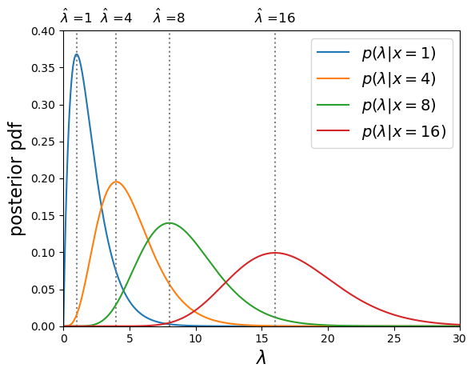
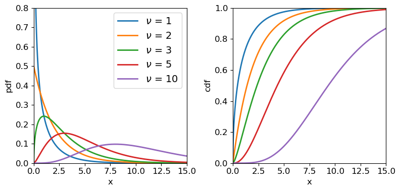
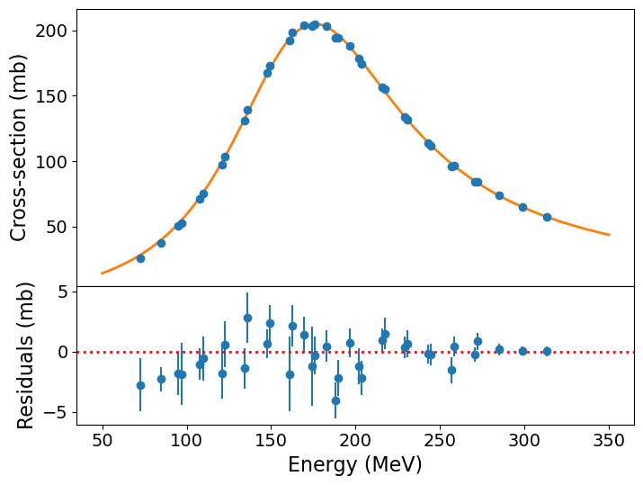

<!-- Just one possible MathJax CDN below. You may use others. -->

In this episode we will be using numpy, as well as matplotlib's plotting library. Scipy contains an extensive range of distributions in its 'scipy.stats' module, so we will also need to import it and we will also make use of scipy's `optimize` and `interpolate` modules. Remember: scipy modules should be installed separately as required - they cannot be called if only scipy is imported.
~~~
import numpy as np
import matplotlib.pyplot as plt
import scipy.stats as sps
import scipy.optimize as spopt
~~~
{: .language-python}

## Maximum likelihood estimation

Consider a hypothesis which is specified by a single parameter $$\theta$$, for which we can calculate the posterior pdf (given data vector $$\mathbf{x}$$), $$p(\theta \vert \mathbf{x})$$. Based on the posterior distribution, what would be a good estimate for $$\theta$$? We could consider obtaining the mean of $$p(\theta\vert \mathbf{x})$$, but this may often be skewed if the distribution has asymmetric tails, and is also difficult to calculate in many cases. A better estimate would involve finding the value of $$\theta$$ which maximises the posterior probability density. I.e. we should find the value of $$\theta$$ corresponding to the peak (i.e. the [__mode__]({{ page.root }}/reference/#mode)) of the posterior pdf. Therefore we require:

$$\frac{\mathrm{d}p}{\mathrm{d}\theta}\bigg\rvert_{\hat{\theta}} = 0 \quad \mbox{and} \quad \frac{\mathrm{d}^{2}p}{\mathrm{d}\theta^{2}}\bigg\rvert_{\hat{\theta}} < 0$$

where $$\hat{\theta}$$ is the value of the parameter corresponding to the maximum probability density. This quantity is referred to as the _maximum likelihood_, although the pdf used is the posterior rather than the likelihood in Bayes' theorem (but the two are equivalent for uniform priors). The parameter value $$\hat{\theta}$$ corresponding to the maximum likelihood is the best [__estimator__]({{ page.root }}/reference/#estimator) for $$\theta$$ and is known as the _maximum likelihood estimate_ of $$\theta$$ or [__MLE__]({{ page.root }}/reference/#mle). The process of maximising the likelihood to obtain MLEs is known as [__maximum likelihood estimation__]({{ page.root }}/reference/#maximum-likelihood-estimation).

## Log-likelihood and MLEs

Many posterior probability distributions are quite 'peaky' and it is often easier to work with the smoother transformation $$L(\theta)=\ln[p(\theta)]$$ (where we now drop the conditionality on the data, which we assume as a given).  $$L(\theta)$$ is a monotonic function of $$p(\theta)$$ so it must also satisfy the relations for a maximum to occur for the same MLE value, i.e:

$$\frac{\mathrm{d}L}{\mathrm{d}\theta}\bigg\rvert_{\hat{\theta}} = 0 \quad \mbox{and} \quad \frac{\mathrm{d}^{2}L}{\mathrm{d}\theta^{2}}\bigg\rvert_{\hat{\theta}} < 0$$

Furthermore, the log probability also has the advantages that products become sums, and powers become multiplying constants, which besides making calculations simpler, also avoids the computational errors that occur for the extremely large or small numbers obtained when multiplying the likelihood for many measurements. We will use this property to calculate the MLEs for some well-known distributions (i.e. we assume a uniform prior so we only consider the likelihood function of the distribution) and demonstrate that the MLEs are the best estimators of function parameters.

Firstly, consider a [_binomial distribution_]({{ page.root }}/reference/#distributions---binomial):

$$p(\theta\vert x, n) \propto \theta^{x} (1-\theta)^{n-x}$$

where $$x$$ is now the _observed_ number of successes in $$n$$ trials and success probability $$\theta$$ is a parameter which is the variable of the function. We can neglect the binomial constant since we will take the logarithm and then differentiate, to obtain the maximum log-likelihood:

$$L(\theta) = x\ln(\theta) + (n-x)\ln(1-\theta) + \mathrm{constant}$$ 

$$\frac{\mathrm{d}L}{\mathrm{d}\theta}\bigg\rvert_{\hat{\theta}} = \frac{x}{\hat{\theta}} - \frac{n-x}{(1-\hat{\theta})} = 0 \quad \rightarrow \quad  \hat{\theta} = \frac{x}{n}$$

Further differentiation will show that the second derivative is negative, i.e. this is indeed the MLE. If we consider repeating our experiment many times, the expectation of our data $$E[x]$$ is equal to that of variates drawn from a binomial distribution with $$\theta$$ fixed at the true value, i.e. $$E[x]=E[X]$$. We therefore obtain $$E[X] = nE[\hat{\theta}]$$ and comparison with the expectation value for binomially distributed variates confirms that $$\hat{\theta}$$ is an unbiased estimator of the true value of $$\theta$$.

> ## Test yourself: MLE for a Poisson distribution
> Determine the MLE of the rate parameter $$\lambda$$ for a Poisson distribution and show that it is an unbiased estimator of the true rate parameter.
>
>> ## Solution
>> For fixed observed counts $$x$$ and a uniform prior on $$\lambda$$, the Poisson distribution $$P(\lambda \vert x) \propto \lambda^{x} e^{-\lambda}$$. Therefore the log-likelihood is:
>> $$L(\lambda) = x\ln(\lambda) -\lambda$$
>> $$\quad \rightarrow \quad \frac{\mathrm{d}L}{\mathrm{d}\lambda}\bigg\rvert_{\hat{\lambda}} = \frac{x}{\hat{\lambda}} - 1 = 0 \quad \rightarrow \quad \hat{\lambda} = x$$
>>
>> $$\frac{\mathrm{d}^{2}L}{\mathrm{d}\lambda^{2}}\bigg\rvert_{\hat{\lambda}} = - \frac{x}{\hat{\lambda}^{2}}$$, i.e. negative, so we are considering the MLE. 
>>
>> Therefore, the observed rate $$x$$ is the MLE for $$\lambda$$.
>>
>> For the Poisson distribution, $$E[X]=\lambda$$, therefore since $$E[x]=E[X] = E[\hat{\lambda}]$$, the MLE is an unbiased estimator of the true $$\lambda$$. You might wonder why we get this result when in the challenge in the previous episode, we showed that the mean of the prior probability distribution for the Poisson rate parameter and observed rate $$x=4$$ was 5! 
>>
>> 

>> 
>> 

>> 
Poisson posterior distribution MLEs are equal to the observed rate.  

>>
>> The mean of the posterior distribution $$\langle \lambda \rangle$$ is larger than the MLE (which is equivalent to the [_mode_]({{ page.root }}/reference/#mode) of the distribution, because the distribution is positively skewed (i.e. skewed to the right). However, over many repeated experiments with the same rate parameter $$\lambda_{\mathrm{true}}$$, $$E[\langle \lambda \rangle]=\lambda_{\mathrm{true}}+1$$, while $$E[\hat{\lambda}]=\lambda_{\mathrm{true}}$$.  I.e. the mean of the posterior distribution is a biased estimator in this case, while the MLE is not.
> {: .solution}
{: .challenge}

## Errors on MLEs

It's important to remember that the MLE $$\hat{\theta}$$ is only an _estimator_ for the  true parameter value $$\theta_{\mathrm{true}}$$, which is contained somewhere in the posterior probability distribution for $$\theta$$, with probability of it occuring in a certain range, given by integrating the distribution over that range, as is the case for the pdf of a random variable. Previously, we looked at the approach of using the posterior distribution to define [__confidence intervals__]({{ page.root }}/reference/#confidence-interval). Now we will examine a simpler approach to estimating the error on an MLE, which is exact for the case of a posterior which is a normal distribution.

Consider a log-likelihood $$L(\theta)$$ with maximum at the MLE, at $$L(\hat{\theta})$$. We can examine the shape of the probability distribution of $$\theta$$ around $$\hat{\theta}$$ by expanding $$L(\theta)$$ about the maximum:

$$L(\theta) = L(\hat{\theta}) + \frac{1}{2} \frac{\mathrm{d}^{2}L}{\mathrm{d}\theta^{2}}\bigg\rvert_{\hat{\theta}}(\theta-\hat{\theta})^{2} + \cdots$$

where the 1st order term is zero because $$\frac{\mathrm{d}L}{\mathrm{d}\theta}\bigg\rvert_{\hat{\theta}} = 0$$ at $$\theta=\hat{\theta}$$, by definition.

For smooth log-likelihoods, where we can neglect the higher order terms, the distribution around the MLE can be approximated by a parabola with width dependent on the 2nd derivative of the log-likelihood. To see what this means, lets transform back to the probability, $$p(\theta)=\exp\left(L(\theta)\right)$$:

$$L(\theta) = L(\hat{\theta}) + \frac{1}{2} \frac{\mathrm{d}^{2}L}{\mathrm{d}\theta^{2}}\bigg\rvert_{\hat{\theta}}(\theta-\hat{\theta})^{2} \quad \Rightarrow \quad p(\theta) = p(\hat{\theta})\exp\left[\frac{1}{2} \frac{\mathrm{d}^{2}L}{\mathrm{d}\theta^{2}}\bigg\rvert_{\hat{\theta}}(\theta-\hat{\theta})^{2}\right]$$

The equation on the right hand side should be familiar to us: it is the [__normal distribution__]({{ page.root }}/reference/#distributions---normal)!

$$p(x\vert \mu,\sigma)=\frac{1}{\sigma \sqrt{2\pi}} e^{-(x-\mu)^{2}/(2\sigma^{2})}$$

i.e. for smooth log-likelihood functions, the posterior probability distribution of the parameter $$\theta$$ can be approximated with a normal distribution about the MLE $$\hat{\theta}$$, i.e. with mean $$\mu=\hat{\theta}$$ and variance $$\sigma^{2}=-\left(\frac{\mathrm{d}^{2}L}{\mathrm{d}\theta^{2}}\bigg\rvert_{\hat{\theta}}\right)^{-1}$$. Thus, assuming this _Gaussian_ or [__normal approximation__]({{ page.root }}/reference/#normal-approximation) , we can estimate a 1-$$\sigma$$ uncertainty or [__error__]({{ page.root }}/reference/#error) on $$\theta$$ which corresponds to a range about the MLE value where the true value should be $$\simeq$$68.2% of the time:

$$\sigma = \left(-\frac{\mathrm{d}^{2}L}{\mathrm{d}\theta^{2}}\bigg\rvert_{\hat{\theta}}\right)^{-1/2}$$

How accurate this estimate for $$\sigma$$ is will depend on how closely the posterior distribution approximates a normal distribution, at least in the region of parameter values that contains most of the probability. The estimate will become exact in the case where the posterior is normally distributed.

> ## Test yourself: errors on Binomial and Poisson MLEs
> Use the normal approximation to estimate the standard deviation on the MLE for binomial and Poisson distributed likelihood functions, in terms of the observed data ($$x$$ successes in $$n$$ trials, or $$x$$ counts). 
>
>> ## Solution
>> For the binomial distribution we have already shown that:
>>   $$\frac{\mathrm{d}L}{\mathrm{d}\theta} = \frac{x}{\theta} - \frac{n-x}{(1-\theta)} \quad \rightarrow \quad  \frac{\mathrm{d}^{2}L}{\mathrm{d}\theta^{2}}\bigg\rvert_{\hat{\theta}} = -\frac{x}{\hat{\theta}^{2}} - \frac{n-x}{(1-\hat{\theta})^{2}} = -\frac{n}{\hat{\theta}(1-\hat{\theta})}$$
>>
>> So we obtain: $$\sigma = \sqrt{\frac{\hat{\theta}(1-\hat{\theta})}{n}}$$ and since $$\hat{\theta}=x/n$$ our final result is:
>>    $$\sigma = \sqrt{\frac{x(1-x/n)}{n^2}}$$
>> 
>> For the Poisson distributed likelihood we already showed in a previous challenge that $$\frac{\mathrm{d}^{2}L}{\mathrm{d}\lambda^{2}}\bigg\rvert_{\hat{\lambda}} = - \frac{x}{\hat{\lambda}^{2}}$$ and $$\hat{\lambda}=x$$
>>
>> So, $$\sigma = \sqrt{x}$$.
> {: .solution}
{: .challenge}

## Using optimisers to obtain MLEs

For the distributions discussed so far, the MLEs could be obtained analytically from the derivatives of the likelihood function. However, in most practical examples, the data are complex (i.e. multiple measurements) and the model distribution may include multiple parameters, making an analytical solution impossible. In some cases, like those we have examined so far, it is possible to calculate the posterior distribution numerically. However, that can be very challenging when considering complex data and/or models with many parameters, leading to a multi-dimensional parameter _hypersurface_ which cannot be efficiently mapped using any kind of computation over a dense grid of parameter values. Furthermore, we may only want the MLEs and perhaps their errors, rather than the entire posterior pdf. In these cases, where we do not need or wish to calculate the complete posterior distribution, we can obtain the MLEs numerically, via a numerical approach called _optimisation_.

Optimisation methods use algorithmic approaches to obtain either the minimum or maximum of a function of one or more adjustable parameters. These approaches are implemented in software using _optimisers_. We do not need the normalised posterior pdf in order to obtain an MLE, since only the pdf shape matters to find the peak. So the function to be optimised is often the likelihood function (for the uniform prior case) or product of likelihood and prior, or commonly some variant of those, such as the log-likelihood or, as we will see later [_weighted least squares_]({{ page.root }}/reference/#weighted-least-squares), colloquially known as [_chi-squared fitting_]({{ page.root }}/reference/#chi-squared-fitting). 

> ## Optimisation methods and the `scipy.optimize` module.
> There are a variety of optimisation methods which are available in Python's `scipy.optimize` module. Many of these approaches are discussed in some detail in Chapter 10 of the book 'Numerical Recipes', available online [here][numrec_online]. Here we will give a brief summary of some of the main methods and their pros and cons for maximum likelihood estimation. An important aspect of most numerical optimisation methods, including the ones in scipy, is that they are _minimisers_, i.e. they operate to minimise the given function rather than maximise it. This works equally well for maximising the likelihood, since we can simply multiply the function by -1 and minimise it to achieve our maximisation result.
>
> - __Scalar minimisation__: the function `scipy.optimize.minimize_scalar` has several methods for minimising functions of only one variable. The methods can be specified as arguments, e.g. `method='brent'` uses __Brent's method__ of parabolic interpolation: find a parabola between three points on the function, find the position of its minimum and use the minimum to replace the highest point on the original parabola before evaluating again, repeating until the minimum is found to the required tolerance. The method is fast and robust but can only be used for functions of 1 parameter and as no gradients are used, it does not return the useful 2nd derivative of the function.
> - __Downhill simplex (Nelder-Mead)__: `scipy.optimize.minimize` offers the method `nelder-mead` for rapid and robust minimisation of multi-parameter functions using the 'downhill simplex' approach. The approach assumes a simplex, an object of $$n+1$$ points or vertices in the $$n$$-dimensional parameter space. The function to be minimised is evaluated at all the vertices. Then, depending on where the lowest-valued vertex is and how steep the surrounding 'landscape' mapped by the other vertices is, a set of rules are applied to move one or more points of the simplex to a new location. E.g. via reflection, expansion or contraction of the simplex or some combination of these. In this way the simplex 'explores' the $$n$$-dimensional landscape of function values to find the minimum. Also known as the 'amoeba' method because the simplex 'oozes' through the landscape like an amoeba!
> - __Gradient methods__: a large set of methods calculate the gradients or even second derivatives of the function (hyper)surface in order to quickly converge on the minimum. A commonly used example is the __Broyden-Fletcher-Goldfarb-Shanno__ (__BFGS__) method (`method=BFGS` in `scipy.optimize.minimize` or the legacy function `scipy.optimize.fmin_bfgs`). A more specialised function using a variant of this approach which is optimised for fitting functions to data with normally distributed errors ('_weighted non-linear least squares_') is `scipy.optimize.curve_fit`. The advantage of these functions is that they usually return either a matrix of second derivatives (the 'Hessian') or its inverse, which is the _covariance matrix_ of the fitted parameters. These can be used to obtain estimates of the errors on the MLEs, following the normal approximation approach described in this episode.
>
> An important caveat to bear in mind with all optimisation methods is that for finding minima in complicated hypersurfaces, there is always a risk that the optimiser returns only a local minimum, end hence incorrect MLEs, instead of those at the true minimum for the function. Most optimisers have built-in methods to try and mitigate this problem, e.g. allowing sudden switches to completely different parts of the surface to check that no deeper minimum can be found there. It may be that a hypersurface is too complicated for any of the optimisers available. In this case, you should consider looking at _Markov Chain Monte Carlo_ methods to fit your data.
{: .callout}

## General maximum likelihood estimation: model fitting

So far we have only considered maximum likelihood estimation applied to simple univariate models and data. It's much more common in the physical sciences that our data is (at least) bivariate i.e. $$(x,y)$$ and that we want to fit the data with multi-parameter models. We'll look at this problem in this episode.

First consider our [__hypothesis__]({{ page.root }}/reference/#hypothesis), consisting of a physical model relating a response variable $$y$$ to some explanatory variable $$x$$. There are $$n$$ pairs of measurements, with a value $$y_{i}$$ corresponding to each $$x_{i}$$ value, $$x_{i}=x_{1},x_{2},...,x_{n}$$. We can write both sets of values as vectors, denoted by bold fonts: $$\mathbf{x}$$, $$\mathbf{y}$$.

Our model is not completely specified, some parameters are unknown and must be obtained from fitting the model to the data. The $$M$$ model parameters can also be described by a vector $$\pmb{\theta}=[\theta_{1},\theta_{2},...,\theta_{M}]$$.

Now we bring in our statistical model. Assuming that the data are unbiased, the model gives the expectation value of $$y$$ for a given $$x$$ value and model parameters, i.e. it gives $$E[y]=f(x,\pmb{\theta})$$. The data are assumed to be independent and drawn from a probability distribution with expectation value given by the model, and which can be used to calculate the probability of obtaining a data $$y$$ value given the corresponding $$x$$ value and model parameters: $$p(y_{i}\vert x_{i}, \pmb{\theta})$$.

Since the data are independent, their probabilities are multiplied together to obtain a total probability for a given set of data, under the assumed hypothesis. The [__likelihood function__]({{ page.root }}/reference/#likelihood-function) is:

$$l(\pmb{\theta}) = p(\mathbf{y}\vert \mathbf{x},\pmb{\theta}) = p(y_{1}\vert x_{1},\pmb{\theta})\times ... \times p(y_{n}\vert x_{n},\pmb{\theta}) = \prod\limits_{i=1}^{n} p(y_{i}\vert x_{i},\pmb{\theta})$$

So that the log-likelihood is:

$$L(\pmb{\theta}) = \ln[l(\pmb{\theta})] = \ln\left(\prod\limits_{i=1}^{n} p(y_{i}\vert x_{i},\pmb{\theta}) \right) = \sum\limits_{i=1}^{n} \ln\left(p(y_{i}\vert x_{i},\pmb{\theta})\right)$$

and to obtain the MLEs for the model parameters, we should maximise the value of his log-likelihood function. This procedure of finding the MLEs of model parameters via maximising the likelihood is often known more colloquially as _model fitting_ (i.e. you 'fit' the model to the data).

## MLEs and errors from multi-parameter model fitting

When using maximum likelihood to fit a model with multiple ($$M$$) parameters $$\pmb{\theta}$$, we obtain a vector of 1st order partial derivatives, known as _scores_:

$$U(\pmb{\theta}) = \left( \frac{\partial L(\pmb{\theta})}{\partial \theta_{1}}, \cdots, \frac{\partial L(\pmb{\theta})}{\partial \theta_{M}}\right)$$

i.e. $$U(\pmb{\theta})=\nabla L$$. In vector calculus we call this vector of 1st order partial derivatives the _Jacobian_. The MLEs correspond to the vector of parameter values where the scores for each parameter are zero, i.e. $$U(\hat{\pmb{\theta}})= (0,...,0) = \mathbf{0}$$.

We saw in the previous episode that the variances of these parameters can be derived from the 2nd order partial derivatives of the log-likelihood.  Now let's look at the case for a function of two parameters, $$\theta$$ and $$\phi$$. The MLEs are found where:

$$\frac{\partial L}{\partial \theta}\bigg\rvert_{\hat{\theta},\hat{\phi}} = 0 \quad , \quad \frac{\partial L}{\partial \phi}\bigg\rvert_{\hat{\theta},\hat{\phi}} = 0$$

where we use $$L=L(\phi,\theta)$$ for convenience. Note that the maximum corresponds to the same location for both MLEs, so is evaluated at $$\hat{\theta}$$ and $$\hat{\phi}$$, regardless of which parameter is used for the derivative. Now we expand the log-likelihood function to 2nd order about the maximum (so the first order term vanishes):

$$L = L(\hat{\theta},\hat{\phi}) + \frac{1}{2}\left[\frac{\partial^{2}L}{\partial\theta^{2}}\bigg\rvert_{\hat{\theta},\hat{\phi}}(\theta-\hat{\theta})^{2} + \frac{\partial^{2}L}{\partial\phi^{2}}\bigg\rvert_{\hat{\theta},\hat{\phi}}(\phi-\hat{\phi})^{2}] + 2\frac{\partial^{2}L}{\partial\theta \partial\phi}\bigg\rvert_{\hat{\theta},\hat{\phi}}(\theta-\hat{\theta})(\phi-\hat{\phi})\right] + \cdots$$

The 'error' term in the square brackets is the equivalent for 2-parameters to the 2nd order term for one parameter which we saw in the previous episode. This term may be re-written using a matrix equation:

$$Q = 
\begin{pmatrix}
\theta-\hat{\theta} & \phi-\hat{\phi}
\end{pmatrix} 
\begin{pmatrix}
A & C\\
C & B
\end{pmatrix} 
\begin{pmatrix}
\theta-\hat{\theta}\\ 
\phi-\hat{\phi}
\end{pmatrix} $$

where $$A = \frac{\partial^{2}L}{\partial\theta^{2}}\bigg\rvert_{\hat{\theta},\hat{\phi}}$$, $$B = \frac{\partial^{2}L}{\partial\phi^{2}}\bigg\rvert_{\hat{\theta},\hat{\phi}}$$ and $$C=\frac{\partial^{2}L}{\partial\theta \partial\phi}\bigg\rvert_{\hat{\theta},\hat{\phi}}$$. 
Since $$L(\hat{\theta},\hat{\phi})$$ is a maximum, we require that $$A<0$$, $$B<0$$ and $$AB>C^{2}$$.

This approach can also be applied to models with $$M$$ parameters, in which case the resulting matrix of 2nd order partial derivatives is $$M\times M$$. In vector calculus terms, this matrix of 2nd order partial derivatives is known as the _Hessian_. As could be guessed by analogy with the result for a single parameter in the previous episode, we can directly obtain estimates of the variance of the MLEs by taking the negative __inverse matrix__ of the Hessian of our log-likelihood evaluated at the MLEs. In fact, this procedure gives us the __covariance matrix__ for the MLEs. For our 2-parameter case this is:

$$
-\begin{pmatrix}
A & C\\
C & B
\end{pmatrix}^{-1} = -\frac{1}{AB-C^{2}}
\begin{pmatrix}
B & -C\\
-C & A
\end{pmatrix} = 
\begin{pmatrix}
\sigma^{2}_{\theta} & \sigma_{\theta \phi} \\
\sigma_{\theta \phi} & \sigma^{2}_{\phi}
\end{pmatrix}$$ 

The diagonal terms of the covariance matrix give the marginalised variances of the parameters, so that in the 2-parameter case, the 1-$$\sigma$$ errors on the parameters (assuming the _normal approximation_, i.e. normally distributed likelihood about the maximum) are given by:

$$\sigma_{\theta}=\sqrt{\frac{-B}{AB-C^{2}}} \quad , \quad \sigma_{\phi}=\sqrt{\frac{-A}{AB-C^{2}}}.$$

The off-diagonal term is the covariance of the errors between the two parameters. If it is non-zero, then the errors are correlated, e.g. a deviation of the MLE from the true value of one parameter causes a correlated deviation of the MLE of the other parameter from its true value. _If the covariance is zero_ (or negligible compared to the product of the parameter errors), the errors on each parameter reduce to the same form as the single-parameter errors described above, i.e.:

$$\sigma_{\theta} = \left(-\frac{\mathrm{d}^{2}L}{\mathrm{d}\theta^{2}}\bigg\rvert_{\hat{\theta}}\right)^{-1/2} \quad , \quad \sigma_{\phi}=\left(-\frac{\mathrm{d}^{2}L}{\mathrm{d}\phi^{2}}\bigg\rvert_{\hat{\phi}}\right)^{-1/2} $$

## Weighted least squares: 'chi-squared fitting'

Let's consider the case where the data values $$y_{i}$$ are drawn from a [_normal distribution_]({{ page.root }}/reference/#distributions---normal) about the expectation value given by the model, i.e. we can define the mean and variance of the distribution for a particular measurement as:

$$\mu_{i} = E[y_{i}] = f(x_{i},\pmb{\theta})$$

and the standard deviation $$\sigma_{i}$$ is given by the error on the data value. __Note that this situation is not the same as in the normal approximation discussed above, since here it is the data which are normally distributed, not the likelihood function.__

The likelihood function for the data points is:

$$p(\mathbf{y}\vert \pmb{\mu},\pmb{\sigma}) = \prod\limits_{i=1}^{n} \frac{1}{\sqrt{2\pi\sigma_{i}^{2}}} \exp\left[-\frac{(y_{i}-\mu_{i})^{2}}{2\sigma_{i}^{2}}\right]$$

and the log-likelihood is:

$$L(\pmb{\theta}) = \ln[p(\mathbf{y}\vert \pmb{\mu},\pmb{\sigma})] = -\frac{1}{2} \sum\limits_{i=1}^{n} \ln(2\pi\sigma_{i}^{2}) - \frac{1}{2} \sum\limits_{i=1}^{n} \frac{(y_{i}-\mu_{i})^{2}}{\sigma_{i}^{2}}$$

Note that the first term on the RHS is a constant defined only by the errors on the data, while the second term is the sum of squared residuals of the data relative to the model, normalised by the squared error of the data. This is something we can easily calculate without reference to probability distributions! We therefore define a new statistic $$X^{2}(\pmb{\theta})$$:

$$X^{2}(\pmb{\theta}) = -2L(\pmb{\theta}) + \mathrm{constant} = \sum\limits_{i=1}^{n} \frac{(y_{i}-\mu_{i})^{2}}{\sigma_{i}^{2}}$$

This statistic is often called the chi-squared ($$\chi^{2}$$) statistic, and the method of maximum likelihood fitting which uses it is formally called _weighted least squares_ but informally known as 'chi-squared fitting' or 'chi-squared minimisation'. The name comes from the fact that, where the model is a correct description of the data, the observed $$X^{2}$$ is drawn from a [_chi-squared distribution_]({{ page.root }}/reference/#distributions---chi-squared). Minimising $$X^{2}$$ is equivalent to maximising $$L(\pmb{\theta})$$ or $$l(\pmb{\theta})$$. In the case where the error is identical for all data points, minimising $$X^{2}$$ is equivalent to minimising the sum of squared residuals in linear regression.

> ## The chi-squared distribution
> Consider a set of independent variates drawn from a standard normal distribution, $$Z\sim N(0,1)$$: $$Z_{1}, Z_{2},...,Z_{n}$$.
>
> We can form a new variate by squaring and summing these variates: $$X=\sum\limits_{i=1}^{n} Z_{i}^{2}$$
>
> The resulting variate $$X$$ is drawn from a [__$$\chi^{2}$$ (chi-squared) distribution__]({{ page.root }}/reference/#distributions---chi-squared):
>
> $$p(x\vert \nu) = \frac{(1/2)^{\nu/2}}{\Gamma(\nu/2)}x^{\frac{\nu}{2}-1}e^{-x/2}$$
>
> where $$\nu$$ is the distribution shape parameter known as the _degrees of freedom_, as it corresponds to the number of standard normal variates which are squared and summed to produce the distribution. $$\Gamma$$ is the Gamma function. Note that for integers $$\Gamma(n)=(n-1)!$$ and for half integers $$\Gamma(n+\frac{1}{2})=\frac{(2n)!}{4^{n}n!} \sqrt{\pi}$$. Therefore, for $$\nu=1$$, $$p(x)=\frac{1}{\sqrt{2\pi}}x^{-1/2}e^{-x/2}$$. For $$\nu=2$$ the distribution is a simple exponential: $$p(x)=\frac{1}{2} e^{-x/2}$$. Since the chi-squared distribution is produced by sums of $$\nu$$ random variates, the [_central limit theorem_]({{ page.root }}/reference/#central-limit-theorem) applies and for large $$\nu$$, the distribution approaches a normal distribution.
>
> A variate $$X$$ which is drawn from chi-squared distribution, is denoted $$X\sim \chi^{2}_{\nu}$$ where the subscript $$\nu$$ is given as an integer denoting the degrees of freedom. Variates distributed as $$\chi^{2}_{\nu}$$ have expectation $$E[X]=\nu$$ and variance $$V[X]=2\nu$$.
>
> 

> 
> 

> 
Chi-squared distributions for different degrees of freedom.  

{: .callout}

## Weighted least squares in Python with `curve_fit`

We already saw how to use Scipy's `curve_fit` function to carry out a linear regression fit with error bars on $$y$$ values not included.  The `curve_fit` routine uses non-linear least-squares to fit a function to data (i.e. it is not restricted to linear least-square fitting) and if the error bars are provided it will carry out a weighted-least-squares fit, which is what we need to obtain a goodness-of-fit (see below).  As well as returning the MLEs, `curve_fit` also returns the covariance matrix evaluated at the minimum chi-squared, which allows errors on the MLEs to be estimated.

An important difference between `curve_fit` and the other minimisation approaches discussed above, is that `curve_fit` implicitly calculates the weighted-least squares from the given model, data and errors.  I.e. we do not provide our `ChiSq` function given above, only our model function (which also needs a subtle change in inputs, see below). Note that the model parameters need to be unpacked for `curve_fit` to work (input parameters given by `*parm` instead of `parm` in the function definition arguments). The `curve_fit` function does not return the function value (i.e. the minimum chi-squared) as a default, so we need to use our own function to calculate this.  We'll demonstrate the approach with the following example, which we will follow throughout the rest of this episode.

### Fitting the energy-dependence of the pion-proton scattering cross-section

Resonances in the pion-proton ($$\pi^{+}$$-$$p$$ interaction provided important evidence for the existence of quarks. One such interaction was probed in an experiment described by Pedroni et al. (1978):

$$\pi^{+}+p \rightarrow \Delta^{++}(1232) \rightarrow \pi^{+}+p$$

which describes the scattering producing a short-lived resonance particle ($$ \Delta^{++}(1232)$$) which decays back into the original particles. Using a beam of pions with adjustable energy, the experimenters were able to measure the scattering cross-section $$\sigma$$ (in mb) as a function of beam energy in MeV. These data, along with the error on the cross-section, are provided in the file `pedroni_data.txt`, [here][pedroni_data].

First we will load the data. Here we will use `numpy.genfromtxt` which will load the data to a _structured array_ with columns identifiable by their names. We will only use the 1st three columns (beam energy, cross-section and error on cross-section). We also select energies $$<=313$$ MeV, as recommended by Pedroni et al. and since the data are not already ordered by energy, we sort the data array by energy (having a numerically ordered set of $$x$$-axis values is useful for plotting purposes, but not required by the method).

~~~
pion = np.genfromtxt('pedroni.txt', dtype='float', usecols=(0,1,2), names=True)
# Now sort by energy and ignore energies > 313 MeV 
pion_clean = np.sort(pion[pion['energy'] <= 313], axis=0)
print(pion_clean.dtype.names) # Check field names for columns of structured array
~~~
{: .language-python}
~~~
('energy', 'xsect', 'error')
~~~
{: .output}

The resonant energy of the interaction, $$E_{0}$$ (in MeV), is a key physical parameter which can be used to constrain physical models. For these data it can be obtained by modelling the cross-section using the non-relativistic Breit-Wigner formula:

$$\sigma(E) = N\frac{\Gamma^{2}/4}{(E-E_{0})^{2}+\Gamma^{2}/4},$$

where $$\sigma(E)$$ is the energy-dependent cross-section, $$N$$ is a normalisation factor and $$\Gamma$$ is the resonant interaction 'width' (also in MeV), which is inversely related to the lifetime of the $$\Delta^{++}$$ resonance particle. This lifetime is a function of energy, such that:

$$\Gamma(E)=\Gamma_{0} \left(\frac{E}{130 \mathrm{MeV}}\right)^{1/2}$$

where $$\Gamma_{0}$$ is the width at 130 MeV. Thus we finally have a model for $$\sigma(E)$$ with $$N$$, $$E_{0}$$ and $$\Gamma_{0}$$ as its unknown parameters. 

To use this model to fit the data with weighted least squares, we must write it as a function to be used by `curve_fit`. You should check the [online documentation][curve_fit_doc] for `curve_fit` carefully. The first `curve_fit` argument (`f`) is for the model function name. Then the `xdata` and `ydata` arrays for the input $$x$$ and $$y$$ data, followed by a list `p0` for the initial guess of the model parameters (which defines the starting point of the fit). Then we include the data errors `sigma`, followed by a number of optional arguments for more control of our fitting approach.

First we should write the function to be used by `curve_fit` to fit the data:

~~~
def breitwigner(e_val,*parm):
    '''Function for non-relativistic Breit-Wigner formula, returns pi-p interaction cross-section
    for input energy and parameters resonant width, resonant energy and normalisation.'''
    gam0 = parm[0] 
    E0 = parm[1]
    N = parm[2]
    gam=gam0*np.sqrt(e_val/130.)
    return N*(gam**2/4)/((e_val-E0)**2+gam**2/4)
~~~
{: .language-python}

Note that for `curve_fit` to be able to use the function correctly, the first argument should correspond to that data $$x$$-values, i.e. the explanatory variable, in our case the beam energies for each measurement.  The model parameters are given as a single list which will match the order `p0` array of initial guesses of the parameter values. By putting `*` in front of the parameter list name we unpack the list values when it is read into the function. This is also a requirement for `curve_fit`.

Now we can set up our starting parameters and fit our data!  The initial parameters need to be chosen so that they are not so far away from the best-fitting parameters that the fit will get stuck, e.g. in a local-minimum, or diverge in the wrong direction away from the best-fitting parameters. You may have a physical motivation for a good choice of starting parameters, but it is also okay to plot the model on the same plot as the data and tweak the parameters so the model curve is at least not too far from most of the data.

Once the fit has been done, `curve_fit` will output the best-fitting parameters (i.e. the parameter _MLEs_) and their covariance matrix, which will allow you to determine the 1-$$\sigma$$ ($$68\%$$ confidence interval) errors on the parameter MLEs. The errors should be accurate if the likelihood for the parameters is close to a multivariate normal distribution.

~~~
p0 = [30., 130., 150.]  # Define starting values for [gam0, E0, N]
ml_cfpars, ml_cfcovar = spopt.curve_fit(breitwigner, pion_clean['energy'], pion_clean['xsect'], 
                                        p0, sigma=pion_clean['error'])
print("The covariance matrix is: ",ml_cfcovar)
# The parameter errors are the square root of the diagonals of the covariance matrix from the fit:
err = np.sqrt(np.diag(ml_cfcovar)) 

print("gam0 = " + str(ml_cfpars[0]) + " +/- " + str(err[0]))
print("E0 = " + str(ml_cfpars[1]) + " +/- " + str(err[1]))
print("N = " + str(ml_cfpars[2]) + " +/- " + str(err[2]))
~~~
{: .language-python}
~~~
The covariance matrix is:  [[ 0.14240621 -0.02342886 -0.13671337]
 [-0.02342886  0.03251713 -0.01115311]
 [-0.13671337 -0.01115311  0.27594578]]
gam0 = 110.22704032430696 +/- 0.3773674789654211
E0 = 175.82091485658844 +/- 0.18032507028531025
N = 205.0222509904991 +/- 0.5253054170197619
~~~
{: .output}

We can also plot our model and the $$data-model$$ residuals to show the quality of the fit and assess whether there is any systematic mismatch between the model and the data:

~~~
# For plotting a smooth model curve we need to define a grid of energy values:
model_ens = np.linspace(50.0,350.0,1000)

fig, (ax1, ax2) = plt.subplots(2,1, figsize=(8,6),sharex=True,gridspec_kw={'height_ratios':[2,1]})
fig.subplots_adjust(hspace=0)
# Plot data as points with y-errors
ax1.errorbar(pion_clean['energy'], pion_clean['xsect'], yerr=pion_clean['error'], marker="o", linestyle="")
# Plot the model as a continuous curve
ax1.plot(model_ens, breitwigner(model_ens,*ml_cfpars), lw=2)
ax1.set_ylabel("Cross-section (mb)", fontsize=16)
ax1.tick_params(labelsize=14)
# Plot the data-model residuals as points with errors:
ax2.errorbar(pion_clean['energy'],pion_clean['xsect']-breitwigner(pion_clean['energy'],*ml_cfpars),
             yerr=pion_clean['error'],marker="o", linestyle="")
ax2.set_xlabel("Energy (MeV)",fontsize=16)
ax2.set_ylabel("Residuals (mb)", fontsize=16)
ax2.axhline(0.0, color='r', linestyle='dotted', lw=2) ## when showing residuals it is useful to also show the 0 line
ax2.tick_params(labelsize=14)
plt.show()
~~~
{: .language-python}

The model curve is clearly a good fit to the data, although the residuals show systematic deviations (up to a few times the error bar) for the cross-sections measured at lower beam energies. It is worth bearing in mind however that our treatment is fairly simplistic, using the non-relativistic version of the formula and ignoring instrumental background. So perhaps it isn't surprising that we see some deviations. It remains useful to ask: how good is our fit anyway?

## Goodness of fit

An important aspect of weighted least squares fitting is that a significance test, the [__chi-squared test__]({{ page.root }}/reference/#chi-squared-test) can be applied to check whether the minimum $$X^{2}$$ statistic obtained from the fit is consistent with the model being a good fit to the data. In this context, the test is often called a [__goodness of fit__]({{ page.root }}/reference/#goodness-of-fit) test and the $$p$$-value which results is called the _goodness of fit_. The goodness of fit test checks the hypothesis that the model can explain the data. If it can, the data should be normally distributed around the model and the sum of squared, weighted data$$-$$model residuals should follow a $$\chi^{2}$$ distribution with $$\nu$$ degrees of freedom. Here $$\nu=n-m$$, where $$n$$ is the number of data points and $$m$$ is the number of __free__ parameters in the model (i.e. the parameters left free to vary so that MLEs were determined). 

It's important to remember that the chi-squared statistic can only be positive-valued, and the chi-squared test is single-tailed, i.e. we are only looking for deviations with large chi-squared compared to what we expect, since that corresponds to large residuals, i.e. a bad fit. Small chi-squared statistics can arise by chance, but if it is so small that it is unlikely to happen by chance (i.e. the corresponding cdf value is very small), it suggests that the error bars used to weight the squared residuals are too large, i.e. the errors on the data are overestimated. Alternatively a small chi-squared compared to the degrees of freedom could indicate that the model is being 'over-fitted', e.g. it is more complex than is required by the data, so that the model is effectively fitting the noise in the data rather than real features.

Sometimes you will see the 'reduced chi-squared' discussed. This is the ratio $$X^2/\nu$$, written as $$\chi^{2}/\nu$$ and also (confusingly) as $$\chi^{2}_{\nu}$$. Since the expectation of the chi-squared distribution is $$E[X]=\nu$$, a rule of thumb is that $$\chi^{2}/\nu \simeq 1$$ corresponds to a good fit, while $$\chi^{2}/\nu$$ greater than 1 are bad fits and values significantly smaller than 1 correspond to over-fitting or overestimated errors on data. It's important to always bear in mind however that the width of the $$\chi^{2}$$ distribution scales as $$\sim 1/\sqrt{\nu}$$, so even small deviations from $$\chi^{2}/\nu = 1$$ can be significant for larger numbers of data-points being fitted, while large $$\chi^{2}/\nu$$ may arise by chance for small numbers of data-points.  For a formal estimate of goodness of fit, you should determine a $$p$$-value calculated from the $$\chi^{2}$$ distribution corresponding to $$\nu$$.

Let's calculate the goodness of fit of the non-relativistic Breit-Wigner formula to our data. Annoyingly, curve_fit does not return the minimum chi-squared so we must calculate that ourselves using our model function with the MLEs obtained by the fit:

~~~
minchisq = np.sum(((pion_clean['xsect']-breitwigner(pion_clean['energy'],*ml_cfpars))/pion_clean['error'])**2)
# Also calculate the degrees of freedom (number of data points - number of free model parameters)
dof = len(pion_clean['energy'])-len(p0)
print("Minimum Chi-squared = "+str(minchisq)+" for "+str(dof)+" d.o.f.")
print("The goodness of fit is: ",sps.chi2.sf(minchisq,df=dof))
~~~
{: .language-python}
~~~
Minimum Chi-squared = 38.01295670804497 for 33 d.o.f.
The goodness of fit is:  0.25158686748919157
~~~
{: .output}

Our $$p$$-value (goodness of fit) is 0.25, indicating that the data are consistent with being normally distributed around the model, according to the size of the data errors. I.e., the fit is good. This does not mean it can't be improved however, e.g. by a more complex model with additional free parameters. We will discuss this question in a couple of episodes' time.

> ## Programming challenge: fitting binary pulsar timing data
> The file [pulsar-timing.txt][pulsar_timing] contains data on the timing of the binary pulsar PSR~1913+16. The data are from Taylor & Weisberg (1982; Astrophysical Journal, v235, pp.908-920). They show the "orbit phase residuals" from precise timing of the orbit of the system. The first column shows the observation, the second the date (in years) the third column shows the phase residual in years and the fourth column shows the error on the phase residual (also years). You can assume that the errors are normally distributed.
>
> If the orbit was (a) constant (at 7.76 hours) the residuals should be constant with time. If the orbit was (b) constant but its period was incorrectly determined the residuals should grow linearly with time. If the period of the system is constantly changing (c) there should be a parabolic change in the residual with time. A constantly increasing period (a quadratically decreasing phase residual) is what we would expect if gravitational waves are radiating energy from the system.
>
> Use weighted least squares to fit the following models to the data and obtain MLEs of the model parameters and their 1$$-\sigma$$ errors. By plotting the data and best-fitting models and data-model residuals, and also determining a goodness-of-fit for each model, decide which model or models give a reasonable match to the data:
>
> - a.	A constant: $$y=\alpha$$
> - b.	A linear function: $$y=\alpha+\beta x$$
> - c.	A quadratic function: $$y=\alpha+\beta x+\gamma x^{2}$$
>
{: .challenge}

[numrec_online]: http://numerical.recipes/book/book.html
[pedroni_data]: https://github.com/philuttley/statistical-inference/tree/gh-pages/data/pedroni.txt
[curve_fit_doc]: https://docs.scipy.org/doc/scipy/reference/generated/scipy.optimize.curve_fit.html
[pulsar_timing]: https://github.com/philuttley/statistical-inference/tree/gh-pages/data/pulsar-timing.txt



