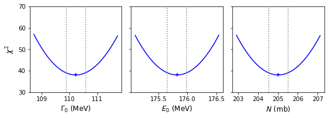
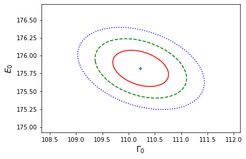
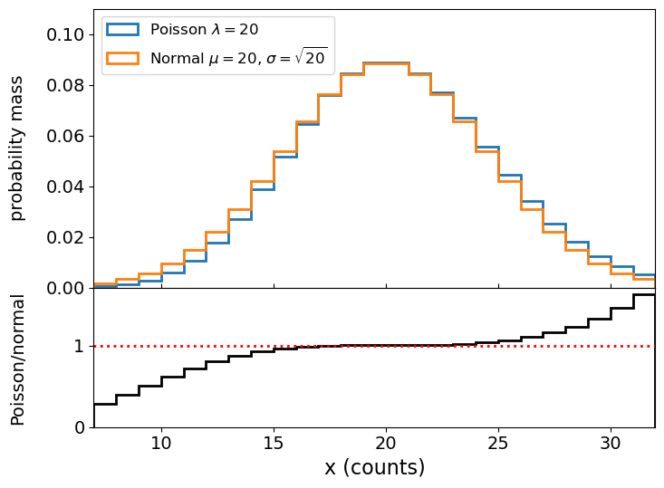
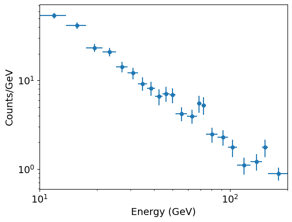

<!-- Just one possible MathJax CDN below. You may use others. -->

In this episode we will be using numpy, as well as matplotlib's plotting library. Scipy contains an extensive range of distributions in its 'scipy.stats' module, so we will also need to import it and we will also make use of scipy's `optimize` and `interpolate` modules. Remember: scipy modules should be installed separately as required - they cannot be called if only scipy is imported.
~~~
import numpy as np
import matplotlib.pyplot as plt
import scipy.stats as sps
import scipy.interpolate as spinterp
import scipy.integrate as spint
import lmfit
~~~
{: .language-python}

> ## Normal distributions in maximum-likelihood estimation: data vs. MLEs
> We should remind ourselves of an important distinction that we made in the previous episode. If the data are normally distributed around their true values, weighted least squares can be used to fit the data and a goodness-of-fit probability can be determined for the fit. If the data are not normally distributed, and cannot be binned up to make it close to normally distributed (see later this episode), then other likelihood statistics should be used, such as the log-likelihood for the distribution that is appropriate for the data. 
>
> However, __the data does not need to be normally distributed in order for the MLEs to be normally distributed__. This may occur for many kinds of data distribution (and corresponding log-likelihood function) and is an expected outcome of the central limit theorem for fitting large data sets. If the MLEs are normally distributed, the covariance matrix (if it can be obtained from the minimisation method) can be used to estimate errors on the MLEs. Also, exact calculations (see following section) may be used to estimate any confidence interval or region for an arbitrary number of model free parameters. The mapping of the likelihood function used to carry out these calculations can also be used to check whether the parameter distribution appears to be normally distributed.
>
> In some cases neither the data nor the MLEs are normally distributed. Or, the parameter space may be too large or complex for any exact calculation of the likelihood. In these situations we should turn to Monte Carlo methods to estimate the goodness of fit and the errors on the MLEs (and perhaps the MLEs themselves). We will turn to this topic in two episodes time.
{: .callout}

## Confidence intervals of normally distributed MLEs

Optimisation methods such as `curve_fit` (alongside several other minimisation algorithms) return the covariance matrix of the fitted parameters together with their MLEs. The variances (diagonal elements) in the covariance matrix can then be used to directly estimate the 1-$$\sigma$$ errors on each MLE, assuming that they are normally distributed. Lmfit also uses this approach to directly infer error bars on the data which are output by the fit report.  

Note however that if the MLEs are not normally distributed, the variances can give an indication of the error but it will not be exact. 

It's also important to bear in mind that the covariance matrix estimated by `curve_fit`, lmfit and other gradient-based minimisation algorithms are estimates obtained from the _Hessian_, i.e. the matrix of 2nd-order partial derivatives of log-likelihood (see above) and as such may also not be exact, even if the MLEs are normally distributed. For these situations, it is possible to numerically evaluate exact confidence intervals and regions for MLEs, under the [__normal approximation__]({{ page.root }}/reference/#normal-approximation), i.e. the assumption that those MLEs are normally distributed. First, consider the log-likelihood for a single model parameter $$\theta$$ with MLE $$\hat{\theta}$$. Assuming that the likelihood is normally distributed we can write the log-likelihood as:

$$L(\theta) = constant - \frac{(\theta - \hat{\theta})^{2}}{2\sigma_{\theta}^{2}}$$ 

Where by definition for a normal distribution, the MLE is the also mean of the distribution and $$\sigma_{\theta}$$ is the standard deviation encompassing $$\simeq 68\%$$ of the probability. Since $$\theta$$ is normally distributed around $$\hat{\theta}$$ with standard deviation $$\sigma_{\theta}$$, the quantity on the right hand side follows a (scaled by $$1/2$$) chi-squared distribution with $$\nu=1$$ degree of freedom, i.e.:

$$\frac{(\theta-\hat{\theta})^{2}}{2\sigma_{\theta}^{2}} \sim \frac{1}{2}\chi^{2}_{1}$$

This means that we can define any confidence interval $$\hat{\theta}\pm\Delta \theta$$ enclosing a probability $$\alpha$$ around $$\hat{\theta}$$  so that:

$$L(\hat{\theta})-L(\hat{\theta}\pm\Delta \theta) = \frac{1}{2}F^{-1}_{\chi^{2}_{1}}(\alpha)$$

where $$F^{-1}_{\chi^{2}_{1}}(\alpha)$$ is the inverse cdf (percent-point function, [__ppf__]({{ page.root }}/reference/#ppf)) for the $$\chi^{2}_{1}$$ distribution. Equivalently for the weighted least squares statistic $$X^{2}$$:

$$X^{2}(\hat{\theta}\pm \Delta \theta)-X^{2}(\hat{\theta}) = F^{-1}_{\chi^{2}_{1}}(\alpha)$$

In practice, this means that to calculate a 1-$$\sigma$$ confidence interval on a single parameter, we must calculate $$L(\theta)$$ vs. $$\theta$$ and find where $$L(\hat{\theta})-L(\theta)=1/2$$ (since $$F^{-1}_{\chi^{2}_{1}}(\alpha)=1$$ for $$\alpha=P(1\sigma)\simeq0.683$$). Or if we are using the weighted-least squares ('chi-squared') statistic, we simply look for $$X^{2}(\hat{\theta}\pm\Delta \theta)-X^{2}(\hat{\theta})=1$$. Thanks to [__Wilks' theorem__]({{ page.root }}/reference/#wilks-theorem) (which we will discuss later, when we consider hypothesis comparison), this approach also works for the case of multiple parameters when we require the confidence interval for an individual parameter. Provided we let the other [__free parameters__]({{ page.root }}/reference/#free-parameter) find their best fits (the MLEs), we can consider the change in log-likelihood or chi-squared as we step through a grid of fixed values for the parameter of interest.

In the approach that follows, we will use this so-called 'brute force' grid search method to calculate individual (1-D) and joint (2-D) confidence intervals for one or two parameters respectively, by defining our own functions for this purpose. Lmfit includes its own methods for these calculations. However, the current lmfit methods are suitable only for finding confidence intervals via weighted-least squares fitting, so they are not appropriate for more general log-likelihood fitting (e.g. of Poisson-distributed data). Therefore we focus first on our own more general approach, which we demonstrate for our Breit-Wigner model fit results from the previous episode, with the programming example below. Before starting, make sure you load the data and the model function from the previous episode.

> ## Programming example: calculating and plotting 1-D confidence intervals
>
> First we must write a function, to run lmfit `minimize` for a grid of fixed values of the parameter we want a confidence interval for. In order to keep one parameter frozen at the grid value, we can edit the Parameters object to change the value to the grid value and freeze it at that value:
> 
> ~~~
> def grid1d_chisqmin(a_name,a_range,a_steps,parm,model,xdata,ydata,yerrs):
>     '''Uses lmfit. Finds best the fit and then carries out chisq minimisation for a 1D grid of fixed 
>        parameters.
>        Input: 
>             a_name - string, name of 'a' parameter (in input Parameters object parm) to use for grid.
>             a_range, a_steps - range (tuple or list) and number of steps for grid.
>             parm - lmfit Parameters object for model to be fitted.
>             model - name of model function to be fitted.
>             xdata, ydata, yerrs - lists of data x, y and y-error arrays (as for the lmf_lsq_resid function)
>         Output: 
>             a_best - best-fitting value for 'a'
>             minchisq - minimum chi-squared (for a_best)
>             a_grid - grid of 'a' values used to obtain fits
>             chisq_grid - grid of chi-squared values corresponding to a_grid'''
>     a_grid = np.linspace(a_range[0],a_range[1],a_steps)
>     chisq_grid = np.zeros(len(a_grid))
>     # First obtain best-fitting value for 'a' and corresponding chi-squared
>     set_function = Minimizer(lmf_lsq_resid, parm, fcn_args=(xdata, ydata, yerrs, model, True),
>                              nan_policy='omit')
>     result = set_function.minimize(method = 'leastsq')
>     minchisq = result.chisqr
>     a_best = result.params.valuesdict()[a_name]
>     # Now fit for each 'a' in the grid, to do so we use the .add() method for the Parameters object
>     # to replace the value of a_name with the value for the grid, setting vary=False to freeze it
>     # so it cannot vary in the fit (only the other parameters will be left to vary)
>     for i, a_val in enumerate(a_grid):
>         parm.add(a_name,value=a_val,vary=False)
>         set_function = Minimizer(lmf_lsq_resid, parm, fcn_args=(xdata, ydata, yerrs, model, True), 
>                                                                 nan_policy='omit')
>         result = set_function.minimize(method = 'leastsq')
>         chisq_grid[i] = result.chisqr
>     return a_best, minchisq, a_grid, chisq_grid 
> ~~~
> {: .language-python}
> 
> To evaluate the confidence intervals as accurately as we can (given our grid spacing), we can create an interpolation function from the grid, which will return the value of a parameter corresponding to a given $$\chi^{2}$$-statistic value. This way we can calculate the interval corresponding to a given $$\Delta \chi^{2}$$ from the minimum value. Since the $$\chi^{2}$$-statistic is symmetric about the minimum, we should consider the lower and upper intervals on either side of the minimum separately:
> 
> ~~~
> def calc_error_chisq(delchisq,a_best,minchisq,a_grid,chisq_grid):
>     '''Function to return upper and lower values of a parameter 'a' for a given delta-chi-squared
>        Input:
>            delchisq - the delta-chi-squared for the confidence interval required (e.g. 1 for 1-sigma error)
>            a_best, minchisq - best-fitting value for 'a' and corresponding chi-squared minimum
>            a_grid, chisq_grid - grid of 'a' and corresponding chi-squared values used for interpolation'''
>     # First interpolate over the grid for values > a_best and find upper interval bound
>     chisq_interp_upper = spinterp.interp1d(chisq_grid[a_grid > a_best],a_grid[a_grid > a_best])
>     a_upper = chisq_interp_upper(minchisq+delchisq)
>     # Interpolate for values <= a_best to find lower interval bound
>     chisq_interp_lower = spinterp.interp1d(chisq_grid[a_grid <= a_best],a_grid[a_grid <= a_best])
>     a_lower = chisq_interp_lower(minchisq+delchisq)  
>     return [a_lower,a_upper]
> ~~~
> {: .language-python}
>
> Now we can implement these functions to calculate and plot the 1-D $$\chi^{2}$$-statistic distribution for each parameter, and calculate and plot the 1-$$\sigma$$ intervals. Try this yourself or look at the solution below.
>
>> ## Solution
>> ~~~
>> model = breitwigner
>> par_names = ['gam0','E0','N'] # Names of parameters in Parameters object
>> n_steps = 1000  # Number of steps in our grids
>> # Ranges for each parameter - should aim for a few times times 1-sigma error estimated from covariance
>> # We can specify by hand or use the values from the original minimize result if available:
>> par_ranges = []
>> for i, par_name in enumerate(par_names):
>>     # range min/max are best-fitting value -/+ four times the estimated 1-sigma error from variances 
>>     # (diagonals of covariance matrix)
>>     par_min = result.params.valuesdict()[par_name] - 4*np.sqrt(result.covar[i,i])
>>     par_max = result.params.valuesdict()[par_name] + 4*np.sqrt(result.covar[i,i])
>>     par_ranges.append([par_min,par_max])
>> #par_ranges = [[109,112],[175,177],[204,206]]   # if specified by hand
>> print("Parameter ranges for grid:",par_ranges)
>> # For convenience when plotting we will store our results in arrays, which we now set up:
>> a_best = np.zeros(len(par_ranges))
>> minchisq = np.zeros(len(par_ranges))
>> a_grid = np.zeros((len(par_ranges),n_steps))
>> chisq_grid = np.zeros((len(par_ranges),n_steps))
>> a_int = np.zeros((len(par_ranges),2))
>> 
>> delchisq = 1.0  # For 1-sigma errors for a single parameter 
>> 
>> # Now do the grid calculation for each parameter:
>> for i, par_range in enumerate(par_ranges):
>>     params = Parameters()
>>     params.add_many(('gam0',30),('E0',130),('N',150))
>>     a_best[i], minchisq[i], a_grid[i,:], chisq_grid[i,:] = grid1d_chisqmin(par_names[i],par_range,n_steps,params,model,
>>                              pion_clean['energy'],pion_clean['xsect'],pion_clean['error'])
>>     a_int[i,:] = calc_error_chisq(delchisq,a_best[i],minchisq[i],a_grid[i,:],chisq_grid[i,:])
>>     # Good presentation of results should round off MLE and errors to an appropriate number
>>     # of decimal places. Here we choose 3 to demonstrate the symmetry of the errors, we 
>>     # could have used 2 decimal places since that is consistent with the size of the error bars
>>     print('MLE '+par_names[i]+':',str(np.round(a_best[i],3)),
>>           'with errors:',str(np.round((a_int[i,:]-a_best[i]),3)))
>> 
>> # Now plot along with a cross to mark the MLE and dotted lines to show the 1-sigma intervals
>> par_xlabels = [r'$\Gamma_{0}$ (MeV)',r'$E_{0}$ (MeV)',r'$N$ (mb)']
>> fig, (ax1, ax2, ax3) = plt.subplots(1,3, figsize=(9,3), sharey=True)
>> fig.subplots_adjust(left=None, bottom=0.2, right=None, top=None, wspace=0.1, hspace=None)
>> for i, ax in enumerate([ax1, ax2, ax3]):
>>     ax.plot(a_grid[i,:],chisq_grid[i,:],color='blue')
>>     ax.scatter(a_best[i],minchisq[i],marker='+',color='blue')
>>     ax.vlines(a_int[i,:],ymin=30,ymax=100,color='gray',linestyle='dotted')
>>     ax.set_xlabel(par_xlabels[i],fontsize=12)
>> ax1.set_ylabel(r'$\chi^{2}$',fontsize=12)
>> ax1.set_ylim(30,70)
>> plt.show()
>> ~~~
>> {: .language-python}
>>
>> ~~~
>> Parameter ranges for grid: [[108.71757041641061, 111.73651025237999], [175.09961457409608, 176.5422151367783], [202.92102931158476, 207.1234726451053]]
>> MLE gam0: 110.227 with errors: [-0.349  0.351]
>> MLE E0: 175.821 with errors: [-0.168  0.167]
>> MLE N: 205.022 with errors: [-0.489  0.49 ]
>> ~~~
>> {: .output}
>>
>> 

>> 
>> 

>>
>> If we compare our calculated 1-$$\sigma$$ confidence intervals with the estimates from the covariance matrix of our original fit, we can see that the match is quite good. Furthermore, the calculated intervals are very close to symmetric, and the plotted distributions of the $$\chi^{2}$$-statistic look like symmetric parabolas, which strongly supports the normal approximation for the likelihood obtained from the Breit-Wigner model fitted to our pion scattering data.
> {: .solution}
{: .challenge}

## Confidence regions for joint distributions of normally distributed MLEs

When fitting models with multiple parameters, we may also want to consider the [__confidence regions__]({{ page.root }}/reference/#confidence-region) for the joint distributions of our MLEs, not just the individual MLE confidence intervals, which require us to consider more than the variances, which correspond only to the marginalised distributions of each parameter. For likelihood distributions which are multivariate normal (i.e. the normal approximation applies), we can use an extension of the method for a single parameter described above.

If the MLEs are multivariate normally distributed, the likelihood is:

$$p(\boldsymbol{\theta}\vert \boldsymbol{\hat{\theta}}, \mathbf{\Sigma}) =  \frac{\exp\left(-\frac{1}{2}(\boldsymbol{\theta}-\boldsymbol{\hat{\theta}})^{\mathrm{T}} \mathbf{\Sigma}^{-1}(\boldsymbol{\theta}-\boldsymbol{\hat{\theta}})\right)}{\sqrt{(2\pi)^{k}\lvert\mathbf{\Sigma}\rvert}}$$

where bold symbols denote vectors and matrices: $$\boldsymbol{\theta}$$ and $$\boldsymbol{\hat{\theta}}$$ are $$k$$-dimensional column vectors of the parameter values and their MLEs (with $$\mathrm{T}$$ denoting the transpose) and $$\mathbf{\Sigma}$$ is the distribution covariance matrix. Taking the log-likelihood:

$$L(\boldsymbol{\theta})= constant -\frac{1}{2}(\boldsymbol{\theta}-\boldsymbol{\hat{\theta}})^{\mathrm{T}} \mathbf{\Sigma}^{-1}(\boldsymbol{\theta}-\boldsymbol{\hat{\theta}})$$

and it can be shown that:

$$(\boldsymbol{\theta}-\boldsymbol{\hat{\theta}})^{\mathrm{T}} \mathbf{\Sigma}^{-1}(\boldsymbol{\theta}-\boldsymbol{\hat{\theta}}) \sim \chi^{2}_{k}$$

so that for a $$k$$-dimensional confidence region enclosing a probability $$\alpha$$ around $$\boldsymbol{\hat{\theta}}$$:

$$L(\boldsymbol{\hat{\theta}})-L(\boldsymbol{\hat{\theta}}\pm\boldsymbol{\Delta \theta}) = \frac{1}{2}F^{-1}_{\chi^{2}_{k}}(\alpha)$$

where $$F^{-1}_{\chi^{2}_{k}}(\alpha)$$ is now the inverse cdf (percent-point function, [__ppf__]({{ page.root }}/reference/#ppf)) for the $$\chi^{2}_{k}$$ distribution, i.e. the $$\chi^{2}$$ distribution with $$\nu=k$$ degrees of freedom. Equivalently for the weighted least squares statistic $$X^{2}$$:

$$X^{2}(\boldsymbol{\hat{\theta}}\pm \boldsymbol{\Delta \theta})-X^{2}(\boldsymbol{\hat{\theta}}) = F^{-1}_{\chi^{2}_{k}}(\alpha)$$

Note that the $$k$$ corresponds to the number of parameters we would like to show a joint confidence region for. The remaining _free_parameters_ which are left to find their best fits do not count (they are effectively marginalised over by the process, according to Wilks' theorem). To demonstrate how this works, we show the construction of a 2-D confidence region for the Breit-Wigner model using a 2-D grid calculation below:

>## Programming example: 2-D confidence regions and contour plot
> First we define a new function which is the 2-D equivalent of our previous function for calculating 1-D confidence intervals.
> 
> ~~~
> def grid2d_chisqmin(ab_names,ab_range,ab_steps,parm,model,xdata,ydata,yerrs):
>     '''Finds best fit and then carries out chisq minimisation for a 1D grid of fixed parameters.
>        Input: 
>             ab_names - tuple/list with names of 'a' and 'b' parameter (in input list parm) to use for grid.
>             ab_range, ab_steps - range (nested tuple or list) and list/tuple with number of steps for grid
>                 for parameters a and b.
>             parm - lmfit Parameters object for model to be fitted.
>             model - name of model function to be fitted.
>             xval, dyval, dy - data x, y and y-error arrays
>         Output: 
>             ab_best - list of best-fitting values for a and b.
>             minchisq - minimum chi-squared (for ab_best)
>             a_grid, b_grid - grids of 'a' and 'b' values used to obtain fits
>             chisq_grid - 2-D grid of chi-squared values corresponding to ab_grid'''
>     a_grid = np.linspace(ab_range[0][0],ab_range[0][1],ab_steps[0])
>     b_grid = np.linspace(ab_range[1][0],ab_range[1][1],ab_steps[1])
>     chisq_grid = np.zeros((len(a_grid),len(b_grid)))
>     # First obtain best-fitting values for a and b and corresponding chi-squared
>     set_function = Minimizer(lmf_lsq_resid, parm, fcn_args=(xdata, ydata, yerrs, model, True),
>                              nan_policy='omit')
>     result = set_function.minimize(method = 'leastsq')
>     minchisq = result.chisqr
>     ab_best = [result.params.valuesdict()[ab_names[0]],result.params.valuesdict()[ab_names[1]]]
>     # Now fit for each a and b in the grid, to do so we use the .add() method for the Parameters object
>     # to replace the value of a_name, b_name with the values for that point in the grid, setting vary=False to
>     # freeze them so they cannot vary in the fit (only the other parameters will be left to vary)
>     for i, a_val in enumerate(a_grid):
>         parm.add(ab_names[0],value=a_val,vary=False)
>         for j, b_val in enumerate(b_grid):
>             parm.add(ab_names[1],value=b_val,vary=False)
>             set_function = Minimizer(lmf_lsq_resid, parm, fcn_args=(xdata, ydata, yerrs, model, True), 
>                                                                 nan_policy='omit')
>             result = set_function.minimize(method = 'leastsq')
>             chisq_grid[i,j] = result.chisqr    
>         print(str((i+1)*len(b_grid))+' out of '+str(len(a_grid)*len(b_grid))+' grid-points calculated')
>     return ab_best, minchisq, a_grid, b_grid, chisq_grid 
> ~~~
> {: .language-python}
>
> As an example, we calculate the 2-D grid of $$\chi^{2}$$-statistic values for the width $$\Gamma_{0}$$ and resonant energy $$E_{0}$$, with 100 grid points for each parameter, so we calculate for 10000 pairs of grid points in total.
> 
> ~~~
> model = breitwigner
> params = Parameters()
> params.add_many(('gam0',30),('E0',130),('N',150))
> par_names = ['gam0','E0'] # Names of parameters for grid search
> par_steps = [100,100]  # Number of steps in our grids
> # Ranges for each parameter - should aim for a few times times 1-sigma error estimated from covariance
> # We can specify by hand or use the values from the original minimize result if available:
> par_ranges = []
> for i, par_name in enumerate(par_names):
>     # range min/max are best-fitting value -/+ five times the estimated 1-sigma error from variances 
>     # (diagonals of covariance matrix)
>     par_min = result.params.valuesdict()[par_name] - 5*np.sqrt(result.covar[i,i])
>     par_max = result.params.valuesdict()[par_name] + 5*np.sqrt(result.covar[i,i])
>     par_ranges.append([par_min,par_max])
> #par_ranges = [[109,112],[175,177]]   # if specified by hand
> print("Parameter ranges for grid:",par_ranges)
> 
> ab_best, minchisq, a_grid, b_grid, chisq_grid  = grid2d_chisqmin(par_names,par_ranges,par_steps,
>                     params,model,pion_clean['energy'],pion_clean['xsect'],pion_clean['error'])
> ~~~
> {: .language-python}
>
> The main use of a 2-D calculation is to be able to plot confidence contours for the model parameters. To do so we need to determine what the appropriate contour levels are. We define these as passing through constant values of $$X^{2}_{i}(\Gamma_{0},E_{0})$$ such that:
>
> $$X^{2}_{i}(\Gamma_{0},E_{0}) = X^{2}(\hat{\Gamma}_{0},\hat{E}_{0})+F^{-1}_{\chi^{2}_{2}}(\alpha_{i}),$$
> 
> where $$X^{2}(\hat{\Gamma}_{0},\hat{E}_{0})$$ is the minimum (best-fit) weighted least squares statistic, corresponding to the MLEs, and $$\alpha_{i}$$ is the required $$i$$th confidence level. In the example below, we show the 1, 2 and 3-$$\sigma$$ confidence. contours. Note that they differ from the projection of the corresponding 1-D contours, since the latter correspond to the marginal distributions of the parameters.
>
> ~~~
> # Determine the chisq_2 values which contain 1, 2 and 3-sigma regions:
> del1 = sps.chi2.isf(2*sps.norm.sf(1),df=2)
> del2 = sps.chi2.isf(2*sps.norm.sf(2),df=2)
> del3 = sps.chi2.isf(2*sps.norm.sf(3),df=2)
> 
> print("1, 2, 3-sigma contours correspond to delta-chisq =",del1,del2,del3)
> 
> # Now plot the contours, including a cross to mark the location of the MLEs
> # First we assign all three variables to their own 2D arrays:
> X, Y = np.meshgrid(a_grid,b_grid,indexing='ij')
> Z = chisq_grid
> levels = [minchisq+del1, minchisq+del2, minchisq+del3] # plots the 1, 2 and 3-sigma
> # confidence contours
> plt.figure()
> plt.contour(X, Y, Z, levels, colors=('r', 'g', 'b'), linestyles=('solid','dashed','dotted'))
> plt.scatter(*ab_best, marker="+")
> plt.xlabel(r'$\Gamma_{0}$', fontsize=14)
> plt.ylabel(r'$E_{0}$', fontsize=14)
> plt.show()
> ~~~
> {: .language-python}
> ~~~
> 1, 2, 3-sigma contours correspond to delta-chisq = 2.295748928898636 6.180074306244174 11.82915808190081
> ~~~
> {: .output}
> 

> 
> 

>
{: .challenge}

## Binned Poisson event data

So far we have considered fitting models to data consisting of pairs of $$x$$ and $$y$$ values (and errors on the $$y$$ values), which commonly arise from experimental measurements of some quantity vs. an explanatory ($$x$$-axis) variable, such as measurements of pion-proton scattering cross-section vs. the pion beam energy. It is often the case however that we measure a sample of univariate data and we would like to model its distribution. Common examples include distributions of some variable drawn from an underlying population, such as the masses of stars in a cluster.  Another very common type of univariate data is when we obtain a _spectrum_, e.g. recording photon or particle event energies in a detector.  To constrain and model the shape of these distributions, it is common to make a [__histogram__]({{ page.root }}/reference/#histogram) of the data. 

Consider a single event $$X$$ which is an outcome of a single draw from a probability xdistribution $$p(x\vert \boldsymbol{\theta})$$, where $$\boldsymbol{\theta}$$ is the vector of parameters of the distribution. The event will occur in a bin with central value $$x=\epsilon_{i}$$ and width $$\Delta_{i}$$ with probability:

$$P_{i} = P(\epsilon_{i}-\Delta_{i}/2 \leq X \leq \epsilon_{i}+\Delta_{i}/2) = \int^{\epsilon_{i}+\Delta_{i}/2}_{\epsilon_{i}-\Delta_{i}/2} p(x)\mathrm{d}x$$

Assuming that the events are independent, Poisson events, then for a given mean total event rate in a fixed nterval, $$\lambda_{\rm total}$$, we expect that the mean rate in a given bin will be $$\lambda_{i} = P_{i}\lambda_{\rm total}$$. Since the events are independent, the number of counts in the bin $$n_{i}$$ will also be Poisson-distributed with rate parameter $$\lambda_{i}$$. Another way to look at this is that the bins also count as intervals, or could be considered as sub-intervals within the wider interval (in energy and/or time) which the total counts are sampled in.

## Fitting binned Poisson event data using weighted least-squares

Having seen that the counts in a bin is Poisson distributed, and that we can calculate the expected rate by integrating the distribution over the bin, we can consider two approaches to fitting the data The first is to use weighted-least squares, for which we must ensure that the data in each bin are close to normally distributed. The central limit theorem enables this provided the number of counts is large enough. For example, comparing the distribution for $$\lambda=20$$ with that of a normal distribution with the same mean ($$\mu=20$$) and variance ($$\sigma^{2}=20$$):

We can see that the distributions are very close in their centres and deviate for values $$\vert x-\lambda \vert > \sigma$$. For this reason, a minimum of 20 counts per bin is used as standard in fields which work with binned photon event data, such as X-ray astronomy, but you can also be more conservative and choose a larger minimum counts/bin, to ensure that the data are even closer to being normally distributed.

> ## Programming example: binning a photon count spectrum
> The file `photon_energies.txt` (see [here][plphoton_data]) contains a list of 1054 measured photon energies simulated to represent a power-law distributed spectrum typical of those obtained by high-energy photon detectors from astronomical sources or particle colliders (if the photons are 'events').  The energies themselves are arbitrary here, real detectors might cover ranges of keV, MeV or even GeV or higher. For our investigation we will assume that the energies are in GeV and that the detector is sensitive to energies from 10-200 GeV, such that photons outside this range are not detected.
>
> To help us bin the spectrum we will first define a function that will rebin a histogram to a given minimum counts per bin:
> 
> ~~~
> def histrebin(mininbin,counts,edges):
>     '''Takes as input a minimum counts per bin and a histogram counts and bin edges, and combines 
>        adjacent histogram bins as needed so that no bin has less than the required minimum.
>        Inputs:
>            mininbin - required minimum counts/bin.
>            counts, edges - input histogram counts/bin and bin edges arrays.
>        Outputs:
>            counts2, edges2 - rebinned counts/bin and bin edges arrays'''
>     edges2=np.zeros(1)
>     counts2=np.zeros(1)
>     i=0
>     countsum=0
>     firstbin_flag = 1
>     edges2[0]=edges[0]
>     for x in counts:
>         countsum=countsum+x
>         i=i+1
>         if countsum >= mininbin and (sum(counts[i:]) >= mininbin or i == len(counts)):  # The sum over counts in 
>             # remaining bins ensures that we are not left with a bin with counts less than our limit at the end.
>             if firstbin_flag == 1: # if this is the first bin satisfying our requirement, 
>                 # do not append but replace bin 0 with countsum
>                 counts2[0]=countsum
>                 firstbin_flag = 0 # now we read the first bin we can switch this off
>             else:
>                 counts2=np.append(counts2,countsum)
>             edges2=np.append(edges2,edges[i])
>             countsum=0        
>     return counts2, edges2
> ~~~
> {: .language-python}
>
> Now load the data and make a histogram of it, then rebin your histogram to a minimum of 20 counts/bin. Then plot your data points using `plt.errorbar` with the $$x$$-values given by the bin centres with $$x$$ errorbars corresponding to half the bin width, the $$y$$-values given by the count densities (counts/bin divided by the bin width) and appropriate 1-$$\sigma$$ errors calculated for the count densities as $$y$$-errors. Note that plotting the data using data points with errors will make the comparison with the models clearer, as we will use a stepped histogram style for plotting the models to compare with the data.
> 
>> ## Solution
>> There are a few important points to take account of here:
>> 
>> - Non-detections of counts in bins also counts as data, so always make sure you use the entire range that the data can be sampled over (i.e. even if the events are not detected over the whole range) to define the range used for binning. This is 10-200 GeV in this example.
>> - The errors correspond to the Poisson standard deviation $$\sqrt{\lambda}$$ which for counts $$n$$ can be taken as $$\sqrt{n}$$ (since the observed counts in an interval is an unbiased estimator of $$\lambda$$).
>> - When plotting data which follow a power-law or power-law-like distribution, it is usually best to plot against logarithmic $$x$$ and $$y$$ axis scales. This means that the power-law shape appears as a straight line and any deviations from it can be more easily seen.
>> 
>> ~~~
>> #  First read in the data.  This is a simple (single-column) list of energies:
>> photens = np.genfromtxt('photon_energies.txt')
>> 
>> # Now we make our unbinned histogram.  We can keep the initial number of bins relatively large.
>> emin, emax = 10., 200.   # We should always use the known values that the data are sampled over 
>>                          # for the range used for the bins!
>> nbins = 50
>> counts, edges = np.histogram(photens, bins=nbins, range=[emin,emax], density=False)
>> 
>> # And now we use our new function to rebin so there are at least mincounts counts per bin:
>> mincounts = 20  # Here we set it to our minimum requirement of 20, but in principle you could set it higher
>> counts2, edges2 = histrebin(mincounts,counts,edges)
>> 
>> bwidths = np.diff(edges2) # calculates the width of each bin
>> cdens = counts2/bwidths # determines the count densities
>> cdens_err = np.sqrt(counts2)/bwidths # calculate the errors: remember the error is based on the counts, 
>> # not the count density, so we have to also apply the same normalisation.
>> energies = (edges2[:-1]+edges2[1:])/2.  # This calculates the energy bin centres
>> # Now plot the data - use a log-log scale since we are plotting a power-law
>> plt.figure()
>> plt.errorbar(energies, cdens, xerr=bwidths/2., yerr=cdens_err, fmt='o')
>> plt.xlabel("Energy (GeV)", fontsize=16)
>> plt.ylabel("Counts/GeV", fontsize=16)
>> plt.tick_params(labelsize=14)
>> plt.yscale('log')
>> plt.xscale('log')
>> plt.xlim(10.0,200.0)
>> plt.show()               
>> ~~~
>> {: .language-python}
>> 

>> 
>> 

>>
> {: .solution}
{: .challenge}

Now we have 'binned up' our data with at least 20 counts/bin we are ready to fit a model to it, using a weighted least-squares method such as the approach we have been using with lmfit. However, before we do so, we must remember that the expected Poisson rate parameter for the bin, which is our model estimate for the number of counts, is:

$$\lambda_{i} = \lambda_{\rm total} \int^{\epsilon_{i}+\Delta_{i}/2}_{\epsilon_{i}-\Delta_{i}/2} p(E)\mathrm{d}E$$

where we have now replaced the variable $$x$$ with energy $$E$$, specific to our data,  $$\lambda_{\rm total}$$ is the rate parameter for the total counts (the complete energy range) and the term in the integral is the probability of an event occuring in the energy bin covering the range $$\epsilon_{i}\pm\Delta_{i}/2$$.  We can subsume $$\lambda_{\rm total}$$ and the normalisation of our distribution $$p(E)$$ into a single normalisation constant which can be one of our model parameters.  But we also need to integrate our model function over each energy bin to obtain the counts predicted by the model for that bin, so we can fit the data. There are several ways to do this:  
1.  The indefinite integral function may be calculated explicitly and used directly as the model function.  This is easy to do for a simple function such as a power-law, but may be difficult for more complicated or challenging functions. 
2.  Python offers numerical methods to calculate the definite integral for a given function (e.g. in `scipy.integrate`).
3.  If you are fitting a model which is itself a statistical distribution in Python, you could use the cdf of the distribution to determine the integral between two values.  Note that in this case you may have to scale the distribution accordingly, to match your spectrum (e.g. the integral of the pdf would no longer be 1.0, but would be the total number of counts in the spectrum).

To allow for fitting binned data in lmfit, while keeping the model format unchanged, we can create a new function to calculate for any given model $$y_{\rm mod}(x)$$ the average counts density per bin (i.e. model integrated over the bin and then divided by bin width). We will also create a new version of our lmfit objective function which uses this new model integration function.

~~~
def model_bin(xbins, model, params):
    '''General function for integrating the input model over bins defined by contiguous (no gaps) 
        bin edges, xbins.
       Inputs:
           xbins - x bin edges.
           model, params - the model name and associated Parameters object.
       Outputs:
           ymod - calculated counts-density model values for y-axis.'''
    i = 0
    ymod = np.zeros(len(xbins)-1)
    for i, xval in enumerate(xbins[:-1]):
        ymod[i], ymoderr = spint.quad(lambda x: model(x, params),xbins[i],xbins[i+1])
        ymod[i] = ymod[i]/(xbins[i+1]-xbins[i])  # we now divide by the bin width to match the counts density
        # units of our data
    return ymod

def lmf_lsq_binresid(params,xdata,ydata,yerrs,model,output_resid=True):
    '''lmfit objective function to calculate and return residual array or model y-values for
        binned data where the xdata are the input bin edges and ydata are the densities (integral over bin
        divided by bin width).
        Inputs: params - name of lmfit Parameters object set up for the fit.
                xdata, ydata, yerrs - lists of 1-D arrays of x (must be bin edges not bin centres) 
                and y data and y-errors to be fitted.
                    E.g. for 2 data sets to be fitted simultaneously:
                        xdata = [x1,x2], ydata = [y1,y2], yerrs = [err1,err2], where x1, y1, err1
                        and x2, y2, err2 are the 'data', sets of 1-d arrays of length n1 (n1+1 for x2
                        since it is bin edges), n2 (n2+1 for x2) respectively, 
                        where n1 does not need to equal n2.
                    Note that a single data set should also be given via a list, i.e. xdata = [x1],...
                model - the name of the model function to be used (must take params as its input params and
                        return the model y-value array for a given x-value array).
                output_resid - Boolean set to True if the lmfit objective function (residuals) is
                        required output, otherwise a list of model y-value arrays (corresponding to the 
                        input x-data list) is returned.
        Output: if output_resid==True, returns a residual array of (y_i-y_model(x_i))/yerr_i which is
            concatenated into a single array for all input data errors (i.e. length is n1+n2 in 
            the example above). If output_resid==False, returns a list of y-model arrays (one per input x-array)'''
    if output_resid == True:
        for i, xvals in enumerate(xdata):  # loop through each input dataset and record residual array
            if i == 0:
                resid = (ydata[i]-model_bin(xdata[i],model,params))/yerrs[i]
            else:
                resid = np.append(resid,(ydata[i]-model_bin(xdata[i],model,params))/yerrs[i])
        return resid
    else:
        ymodel = []
        for i, xvals in enumerate(xdata): # record list of model y-value arrays, one per input dataset
            ymodel.append(model_bin(xdata[i],model,params))
        return ymodel
~~~
{: .language-python}

To fit the data, we next define a power-law model function and Parameters object with starting values:

~~~
def pl_model(x, params):
    '''Simple power-law function.
       Inputs:
           x - input x value(s) (can be list or single value).
           params - lmfit Parameters object: PL normalisation (at x = 1) and power-law index.'''
    v = params.valuesdict()
    return v['N'] * x**v['gamma']

params = Parameters()
params.add_many(('N',2500),('gamma',-1.5))
~~~
{: .language-python}

Next we set up our `Minimizer` function and input parameters. The approach is the same as for our previous Breit-Wigner model fit, with the data included in lists as required by our objective function. In addition to printing the fit report, we will also print out the chi-squared and degrees-of-freedom along with the corresponding goodness of it.

~~~
model = pl_model
output_resid = True
xdata = [edges2]
ydata = [cdens]
yerrs = [cdens_err]
set_function = Minimizer(lmf_lsq_binresid, params, fcn_args=(xdata, ydata, yerrs, model, output_resid),nan_policy='omit')
result = set_function.minimize(method = 'leastsq')
report_fit(result)
print("Minimum Chi-squared = "+str(result.chisqr)+" for "+str(result.nfree)+" d.o.f.")
print("The goodness of fit is: ",sps.chi2.sf(result.chisqr,df=result.nfree))
~~~
{: .language-python}
~~~
[[Fit Statistics]]
    # fitting method   = leastsq
    # function evals   = 13
    # data points      = 22
    # variables        = 2
    chi-square         = 20.6520859
    reduced chi-square = 1.03260429
    Akaike info crit   = 2.60902520
    Bayesian info crit = 4.79111011
[[Variables]]
    N:      2695.86051 +/- 372.233648 (13.81%) (init = 2500)
    gamma: -1.57250939 +/- 0.03962710 (2.52%) (init = -1.5)
[[Correlations]] (unreported correlations are < 0.100)
    C(N, gamma) = -0.973
Minimum Chi-squared = 20.65208589188919 for 20 d.o.f.
The goodness of fit is:  0.41785865938157196
~~~
{: .output}

A good fit is obtained! It's interesting to note that the power-law index and the power-law normalisation are very strongly (anti-)correlated. This is typical for models which fit steep slopes to the data, since a change in the slope will lead to a compensating change in the normalisation to maintain a reasonable fit to the data (one way to think about this is that the model 'pivots' around the average $$x$$ and $$y$$ values of the data which hold the model in place there).

If we plot our best-fitting model against the data, we can make a better-informed judgement about whether it is a good fit and whether there are any features in the data which the model cannot explain. To compare our best-fitting model with the data, it is useful to plot the model as a stepped histogram function. To do this we need to make use of the `weights` parameter of `plt.hist`, so that we can give the histogram function a bespoke set of $$y$$-values for the histogram plot. We also compare the model to data by plotting the data/model ratio. For a model with a large dynamic range of $$y$$-axis values such as a power-law, the deviations of the data from the model are best shown as a ratio, as absolute differences would be dominated by the values where $$y$$ is largest.

~~~
def plot_spec_model(ebins,cdens,cdens_err,cdens_model):
    '''Plot the binned (GeV) spectrum with the model as a histogram, and 
       data/model residuals.
       Inputs:
           ebins - energy bin edges.
           cdens, cdens_err - counts density and its error.
           cdens_model - model counts density.'''
    energies = (ebins[1:]+ebins[:-1])/2
    bwidths = np.diff(ebins)
    fig, (ax1, ax2) = plt.subplots(2,1, figsize=(8,6),sharex=True,gridspec_kw={'height_ratios':[2,1]})
    fig.subplots_adjust(hspace=0)
    ax1.errorbar(energies, cdens, xerr=bwidths/2., yerr=cdens_err, fmt='o')
    model_hist, edges, patches = ax1.hist(energies, bins=ebins, weights=cdens_model, 
                                      density=False, histtype='step')
    ax2.errorbar(energies, cdens/cdens_model, xerr=bwidths/2., yerr=cdens_err/cdens_model, fmt='o')
    ax2.set_xlabel("Energy (GeV)", fontsize=16)
    ax1.set_ylabel("Counts/Gev", fontsize=14)
    ax2.set_ylabel("data/model", fontsize=14)
    ax2.axhline(1.0, color='r', linestyle='dotted', lw=2) 
    ax1.tick_params(labelsize=14)
    ax1.tick_params(axis="x",direction="in",which="both", length=4)
    ax2.tick_params(axis="x",which="both", length=4)
    ax2.tick_params(labelsize=14)
    ax1.set_yscale('log')
    ax1.set_xscale('log')
    ax2.set_xscale('log')
    ax1.get_yaxis().set_label_coords(-0.12,0.5)
    ax2.get_yaxis().set_label_coords(-0.12,0.5)
    ax2.set_xlim(ebins[0],ebins[-1]) # Strictly speaking we should only show the energy range 
    # where data is sampled, to avoid impression from model that the flux suddenly drops 
    # at the boundaries.
    plt.show()

# To calculate the best-fitting model values, use the parameters of the best fit output
# from the fit, result.params and set output_resid=false to output a list of model y-values:
model_vals = lmf_lsq_binresid(result.params,xdata,ydata,yerrs,model,output_resid=False)
# Now plot the data and model and residuals
# The plotting function we defined takes the array of model values, so we must
# specify the index for the model_vals list, to provide this array
plot_spec_model(edges2,cdens,cdens_err,model_vals[0]) 
~~~
{: .language-python}

We could go further and calculate the confidence intervals and plot confidence contours using the modified version of the model for binned data, but we will leave this as an exercise for the reader.

## Fitting binned Poisson event data using a Poisson likelihood function

In some cases when we are modelling data as counts in bins, we may not want to rebin our data to achieve at least 20 counts per bin.  Perhaps we don't have sufficient counts to bin up, or we want to preserve the resolution of our data to take the opportunity to look for narrow features at energies where the counts are sparse (such features may be smeared out if we use wide bins, but could be significant if several counts appear close together in energy).  Or perhaps we don't care about getting a goodness-of-fit and therefore don't want to use weighted-least-squares as our likelihood statistic.  In these cases an alternative option will be to use the Poisson distribution to generate our likelihood function, so we do not care whether there are sufficient counts in a bin (or even if the bins are empty: with a Poisson distribution having zero counts in a bin is possible for small rate parameters and therefore conveys useful information!).

In situations where data are not normally distributed (about the 'true' value), weighted least squares is not appropriate to fit the data, but we can directly maximise the log-likelihood instead, or equivalently, minimise the negative log-likelihood. This approach can be used for Poisson data, as well as for other situations where the data are not normally distributed. For Poisson counts data, that means we must integrate over the data bins inside the log-likelihood function. In lmfit, we need to change the objective function to return the summed negative log-likelihood for our data conditional on the model. This is a scalar quantity so we also need to change the `Minimizer` method to `scalar_minimize`, which uses Nelder-Mead optimisation as the default (but can be changed to other methods). Note that since the Poisson likelihood compares the observed and model-predicted _counts_ (not count density), we need to be careful to give the data to the function in those units. For plotting purposes however, we could still plot counts density using our original plotting function with the non-rebinned histograms and the corresponding model.

We first define a function to calculate the summed negative log-likelihood, using the `logpmf` method which is more accurate and reliable than determining the pmf and then separately taking the log. Then we define a new version of our lmfit objective function (for binned data), to return the summed negative log-likelihood for the input dataset(s).

~~~
def LogLikelihood_Pois(model_counts, counts): 
    '''Calculate the negative Poisson log-likelihood for a model vs counts data. 
       Inputs:
           model_counts - array of predicted model counts per bin
           counts - data: observed counts per bin.
        Outputs: the negative Poisson log-likelihood'''
    pd = sps.poisson(model_counts) #we define our Poisson distribution
    return -1*np.sum(pd.logpmf(counts))

def lmf_poissll(params,xdata,ydata,model,output_ll=True):
    '''lmfit objective function to calculate and return total negative Poisson log-likelihood or model 
        y-values for binned data where the xdata are the contiguous (i.e. no gaps) input bin edges and 
        ydata are the counts (not count densities) per bin.
        Inputs: params - name of lmfit Parameters object set up for the fit.
                xdata, ydata - lists of 1-D arrays of x (must be bin edges not bin centres) 
                and y data and y-errors to be fitted.
                    E.g. for 2 data sets to be fitted simultaneously:
                        xdata = [x1,x2], ydata = [y1,y2], yerrs = [err1,err2], where x1, y1, err1
                        and x2, y2, err2 are the 'data', sets of 1-d arrays of length n1 (n1+1 for x2
                        since it is bin edges), n2 (n2+1 for x2) respectively, 
                        where n1 does not need to equal n2.
                    Note that a single data set should also be given via a list, i.e. xdata = [x1],...
                model - the name of the model function to be used (must take params as its input params and
                        return the model y counts density array for a given x-value array).
                output_resid - Boolean set to True if the lmfit objective function (total -ve 
                        log-likelihood) is required output, otherwise a list of model y-value arrays 
                        (corresponding to the input x-data list) is returned.
        Output: if output_resid==True, returns the total negative log-likelihood. If output_resid==False, 
                returns a list of y-model counts density arrays (one per input x-array)'''
    if output_ll == True:
        poissll = 0
        for i, xvals in enumerate(xdata):  # loop through each input dataset to sum negative log-likelihood
                # We can re-use our model binning function here, but the model then needs to be converted into 
                # counts units from counts density, by multiplying by the bin widths
                ymodel = model_bin(xdata[i],model,params)*np.diff(xdata[i])
                # Then obtain negative Poisson log-likelihood for data (in counts units) vs the model 
                poissll = poissll + LogLikelihood_Pois(ymodel,ydata[i])
        return poissll
    else:
        ymodel = []
        for i, xvals in enumerate(xdata): # record list of model y-value arrays, one per input dataset
            ymodel.append(model_bin(xdata[i],model,params))
        return ymodel
~~~
{: .language-python}

We now run the model on our data without rebinning (i.e. using the original `edges` and `counts` arrays). Note that we use the counts array rather than count densities. The chi-squared in the fit report does not mean anything for Poisson data, but we can use `report.residual` to output the best-fitting result of the objective function, multiplying by -1 to give the log-likelihood. Note that without the renormalisation in Bayes' formula the log-likelihood does not tell us much about how well the model is described by the data. However, differences in log-likelihood can still be used to calculate confidence intervals, and for setting limits and hypothesis testing (see next episode).

~~~
params = Parameters()
params.add_many(('N',2500),('gamma',-1.5))
params.add('gamma',value=-1.5,vary=True)
model = pl_model
output_ll = True
xdata = [edges]
ydata = [counts]
set_function = Minimizer(lmf_poissll, params, fcn_args=(xdata, ydata, model, output_ll),
                         nan_policy='omit',calc_covar=True)
result = set_function.scalar_minimize(method='Nelder-Mead') # We specify the method for completeness, 
                                                            # but Nelder-Mead is the default
report_fit(result)
print("Summed log-likelihood = ",-1*result.residual)
~~~
{: .language-python}

~~~
[[Fit Statistics]]
    # fitting method   = Nelder-Mead
    # function evals   = 108
    # data points      = 1
    # variables        = 2
    chi-square         = 15950.0258
    reduced chi-square = 15950.0258
    Akaike info crit   = 13.6772157
    Bayesian info crit = 9.67721572
##  Warning: uncertainties could not be estimated:
[[Variables]]
    N:      2555.59555 (init = 2500)
    gamma: -1.55096712 (init = -1.5)
Summed log-likelihood =  [-126.2934115]
~~~
{: .output}

Comparison with the results for the binned-up histogram fitted with weighted least squares shows agreement within the errors, although the MLEs are not identical. This is not surprising since the data values and assumptions going into each fit are different.

Unfortunately, although the Hessian (and covariance matrix) could in principle be calculated by the fit, lmfit does not yet have this functionality for a scalar output from the objective function. Therefore we cannot estimate errors from the initial fit like we can with weighted least squares in lmfit. We should instead calculate them directly using brute force grid search, which you can attempt in the programming challenge which follows.

> ## Programming challenge: confidence regions for Poisson event data
>
> Now use the data in `photon_energies.txt` provided for this episode, with weighted least-squares to calculate 1-D and 2-D confidence regions on the power-law MLEs, plotting your results as for the Breit-Wigner example for non-binned data above. Then repeat this exercise for the unbinned histogram with Poisson likelihood function, and compare your confidence regions to see if the two approaches to the data give similar results.  Remember that the log-likelihood and the weighted least squares statistic are simply related, such that the confidence intervals for log-likelihood correspond to a change in negative log-likelihood equal to half the corresponding change for the weighted least squares statistic! 
> 
{: .challenge}

[plphoton_data]: https://github.com/philuttley/statistical-inference/tree/gh-pages/data/photon_energies.txt



