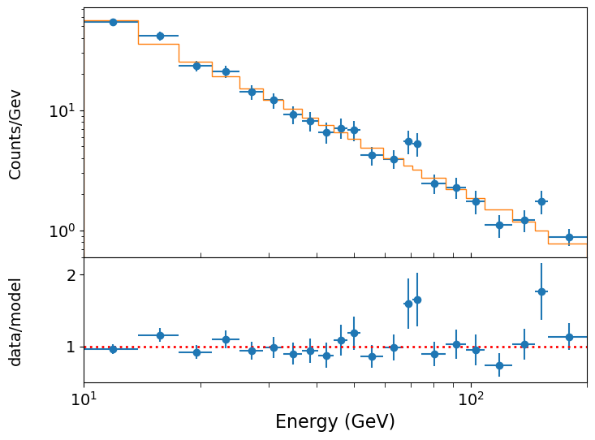

<!-- Just one possible MathJax CDN below. You may use others. -->

In this episode we will be using numpy, as well as matplotlib's plotting library. Scipy contains an extensive range of distributions in its 'scipy.stats' module, so we will also need to import it and we will also make use of scipy's `optimize` and `interpolate` modules. Remember: scipy modules should be installed separately as required - they cannot be called if only scipy is imported.
~~~
import numpy as np
import matplotlib.pyplot as plt
import scipy.stats as sps
import scipy.optimize as spopt
import scipy.interpolate as spinterp
~~~
{: .language-python}

> ## Normal distributions in maximum-likelihood estimation: data vs. MLEs
> We should remind ourselves of an important distinction that we made in the previous episode. If the data are normally distributed around their true values, weighted least squares can be used to fit the data and a goodness-of-fit probability can be determined for the fit. If the data are not normally distributed, and cannot be binned up to make it close to normally distributed (see later this episode), then other likelihood statistics should be used, such as the log-likelihood for the distribution that is appropriate for the data. 
>
> However, __the data does not need to be normally distributed in order for the MLEs to be normally distributed__. This may occur for many kinds of data distribution (and corresponding log-likelihood function) and is an expected outcome of the central limit theorem for fitting large data sets. If the MLEs are normally distributed, the covariance matrix (if it can be obtained from the minimisation method) can be used to estimate errors on the MLEs. Also, exact calculations (see following section) may be used to estimate any confidence interval or region for an arbitrary number of model free parameters. The mapping of the likelihood function used to carry out these calculations can also be used to check whether the parameter distribution appears to be normally distributed.
>
> In some cases neither the data nor the MLEs are normally distributed. Or, the parameter space may be too large or complex for any exact calculation of the likelihood. In these situations we should turn to Monte Carlo methods to estimate the goodness of fit and the errors on the MLEs (and perhaps the MLEs themselves). We will turn to this topic in two episodes time.
{: .callout}

## Confidence intervals of normally distributed MLEs

We have seen that `curve_fit` (alongside several other minimisation algorithms) returns the covariance matrix of the fitted parameters together with their MLEs. The variances (diagonal elements) in the covariance matrix can then be used to directly estimate the 1-$$\sigma$$ errors on each MLE, assuming that they are normally distributed. If they are not normally distributed, the variances can give an indication of the error but it will not be exact. 

It's also important to bear in mind that the covariance matrix estimated by `curve_fit` and other gradient-based minimisation algorithms are estimates obtained from the _Hessian_, i.e. the matrix of 2nd-order partial derivatives of log-likelihood (see above) and as such may also not be exact, even if the MLEs are normally distributed. For these situations, it is possible to numerically evaluate exact confidence intervals and regions for MLEs, under the [__normal approximation__]({{ page.root }}/reference/#normal-approximation), i.e. the assumption that those MLEs are normally distributed. First, consider the log-likelihood for a single model parameter $$\theta$$ with MLE $$\hat{\theta}$$. Assuming that the likelihood is normally distributed we can write the log-likelihood as:

$$L(\theta) = constant - \frac{(\theta - \hat{\theta})^{2}}{2\sigma_{\theta}^{2}}$$ 

Where by definition for a normal distribution, the MLE is the also mean of the distribution and $$\sigma_{\theta}$$ is the standard deviation encompassing $$\simeq 68\%$$ of the probability. Since $$\theta$$ is normally distributed around $$\hat{\theta}$$ with standard deviation $$\sigma_{\theta}$$, the quantity on the right hand side follows a (scaled by $$1/2$$) chi-squared distribution with $$\nu=1$$ degree of freedom, i.e.:

$$\frac{(\theta-\hat{\theta})^{2}}{2\sigma_{\theta}^{2}} \sim \frac{1}{2}\chi^{2}_{1}$$

This means that we can define any confidence interval $$\hat{\theta}\pm\Delta \theta$$ enclosing a probability $$\alpha$$ around $$\hat{\theta}$$  so that:

$$L(\hat{\theta})-L(\hat{\theta}\pm\Delta \theta) = \frac{1}{2}F^{-1}_{\chi^{2}_{1}}(\alpha)$$

where $$F^{-1}_{\chi^{2}_{1}}(\alpha)$$ is the inverse cdf (percent-point function, [__ppf__]({{ page.root }}/reference/#ppf)) for the $$\chi^{2}_{1}$$ distribution. Equivalently for the weighted least squares statistic $$X^{2}$$:

$$X^{2}(\hat{\theta}\pm \Delta \theta)-X^{2}(\hat{\theta}) = F^{-1}_{\chi^{2}_{1}}(\alpha)$$

In practice, this means that to calculate a 1-$$\sigma$$ confidence interval on a single parameter, we must calculate $$L(\theta)$$ vs. $$\theta$$ and find where $$L(\hat{\theta})-L(\theta)=1/2$$ (since $$F^{-1}_{\chi^{2}_{1}}(\alpha)=1$$ for $$\alpha=P(1\sigma)\simeq0.683$$). Or if we are using the weighted-least squares ('chi-squared') statistic, we simply look for $$X^{2}(\hat{\theta}\pm\Delta \theta)-X^{2}(\hat{\theta})=1$$. Thanks to [__Wilks' theorem__]({{ page.root }}/reference/#wilks-theorem) (which we will discuss later, when we consider hypothesis comparison), this approach also works for the case of multiple parameters when we require the confidence interval for an individual parameter. Provided we let the other [__free parameters__]({{ page.root }}/reference/#free-parameter) find their best fits (the MLEs), we can consider the change in log-likelihood or chi-squared as we step through a grid of fixed values for the parameter of interest.

We demonstrate this approach for our Breit-Wigner model fit, with the programming example below.

> ## Programming example: calculating and plotting 1-D confidence intervals
>
> First we must write a function, to run `curve_fit` for a grid of fixed values of the parameter we want a confidence interval for. `curve_fit` will automatically count the input parameter list for the model as [__free parameters__]({{ page.root }}/reference/#free-parameter), when it uses the model evaluations to find the minimum (i.e. it will let them vary to find the best fit). In order to keep one parameter frozen at the grid value, we will need to remove that parameter from the list we give to curve_fit and add it back in to the parameter list at the time `curve_fit` calls the model function:
> 
> ~~~
> def grid1d_chisqmin(a_index,a_range,a_steps,parm,model,xval,yval,dy):
>     '''Finds best the fit and then carries out chisq minimisation for a 1D grid of fixed parameters.
>        Input: 
>             a_index - index of 'a' parameter (in input list parm) to use for grid.
>             a_range, a_steps - range (tuple or list) and number of steps for grid.
>             parm - parameter list for model to be fitted.
>             model - name of model function to be fitted.
>             xval, dyval, dy - data x, y and y-error arrays
>         Output: 
>             a_best - best-fitting value for 'a'
>             minchisq - minimum chi-squared (for a_best)
>             a_grid - grid of 'a' values used to obtain fits
>             chisq_grid - grid of chi-squared values corresponding to a_grid'''
>     a_grid = np.linspace(a_range[0],a_range[1],a_steps)
>     chisq_grid = np.zeros(len(a_grid))
>     # First obtain best-fitting value for 'a' and corresponding chi-squared
>     ml_cfpars, ml_cfcovar = spopt.curve_fit(model, xval, yval, parm, sigma=dy)    
>     minchisq = np.sum(((yval-model(xval,*ml_cfpars))/dy)**2)
>     a_best = ml_cfpars[a_index]
>     # Now remove 'a' from the input parameter list, so this parameter may be frozen at the 
>     # grid value for each fit
>     free_parm = np.delete(parm,a_index)
>     # Now fit for each 'a' in the grid, to do so we must use a lambda function to insert the fixed 
>     # 'a' into the model function when it is called by curve_fit, so that curve_fit does not use 
>     # 'a' as one of the free parameters so it remains at the fixed grid value in the fit.
>     for i, a_val in enumerate(a_grid):
>         ml_cfpars, ml_cfcovar = spopt.curve_fit(lambda xval, 
>             *free_parm: model(xval, *np.insert(free_parm,a_index,a_val)), xval, yval, free_parm, sigma=dy)
>         chisq_grid[i] = np.sum(((yval-model(xval,*np.insert(ml_cfpars,a_index,a_val)))/dy)**2)
>     return a_best, minchisq, a_grid, chisq_grid 
> ~~~
> {: .language-python}
> 
> To evaluate the confidence intervals as accurately as we can (given our grid spacing), we can create an interpolation function from the grid, which will return the value of a parameter corresponding to a given $$\chi^{2}$$-statistic value. This way we can calculate the interval corresponding to a given $$\Delta \chi^{2}$$ from the minimum value. Since the $$\chi^{2}$$-statistic is symmetric about the minimum, we should consider the lower and upper intervals on either side of the minimum separately:
> 
> ~~~
> def calc_error_chisq(delchisq,a_best,minchisq,a_grid,chisq_grid):
>     '''Function to return upper and lower values of a parameter 'a' for a given delta-chi-squared
>        Input:
>            delchisq - the delta-chi-squared for the confidence interval required (e.g. 1 for 1-sigma error)
>            a_best, minchisq - best-fitting value for 'a' and corresponding chi-squared minimum
>            a_grid, chisq_grid - grid of 'a' and corresponding chi-squared values used for interpolation'''
>     # First interpolate over the grid for values > a_best and find upper interval bound
>     chisq_interp_upper = spinterp.interp1d(chisq_grid[a_grid > a_best],a_grid[a_grid > a_best])
>     a_upper = chisq_interp_upper(minchisq+delchisq)
>     # Interpolate for values <= a_best to find lower interval bound
>     chisq_interp_lower = spinterp.interp1d(chisq_grid[a_grid <= a_best],a_grid[a_grid <= a_best])
>     a_lower = chisq_interp_lower(minchisq+delchisq)  
>     return [a_lower,a_upper]
> ~~~
> {: .language-python}
>
> Now we can implement these functions to calculate and plot the 1-D $$\chi^{2}$$-statistic distribution for each parameter, and calculate and plot the 1-$$\sigma$$ intervals. Try this yourself or look at the solution below.
>
>> ## Solution
>> ~~~
>> model = breitwigner
>> parm = [100., 130., 150.] # starting parameters for initial fit
>> n_steps = 1000  # Number of steps in our grids
>> par_ranges = [[108,112],[175,177],[202,208]]  # Ranges for each parameter - should aim for a few times
>>                                               # times 1-sigma error estimated from covariance
>> # For convenience when plotting we will store our results in arrays, which we now set up:
>> a_best = np.zeros(len(par_ranges))
>> minchisq = np.zeros(len(par_ranges))
>> a_grid = np.zeros((len(par_ranges),n_steps))
>> chisq_grid = np.zeros((len(par_ranges),n_steps))
>> a_int = np.zeros((len(par_ranges),2))
>> 
>> delchisq = 1.0
>> par_names = ['Gamma_0','E_0','N'] # This is just to nicely print our results to the screen
>> # Now do the grid calculation for each parameter:
>> for i, par_range in enumerate(par_ranges):
>>     a_best[i], minchisq[i], a_grid[i,:], chisq_grid[i,:] = grid1d_chisqmin(i,par_range,n_steps,parm,model,
  >>                              pion_clean['energy'],pion_clean['xsect'],pion_clean['error'])
>>     a_int[i,:] = calc_error_chisq(delchisq,a_best[i],minchisq[i],a_grid[i,:],chisq_grid[i,:])
>>     # Good presentation of results should round off MLE and errors to an appropriate number
>>     # of decimal places. Here we choose 3 to demonstrate the symmetry of the errors, we 
>>     # could have used 2 decimal places since that is consistent with the size of the error bars
>>     print('MLE '+par_names[i]+':',str(np.round(a_best[i],3)),
>>           'with errors:',str(np.round((a_int[i,:]-a_best[i]),3)))
>> 
>> # Now plot along with a cross to mark the MLE and dotted lines to show the 1-sigma intervals
>> par_xlabels = [r'$\Gamma_{0}$ (MeV)',r'$E_{0}$ (MeV)',r'$N$ (mb)']
>> fig, (ax1, ax2, ax3) = plt.subplots(1,3, figsize=(9,3), sharey=True)
>> fig.subplots_adjust(left=None, bottom=0.2, right=None, top=None, wspace=0.1, hspace=None)
>> for i, ax in enumerate([ax1, ax2, ax3]):
>>     ax.plot(a_grid[i,:],chisq_grid[i,:],color='blue')
>>     ax.scatter(a_best[i],minchisq[i],marker='+',color='blue')
>>     ax.vlines(a_int[i,:],ymin=30,ymax=100,color='gray',linestyle='dotted')
>>     ax.set_xlabel(par_xlabels[i],fontsize=12)
>> ax1.set_ylabel(r'$\chi^{2}$',fontsize=12)
>> ax1.set_ylim(30,100)
>> plt.show()
>> ~~~
>> {: .language-python}
>>
>> ~~~
>> MLE Gamma_0: 110.227 with errors: [-0.349  0.351]
>> MLE E_0: 175.821 with errors: [-0.168  0.167]
>> MLE N: 205.022 with errors: [-0.489  0.49 ]
>> ~~~
>> {: .output}
>>
>> 

>> 
>> 

>>
>> If we compare our calculated 1-$$\sigma$$ confidence intervals with the estimates from the covariance matrix of our original fit, we can see that the match is quite good. Furthermore, the calculated intervals are very close to symmetric, and the plotted distributions of the $$\chi^{2}$$-statistic look like symmetric parabolas, which strongly supports the normal approximation for the likelihood obtained from the Breit-Wigner model fitted to our pion scattering data.
> {: .solution}
{: .challenge}

## Confidence regions for joint distributions of normally distributed MLEs

When fitting models with multiple parameters, we may also want to consider the [__confidence regions__]({{ page.root }}/reference/#confidence-region) for the joint distributions of our MLEs, not just the individual MLE confidence intervals, which require us to consider more than the variances, which correspond only to the marginalised distributions of each parameter. For likelihood distributions which are multivariate normal (i.e. the normal approximation applies), we can use an extension of the method for a single parameter described above.

If the MLEs are multivariate normally distributed, the likelihood is:

$$p(\boldsymbol{\theta}\vert \boldsymbol{\hat{\theta}}, \mathbf{\Sigma}) =  \frac{\exp\left(-\frac{1}{2}(\boldsymbol{\theta}-\boldsymbol{\hat{\theta}})^{\mathrm{T}} \mathbf{\Sigma}^{-1}(\boldsymbol{\theta}-\boldsymbol{\hat{\theta}})\right)}{\sqrt{(2\pi)^{k}\lvert\mathbf{\Sigma}\rvert}}$$

where bold symbols denote vectors and matrices: $$\boldsymbol{\theta}$$ and $$\boldsymbol{\hat{\theta}}$$ are $$k$$-dimensional column vectors of the parameter values and their MLEs (with $$\mathrm{T}$$ denoting the transpose) and $$\mathbf{\Sigma}$$ is the distribution covariance matrix. Taking the log-likelihood:

$$L(\boldsymbol{\theta})= constant -\frac{1}{2}(\boldsymbol{\theta}-\boldsymbol{\hat{\theta}})^{\mathrm{T}} \mathbf{\Sigma}^{-1}(\boldsymbol{\theta}-\boldsymbol{\hat{\theta}})$$

and it can be shown that:

$$(\boldsymbol{\theta}-\boldsymbol{\hat{\theta}})^{\mathrm{T}} \mathbf{\Sigma}^{-1}(\boldsymbol{\theta}-\boldsymbol{\hat{\theta}}) \sim \chi^{2}_{k}$$

so that for a $$k$$-dimensional confidence region enclosing a probability $$\alpha$$ around $$\boldsymbol{\hat{\theta}}$$:

$$L(\boldsymbol{\hat{\theta}})-L(\boldsymbol{\hat{\theta}}\pm\boldsymbol{\Delta \theta}) = \frac{1}{2}F^{-1}_{\chi^{2}_{k}}(\alpha)$$

where $$F^{-1}_{\chi^{2}_{k}}(\alpha)$$ is now the inverse cdf (percent-point function, [__ppf__]({{ page.root }}/reference/#ppf)) for the $$\chi^{2}_{k}$$ distribution, i.e. the $$\chi^{2}$$ distribution with $$\nu=k$$ degrees of freedom. Equivalently for the weighted least squares statistic $$X^{2}$$:

$$X^{2}(\boldsymbol{\hat{\theta}}\pm \boldsymbol{\Delta \theta})-X^{2}(\boldsymbol{\hat{\theta}}) = F^{-1}_{\chi^{2}_{k}}(\alpha)$$

Note that the $$k$$ corresponds to the number of parameters we would like to show a joint confidence region for. The remaining _free_parameters_ which are left to find their best fits do not count (they are effectively marginalised over by the process, according to Wilks' theorem). To demonstrate how this works, we show the construction of a 2-D confidence region for the Breit-Wigner model using a 2-D grid calculation below:

>## Programming example: 2-D confidence regions and contour plot
> First we define a new function which is the 2-D equivalent of our previous function for calculating 1-D confidence intervals.
> 
> ~~~
> def grid2d_chisqmin(ab_index,ab_range,ab_steps,parm,model,xval,yval,dy):
>     '''Finds best fit and then carries out chisq minimisation for a 1D grid of fixed parameters.
>        Input: 
>             ab_index - tuple/list with indices of 'a' and 'b' parameter (in input list parm) to use for grid.
>             ab_range, ab_steps - range (nested tuple or list) and list/tuple with number of steps for grid
>                 for parameters a and b.
>             parm - parameter list for model to be fitted.
>             model - name of model function to be fitted.
>             xval, dyval, dy - data x, y and y-error arrays
>         Output: 
>             ab_best - list of best-fitting values for a and b.
>             minchisq - minimum chi-squared (for ab_best)
>             a_grid, b_grid - grids of 'a' and 'b' values used to obtain fits
>             chisq_grid - 2-D grid of chi-squared values corresponding to ab_grid'''
>     a_grid = np.linspace(ab_range[0][0],ab_range[0][1],ab_steps[0])
>     b_grid = np.linspace(ab_range[1][0],ab_range[1][1],ab_steps[1])
>     chisq_grid = np.zeros((len(a_grid),len(b_grid)))
>     # First obtain best-fitting values for a and b and corresponding chi-squared
>     ml_cfpars, ml_cfcovar = spopt.curve_fit(model, xval, yval, parm, sigma=dy)    
>     minchisq = np.sum(((yval-model(xval,*ml_cfpars))/dy)**2)
>     ab_best = [ml_cfpars[ab_index[0]], ml_cfpars[ab_index[1]]]
>     # Now remove 'a' and 'b' from the input parameter list, so these parameters may be frozen at the 
>     # grid value for each fit
>     free_parm = np.delete(parm,ab_index)
>     # Now fit for each a and b in the grid, to do so we must use a lambda function to insert the fixed 
>     # a and b into the model function when it is called by curve_fit, so that curve_fit does not use 
>     # a or b as one of the free parameters so they remain at the fixed grid value in the fit.
>     for i, a_val in enumerate(a_grid):
>         for j, b_val in enumerate(b_grid):
>             ml_cfpars, ml_cfcovar = spopt.curve_fit(lambda xval, 
>             *free_parm: model(xval, *np.insert(np.insert(free_parm,ab_index[0],a_val),ab_index[1],b_val)), 
>                                                     xval, yval, free_parm, sigma=dy)
>             chisq_grid[i,j] = np.sum(((yval-model(xval,
>                             *np.insert(np.insert(ml_cfpars,ab_index[0],a_val),ab_index[1],b_val)))/dy)**2)
>         print(str((i+1)*len(b_grid))+' out of '+str(len(a_grid)*len(b_grid))+' grid-points calculated')
>     return ab_best, minchisq, a_grid, b_grid, chisq_grid 
> ~~~
> {: .language-python}
>
> As an example, we calculate the 2-D grid of $$\chi^{2}$$-statistic values for the width $$\Gamma_{0}$$ and resonant energy $$E_{0}$$, with 100 grid points for each parameter, so we calculate for 10000 pairs of grid points in total.
> 
> ~~~
> model = breitwigner
> parm = [100., 130., 150.] # starting parameters for initial fit
> par_indices = [0,1]
> par_ranges = [[108,112],[175,177]]
> par_steps = [100,100]
> ab_best, minchisq, a_grid, b_grid, chisq_grid  = grid2d_chisqmin(par_indices,par_ranges,par_steps,
> parm,model,pion_clean['energy'],pion_clean['xsect'],pion_clean['error'])
> ~~~
> {: .language-python}
>
> The main use of a 2-D calculation is to be able to plot confidence contours for the model parameters. To do so we need to determine what the appropriate contour levels are. We define these as passing through constant values of $$X^{2}_{i}(\Gamma_{0},E_{0})$$ such that:
>
> $$X^{2}_{i}(\Gamma_{0},E_{0}) = X^{2}(\hat{\Gamma}_{0},\hat{E}_{0})+F^{-1}_{\chi^{2}_{2}}(\alpha_{i}),$$
> 
> where $$X^{2}(\hat{\Gamma}_{0},\hat{E}_{0})$$ is the minimum (best-fit) weighted least squares statistic, corresponding to the MLEs, and $$\alpha_{i}$$ is the required $$i$$th confidence level. In the example below, we show the 1, 2 and 3-$$\sigma$$ confidence. contours. Note that they differ from the projection of the corresponding 1-D contours, since the latter correspond to the marginal distributions of the parameters.
>
> ~~~
> # Determine the chisq_2 values which contain 1, 2 and 3-sigma regions:
> del1 = sps.chi2.isf(2*sps.norm.sf(1),df=2)
> del2 = sps.chi2.isf(2*sps.norm.sf(2),df=2)
> del3 = sps.chi2.isf(2*sps.norm.sf(3),df=2)
> 
> print("1, 2, 3-sigma contours correspond to delta-chisq =",del1,del2,del3)
> 
> # Now plot the contours, including a cross to mark the location of the MLEs
> # First we assign all three variables to their own 2D arrays:
> X, Y = np.meshgrid(a_grid,b_grid,indexing='ij')
> Z = chisq_grid
> levels = [minchisq+del1, minchisq+del2, minchisq+del3] # plots the 1, 2 and 3-sigma
> # confidence contours
> plt.figure()
> plt.contour(X, Y, Z, levels, colors=('r', 'g', 'b'), linestyles=('solid','dashed','dotted'))
> plt.scatter(*ab_best, marker="+")
> plt.xlabel(r'$\Gamma_{0}$', fontsize=14)
> plt.ylabel(r'$E_{0}$', fontsize=14)
> plt.show()
> ~~~
> {: .language-python}
> ~~~
> 1, 2, 3-sigma contours correspond to delta-chisq = 2.295748928898636 6.180074306244174 11.82915808190081
> ~~~
> {: .output}
> 

> 
> 

>
{: .challenge}

## Binned Poisson event data

So far we have considered fitting models to data consisting of pairs of $$x$$ and $$y$$ values (and errors on the $$y$$ values), which commonly arise from experimental measurements of some quantity vs. an explanatory ($$x$$-axis) variable, such as measurements of pion-proton scattering cross-section vs. the pion beam energy. It is often the case however that we measure a sample of univariate data and we would like to model its distribution. Common examples include distributions of some variable drawn from an underlying population, such as the masses of stars in a cluster.  Another very common type of univariate data is when we obtain a _spectrum_, e.g. recording photon or particle event energies in a detector.  To constrain and model the shape of these distributions, it is common to make a [__histogram__]({{ page.root }}/reference/#histogram) of the data. 

Consider a single event $$X$$ which is an outcome of a single draw from a probability xdistribution $$p(x\vert \boldsymbol{\theta})$$, where $$\boldsymbol{\theta}$$ is the vector of parameters of the distribution. The event will occur in a bin with central value $$x=\epsilon_{i}$$ and width $$\Delta_{i}$$ with probability:

$$P_{i} = P(\epsilon_{i}-\Delta_{i}/2 \leq X \leq \epsilon_{i}+\Delta_{i}/2) = \int^{\epsilon_{i}+\Delta_{i}/2}_{\epsilon_{i}-\Delta_{i}/2} p(x)\mathrm{d}x$$

Assuming that the events are independent, Poisson events, then for a given mean total event rate in a fixed nterval, $$\lambda_{\rm total}$$, we expect that the mean rate in a given bin will be $$\lambda_{i} = P_{i}\lambda_{\rm total}$$. Since the events are independent, the number of counts in the bin $$n_{i}$$ will also be Poisson-distributed with rate parameter $$\lambda_{i}$$. Another way to look at this is that the bins also count as intervals, or could be considered as sub-intervals within the wider interval (in energy and/or time) which the total counts are sampled in.

## Fitting binned Poisson event data using weighted least-squares

Having seen that the counts in a bin is Poisson distributed, and that we can calculate the expected rate by integrating the distribution over the bin, we can consider two approaches to fitting the data The first is to use weighted-least squares, for which we must ensure that the data in each bin are close to normally distributed. The central limit theorem enables this provided the number of counts is large enough. For example, comparing the distribution for $$\lambda=20$$ with that of a normal distribution with the same mean ($$\mu=20$$) and variance ($$\sigma^{2}=20$$):

We can see that the distributions are very close in their centres and deviate for values $$\vert x-\lambda \vert > \sigma$$. For this reason, a minimum of 20 counts per bin is used as standard in fields which work with binned photon event data, such as X-ray astronomy, but you can also be more conservative and choose a larger minimum counts/bin, to ensure that the data are even closer to being normally distributed.

> ## Programming example: binning a photon count spectrum
> The file `photon_energies.txt` (see [here][plphoton_data]) contains a list of 1054 measured photon energies simulated to represent a power-law distributed spectrum typical of those obtained by high-energy photon detectors from astronomical sources or particle colliders (if the photons are 'events').  The energies themselves are arbitrary here, real detectors might cover ranges of keV, MeV or even GeV or higher. For our investigation we will assume that the energies are in GeV and that the detector is sensitive to energies from 10-200 GeV, such that photons outside this range are not detected.
>
> To help us bin the spectrum we will first define a function that will rebin a histogram to a given minimum counts per bin:
> 
> ~~~
> def histrebin(mininbin,counts,edges):
>     '''Takes as input a minimum counts per bin and a histogram counts and bin edges, and combines 
>        adjacent histogram bins as needed so that no bin has less than the required minimum.
>        Inputs:
>            mininbin - required minimum counts/bin.
>            counts, edges - input histogram counts/bin and bin edges arrays.
>        Outputs:
>            counts2, edges2 - rebinned counts/bin and bin edges arrays'''
>     edges2=np.zeros(1)
>     counts2=np.zeros(1)
>     i=0
>     countsum=0
>     firstbin_flag = 1
>     edges2[0]=edges[0]
>     for x in counts:
>         countsum=countsum+x
>         i=i+1
>         if countsum >= mininbin and (sum(counts[i:]) >= mininbin or i == len(counts)):  # The sum over counts in 
>             # remaining bins ensures that we are not left with a bin with counts less than our limit at the end.
>             if firstbin_flag == 1: # if this is the first bin satisfying our requirement, 
>                 # do not append but replace bin 0 with countsum
>                 counts2[0]=countsum
>                 firstbin_flag = 0 # now we read the first bin we can switch this off
>             else:
>                 counts2=np.append(counts2,countsum)
>             edges2=np.append(edges2,edges[i])
>             countsum=0        
>     return counts2, edges2
> ~~~
> {: .language-python}
>
> Now load the data and make a histogram of it, then rebin your histogram to a minimum of 20 counts/bin. Then plot your data points using `plt.errorbar` with the $$x$$-values given by the bin centres with $$x$$ errorbars corresponding to half the bin width, the $$y$$-values given by the count densities (counts/bin divided by the bin width) and appropriate 1-$$\sigma$$ errors calculated for the count densities as $$y$$-errors. Note that plotting the data using data points with errors will make the comparison with the models clearer, as we will use a stepped histogram style for plotting the models to compare with the data.
> 
>> ## Solution
>> There are a few important points to take account of here:
>> 
>> - Non-detections of counts in bins also counts as data, so always make sure you use the entire range that the data can be sampled over (i.e. even if the events are not detected over the whole range) to define the range used for binning. This is 10-200 GeV in this example.
>> - The errors correspond to the Poisson standard deviation $$\sqrt{\lambda}$$ which for counts $$n$$ can be taken as $$\sqrt{n}$$ (since the observed counts in an interval is an unbiased estimator of $$\lambda$$).
>> - When plotting data which follow a power-law or power-law-like distribution, it is usually best to plot against logarithmic $$x$$ and $$y$$ axis scales. This means that the power-law shape appears as a straight line and any deviations from it can be more easily seen.
>> 
>> ~~~
>> #  First read in the data.  This is a simple (single-column) list of energies:
>> photens = np.genfromtxt('photon_energies.txt')
>> 
>> # Now we make our unbinned histogram.  We can keep the initial number of bins relatively large.
>> emin, emax = 10., 200.   # We should always use the known values that the data are sampled over 
>>                          # for the range used for the bins!
>> nbins = 50
>> counts, edges = np.histogram(photens, bins=nbins, range=[emin,emax], density=False)
>> 
>> # And now we use our new function to rebin so there are at least mincounts counts per bin:
>> mincounts = 20  # Here we set it to our minimum requirement of 20, but in principle you could set it higher
>> counts2, edges2 = histrebin(mincounts,counts,edges)
>> 
>> bwidths = np.diff(edges2) # calculates the width of each bin
>> cdens = counts2/bwidths # determines the count densities
>> cdens_err = np.sqrt(counts2)/bwidths # calculate the errors: remember the error is based on the counts, 
>> # not the count density, so we have to also apply the same normalisation.
>> energies = (edges2[:-1]+edges2[1:])/2.  # This calculates the energy bin centres
>> # Now plot the data - use a log-log scale since we are plotting a power-law
>> plt.figure()
>> plt.errorbar(energies, cdens, xerr=bwidths/2., yerr=cdens_err, fmt='o')
>> plt.xlabel("Energy (GeV)", fontsize=16)
>> plt.ylabel("Counts/GeV", fontsize=16)
>> plt.tick_params(labelsize=14)
>> plt.yscale('log')
>> plt.xscale('log')
>> plt.xlim(10.0,200.0)
>> plt.show()               
>> ~~~
>> {: .language-python}
>> 

>> 
>> 

>>
> {: .solution}
{: .challenge}

Now we have 'binned up' our data with at least 20 counts/bin we are ready to fit a model to it, using a weighted least-squares method such as `curve_fit`. However, before we do so, we must remember that the expected Poisson rate parameter for the bin, which is our model estimate for the number of counts, is:

$$\lambda_{i} = \lambda_{\rm total} \int^{\epsilon_{i}+\Delta_{i}/2}_{\epsilon_{i}-\Delta_{i}/2} p(E)\mathrm{d}E$$

where we have now replaced the variable $$x$$ with energy $$E$$, specific to our data,  $$\lambda_{\rm total}$$ is the rate parameter for the total counts (the complete energy range) and the term in the integral is the probability of an event occuring in the energy bin covering the range $$\epsilon_{i}\pm\Delta_{i}/2$$.  We can subsume $$\lambda_{\rm total}$$ and the normalisation of our distribution $$p(E)$$ into a single normalisation constant which can be one of our model parameters.  But we also need to integrate our model function over each energy bin to obtain the counts predicted by the model for that bin, so we can fit the data. There are several ways to do this:  
1.  The indefinite integral function may be calculated explicitly and used directly as the model function.  This is easy to do for a simple function such as a power-law, but may be difficult for more complicated or challenging functions. 
2.  Python offers numerical methods to calculate the definite integral for a given function (e.g. in `scipy.integrate`).
3.  If you are fitting a model which is itself a statistical distribution in Python, you could use the cdf of the distribution to determine the integral between two values.  Note that in this case you may have to scale the distribution accordingly, to match your spectrum (e.g. the integral of the pdf would no longer be 1.0, but would be the total number of counts in the spectrum).

We'll now define two functions. First, a power-law model, to fit to our data. Then we will define a general function that can integrate a `curve_fit` model function and obtain a predicted counts density, if the bin edges are provided:

~~~
def pl_model(x, parm):
    '''Simple power-law function.
       Inputs:
           x - input x value(s) (can be list or single value).
           parm - parameters, list of PL normalisation (at x = 1) and power-law index.
           '''
    pl_norm = parm[0]  # here the function given means that the normalisation corresponds to that at a value 1.0
    pl_index = parm[1]
    return pl_norm * x**pl_index

def model_int_cf(ecent, ebins, model, *parm):
    '''General function for integrating the input model over energy bins ebins within curve_fit.
       Inputs:
           ecent - energy bin centres, dummy array with length len(ebins)-1 to fool curve_fit into 
                   accepting the function as the correct format for curve_fit.
           ebins - energy bin edges.
           model, parm - the curve_fit model name and input parameter list.
       Outputs:
           ymod - calculated counts-density model values for y-axis.'''
    i = 0
    ymod = np.zeros(len(ecent))
    for energy in ebins[:-1]:
        ymod[i], ymoderr = spint.quad(lambda x: model(x, parm),ebins[i],ebins[i+1])
        ymod[i] = ymod[i]/(ebins[i+1]-ebins[i])  # we now divide by the bin width to match the counts density
        # units of our data
        i=i+1
    return ymod
~~~
{: .language-python}

Note that the power-law model function should not unpack its parameter list, so that it can work with `scipy.integrate.quad`. The parameter list is required to be unpacked only for the model which interfaces with `curve_fit`, which is the general integration function `model_int_cf` in this case.  With these functions we can now fit our binned data using `curve_fit`:

~~~
model = pl_model
p0 = [2500.0, -1.5]  # Initial power-law parameters
ml_cfpars, ml_cfcovar = spopt.curve_fit(lambda energies, *parm: model_int_cf(energies, edges2, model, *parm),
                                        energies, cdens, p0, sigma=cdens_err)
err = np.sqrt(np.diag(ml_cfcovar))
print("Covariance matrix:",ml_cfcovar)

print("Normalisation at 1 GeV = " + str(ml_cfpars[0]) + " +/- " + str(err[0]))
print("Power-law index = " + str(ml_cfpars[1]) + " +/- " + str(err[1]))
minchisq = np.sum(((cdens - model_int_cf(energies, edges2, model, *ml_cfpars))/cdens_err)**2.)

print("Minimum Chi-squared = " + str(minchisq) + " for " + str(len(cdens)-len(p0)) + " d.o.f.")
print("The goodness of fit is: " + str(sps.chi2.sf(minchisq,df=(len(cdens)-len(p0)))))
~~~
{: .language-python}
~~~
Covariance matrix: [[ 1.38557897e+05 -1.43587826e+01]
 [-1.43587826e+01  1.57030675e-03]]
Normalisation at 1 GeV = 2695.8605004131714 +/- 372.23365894181904
Power-law index = -1.5725093885531372 +/- 0.0396270962109368
Minimum Chi-squared = 20.652085891889353 for 20 d.o.f.
The goodness of fit is: 0.41785865938156186
~~~
{: .output}

To compare our best-fitting model with the data, it is useful to plot the model as a stepped histogram function. To do this we need to make use of the `weights` parameter of `plt.hist`, so that we can give the histogram function a bespoke set of $$y$$-values for the histogram plot. We also compare the model to data by plotting the data/model ratio. For a model with a large dynamic range of $$y$$-axis values such as a power-law, the deviations of the data from the model are best shown as a ratio, as absolute differences would be dominated by the values where $$y$$ is largest.

~~~
def plot_spec_model(ebins,cdens,cdens_err,cdens_model):
    '''Plot the binned (GeV) spectrum with the model as a histogram, and 
       data/model residuals.
       Inputs:
           ebins - energy bin edges.
           cdens, cdens_err - counts density and its error.
           cdens_model - model counts density.'''
    energies = (ebins[1:]+ebins[:-1])/2
    bwidths = np.diff(ebins)
    fig, (ax1, ax2) = plt.subplots(2,1, figsize=(8,6),sharex=True,gridspec_kw={'height_ratios':[2,1]})
    fig.subplots_adjust(hspace=0)
    ax1.errorbar(energies, cdens, xerr=bwidths/2., yerr=cdens_err, fmt='o')
    model_hist, edges, patches = ax1.hist(energies, bins=ebins, weights=cdens_model, 
                                      density=False, histtype='step')
    ax2.errorbar(energies, cdens/cdens_model, xerr=bwidths/2., yerr=cdens_err/cdens_model, fmt='o')
    ax2.set_xlabel("Energy (GeV)", fontsize=16)
    ax1.set_ylabel("Counts/Gev", fontsize=14)
    ax2.set_ylabel("data/model", fontsize=14)
    ax2.axhline(1.0, color='r', linestyle='dotted', lw=2) 
    ax1.tick_params(labelsize=14)
    ax1.tick_params(axis="x",direction="in",which="both", length=4)
    ax2.tick_params(axis="x",which="both", length=4)
    ax2.tick_params(labelsize=14)
    ax1.set_yscale('log')
    ax1.set_xscale('log')
    ax2.set_xscale('log')
    ax1.get_yaxis().set_label_coords(-0.12,0.5)
    ax2.get_yaxis().set_label_coords(-0.12,0.5)
    ax2.set_xlim(ebins[0],ebins[-1]) # Strictly speaking we should only show the energy range 
    # where data is sampled, to avoid impression from model that the flux suddenly drops 
    # at the boundaries.
    plt.show()

# Return the model y-values for model with parameters equal to the MLEs
best_model = model_int_cf(energies, edges2, model, *ml_cfpars)
# Now plot the data and model and residuals
plot_spec_model(edges2,cdens,cdens_err,best_model)
~~~
{: .language-python}

We could go further and calculate the confidence intervals and plot confidence contours using the modified version of the model for binned data, but we will leave this as an exercise for the reader.

## Fitting binned Poisson event data using a Poisson likelihood function

In some cases when we are modelling data as counts in bins, we may not want to rebin our data to achieve at least 20 counts per bin.  Perhaps we don't have sufficient counts to bin up, or we want to preserve the resolution of our data to take the opportunity to look for narrow features at energies where the counts are sparse (such features may be smeared out if we use wide bins, but could be significant if several counts appear close together in energy).  Or perhaps we don't care about getting a goodness-of-fit and therefore don't want to use weighted-least-squares as our likelihood statistic.  In these cases an alternative option will be to use the Poisson distribution to generate our likelihood function, so we do not care whether there are sufficient counts in a bin (or even if the bins are empty: with a Poisson distribution having zero counts in a bin is possible for small rate parameters and therefore conveys useful information!).

Unlike `curve_fit`, which takes a model function and then calculates the chi-squared statistic (and minimises it) 'under the hood', for minimising a log-likelihood we need to call the log-likelihood function itself with the minimisation function. That means we must integrate over the data bins inside the log-likelihood function. For minimisation purposes, we will use `scipy.optimize.minimize` with `method=BFGS`, corresponding to the _Broyden–Fletcher–Goldfarb–Shanno algorithm_ which is a gradient method that will provide us with an estimate of the inverse Hessian - i.e. the covariance matrix - of our likelihood function. Note that since the Poisson likelihood compares the observed and model-predicted _counts_ (not count density), we need to be careful to give the data to the function in those units. For plotting purposes however, we could still plot counts density using our original plotting function with the non-rebinned histograms and the corresponding model.

~~~
def LogLikelihood_Pois_Integ(parm, model, ebins, counts): 
    '''Calculate the negative Poisson log-likelihood for a model integrated over bins. 
       Inputs:
           parm - model parameter list.
           model - model function name.
           ebins, counts - energy bin edges and corresponding counts per bin.
        Outputs: the negative Poisson log-likelihood'''
    i = 0
    ymod = np.zeros(len(counts))
    for energy in ebins[:-1]:
        ymod[i], ymoderr = spint.quad(lambda x: model(x, parm),ebins[i],ebins[i+1])
        # we don't normalise by bin width since the rate parameter is set by the model and needs to be 
        # in counts per bin
        i=i+1        
    pd = sps.poisson(ymod) #we define our Poisson distribution
    return -sum(pd.logpmf(counts))

parm = [2500.0, -1.5]
# We use our original counts bins.  Also, remember that the Likelihood function we have just defined uses 
# counts rather than count density
result = spopt.minimize(LogLikelihood_Pois_Integ, parm, args=(pl_model, edges, counts), method='BFGS')

err = np.sqrt(np.diag(result.hess_inv))
print("Covariance matrix:",result.hess_inv)
print("Normalisation at 1 GeV = " + str(result.x[0]) + " +/- " + str(err[0]))
print("Power-law index = " + str(result.x[1]) + " +/- " + str(err[1]))
print("Maximum log-likelihood = " + str(-1.0*result.fun))
~~~
{: .language-python}

~~~
Covariance matrix: [[ 9.91489509e+04 -1.08730614e+01]
 [-1.08730614e+01  1.26924350e-03]]
Normalisation at 1 GeV = 2555.1950763371633 +/- 314.8792639253478
Power-law index = -1.5509355551083952 +/- 0.03562644377101803
Maximum log-likelihood = -126.29341311424112
~~~
{: .output}

Comparison with the results for the binned-up histogram fitted with `curve_fit` shows good agreement!

> ## Programming challenge: confidence regions for Poisson event data
>
> Now use the data in `photon_energies.txt` provided for this episode, with weighted least-squares to calculate a 2-D confidence region on the power-law MLEs, plotting your result as a contour plot. Then repeat this exercise for the unbinned histogram with Poisson likelihood function, and compare your contour plots to see if the two approaches to the data give similar results.
> 
{: .challenge}

[plphoton_data]: https://github.com/philuttley/statistical-inference/tree/gh-pages/data/photon_energies.txt



