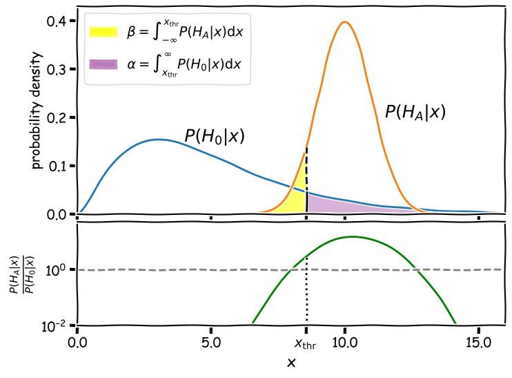
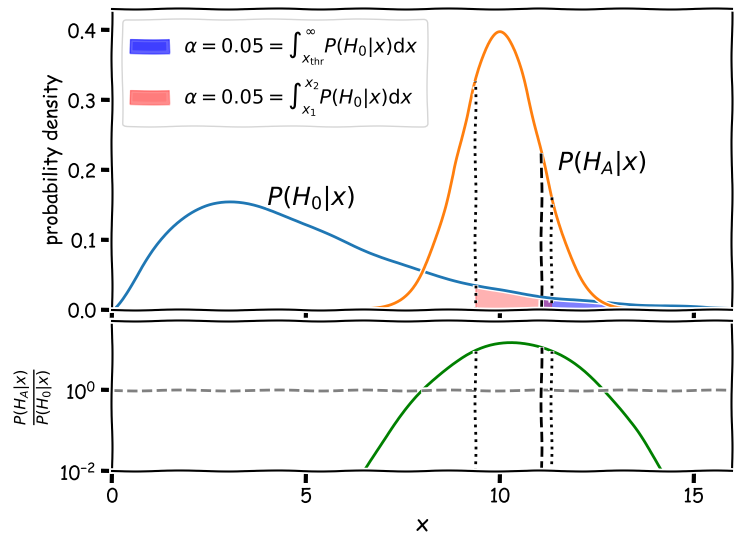
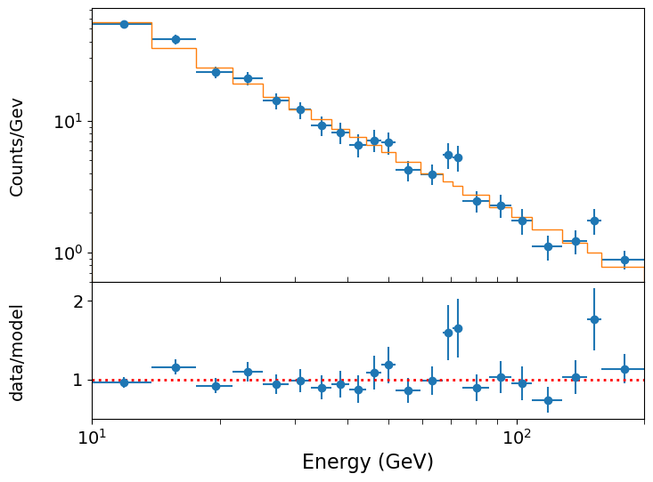
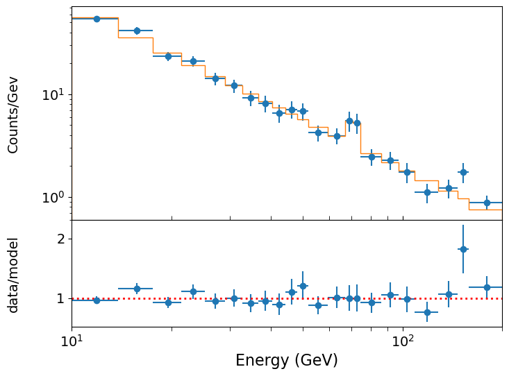
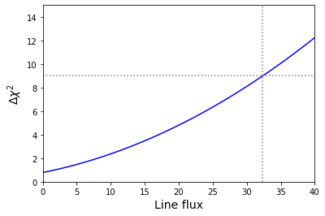
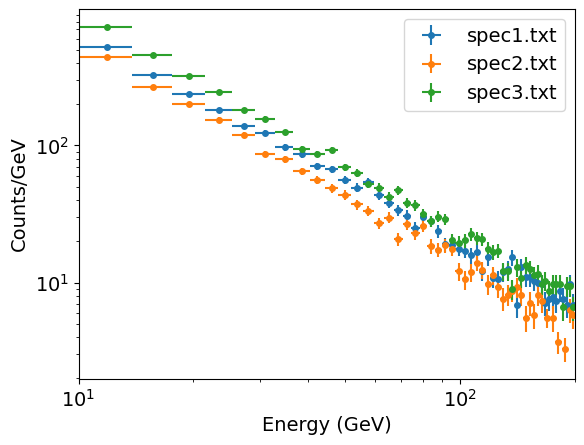
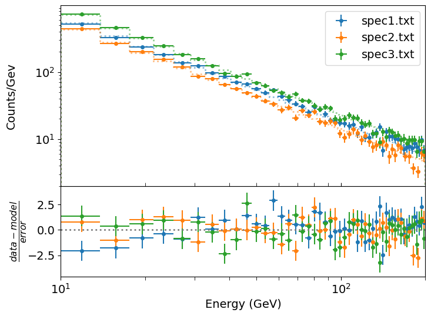

<!-- Just one possible MathJax CDN below. You may use others. -->

In this episode we will be using numpy, as well as matplotlib's plotting library. Scipy contains an extensive range of distributions in its 'scipy.stats' module, so we will also need to import it and we will also make use of scipy's `scipy.optimize` module. Remember: scipy modules should be installed separately as required - they cannot be called if only scipy is imported.
~~~
import numpy as np
import matplotlib.pyplot as plt
import scipy.stats as sps
import scipy.interpolate as spinterp
import scipy.integrate as spint
import lmfit
~~~
{: .language-python}

## Which is the best hypothesis?

Imagine that you have two hypotheses, a null hypothesis $$H_{0}$$ and an alternative hypothesis $$H_{A}$$, which you will accept as the alternative to the null. You want to test which is the best hypothesis to explain your data $$D$$.  You might think that your favoured hypothesis should be the one with the greatest [_posterior probability_]({{ page.root }}/reference/#posterior), i.e. you will accept the alternative if $$P(H_{A}\vert D)/P(H_{0}\vert D)>1)$$. 

However, consider the case shown in the plots below, where for simplicity we assume that the data we are using to choose between our hypotheses consists of a single value $$x$$, which may represent a single measurement or even a [_test statistic_]({{ page.root }}/reference/#test-statistic) calculated from multiple measurements. Let's further assume that we have the following posterior probability distributions for each hypothesis as a function of $$x$$, along with their ratio:

Now, in order to conduct our test we need to place a threshold on the region of $$x$$ values where we will reject $$H_{0}$$ and accept $$H_{A}$$. Based on what we have learned about significance testing so far, we may decide to reject the null hypothesis for values of $$x$$ exceeding some threshold value, i.e. $$x > x_{\rm thr}$$. Taking our alternative hypothesis into account, in the case illustrated above, we might somewhat arbitrarily set $$x_{\rm thr}=8.55$$ because at that point the alternative hypothesis has a three times higher posterior probability than the null hypothesis. However, this approach has some serious problems:

1. If the null hypothesis is true, there is a 12.8% probability (corresponding to the [_significance level_]({{ page.root }}/reference/#significance-level) $$\alpha$$) that it will be rejected in favour of the alternative. This rejection of a true null hypothesis in favour of a false alternative is called a [__false positive__]({{ page.root }}/reference/#false-positive), also known as a [_type I error_].
2. If the null hypothesis is false and the alternative is true, there is a 7.4% probability (corresponding to the integral $$\beta$$) that the alternative will be rejected and the false null will be accepted. The acceptance of a false null hypothesis is known as a [__false negative__]({{ page.root }}/reference/#false-negative) or a [_type  II error_].
3. Furthermore, in this particular case, values of $$x>12.7$$ are more likely to be produced by the null hypothesis than the alternative, according to their posterior probability ratios!

When we carry out significance tests of a null hypothesis, we often place quite a strong requirement on the significance needed to reject the null, because the null is generally chosen as being the simplest and most plausible explanation in the absence of compelling evidence otherwise. The same principle holds for whether we should reject the null hypothesis in favour of an alternative or not. Clearly the possibility of a false negative in our example is too high to be acceptable for a relaible statistical test. We need a better approach to calculate what range of $$x$$ we should use as our threshold for rejecting the null and accepting the alternative.

## The likelihood ratio test

We would like to control the rate of false positive and false negative errors that arise from our test to compare hypotheses. To control the fraction of false negative tests, we should first be able to pre-specify our desired value of $$\alpha$$, i.e. we will only reject the null hypothesis in favour of the alternative if the test gives a $$p$$-value, $$p < \alpha$$ where $$\alpha$$ is set to be small enough to be unlikely. The choice of $$\alpha$$ should also reflect the importance of the outcome of rejecting the null hypothesis, e.g. does this correspond to the detection of a new particle (usually $$5\sigma$$, or just the detection of an astronomical source where one is already known in another waveband (perhaps 3$$\sigma$$)? If $$\alpha$$ is sufficiently small, the risk of a false positive (e.g. detecting a particle or source which isn't real) is low, by definition.

To control the false negative rate, we need to minimise $$\beta$$, which corresponds to the probability that we reject a true alternative and accept the false null hypothesis. The statistical [__power__]({{ page.root }}/reference/#power) of the test is $$1-\beta$$, i.e. by minimising the risk of a false negative we maximise the power of the test.

> ## Significance and power
> Consider a test where rejection of the null hypothesis ($$H_{0}$$) (and acceptance of the alternative $$H_{A}$$) occurs when the value of the test statistic $$x$$ lies in a rejection region $$R$$. We then define:
>
> [__Significance__]({{ page.root }}/reference/#significance-level): 
>
> $$\int_{R} P(H_{0}\vert x)\mathrm{d}x = \alpha$$
>
> [__Power__]({{ page.root }}/reference/#power): 
>
> $$\int_{R} P(H_{A}\vert x)\mathrm{d}x = 1-\beta$$
>
{: .callout}

Given a desired significance level $$\alpha$$, what is the rejection region that maximises the statistical power of a test? The answer to this question is given by the [__Neyman-Pearson Lemma__]({{ page.root }}/reference/#neyman-pearson-lemma), which states that the rejection region that maximises statistical power is given by all $$x$$ that have a large enough [__likelihood ratio__]({{ page.root }}/reference/#likelihood-ratio):

$$\frac{P(H_{A}\vert x)}{P(H_{0}\vert x)} > c$$

where c if fixed such that the test has the desired significance:

$$\int_{R} P(H_{0}\vert x) \mathrm{Hv}\left[\frac{P(H_{A}\vert x)}{P(H_{0}\vert x)}-c\right] \mathrm{d}x = \alpha$$

where $$\mathrm{Hv}[y]$$ is the Heaviside step function, which is zero for negative $$y$$ and 1 otherwise.

To see how this works, we will take our example above and require a fairly minimal significance level $$\alpha=0.05$$.

The figure shows two regions (shaded red and blue) where the false positive rate is 5%. The false negative rate is given by the area of the alternative hypothesis curve $$P(H_{A}\vert x)$$ _outside_ this region. For the blue shaded region, bounded only to the left at $$x_{\mathrm{thr}}$$ with the dashed line as for a standard significance test, the false negative rate is 86%. For the Neyman-Pearson red shaded region, bounded on either side by the dotted lines at $$x_{1}$$ and $$x_{2}$$, the false negative rate is 36%. This means that the Neyman-Pearson likelihood ratio test is substantially more powerful: if the alternative hypothesis is correct it will be favoured versus the null 64% of the time, while using the standard significance threshold $$x_{\mathrm{thr}}$$ will only lead to the correct alternative being favoured 14% of the time, a factor $$>$$4.5 times worse!

## Practical application to model fitting: Wilks' theorem

In general it will be very challenging to calculate the critical threshold to maximise the power of a likelihood ratio test, since one must integrate over the posterior distributions for both the null and alternative hypotheses. However, with some simplifying assumptions that commonly apply in model-fitting, there is an easy way to carry out the test, by applying [__Wilks' theorem__]({{ page.root }}/reference/#wilks-theorem).

First of all, assume that the null hypothesis is a model with $$n$$ parameters $$\theta_{i}$$, with likelihood:

$$p(\mathbf{x} \vert H) = p(\mathbf{x}\vert \theta_{1}, \theta_{2}, ... , \theta_{n})$$

where $$\mathbf{x}$$ is the vector of data points. Now further assume that of the $$n$$ model parameters, a number $$k$$ of them are [__free parameters__]({{ page.root }}/reference/#free-parameter), which are free to vary to find their best-fitting [__MLEs__]({{ page.root }}/reference/#mle). The remaining $$m=n-k$$ parameters are fixed and unable to vary when fitting the model (in model-fitting terminology we say that the parameters are _frozen_).

Now assume that there is an alternative hypothesis with likelihood $$p(\mathbf{x} \vert A)$$, which is the same overall model but in which the $$m$$ fixed parameters are now allowed to vary (they are freed or in some model-fitting software, 'thawed'). The null hypothesis is said to be a nested model of the alternative, which in geometric terms means that its likelihood surface (likelihood vs. parameters) is a _sub-manifold_ of a more multi-dimensional hyper-surface describing the likelihood over the parameter space of the alternative hypothesis.

Now let's look at the likelihood ratio between the null and the alternative hypotheses. We can define the [__log-likelihood-ratio__]({{ page.root }}/reference/#log---likelihood-ratio):

$$\Lambda = 2 \ln \frac{p(\mathbf{x}\vert A)}{p(\mathbf{x}\vert H)}$$

The threshold $$c$$ for rejecting the null hypothesis is obtained from:

$$\int^{\infty}_{c} p(\Lambda\vert H)\mathrm{d}\Lambda = \alpha$$

which is equivalent to asking the question: __assuming the null hypothesis is correct, what is the chance that I would see this value of the log-likelihood-ratio (or equivalently: this difference between the alternative and the null log-likelihoods)?__

__Wilks' theorem__ states that in the large-sample limit (i.e. sufficient data), or equivalently, when the MLEs of the additional free parameters in the alternative hypothesis are normally distributed:

$$p(\Lambda\vert H) \sim \chi^{2}_{m}$$

i.e. the log-likelihood-ratio is distributed as a $$\chi^{2}$$ distribution with degrees of freedom equal to the number of extra free parameters in the alternative hypothesis compared to the null hypothesis. That means we can look at the difference in weighted-least squares (or log-likelihood) statistics  between the null and alternative best fits and it will tell us whether the null is rejected or not, by calculating the significance level ($$p$$-value) for $$\Delta \chi^{2}$$ or $$-2\Delta L$$, with respect to a $$\chi^{2}_{m}$$ distribution.

To illustrate how to use likelihood ratio tests in this way, we will show a couple of examples.

## Adding model components: is that a significant emission line?

Looking at the spectral plot of our $$\gamma$$-ray photon data from the previous episode, there is a hint of a possible feature at around 70 GeV.  Could there be an emission feature there?  This is an example of a hypothesis test with a nested model where the main model is a power-law plus a Gaussian emission feature.  The simple power-law model is nested in the power-law plus Gaussian: it is this model with a single constraint, namely that the Gaussian flux is zero, which is our null hypothesis (i.e. which should have a lower probability than the alternative with more free parameters).  Since zero gives a lower bound of the parameter for an emission feature (which is not formally allowed for likelihood ratio tests), we should be sure to allow the Gaussian flux also to go negative (to approximate an absorption feature). 

Before we start, you should first run in your notebook the analysis in the previous episode in the section on _Fitting binned Poisson event data using weighted least-squares_,to model the example photon spectrum with a simple power-law model and plot the data, model and data/model ratio:

The model is formally a good fit, but there may be an addition to the model which will formally give an even better fit. In particular, it looks as if there may be an emission feature around 70~GeV. Will adding a Gaussian emission line here make a significant improvement to the fit? To test this, we must use the (log)-likelihood ratio test. 

First, let's define a model for a power-law plus a Gaussian component, using an lmfit `Parameters` object as input:

~~~
def plgauss_model(x, params):
    '''Power-law plus Gaussian function.
       Inputs:
           x - input x value(s) (can be list or single value).
           params - lmfit Parameters object normalisation (at x = 1) and power-law index, 
                Gaussian mean, Gaussian sigma and Gaussian normalisation.'''
    v = params.valuesdict()
    # The line is a Gaussian shape with a normalisation equal to the number of counts in the line
    gflux = np.exp(-0.5*((x - v['gauss_mu'])/v['gauss_sig'])**2)/(v['gauss_sig']*
                                                                  np.sqrt(2.*np.pi))
    return  v['N'] * x**v['gamma'] + v['N_gauss']*gflux
~~~
{: .language-python}

Now we set up the `Parameters` object for lmfit to initialise the fit parameters and set up the model name. Since the possible emission feature is quite narrow, you need to be fairly precise about the starting energy of the Gaussian component, otherwise the fit will not find the emission feature. We will start with assuming no line, i.e. we initialise Gaussian normalisation `N_gauss` equal to zero, and let the fit find the best-fitting normalisation from there. With narrow features you may sometimes need to give a reasonable estimate of normalisation as your initial value, to prevent the minimizer trial-location of the feature wandering off to some value where it cannot find (and thus cannot successfully model) the feature again. In this case however, the fit should work well and successfully find the feature we want to model.

~~~
params = Parameters()
params.add_many(('N',2500),('gamma',-1.5),('N_gauss',0),('gauss_mu',70),('gauss_sig',10))
~~~
{: .language-python}

From here we can run the lmfit `Minimizer` again, although we use a different variable name from our previous output `result` so that we can compare the effect of adding the Gaussian component. The relative narrowness of the Gaussian feature means that the covariance and error estimates for the Gaussian parameters from the fit are not very reliable. We would need to use the grid search method from the previous episode to obtain reliable error estimates in this case. But the fit itself is fine and shows improvement in the chi-squared and goodness-of-fit.

~~~
model = plgauss_model
output_resid = True
xdata = [edges2]
ydata = [cdens]
yerrs = [cdens_err]
set_function = Minimizer(lmf_lsq_binresid, params, fcn_args=(xdata, ydata, yerrs, model, output_resid),nan_policy='omit')
result_withgaussian = set_function.minimize(method = 'leastsq')
report_fit(result_withgaussian)
print("Minimum Chi-squared = "+str(result_withgaussian.chisqr)+" for "+
      str(result_withgaussian.nfree)+" d.o.f.")
print("The goodness of fit is: ",sps.chi2.sf(result_withgaussian.chisqr,df=result_withgaussian.nfree))
~~~
{: .language-python}

~~~
[[Fit Statistics]]
    # fitting method   = leastsq
    # function evals   = 61
    # data points      = 22
    # variables        = 5
    chi-square         = 14.4301537
    reduced chi-square = 0.84883257
    Akaike info crit   = 0.72210652
    Bayesian info crit = 6.17731879
[[Variables]]
    N:          2795.93653 +/- 355.799130 (12.73%) (init = 2500)
    gamma:     -1.58614493 +/- 0.03685151 (2.32%) (init = -1.5)
    N_gauss:    16.2385238 +/- 3589.23773 (22103.23%) (init = 0)
    gauss_mu:   70.8014411 +/- 12961923.3 (18307428.71%) (init = 70)
    gauss_sig:  0.34398656 +/- 3.0984e+09 (900737942495.81%) (init = 10)
[[Correlations]] (unreported correlations are < 0.100)
    C(gauss_mu, gauss_sig) = 1.000
    C(N_gauss, gauss_mu)   = -1.000
    C(N_gauss, gauss_sig)  = -1.000
    C(N, gamma)            = -0.973
Minimum Chi-squared = 14.430153675574797 for 17 d.o.f.
The goodness of fit is:  0.636453578068235
~~~
{: .output}

We can also plot the data vs. model using the same function as we defined in the previous episode.

Now we can assess the significance of the improvement using Wilks' theorem. We can see that the fit has improved by allowing the line flux to be non-zero, with the chi-squared dropping from 20.65 to 14.43, i.e. $$\Delta \chi^{2}$$, measured from subtracting the worse (higher) value from the better one, is 6.22.  Is this a significant improvement?

One important question here is: what is the number of additional free parameters?  Wilks' theorem tells us that the $$\Delta \chi^{2}$$ in going from a less constrained model to a more constrained one is itself distributed as $$\chi^{2}_{m}$$ where $$m$$ is the number of additional constraints in the more constrained model (or equivalently, the number of additional free parameters in the less constrained model).  In our case, it seems like $$m=3$$, but for an emission line we should be careful: the line energy is not really a 'nestable' model parameter because the likelihood does not smoothly change if we change the position of such a sharp feature.  The line width might be considered as a parameter, but often is limited by the resolution of the instrument which applies a significant lower bound, also making the likelihood ratio approach unsuitable.  Therefore for simplicity here it is better to do the test assuming only the flux as the additional constraint, i.e. the null hypothesis is for flux = 0.  

Thus, we have a $$\chi^{2}_{1}$$ distribution and we can estimate the significance of our improvement as follows:

~~~
# result.chisqr is the chi-squared value from the previous fit with only the power-law
deltachisq = result.chisqr-result_withgaussian.chisqr
print("p-value for our delta-chi-squared: ",sps.chi2.sf(deltachisq,df=1))
~~~
{: .language-python}

~~~
p-value for our delta-chi-squared:  0.01263151128225959
~~~
{: .output}

> ## The Bonferroni correction
> The significance for the possible emission line above is not very impressive! Furthermore, we haven't allowed for the fact that in this case we did not expect to find a line at this energy ___a priori___ - we only saw there was a possible feature there ___a posteriori___, i.e. 'after the fact'. A crude way to correct for this is to allow for the number of 'hidden' trials that we effectively conducted by searching across the residuals by eye for a line-like feature. Then we ask the question 'if I carried out $$n$$ trials, what is the chance I would find the observed $$p$$-value by chance in at least one trial?'. In probability terms, this is the _complement_ of the question 'what is the chance that I would see no $$p$$-value of this magnitude or smaller in $$n$$ trials?'. To answer this question, we just consider a Binomial probability with $$\theta=p$$, $$n=20$$ trials and $$x=0$$ successes:
>
> $$p(0|n,\theta) = (1-\theta)^{n} = (1-0.01314)^{20} \simeq 0.77 $$
>
> Here we have estimated the effective number of trials, which we take to be the ratio of the logarithmic range of energies observed divided by the approximate logarithmic energy width of the possible line feature, which spans a couple of bins. The chance that we would see at least 1 success ($$p< 0.01314$$) in the resulting 20 trials is then 0.23, i.e. much less significant than our already not-impressive $$p=0.013$$.
>
> Thus we conclude that the apparent emission feature at ~70 GeV is not significant. Note that if we were even more conservative and assumed $$k=2$$ or 3 for our constraints, our $$p$$-value would be even larger and therefore even less significant. 
>
> The correction for the number of trials described above is known as a ___Bonferroni correction___ - the estimate of the number of trials seems a bit hand-wavy here, based on a heuristic which is somewhat subjective. In Bayesian terms, we can deal with this question (and its subjectivity) more rigorously, including the use of the prior (which represents our uncertainty over where any line can be located). The Bayesian approach is beyond the scope of this course, but an introduction can be found in Chapter 4 of Sivia's book.
>
{: .callout}

## Relation to errors and limits: upper limit on an emission line normalisation

Confidence intervals and upper or lower limits can be thought of as the model calculated for a fixed parameter value, such that the best-fit becomes significantly improved vs. the constrained fit at the confidence interval or limit boundary. In this way, we can interpret confidence intervals and upper and lower limits in the language of hypothesis testing and think of the model evaluated at the interval/limit bounds as the contrained null hypothesis with $$m$$ fewer free parameters than the alternative best-fitting model, where $$m$$ is the dimensionality required for the confidence region. Thus we obtain our result from the previous episode, of using the change in $$\chi^{2}$$ statistic or $$L$$ to define confidence intervals/regions.

Let's imagine that our $$\gamma$$-ray photon data arises from an extreme cosmic explosion like a gamma-ray burst, and that a model predicts that we should see a Gaussian emission line appearing in our spectrum at $$E_{\rm line}=33.1$$ GeV, with Gaussian width $$\sigma=5$$ GeV. There doesn't appear to be feature there in our spectrum, but the line flux (i.e. normalisation) is not specified by the model, so it is an adjustable parameter which our data can constrain. What is the 3-$$\sigma$$ upper limit on the line flux?

For this task we can repurpose the functions `grid1d_chisqmin` and `calc_error_chisq`, defined in the previous episode in order to calculate exact confidence intervals from the $$\chi^{2}$$ statistics calculated for a grid of parameter values. For 1 constrained parameter (i.e. 1 degree of freedom) and a 3-$$\sigma$$ upper limit, we need to find when $$\chi^{2}$$ has changed (relative to the $$\chi^{2}$$ for zero line flux) by $$\Delta \chi^{2}=3^{2}=9$$. This was an easy calculation by hand, but with `scipy.stats` distributions you can also use the _inverse survival function_ which is the survival-function equivalent of the ppf (which is the inverse cdf), e.g. try:
~~~
print(sps.chi2.isf(2*sps.norm.sf(3),df=1))
~~~
{: .language-python}

Now the modified versions of the functions. The `calc_error_chisq` function is modified to calculate only the upper value of an interval, consistent with an upper limit.

~~~
def grid1d_binchisqmin(a_name,a_range,a_steps,parm,model,xdata,ydata,yerrs):
    '''Uses lmfit. Finds best the fit and then carries out chisq minimisation for a 1D grid of fixed 
       parameters, but using a binned model suitable for binned counts data
       Input: 
            a_name - string, name of 'a' parameter (in input Parameters object parm) to use for grid.
            a_range, a_steps - range (tuple or list) and number of steps for grid.
            parm - lmfit Parameters object for model to be fitted.
            model - name of model function to be fitted.
            xdata, ydata, yerrs - lists of data x, y and y-error arrays (as for the lmf_lsq_resid function)
        Output: 
            a_best - best-fitting value for 'a'
            minchisq - minimum chi-squared (for a_best)
            a_grid - grid of 'a' values used to obtain fits
            chisq_grid - grid of chi-squared values corresponding to a_grid'''
    a_grid = np.linspace(a_range[0],a_range[1],a_steps)
    chisq_grid = np.zeros(len(a_grid))
    # First obtain best-fitting value for 'a' and corresponding chi-squared
    set_function = Minimizer(lmf_lsq_binresid, parm, fcn_args=(xdata, ydata, yerrs, model, True),
                             nan_policy='omit')
    result = set_function.minimize(method = 'leastsq')
    minchisq = result.chisqr
    a_best = result.params.valuesdict()[a_name]
    # Now fit for each 'a' in the grid, to do so we use the .add() method for the Parameters object
    # to replace the value of a_name with the value for the grid, setting vary=False to freeze it
    # so it cannot vary in the fit (only the other parameters will be left to vary)
    for i, a_val in enumerate(a_grid):
        parm.add(a_name,value=a_val,vary=False)
        set_function = Minimizer(lmf_lsq_binresid, parm, fcn_args=(xdata, ydata, yerrs, model, True), 
                                                                nan_policy='omit')
        result = set_function.minimize(method = 'leastsq')
        chisq_grid[i] = result.chisqr
        
    return a_best, minchisq, a_grid, chisq_grid 

def calc_upper_chisq(delchisq,minchisq,a_grid,chisq_grid):
    '''Function to return upper values of a parameter 'a' for a given delta-chi-squared
       Input:
           delchisq - the delta-chi-squared for the confidence interval required (e.g. 1 for 1-sigma error)
           a_grid, chisq_grid - grid of 'a' and corresponding chi-squared values used for interpolation'''
    # First interpolate over the grid for values > a_best and find upper interval bound
    chisq_interp_upper = spinterp.interp1d(chisq_grid,a_grid)
    a_upper = chisq_interp_upper(minchisq+delchisq)
    return a_upper
~~~
{: .language-python}

Now we can run the grid search to find the upper limit. However, we need to bear in mind that we must keep the Gaussian feature mean energy and width $$\sigma$$ fixed at the stated values for these fits!:

~~~
# First we set up the parameters for the search. Remember we want to find the upper-limit
# on Gaussian normalisation at a fixed Gaussian mean energy and sigma, so we need to
# set the `vary` argument for those two parameters to be False, to keep them fixed.
fixed_en = 33.1
fixed_sig = 5.0
params = Parameters()
params.add_many(('N',2500),('gamma',-1.5),('N_gauss',0),
                ('gauss_mu',fixed_en,False),('gauss_sig',fixed_sig,False))

# Now set up the parameter to be stepped over for the upper-limit search
a_range = [0,40]
a_name = 'N_gauss'
n_steps = 100

# Run the grid calculation
a_best, minchisq, a_grid, chisq_grid = grid1d_binchisqmin(a_name,a_range,n_steps,params,model,
                             xdata,ydata,yerrs)

# Now give the output
delchisq = 9
a_upper = calc_upper_chisq(delchisq,minchisq,a_grid,chisq_grid)
print("Best-fitting line flux = ",a_best,"for chisq = ",minchisq)
print("3-sigma upper limit on line flux: ", a_upper,"for chisq = ",minchisq+delchisq)
~~~
{: .language-python}

~~~
Best-fitting line flux =  -13.534821277620663 for chisq =  19.869492823618017
3-sigma upper limit on line flux:  32.3673655153036 for chisq =  28.869492823618017
~~~
{: .output}

Note that for a meaningful 3-$$\sigma$$ upper limit according to Wilks' theorem, we must compare with the best-fit (the alternative hypothesis) even if the best-fitting line flux is non-zero, and since it is an upper limit and not an interval, we just state the absolute value of the flux not the difference from the best-fitting value.

We can also plot our grid to check that everything has worked okay and that there is a smooth variation of the $$\Delta \chi^{2}$$ with the line flux. We also show the location for $$\Delta \chi^{2}$$ on the plot (the corresponding line flux is $$32.4$$ counts).

## Fitting multiple datasets: are the MLEs different?

It can be common that we have multiple datasets that we want to fit the same model to. Perhaps these are the spectra of a sample of some type of astronomical objects, or perhaps the same object but observed at different times. Or perhaps we have data from repeated experiments to make the same measurements. Fitting multiple datasets can give us better constraints on our model parameters. 

But it can also happen that we want to look for differences between our datasets which may give us new insights. For example, we may want to see if astronomical source spectra are different in ways which may correlate with other source properties. Or perhaps we want to see if spectra from a single source varies over time. Or maybe we ran our experiment multiple times with different settings and we want to see if there is an effect on our data. In these cases, it is useful to work out whether the MLEs for each dataset are consistent with being the same or whether they are different for different datasets. This is a type of hypothesis test and we can use the change in $$\chi^{2}$$ statistic or $$L$$ when we 'tie together' or 'free' some of the model parameters used to fit each dataset.

For simultaneous fitting of multiple datasets we can input our data using the list format we already applied for our lmfit objective function in this and previous episodes. This time each list for `xdata`, `ydata` and `yerrs` will contain the corresponding data for multiple datasets. For this example of spectral fitting of (imagined) gamma ray spectra, we use the three photon events data files named `spec1.txt`, `spec2.txt` and `spec3.txt` (see [here][data_dir]). Our loop over the photon data files reads them in, rebins them so we can use weighted least squares fitting (this is possible due to the high photon counts) and then assigns the binned data and errors to our lmfit dataset arrays:

~~~
emin, emax = 10., 200.   # We should always use the known values that the data are sampled over 
                         # for the range used for the bins!
nbins = 50
# And now we use our new function to rebin so there are at least mincounts counts per bin:
mincounts = 20  # Here we set it to our minimum requirement of 20, but in principle you could set it higher

xdata = []  # We create empty lists to assign our binned spectra to lists for lmfit to fit them together
ydata = []
yerrs = []
files = ['spec1.txt','spec2.txt','spec3.txt']
for file in files:
    #  First read in the data.  This is a simple (single-column) list of energies:
    photens = np.genfromtxt(file)
    counts, edges = np.histogram(photens, bins=nbins, range=[emin,emax], density=False)
    counts2, edges2 = histrebin(mincounts,counts,edges)
    bwidths = np.diff(edges2) # calculates the width of each bin
    cdens = counts2/bwidths # determines the count densities
    cdens_err = np.sqrt(counts2)/bwidths # calculate the errors: remember the error is based on the counts, 
    # not the count density, so we have to also apply the same normalisation.
    xdata.append(edges2) # Now assign to our lists for lmfit
    ydata.append(cdens)
    yerrs.append(cdens_err) 
~~~
{: .language-python}

We can plot the resulting binned spectra, which confirms that they have power-law shapes that are similar to one another, albeit with different normalisations.

For fitting multiple datasets we need to modify our objective function as well as the function used to bin the model (since we are fitting binned data), so that we can tell the model which dataset to consider for which parameters. The reason for this is that lmfit requires a single `Parameters` object as input to the objective function which is minimized. Therefore if we fit multiple spectra simultaneously and wish to allow the model parameter values to be different for different spectra, we need to include the parameters for each spectrum separately in our `Parameters` object and then provide a way for the objective function to determine which parameters to use. Note that if we wished to fit the same model parameter values to all datasets (which may be preferred in some cases, e.g. where we have good reason to think they should be the same), we can use our original function definitions for this purpose (since they are also designed to be able to handle a list of datasets, but will fit all with the same model parameter values).

To proceed, we make a small modification to our objective function and model binning function which includes as an argument an index for the dataset (i.e. in this case, spectrum) we are using:

~~~
def model_bin_mult(xbins, model, i_data, params):
    '''General function for integrating the input model over bins defined by contiguous (no gaps) 
        bin edges, xbins.
       Inputs:
           xbins - x bin edges.
           i_data - the dataset being considered (determines which parameters to use in the model)
           model, params - the model name and associated Parameters object.
       Outputs:
           ymod - calculated counts-density model values for y-axis.'''
    i = 0
    ymod = np.zeros(len(xbins)-1)
    for i, xval in enumerate(xbins[:-1]):
        ymod[i], ymoderr = spint.quad(lambda x: model(x, i_data, params),xbins[i],xbins[i+1])
        ymod[i] = ymod[i]/(xbins[i+1]-xbins[i])  # we now divide by the bin width to match the counts density
        # units of our data
    return ymod

def lmf_lsq_binresid_mult(params,xdata,ydata,yerrs,model,output_resid=True):
    '''lmfit objective function to calculate and return residual array or model y-values for
        binned data where the xdata are the input bin edges and ydata are the densities (integral over bin
        divided by bin width).
        Inputs: params - name of lmfit Parameters object set up for the fit.
                xdata, ydata, yerrs - lists of 1-D arrays of x (must be bin edges not bin centres) 
                and y data and y-errors to be fitted.
                    E.g. for 2 data sets to be fitted simultaneously:
                        xdata = [x1,x2], ydata = [y1,y2], yerrs = [err1,err2], where x1, y1, err1
                        and x2, y2, err2 are the 'data', sets of 1-d arrays of length n1 (n1+1 for x2
                        since it is bin edges), n2 (n2+1 for x2) respectively, 
                        where n1 does not need to equal n2.
                    Note that a single data set should also be given via a list, i.e. xdata = [x1],...
                model - the name of the model function to be used (must take params as its input params and
                        return the model y-value array for a given x-value array).
                output_resid - Boolean set to True if the lmfit objective function (residuals) is
                        required output, otherwise a list of model y-value arrays (corresponding to the 
                        input x-data list) is returned.
        Output: if output_resid==True, returns a residual array of (y_i-y_model(x_i))/yerr_i which is
            concatenated into a single array for all input data errors (i.e. length is n1+n2 in 
            the example above). If output_resid==False, returns a list of y-model arrays (one per input x-array)'''
    if output_resid == True:
        for i, xvals in enumerate(xdata):  # loop through each input dataset and record residual array
                     # Note that we identify the dataset by counting from 1 not 0, this is just the 
                    # standard we will use for naming the parameters.
            if i == 0:
                resid = (ydata[i]-model_bin_mult(xdata[i],model,i+1,params))/yerrs[i]
            else:
                resid = np.append(resid,(ydata[i]-model_bin_mult(xdata[i],model,i+1,params))/yerrs[i])
        return resid
    else:
        ymodel = []
        for i, xvals in enumerate(xdata): # record list of model y-value arrays, one per input dataset
            ymodel.append(model_bin_mult(xdata[i],model,i+1,params))
        return ymodel
~~~
{: .language-python}

Next we define our power-law model so it contains multiple parameters. By using the input dataset index in parameter name we can make this function generic for simultaneous fitting of any number of datasets.

~~~
def pl_model_mult(x, i_data, params):
    '''Simple power-law function to fit multiple datasets.
       Inputs:
           x - input x value(s) (can be list or single value).
           i_data - Index of dataset
           params - lmfit Parameters object: PL normalisation (at x = 1) and power-law index.'''
    v = params.valuesdict()
    return v['N_'+str(i_data)] * x**v['gamma_'+str(i_data)]
~~~
{: .language-python}

We now set up our lmfit `Parameters` object. We can already see that the normalisations of our power-laws are clearly different, but the power-law indices (so-called photon index $$\Gamma$$) look similar. Are they the same or not? To test this idea we first try our null hypothesis where the three fitted power-law indices are tied together so that the same value is used for all of them and allowed to vary to find its MLE. To 'tie together' the power-law indices we need to consider some of the other properties of the corresponding `Parameter`: we set `vary=True` and we also use the `expr` property, for which we must give a mathematical expression (without the preceding equals sign) in the form of a string. `expr` forces the parameter to take the value given by `expr` which allows us to set parameters to values calculated with the mathematical expression, including functions of the other parameters. To set the parameter to be equal to the another parameter, we can just give that parameter name as the expression:

~~~
params = Parameters()
params.add_many(('N_1',2500),('gamma_1',-1.5,True),
                ('N_2',2500),('gamma_2',-1.5,True,None,None,'gamma_1'), # We must specifiy all properties up to `gamma_1`, 
                # here using None except for vary which we set to True.
                ('N_3',2500),('gamma_3',-1.5,True,None,None,'gamma_1'))
~~~
{: .language-python}

Now we are ready to fit our null hypothesis of a single photon index (but different normalisations) for all three spectra.

~~~
model = pl_model_mult
output_resid = True
set_function = Minimizer(lmf_lsq_binresid_mult, params, fcn_args=(xdata, ydata, yerrs, model, output_resid),nan_policy='omit')
result_null = set_function.minimize(method = 'leastsq')
report_fit(result_null)
print("Minimum Chi-squared = "+str(result_null.chisqr)+" for "+str(result_null.nfree)+" d.o.f.")
print("The goodness of fit is: ",sps.chi2.sf(result_null.chisqr,df=result_null.nfree))
~~~
{: .language-python}

~~~
[[Fit Statistics]]
    # fitting method   = leastsq
    # function evals   = 53
    # data points      = 147
    # variables        = 4
    chi-square         = 180.133178
    reduced chi-square = 1.25967257
    Akaike info crit   = 37.8797884
    Bayesian info crit = 49.8415188
[[Variables]]
    N_1:      28046.3749 +/- 818.363220 (2.92%) (init = 2500)
    gamma_1: -1.60080260 +/- 0.00804811 (0.50%) (init = -1.5)
    N_2:      22411.0523 +/- 674.301381 (3.01%) (init = 2500)
    gamma_2: -1.60080260 +/- 0.00804811 (0.50%) == 'gamma_1'
    N_3:      36682.3746 +/- 1065.10145 (2.90%) (init = 2500)
    gamma_3: -1.60080260 +/- 0.00804811 (0.50%) == 'gamma_1'
[[Correlations]] (unreported correlations are < 0.100)
    C(gamma_1, N_3) = -0.940
    C(N_1, gamma_1) = -0.921
    C(gamma_1, N_2) = -0.907
    C(N_1, N_3)     = 0.866
    C(N_2, N_3)     = 0.852
    C(N_1, N_2)     = 0.835
Minimum Chi-squared = 180.13317771619816 for 143 d.o.f.
The goodness of fit is:  0.019284359760601277
~~~
{: .output}

The fit finds that a power-law index of $$\simeq -1.6$$ can best fit the data if a single value is assumed for all three spectra. The fit isn't great but it's not terrible either (from the goodness-of-fit, the model is ruled out with less than 3-$$\sigma$$ significance). We can plot our spectra vs. the model, and the residuals, to see if there are any systematic deviations from the model. First we define a handy plotting function for plotting data vs. model comparisons for multiple spectra, which also allows different options for the data vs. model residuals:

~~~
def plot_spec_model_mult(ebins_list,cdens_list,cdens_err_list,cdens_model_list,emin,emax,resid_type,
                         legend_labels):
    '''Plot the binned (GeV) spectrum with the model as a histogram, and 
       data/model residuals.
       Inputs:
           ebins_list - energy bin edges.
           cdens_list, cdens_err_list - counts density and its error.
           cdens_model_list - model counts density.
           emin, emax - minimum and maximum energy to be plotted
           resid_type - string, type of data vs model residuals, these can be: 
               ratio: data/model, resid: data-model, weighted resid: data-model/error
           legend_labels - list of labels for each dataset to use in legend, 
                   use None if no legend required'''
    
    fig, (ax1, ax2) = plt.subplots(2,1, figsize=(8,6),sharex=True,gridspec_kw={'height_ratios':[2,1]})
    fig.subplots_adjust(hspace=0)
    for i,ebins in enumerate(ebins_list):
        energies = (ebins[1:]+ebins[:-1])/2
        bwidths = np.diff(ebins)
        if legend_labels != None:
            label_txt = legend_labels[i]
        # Note that colours in the default Matplotlib colour cycle can be specified using strings 
        # 'C0'..'C9', which is useful for plotting the same colours for model and data.
        ax1.errorbar(energies, cdens_list[i], xerr=bwidths/2., yerr=cdens_err_list[i], 
                     color='C'+str(i), markersize=4, fmt='o', label=label_txt)
        model_hist, edges, patches = ax1.hist(energies, bins=ebins, weights=cdens_model_list[i], 
                    density=False, histtype='step', color='C'+str(i), alpha=0.5, 
                                              linestyle='dotted', linewidth=2)
        if resid_type == 'ratio':
            ax2.errorbar(energies, cdens_list[i]/cdens_model_list[i], xerr=bwidths/2., 
                    yerr=cdens_err_list[i]/cdens_model_list[i], color='C'+str(i), markersize=4, fmt='o')
        elif resid_type == 'resid':
            ax2.errorbar(energies, (cdens_list[i]-cdens_model_list[i]), xerr=bwidths/2., 
                    yerr=cdens_err_list[i], color='C'+str(i), markersize=4, fmt='o')
        elif resid_type == 'weighted resid':
            ax2.errorbar(energies, (cdens_list[i]-cdens_model_list[i])/cdens_err_list[i], xerr=bwidths/2., 
                    yerr=1.0, color='C'+str(i), markersize=4, fmt='o')
    ax2.set_xlabel("Energy (GeV)", fontsize=14)
    ax1.set_ylabel("Counts/Gev", fontsize=14)
    ax1.get_yaxis().set_label_coords(-0.12,0.5)
    ax2.get_yaxis().set_label_coords(-0.12,0.5)
    if resid_type == 'ratio':
        ax2.set_ylabel("data/model", fontsize=14)
        ax2.axhline(1., color='gray', linestyle='dotted', lw=2)
    elif resid_type == 'resid':
        ax2.set_ylabel("data-model", fontsize=14)
        ax2.axhline(0., color='gray', linestyle='dotted', lw=2)
    elif resid_type == 'weighted resid':
        ax2.get_yaxis().set_label_coords(-0.09,0.5)
        ax2.set_ylabel(r"$\frac{data-model}{error}$", fontsize=16)
        ax2.axhline(0., color='gray', linestyle='dotted', lw=2)
    ax1.tick_params(labelsize=14)
    ax1.tick_params(axis="x",direction="in",which="both", length=4)
    ax2.tick_params(axis="x",which="both", length=4)
    ax2.tick_params(labelsize=14)
    ax1.set_yscale('log')
    ax1.set_xscale('log')
    ax2.set_xscale('log')
    ax2.set_xlim(emin,emax) # Strictly speaking we should only show the energy range 
    # where data is sampled, to avoid impression from model that the flux suddenly drops 
    # at the boundaries.
    ax1.legend(fontsize=14)
    plt.show()
~~~
{: .language-python}

Now we plot our data vs. model comparison.

~~~
# To calculate the best-fitting model values, use the parameters of the best fit output
# from the fit, result.params and set output_resid=false to output a list of model y-values:
model_vals = lmf_lsq_binresid_mult(result_null.params,xdata,ydata,yerrs,model,output_resid=False)
# Now plot the data and model and residuals
legend_labels = files
plot_spec_model_mult(xdata,ydata,yerrs,model_vals,10,200,'weighted resid',legend_labels)
~~~
{: .language-python}

For our plot we choose to show the weighted residuals, i.e. (data-model)/error, since the differences are quite small and if we plot the data/model ratio or the data-model residuals the plot scale is driven by either the high energy or low energy parts of the spectra respectively, such that we cannot easily see deviations across the full energy range. With this plot we can see some small but systematic differences in the weighted residuals for spectrum 1 vs the other spectra, which may indicated a flatter spectrum (i.e. less negative index) for that dataset.

We can now see whether there are significant differences in the power-law index between the three spectra, by relaxing our constraint which ties the three index values together, so that they are free to vary independently in the fit. To do this we replace our parameters with the default values (free to vary and with mathematical expression to constrain them), and fit again:

~~~
params.add_many(('N_1',2500),('gamma_1',-1.5),
                ('N_2',2500),('gamma_2',-1.5),
                ('N_3',2500),('gamma_3',-1.5))

model = pl_model_mult
output_resid = True
set_function = Minimizer(lmf_lsq_binresid_mult, params, fcn_args=(xdata, ydata, yerrs, model, output_resid),nan_policy='omit')
result = set_function.minimize(method = 'leastsq')
report_fit(result_altern)
print("Minimum Chi-squared = "+str(result_altern.chisqr)+" for "+str(result_altern.nfree)+" d.o.f.")
print("The goodness of fit is: ",sps.chi2.sf(result_altern.chisqr,df=result_altern.nfree))
~~~
{: .language-python}

We show here only part of the results, for brevity:

~~~
[[Variables]]
    N_1:      23457.2880 +/- 1069.88979 (4.56%) (init = 2500)
    gamma_1: -1.54756853 +/- 0.01301848 (0.84%) (init = -1.5)
    N_2:      24235.3503 +/- 1237.64629 (5.11%) (init = 2500)
    gamma_2: -1.62394581 +/- 0.01479000 (0.91%) (init = -1.5)
    N_3:      40046.3917 +/- 1610.95889 (4.02%) (init = 2500)
    gamma_3: -1.62674743 +/- 0.01166195 (0.72%) (init = -1.5)
[[Correlations]] (unreported correlations are < 0.100)
    C(N_3, gamma_3) = -0.973
    C(N_2, gamma_2) = -0.973
    C(N_1, gamma_1) = -0.973
Minimum Chi-squared = 154.01314423376198 for 141 d.o.f.
The goodness of fit is:  0.2142664317881377
~~~
{: .output}

Our new fit finds that the fit has improved (goodness-of-fit now 0.21) with `gamma_1` less negative than `gamma_2` and `gamma_3`, as we suspected from the data vs. model residuals of our previous fit. But is this change formally significant? How sure can we be that the data _require_ that the power-law index is different between the spectra?

To do this test we look at the change in chi-squared (to use the colloquial term for the weighted least squares statistic) between our null hypothesis (with constrained power-law index) and our alternative, with that constraint removed. We also need to account for the change in the number of constraints, i.e. our degrees of freedom. In our null hypothesis we had two constraints for the index which we relaxed. So according to Wilks' theorem, if the null hypothesis is correct and the improvement with the alternative is just due to chance, the improvement $$\Delta \chi^{2}$$ should be distributed as $$\chi^{2}_{m}$$ where $$m=2$$. Let's take a look:

~~~
constraints = 
deltachisq = result_null.chisqr-result_altern.chisqr
print("p-value for our delta-chi-squared: ",sps.chi2.sf(deltachisq,df=2))
~~~
{: .language-python}

~~~
m = result_null.nfree-result_altern.nfree
deltachisq = result_null.chisqr-result_altern.chisqr
print("p-value for our delta-chi-squared: ",sps.chi2.sf(deltachisq,df=m),"for",m,"fewer constraints.")
~~~
{: .language-python}

~~~
p-value for our delta-chi-squared:  2.1286624330119402e-06 for 2 fewer constraints.
~~~
{: .output}

Which means the improvement is significant at better than 4-$$\sigma$$ significance (actually 4.74-$$\sigma$$). This is more than acceptable for spectral comparisons (unless the difference would imply something really important, like the discovery of a new particle or physical effect), so we can state that the data are consistent with the spectra (at least spectrum 1 vs spectra 2 and 3) having different power-law indices. 

If we want to test whether spectra 2 and 3 also have different indices from each other, we can go further and compare the situation with all indices free to vary with that where the indices for spectra 2 and 3 are tied to be the same, but the index for spectrum 1 is allowed to be different. I.e. we edit the Parameters object and run our fit as follows:

~~~
params.add_many(('N_1',2500),('gamma_1',-1.5),
                ('N_2',2500),('gamma_2',-1.5),
                ('N_3',2500),('gamma_3',-1.5,True,None,None,'gamma_2'))

model = pl_model_mult
output_resid = True
set_function = Minimizer(lmf_lsq_binresid_mult, params, fcn_args=(xdata, ydata, yerrs, model, output_resid),nan_policy='omit')
result_altern2 = set_function.minimize(method = 'leastsq')
report_fit(result_altern2)
print("Minimum Chi-squared = "+str(result_altern2.chisqr)+" for "+str(result_altern2.nfree)+" d.o.f.")
print("The goodness of fit is: ",sps.chi2.sf(result_altern2.chisqr,df=result_altern2.nfree))
# note that our new fit is the new null, since it has the most constraints
m = result_altern2.nfree-result_altern.nfree
deltachisq = result_altern2.chisqr-result_altern.chisqr
print("p-value for our delta-chi-squared: ",sps.chi2.sf(deltachisq,df=m),"for",m,"fewer constraints.")
~~~
{: .language-python}

~~~
[[Variables]]
    N_1:      23457.2870 +/- 1066.20685 (4.55%) (init = 2500)
    gamma_1: -1.54756851 +/- 0.01297362 (0.84%) (init = -1.5)
    N_2:      24375.5752 +/- 800.070733 (3.28%) (init = 2500)
    gamma_2: -1.62566426 +/- 0.00912604 (0.56%) (init = -1.5)
    N_3:      39900.9893 +/- 1277.00511 (3.20%) (init = 2500)
    gamma_3: -1.62566426 +/- 0.00912604 (0.56%) == 'gamma_2'
[[Correlations]] (unreported correlations are < 0.100)
    C(N_1, gamma_1) = -0.973
    C(gamma_2, N_3) = -0.958
    C(N_2, gamma_2) = -0.933
    C(N_2, N_3)     = 0.894
Minimum Chi-squared = 154.0375075024773 for 142 d.o.f.
The goodness of fit is:  0.23136639609523538
p-value for our delta-chi-squared:  0.8759641494768704 for 1 fewer constraints.
~~~
{: .output}

Now we see that the $$p$$-value is high and so there is no significant improvement in the fit from allowing the power-law indices of spectra 2 and 3 to be different from one another. I.e. our final conclusion should be that ___spectrum 1 has a different power-law index to spectra 2 and 3, but the latter two datasets are consistent with having the same power-law index___. 

It's useful to note also that although the chi-squared value has increased slightly, the goodness-of-fit has actually improved because of adding this extra constraint between the spectral indices of spectra 2 and 3. This shows that improvements in the goodness-of-fit can happen not just because of smaller chi-squared but also because we reduce the freedom of our model to fit the data, so that if the quality of fit stays the same or only gets very slightly worse __despite__ that reduction in freedom to fit, we can consider that an improvement in the consistency of the model with data. If the data can be fitted with a simpler (i.e. fewer free parameters) model without a significant reduction in fit quality, we should (usually) favour the simpler model.

> ## Programming challenge: constraining spectral features
> 
> A particle accelerator experiment gives (after cleaning the data of known particle events) a set of measured event energies (in GeV) contained in the file [`event_energies.txt`][event_data]. The detector detects events with energies in the range 20 to 300 GeV and the background events produce a continuum spectrum which follows an exponentially cut-off power-law shape:
>
> $$N_{\rm cont}(E)=N_{0}E^{-\Gamma} \exp(-E⁄E_{\rm cut})$$
>
> where $$N_{\rm cont}(E)$$ is the number of continuum photons per GeV at energy $$E$$ GeV. The normalisation $$N_{0}$$, power-law index $$\Gamma$$ and cut-off energy $$E_{\rm cut}$$ (in GeV) are parameters to be determined from the data. Besides the background spectrum, a newly-discovered particle which is under investigation produces an additional feature in the spectrum somewhere between 80-85 GeV, with a Gaussian profile:
>
> $$N_{\rm Gauss}(E)=\frac{N_{\rm total}}{\sigma\sqrt{2\pi}} \exp\left(-(E-E_{\rm cent})^{2}/(2\sigma^{2})\right)$$
> 
> Where $$N_{\rm Gauss}(E)$$ is the number of photons per GeV in the Gaussian feature, at energy $$E$$ GeV. $$N_{\rm total}$$ is a normalisation corresponding to the (expected) total number of photons in the feature, $$E_{\rm cent}$$ is the Gaussian centroid energy and $$\sigma$$ is the Gaussian width (i.e. standard deviation). The $$\sigma$$ of the Gaussian feature can be assumed to be fixed at the instrument resolution, which is 1.3 GeV and is the same at all energies.
> 
> - a) Calculate and plot (with appropriate axes and in appropriate units) a histogram of the event spectrum and then fit the continuum-only model to the data. Use the data/model ratio to identify the possible location(s) of any Gaussian features, including the known feature in the 80-85 GeV range.
> - b) Now add a Gaussian profile to your continuum model to fit the feature in the 80-85 GeV range. Fit the new combined model and determine the continuum and Gaussian MLEs, their errors (use covariance matrix __or__ 1-D grid search) and the model goodness of fit. Confirm that the Gaussian feature makes a significant improvement to the fit compared to the continuum-only model. Estimate what the significance of the line feature would be __if you did not already know its expected energy range__.
> - c) Prof. Petra Biggs has proposed a theory that predicts that a new particle should produce a feature (also a Gaussian at the instrument resolution) at 144.0 GeV. Use your data to set 3-sigma upper limit on the normalization (in terms of expected number of events N_total) that can be produced by this particle.
> 
{: .challenge}

[event_data]: https://github.com/philuttley/statistical-inference/tree/gh-pages/data/event_energies.txt
[data_dir]: https://github.com/philuttley/statistical-inference/tree/gh-pages/data/



